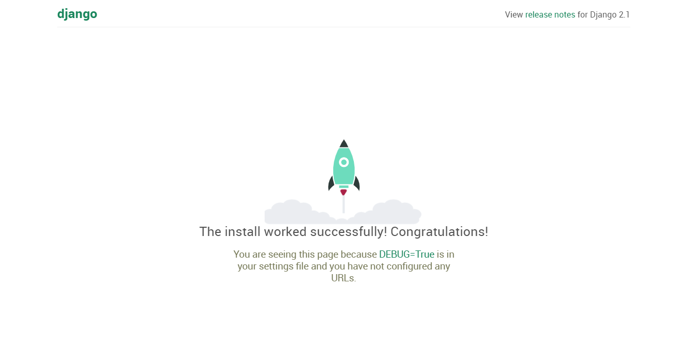
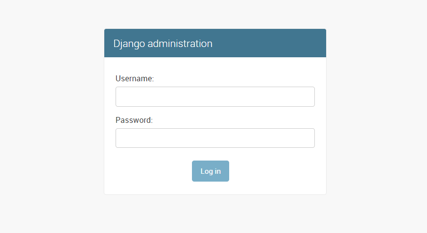
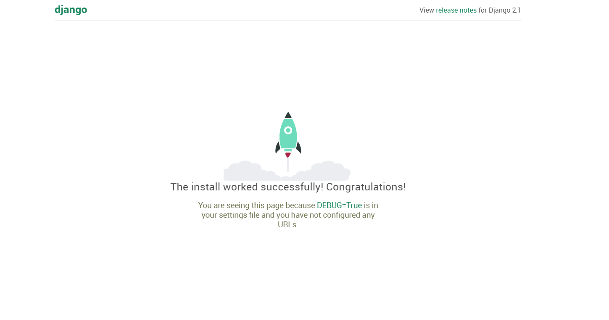
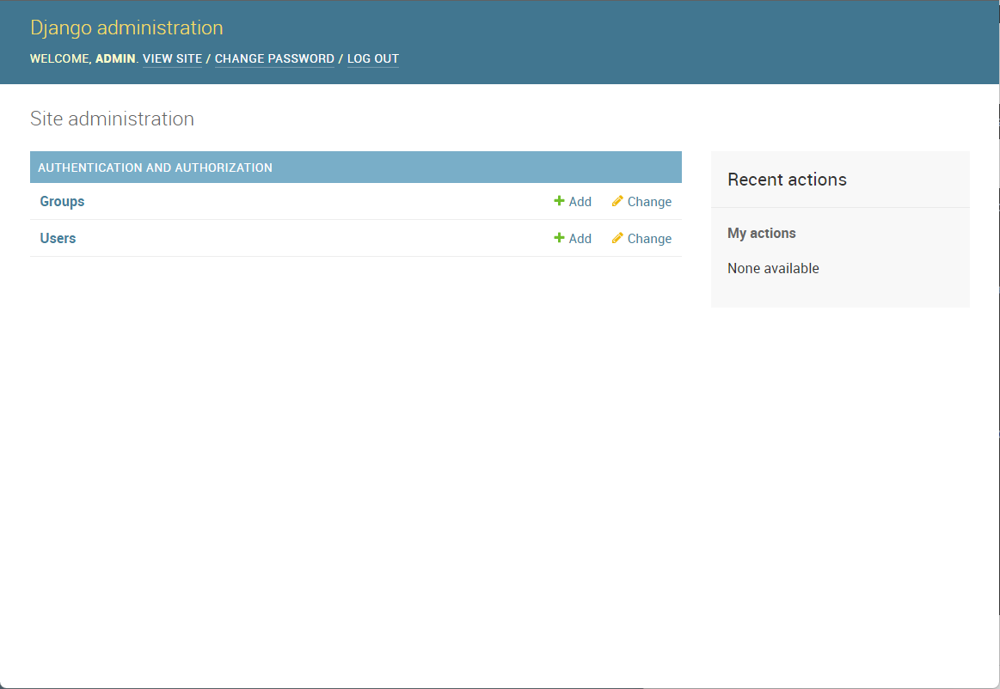

## 容器部署django

### 宿主机实现

> 宿主机部署python开发得框架，django程序

```perl6
1.yum install python3-devel python3 python3-pip -y


2.安装django模块开发网站
pip3 install django==2.1

3.检查模块
pip3 list|grep -i django

4.使用django写一个网站

mkdir /my_django -p

[root@docker01 my_django]# django-admin startproject blog
[root@docker01 my_django]# ls
blog
[root@docker01 my_django]# tree
.
└── blog
    ├── blog
    │   ├── __init__.py
    │   ├── settings.py
    │   ├── urls.py
    │   └── wsgi.py
    └── manage.py

2 directories, 5 files

5.修改配置文件
[root@docker01 my_django]# vim blog/blog/settings.py 
28 ALLOWED_HOSTS = ["*"]
[root@docker01 my_django]# egrep -i "allow" blog/blog/settings.py 
ALLOWED_HOSTS = ["*"]

6.设置地址访问网站，我们发现了警告信息 -----访问192.168.6.200:9090
[root@docker01 blog]# python3 manage.py runserver 0.0.0.0:9090
Performing system checks...

System check identified no issues (0 silenced).

You have 15 unapplied migration(s). Your project may not work properly until you apply the migrations for app(s): admin, auth, contenttypes, sessions.
Run 'python manage.py migrate' to apply them.

March 13, 2022 - 03:40:23
Django version 2.1, using settings 'blog.settings'
Starting development server at http://0.0.0.0:9090/
Quit the server with CONTROL-C.
[13/Mar/2022 03:41:16] "GET / HTTP/1.1" 200 16348
[13/Mar/2022 03:41:16] "GET /static/admin/css/fonts.css HTTP/1.1" 200 423
[13/Mar/2022 03:41:16] "GET /static/admin/fonts/Roboto-Bold-webfont.woff HTTP/1.1" 200 82564
[13/Mar/2022 03:41:16] "GET /static/admin/fonts/Roboto-Regular-webfont.woff HTTP/1.1" 200 80304
[13/Mar/2022 03:41:16] "GET /static/admin/fonts/Roboto-Light-webfont.woff HTTP/1.1" 200 81348
Not Found: /favicon.ico
[13/Mar/2022 03:41:16] "GET /favicon.ico HTTP/1.1" 404 1974

解决方法：
python3 manage.py migrate

```

访问：本主机ip:9090



访问：本主机ip:9090/admin



### 容器化实现

基础环境准备

- run.sh

```
[root@docker01 blog]# pwd
/my_django/blog

[root@docker01 blog]# ls
blog  db.sqlite3  Dockfile  manage.py  run.sh

[root@docker01 blog]# cat run.sh 
#!/bin/bash
python3 manage.py migrate
python3 manage.py runserver 0.0.0.0:8000
```

- blog

  如上

- dockerfile

```
[root@docker01 my_django]# cat Dockerfile 
#基础镜像,python:3基础镜像
FROM centos:7.8.2003
#维护者信息
LABEL maintainer="yuezenghui,2361046420@qq.com"
#环境变量
ENV LANG en_US.UTF-8
ENV LC_ALL en_US.UTF-8
#配置yum源，安装依赖关系
RUN yum clean all
RUN curl -so /etc/yum.repos.d/Centos-7.repo \
http://mirrors.aliyun.com/repo/Centos-7.repo && rpm -Uvh \
http://nginx.org/packages/centos/7/noarch/RPMS/nginx-release-centos-7-0.el7.ngx.noarch.rpm

RUN yum install -y python36 python3-devel gcc pcre-devel zlib-devel make net-tools nginx
#切换到工作目录
WORKDIR /docker_django/

#拷贝文件,把项目文件拷贝到容器内
ADD . .

#安装django
RUN pip3 install django==2.1

#进入django代码目录,调试看一下可以删除
RUN pwd;ls

#启动脚本
WORKDIR ./blog/
RUN chmod +x ./run.sh

#映射端口
EXPOSE 8000

#运行命令
CMD ["./run.sh"]


```

构建镜像

```
[root@docker01 my_django]# docker build -t docker_django .
```

查看镜像

```
[root@docker01 my_django]# docker images|grep docker_d*
docker_django         latest     0f12328cd694   5 minutes ago   613MB

```

运行容器

```
[root@docker01 my_django]# docker run -d -p 8000:8000 docker_django

[root@docker01 my_django]# docker ps
CONTAINER ID   IMAGE           COMMAND                  CREATED          STATUS          PORTS                                       NAMES
f9559bdf3645   docker_django   "./run.sh"               13 seconds ago   Up 12 seconds   0.0.0.0:8000->8000/tcp, :::8000->8000/tcp   awesome_hawking

```

访问网站

http://192.168.6.200:8000/



查看docker运行日志

```
[root@docker01 my_django]# docker logs -f f955
```

进入后台管理

```
[root@docker01 my_django]# docker exec -it f9559bdf3645  bash


#进入容器创建用户名和密码
[root@f9559bdf3645 blog]# python3 manage.py createsuperuser
Username (leave blank to use 'root'): admin
Email address: 2361046420@11^H^H
Error: Enter a valid email address.
Email address: 2361046420@qq.com
Password: 
Password (again): 
This password is too short. It must contain at least 8 characters.
This password is too common.
This password is entirely numeric.
Bypass password validation and create user anyway? [y/N]: y
Superuser created successfully.

账密
admin
1234
```

进入后台管理输入账号密码就可以进入这个页面

http://192.168.6.200:8000/admin/

