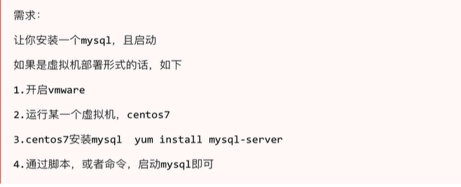

## DockerFile镜像定制

定制docker镜像的方式有两种：

- 手动修改容器内容，导出新的镜像
- 基于Dockerfile自行编写指令，基于指令流程创建镜像。

## dockerfile简介

镜像是多层存储，每一层在前一层的基础上进行修改；

容器也是多层存储，以镜像为基础层，在其基础上加一层作为容器运行时的存储层。

刚才说了，创建镜像的两个方法

- 手动修改容器内容，然后docker commit提交容器为新的镜像
- 通过在dockerfile中定义一系列的命令和参数构成的脚本，然后这些命令应用于基础镜像，依次添加层，最终生成一个新的镜像。极大的简化了部署工作。

官方提供的dockerfile实例：https://github.com/CentOS/CentOS-Dockerfiles

## dockerfile实践




## dockerfile指令

```
FROM			指定基础镜像

MAINTAINER		指定维护者信息，可以没有

RUN             想让它做什么在命令前面加上RUN即可

ADD             COPY文件，会自动解压

COPY 			复制文件

WORKDIR         设置当前工作目录

VOLUME          设置卷，挂载主机目录

EXPOSE         	指定对外的端口(端口 export 80)

ENTRYPOINT 		容器启动后执行的命令

ENV 			环境变量

CMD             指定容器启动后的要做什么
```


## 入门dockerfile

1.写一个dockerfile构建一个nginx镜像，可以运行nginx服务

```
[root@docker01 docker]# cat Dockerfile 
FROM nginx
RUN echo '<meta charset=utf8>docker运行nginx服务.' > /usr/share/nginx/html/index.html
```

2.构建Dockerfile

```
[root@docker01 docker]# docker build .
```

3.修改镜像名

```
[root@docker01 docker]# docker tag 153687381b2b my_nginx
```

4.运行该镜像

```
[root@docker01 docker]# docker RUN -d -p 80:80 my_nginx
3c9d2b55c3eaa86caf1e8e201e8a8b3f2119b870d43bc03ec555210e459974b0

[root@docker01 docker]# docker ps
CONTAINER ID   IMAGE             COMMAND                  CREATED         STATUS         PORTS                               NAMES
3c9d2b55c3ea   my_nginx          "/docker-entrypoint.…"   4 seconds ago   Up 3 seconds   0.0.0.0:80->80/tcp, :::80->80/tcp   keen_kilby

```

5.查看宿主机的80端口

```
http://192.168.6.200/
```


### COPY

```
copy指令从宿主机复制文件/目录到新的一层镜像内
如
copy yzh.py /home/

# 支持多个文件，以及通配符形式复制，语法要满足Golang的filepath.Match
copy yzh* /tmp/cc?.txt. /home/

# COPY指令能够保留源文件的元数据，如权限，访问时间等等，这点很重要
```

### ADD

```
特性和COPY基本一致，不过多了些功能
1.源文件是一个URL，此时docker引擎会下载该链接，放入目标路径，且权限自动设为600，若这不是期望结果，还得增加一层RUN指令进行调整
2.源文件是一个URL，且是一个压缩包，不会自动解压，也得单独用RUN指令解压
3.源文件是一个压缩文件，且是gzip，bzip2，xz，tar情况，ADD指令会自动解压缩该文件到目标路径
```

```
add yzh.tgz /home/
```

Dockerfile官方更为推荐使用COPY，ADD包含了更多复杂的功能，且ADD会使构建缓存失效，导致镜像构建缓慢。

### CMD

```
用法
CMD ["参数1","参数2"]

在指定了entrypoint指令后，用CMD指定具体的参数

docker不是虚拟机，容器就是一个进程，既然是进程，那么程序在启动的时候需要指定些运行参数，这就是CMD指令作用

例如centos镜像默认的CMD是/bin/bash，直接docker RUN -it centos会直接进入bash解释器。
也可以启动容器时候，指定参数. docker RUN -it centos cat /etc/os-releasea


CMD ["参数1","参数2"]

CMD ["/bin/bash"]
#该容器运行时，执行的命令
#等同于命令行的直接操作docker RUN -it centos cat /etc/os-release
CMD ["cat","/etc/os-release"]
```

### 容器内运行程序

这里要注意的是，docker不是虚拟机的概念，虚拟机里的程序运行，基本上都是在后台运行，利用systemctl运行，但是容器内没有后台进程的概念，必须在前台运行。

容器就是为了主进程而存在的，主进程如果退出了，容器也就失去意义，自动退出。

例如有一个经典问题

```
CMD systemctl start nginx
这样的写法是错误的，容器会立即退出

因为systemctl start nginx是希望以守护进程形式启动nginx，且CMD命令会转化为

CMD ["sh","-c","systemctl start nginx"]
这样的命令主进程是sh解释器，执行完毕后立即结束了，因此容器也就退出了。

因此正确的做法应该是CMD ["nginx","-g","daemon off;"]
```


> docker面试题：entrypoint 和cmd的区别以及用法

### ENTRYPOINT

和RUN指令一样，分为两种格式

- exec
- shell

> 作用和CMD一样，都是在指定容器启动程序以及参数。

> 当指定了ENTRYPOINT之后，CMD指令的语义就有了变化，而是把CMD的内容当作参数传递给ENTRYPOINT指令。

```
cmd  参数  [传递]>  entrypoint 参数
```

- 实际用法

1.准备好dockerfile

```
[root@docker01 docker]# cat Dockerfile
FROM centos:7.8.2003
RUN rpm --rebuilddb &&  yum install epel-release -y
RUN rpm --rebuilddb &&  yum install curl -y
CMD ["curl","-s","http://ipinfo.io/ip"]
```

2.构建镜像

```
docker build .
```

3.查看结果

```
Removing intermediate container f2408d27d789
 ---> a0817a9c9c59
Step 4/4 : CMD ["curl","-s","http://ipinfo.io/ip"]
 ---> RUNning in f205cb5520d5
Removing intermediate container f205cb5520d5
 ---> 5a08f53ab762
Successfully built 5a08f53ab762
```

4.检查镜像

```
[root@docker01 docker]# docker images
REPOSITORY           TAG        IMAGE ID       CREATED          SIZE
<none>               <none>     5a08f53ab762   23 minutes ago   526MB

[root@docker01 docker]# docker tag 5a08f53ab762 centos_curl
[root@docker01 docker]# docker images
REPOSITORY           TAG        IMAGE ID       CREATED          SIZE
centos_curl          latest     5a08f53ab762   24 minutes ago   526MB
```

5.运行镜像生成容器记录，没有前台运行，因此立即挂了

```
[root@docker01 docker]# docker RUN centos_curl
111.41.132.186[root@docker01 docker]# 
```

6.上述运行正确，但是想在传入一个参数，该如何做？

发现无法直接传参，该形式事覆盖镜像中的cmd,当作一个环境，去执行后面的命令

```
[root@docker01 docker]# docker RUN centos_curl pwd
/
[root@docker01 docker]# docker RUN centos_curl -I
docker: Error response from daemon: OCI RUNtime create failed: container_linux.go:380: starting container process caused: exec: "-I": executable file not found in $PATH: unknown.
```

7.正确给容器传入一个  -I 参数该怎么办

希望容器内能正确完整，这个命令的执行

```
curl -s http://ipinfo.io/ip -I
```

8.解决办法

使用entrypoint解决该问题

```
[root@docker01 docker]# cat Dockerfile 
FROM centos:7.8.2003
RUN rpm --rebuilddb &&  yum install epel-release -y
RUN rpm --rebuilddb &&  yum install curl -y
entrypoint ["curl","-s","http://ipinfo.io/ip"]

重新构建dockerfile
[root@docker01 docker]# docker build .
Sending build context to Docker daemon  2.048kB
Step 1/4 : FROM centos:7.8.2003
 ---> afb6fca791e0
Step 2/4 : RUN rpm --rebuilddb &&  yum install epel-release -y
 ---> Using cache
 ---> b17f983d8fb7
Step 3/4 : RUN rpm --rebuilddb &&  yum install curl -y
 ---> Using cache
 ---> a0817a9c9c59
Step 4/4 : entrypoint ["curl","-s","http://ipinfo.io/ip"]
 ---> RUNning in 454fd6763142
Removing intermediate container 454fd6763142
 ---> e55a236f928c
Successfully built e55a236f928c
```

9.改名

```
[root@docker01 docker]# docker tag e55a236f928c centos_new
[root@docker01 docker]# docker images
REPOSITORY           TAG        IMAGE ID       CREATED          SIZE
centos_new           latest     e55a236f928c   6 minutes ago    526MB
```

10.此时传入cmd指令，当作了entrypoint的参数

```
[root@docker01 docker]# docker RUN centos_new
111.41.132.186[root@docker01 docker]# 

[root@docker01 docker]# docker RUN centos_new -I
HTTP/1.1 200 OK
x-cloud-trace-context: 54ccb09153d6cb0b8086b03d9182ae48/9144909824452320316
access-control-allow-origin: *
content-type: text/html; charset=utf-8
content-length: 14
date: Sun, 13 Feb 2022 14:04:16 GMT
x-envoy-upstream-service-time: 1
Via: 1.1 google

```

**总结**

这就是当entrypoint存在时，给镜像运行时传入参数，也就是CMD的内容，会座位参数传递给ENTRYPOINT。

这里的`-I`参数就传递给了`curl -s http://ipinfo.io/ip -I`

### ENV

这个指令简单，简单的设置环境变量而已，无论是其他指令还是RUN，都可以应用该环境变量。

```
ENV NAME="text huanjing"
ENV MYSQL_VERSION=5.7

预先定义了环境变量后，在后续的操作都可以采用 $NAME. $MYSQL_VERSION形式进行方便的操作，维护起来更为专业，简单。
```

ADD、COPY、ENV、EXPOSE、LABEL、WORKDIR、VOLUME等都支持。

### VOLUME

容器在运行时，应该保证存储层不存在写入操作，需要写入数据的操作，例如数据库类动态数据，应该保存在卷中。（VOLUME）

```
VOLUME /data   如此写法，容器运行时候该/data目录回自动挂载为匿名卷，任何向/data写入的操作都不会记录到容器里，保证了容器存储层的无状态化。

# 测试的dockerfile文件
FROM centos
MAINTAINER yzh
VOLUME ["/data1","/data2"]

这样volume指定了2个挂载点/data1和/data2，会自动和宿主机的目录做映射关系。

可以通过命令查看
docker inspect 容器

查找"Mounts"寻找宿主机的源目录。
```

有关容器内数据的存储，还可以通过docker命令参数-v实现。

```
docker RUN -d -v /my_data:/data  容器id

表示把容器内的/data目录和宿主机的/my_data作映射关系
```

### EXPOSE

该指令用于指定容器运行时提供的端口服务，这里只是声明为要用哪个端口，不是说会开启这个端口。

作用是

- docker port 容器

- 帮助镜像使用者快速理解该镜像的端口服务，便于配置映射关系`docker RUN -p`
- 启动容器时可以进行随机端口映射`docker RUN -P`

### WORKDIR

该指令用于指定工作目录，前提该目录得存在，要更改工作目录，得用该指令

```
WORKDIR /opt
```

### USER

和WORKDIR指令类似，用于改变环境，作用是切换到其他用户，改变之后的指令执行的身份。

注意用户要提前存在

```
USER root
USER yzh
```

dockerfile的指令还有很多

## Docker commit

镜像是容器的基础，除了可以去docker hub下载镜像，还可以基于本地容器进行镜像提交，定制镜像。

镜像是多层存储，每一层都是在前一层的基础上修改。

## 构建一个网站镜像


## 实践dockerfile构建镜像

1.准备代码文件，python脚本

```python
[root@docker01 docker]# cat app.py 
#coding:utf8
from flask import Flask
app=Flask(__name__)
@app.route('/')
def hello():
    return "hello docker,i am yzh"
if __name__=="__main__":
    app.RUN(host='0.0.0.0',port=8080)
```

2.写入python文件内容，创建dockerfile

```bash
[root@docker01 docker]# cat Dockerfile 
FROM centos:7.8.2003
RUN curl -o /etc/yum.repos.d/CentOS-Base.repo https://mirrors.aliyun.com/repo/Centos-7.repo;
RUN curl -o /etc/yum.repos.d/epel.repo http://mirrors.aliyun.com/repo/epel-7.repo;
RUN yum makecache fast;
RUN yum install python3-devel python3-pip -y
RUN pip3 install -i https://pypi.douban.com/simple flask
COPY app.py /opt
WORKDIR /opt
EXPOSE 8080
CMD ["python3","app.py"]
```

3.执行构建命令，创建新镜像，可以考虑加上忽略缓存的参数，--no-cache

```bash
docker build -t "yzh/my_flask" .
```

4.运行镜像启动容器

```
[root@docker01 docker]# docker RUN --name flask01 -d -p 7080:8080  yzh/my_flask
9da928cfdb90ec7b0f2033e4fe942a81274773dcc77853a93f17aad857d336ad
```

5.访问宿主机，看容器内的flask web网站


## 如何修改该网站内容

1.进入容器内

```
docker exec -it 容器id bash
```

2.修改容器内的程序

```
ls /opt
```

3.退出容器，并重启

```
docker restart 容器id
```


## Docker容器管理总结

容器是docker的核心概念，容器是一个或者一组应用，它的运行状态如下

- docker利用容器运行应用程序
- 容器是镜像的运行实例，可以被RUN、start、stop、rm
- 每个容器都是相互隔离，保证平台安全
- 容器可以看作是一个简易版Linux环境（有root权限，进程，用户空间，网络）
- 镜像是只读的，容器在启动的时候创建一层可写层。


dockerfile面向开发，docker image作为交付标准，docker container涉及部署和运维，三者合起来完成docker体系。

```
FROM ubuntu:14.04            选择基础镜像
ADD RUN.sh                    添加文件进镜像，这一层镜像只有一个内容，就是这个文件
VOLUME /data                设定存储目录，并未添加文件，只是更新了镜像的json文件，便于启动时候读区该层信息
CMD ["./RUN.sh"]        更新json文件，设定程序入口
```

容器运行web程序

> 注意端口使用，数字大一点 8000以后最好以免冲突

```
[root@docker01 docker]# docker run --name my_nginx_7070 -d --restart=always  -p 7070:80 nginx
f2615948532d449e28408b921c23e98e7bbc496105a34c84964e6d06d47d4d4a
```

docker RUN启动容器的时候，docker后台操作流程是

- 检查本地是否有该镜像，没有就下载
- 利用镜像创建且启动一个容器
- 分配容器文件系统，在只读的镜像层挂载读写层
- 宿主机的网桥接口会分配一个虚拟接口到容器中
- 容器获得地址池里的ip地址
- 执行用户指定的程序
- 若程序里没有进程在运行，容器执行完毕后立即终止

```
docker start可以启动一个处于stop状态的容器。
```

## 后台运行容器

```
1.在宿主机下，前台运行容器，会占用窗口，打印日志
[root@docker01 my_docker]# docker RUN --rm --name my_nginx02  -p 80:80 nginx
/docker-entrypoint.sh: /docker-entrypoint.d/ is not empty, will attempt to perform configuration
/docker-entrypoint.sh: Looking for shell scripts in /docker-entrypoint.d/
/docker-entrypoint.sh: Launching /docker-entrypoint.d/10-listen-on-ipv6-by-default.sh
10-listen-on-ipv6-by-default.sh: Getting the checksum of /etc/nginx/conf.d/default.conf
10-listen-on-ipv6-by-default.sh: Enabled listen on IPv6 in /etc/nginx/conf.d/default.conf
/docker-entrypoint.sh: Launching /docker-entrypoint.d/20-envsubst-on-templates.sh
/docker-entrypoint.sh: Configuration complete; ready for start up

10.0.1.1 - - [05/Sep/2020:08:46:14 +0000] "GET / HTTP/1.1" 200 612 "-" "Mozilla/5.0 (Macintosh; Intel Mac OS X 10_15_6) AppleWebKit/537.36 (KHTML, like Gecko) Chrome/85.0.4183.83 Safari/537.36" "-"
2020/09/05 08:46:14 [error] 28#28: *1 open() "/usr/share/nginx/html/favicon.ico" failed (2: No such file or directory), client: 10.0.1.1, server: localhost, request: "GET /favicon.ico HTTP/1.1", host: "10.0.1.70", referrer: "http://10.0.1.70/"
10.0.1.1 - - [05/Sep/2020:08:46:14 +0000] "GET /favicon.ico HTTP/1.1" 404 555 "http://10.0.1.70/" "Mozilla/5.0 (Macintosh; Intel Mac OS X 10_15_6) AppleWebKit/537.36 (KHTML, like Gecko) Chrome/85.0.4183.83 Safari/537.36" "-"
```

使用-d参数在后台运行

```
[root@docker01 my_docker]# docker RUN --rm --name my_nginx02  -d -p 80:80 nginx
eb6a2382bd1671bfbf47de176c1320355717a9ea132c4e469b9cc1cdc820436c
```

此时容器在后台运行，日志可以通过`docker logs 容器`查看

## docker logs

```
# 查看容器日志
[root@docker01 my_docker]# docker logs eb6

# 跟踪容器日志
[root@docker01 my_docker]# docker logs -f eb6
```

## 查看容器记录

```
docker ps   在运行的容器

docker ps -a 挂掉以及活着的容器
```

## 停止容器

```
docker stop
```

## 进入容器

```
容器在-d后台运行时，想要进入容器内操作
[root@docker01 my_docker]# docker exec -it eb6 bash
```

## 导入/导出/容器快照

```
# 导出镜像到本地文件
[root@docker01 my_docker]# docker export my_nginx02 > my_nginx02.tar
[root@docker01 my_docker]# ls
app.py  Dockerfile  my_nginx02.tar


# 用户可以导入容器快照，恢复为镜像
[root@docker01 my_docker]# docker import my_nginx02.tar test/my_nginx:v1.0
sha256:36321d2fc1c8d348452dff561a6e1de4567cea48c7303c9113d8b62c647b6cf4
[root@docker01 my_docker]# docker images
REPOSITORY          TAG                 IMAGE ID            CREATED             SIZE
test/my_nginx       v1.0                36321d2fc1c8        4 seconds ago       131MB
```

## 导入/导出/镜像

```
docker save 镜像

docker load 镜像文件

docker import 容器快照


注意这俩区别，容器快照文件会丢失所有历史记录和容器内元数据
镜像文件会保存完整记录，体积较大
```

## 删除容器

```
docker rm 容器id # 删除一个停止状态的容器

docker rm -f 容器。# 强制终止容器且删除
```

## 查看容器日志

```
docker logs 容器
docker logs -f 容器  # 跟踪容器日志
docker logs -ft 容器 # 跟踪容器日志与时间戳
```

## 查看容器进程列表

```
[root@docker01 my_docker]# docker top eb6
UID                 PID                 PPID                C                   STIME               TTY                 TIME                CMD
root                20906               20889               0                   Sep06               ?                   00:00:00            nginx: master process nginx -g daemon off;
101                 20955               20906               0                   Sep06               ?                   00:00:00            nginx: worker process
```

## 查看容器列表系统资源状态

```
docket stats
```

## 查看容器信息参数

```
[root@docker01 my_docker]# docker inspect 容器id
```

## 获取容器ip

```
[root@docker01 my_docker]# docker inspect --format '{{ .NetworkSettings.IPAddress }}'  eb6
172.17.0.3
```