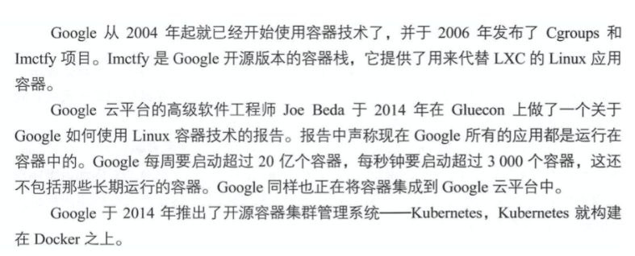

## 容器

以前服务器部署

由于物理机的诸多问题，后来出现了虚拟机

但是虚拟化也是有局限性的，每一个虚拟机都是一个完整的操作系统，要分配系统资源，虚拟机多道一定程度时，操作系统本身资源也就消耗殆尽，或者说必须扩容

## 为什么学docker

某公司的产品运行在内部的虚拟化平台中，如openstack，也就是我们所学的KVM虚拟化，创建虚拟机。

但是不断增加的云端应用，增加了对硬件资源的消耗，不断的创建虚拟机，给公司带来了难题，公司已经在云平台上运行了多台云主机，消耗了大量的硬件资源。

怎么才能够高效的利用硬件资源实现云服务呢？

容器技术，此时就派上用场了。

## 容器技术

Docker最初是DotCloud公司在法国期间发起的一个公司内部项目，后来以Apache2.0授权协议开源，代码在Github上维护。

Docker是基于Google公司推出的Golang语言开发而来，基于Linux内核的Cgroups、NameSpace，以及Union FS等技术，对进程进行封装隔离，属于操作系统层面的虚拟化技术。

由于隔离的进程独立于宿主机和其他隔离的进程，也被称之为容器。

最初的Docker是基于LXC的，后来去除LXC转而使用自行开发的Libcontainer。

Docker被定义为开源的容器引擎，可以方便的对容器进行管理。例如对镜像打包封装，引入Docker Registry对镜像统一管理。

利用Docker可以实现开发，测试，生产环境的部署一致性，极大的减少运维成本。

## 容器和虚拟机的差异

### 传统虚拟机技术

虚拟机是虚拟出一套硬件，在其上面运行一个完整的操作系统，例如我们使用KVM，指定系统镜像，然后装系统，最终可以使用，在该系统上再运行所需的应用程序。

KVM创建虚拟机时，指定较少的cpu，内存，硬盘等资源，虚拟机性能较低。

### 容器技术

容器内的应用程序直接运行在宿主机的内核上，容器内没有自己的内核，也没有对硬件进行虚拟，因此容器比起虚拟机更为轻便。

### 容器对比KVM的好处

- 容器能够提供宿主机的性能，而kvm虚拟机是分配宿主机硬件资源，性能较弱
- 同样配置的宿主机，最多可以启动10个虚拟机的话，可以启动100+的容器数量。
- 启动一个KVM虚拟机，得有一个完整的开机流程，花费时间较长，或许得20S，而启动一个容器只需要1S。
- KVM需要硬件CPU的虚拟化支持，而容器不需要。

## 为什么选择docker

### docker更高效的利用系统资源

容器不需要进行硬件虚拟化以及运行一个完整操作系统的额外开销，docker对系统资源的利用率更高，无论是应用执行，文件存储，还是在内存消耗等方面，都比传统虚拟机更高效。因此一个同样配置的主机，可以运行处更多数量的容器实例。

### 更快的启动时间

传统的虚拟机启动时间较久，docker容器直接运行在宿主机的内核上，无须启动一个完整的操作系统，因此可以达到秒级启动，大大的解决开发，测试，部署的时间。

### 一致性的环境

在企业里，程序从开发环境，到测试服务器，到生产环境，难以保证机器环境一致性，极大可能出现系统依赖冲突，导致难以部署等Bug。

然而利用docker的容器-镜像技术，提供了除了内核以外完整的运行时环境，确保了应用环境的一致性。

### 持续交付和部署

还是刚才所说的一致性的环境，对于开发和运维的人员，最希望的就是环境部署迁移别处问题，利用docker可以定制镜像，以达到持续集成，持续交付和部署。

通过Dockerfile来进行镜像构建，实现系统集成测试，运维进行生产环境的部署。

且Dockerfile可以使镜像构建透明化，方便技术团队能够快速理解运行环境部署流程。

### 更轻松的迁移

Docker可以在很多平台运行，无论是物理机，虚拟机，云服务器等环境，运行结果都是一致的。用于可以轻松的将一个平台的应用，迁移到另一个平台，而不用担心环境的变化，导致程序无法运行。

### docker能做什么

- 可以把应用程序代码及运行依赖环境打包成镜像，作为交付介质，在各环境部署
- 可以将镜像（image）启动成为容器(container)，并且提供多容器的生命周期进行管理（启、停、删）
- container容器之间相互隔离，且每个容器可以设置资源限额
- 提供轻量级虚拟化功能，容器就是在宿主机中的一个个的虚拟的空间，彼此相互隔离，完全独立

## Docker VS 传统虚拟机

| 特性       | 容器               | 虚拟机     |
| ---------- | ------------------ | ---------- |
| 启动       | 秒级               | 分钟级     |
| 硬盘使用   | 一般为 MB          | 一般为 GB  |
| 性能       | 接近原生           | 弱         |
| 系统支持量 | 单机支持上千个容器 | 一般几十个 |

## docker使用情况

## 企业与容器集群

### 京东容器集群

### 淘宝容器集群

阿里成立专门的项目组推进docker应用，目标是把双11流量覆盖的核心应用，全部升级为镜像化的Docker应用
