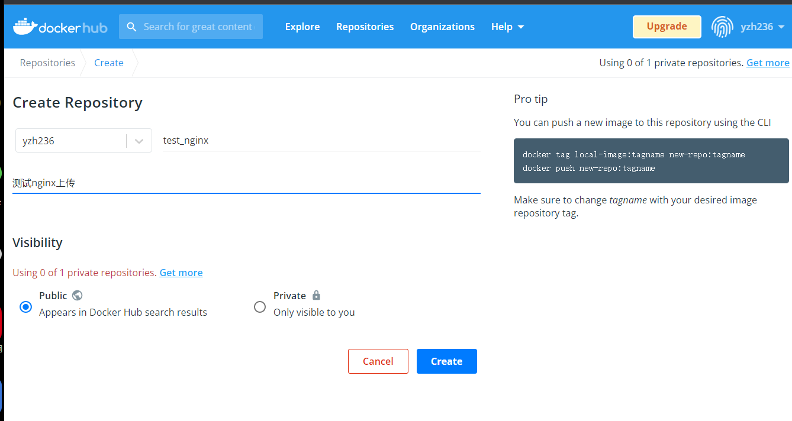
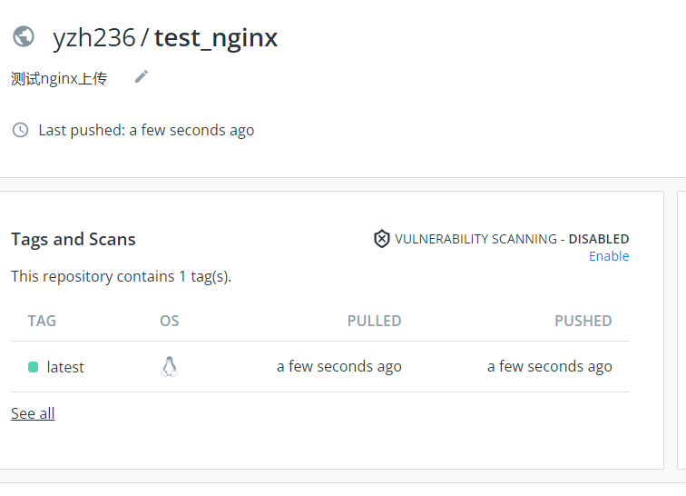

## docker仓库


仓库的概念也就是用于存储，docker仓库用于存储镜像。

镜像构建完成后，很容易可以在宿主机上运行，但是如果要在其他服务器上运行，则需要考虑镜像的分发，存储的问题。

## docker registry

镜像注册服务就是用于提供集中式的存储，分发镜像的服务。

一个Docker Registry中可以包含多个仓库（Repositroy）

每个仓库可以包含多个标签（Tag），每个标签对应一个镜像。

通常一个仓库会包含同一个软件不同版本的镜像

```
centos8
centos7.2.xx

标签常用于对应该软件的各个版本，开发者可以通过
<仓库名>:<标签>
这样的格式指定软件具体版本，若不给出标签，默认用latest作为默认标签
```

### 仓库名

```
仓库名一般以两段形式出现，例如yzh/centos

前者是docker registry多用户的用户名，后者是软件名

# 常见用法
docker pull yzh/centos:7.2.1511
```

## 公有/私有/仓库

Docker Registry有两种形式

- 公开，开放给所有用户，提供给所有用户搜索，拉取，提交，更新镜像，还免费保管用户镜像数据。
  - 此类服务受限于网络限制，无法及时立即获取所需镜像，简单说就是需要用什么得现下载，得看网速
  - 优点是可以获取绝大部分公开的镜像，方便使用
- 私有范围的Registry服务，用在学校，企业内网的研发环境
  - 局域网环境，保证了镜像拉取速度
  - 保证核心镜像数据安全
  - 存在镜像不丰富问题

### 公开服务仓库

最常见的Registry是Docker Hub，也是docker默认允许用户管理镜像的Registry服务，拥有大量高质量的官方镜像。

由于网络地域原因，公开服务在国内访问较慢，也就出现了针对镜像服务的加速器。

- 阿里云加速器
- DaoCloud加速器
- 灵雀云加速器
- 等等

使用加速器，可以从国内的地址获取Docker Hub的镜像，速度会快很多。

### 私有服务仓库

除了私用公开服务外，还可以在自己本地搭建私有Docker Registry。

开源的Docker Registry镜像只提供了Docker Registry API的功能，没有图形化功能。

## 镜像注册|推送|下载

1.注册docker官网维护的大型公共仓库 Docker Hub

```
https://hub.docker.com/
```

2.注册完毕账号后，可以根据自己需要，创建，公开/私有的镜像仓库。



- 修改本地镜像名

```
#docker tag local-image:tagname new-repo:tagname

docker tag 153687381b2b yzh236/test_nginx
```

- 登录dockerhub账户

```
[root@docker01 docker]# docker login
Login with your Docker ID to push and pull images from Docker Hub. If you don't have a Docker ID, head over to https://hub.docker.com to create one.
Username: yzh236
Password: 
WARNING! Your password will be stored unencrypted in /root/.docker/config.json.
Configure a credential helper to remove this warning. See
https://docs.docker.com/engine/reference/commandline/login/#credentials-store
Login Succeeded
```

- 推送到远程仓库

```
#docker push new-repo:tagname

[root@docker01 docker]# docker push yzh236/test_nginx
Using default tag: latest
The push refers to repository [docker.io/yzh236/test_nginx]
```



- 下载镜像模拟

  ```
  [root@docker01 ~]# docker pull yzh236/test_nginx
  ```

## 操作使用共有仓库

```
docker search 镜像名
```

## 加速器配置

```
1.修改docker配置文件
[root@docker01 my_docker]# cat /etc/docker/daemon.json
{"registry-mirrors": ["https://reg-mirror.qiniu.com"]}


2.重启docker
[root@docker01 my_docker]# systemctl daemon-reload
[root@docker01 my_docker]# systemctl restart docker
```

## 私有仓库部署

Repository是集中存放镜像的地方，且私有仓库优点是

- 省贷款
- 传输速度快
- 方便存储

当开发者编译完成Image之后，就可以推送到Registry了，公开或私有的皆可。

```
1.获取registry镜像，加上参数，确保每次重启
docker run -d \
      --name cc_registry \
      --restart=always \
    -p 5000:5000 \
    -v /opt/data/registry:/var/lib/registry \
    registry

[root@docker01 my_docker]# docker ps
CONTAINER ID        IMAGE               COMMAND                  CREATED             STATUS              PORTS                    NAMES
1979dd1975f0        registry            "/entrypoint.sh /etc…"   2 seconds ago       Up 1 second         0.0.0.0:5000->5000/tcp   cc_registry


2.推送本地镜像到私有仓库中

# 必须先修改镜像名，以
仓库地址/软件名 形式上传

[root@docker01 my_docker]# docker tag hello-world 10.0.1.70:5000/cc-hello-world:latest
[root@docker01 my_docker]# docker images |grep hello
10.0.1.70:5000/cc-hello-world   latest              bf756fb1ae65        8 months ago        13.3kB
hello-world                     latest              bf756fb1ae65        8 months ago        13.3kB

3.上传到私有仓库

注意，要修改docker配置文件

[root@docker01 my_docker]# cat /etc/docker/daemon.json
{"registry-mirrors": ["https://reg-mirror.qiniu.com"],"insecure-registries":["10.0.1.70:5000"]}


[root@docker01 my_docker]# systemctl restart docker

# 推送本地镜像
[root@docker01 my_docker]# docker push 10.0.1.70:5000/cc-hello-world
The push refers to repository [10.0.1.70:5000/cc-hello-world]
9c27e219663c: Pushed
latest: digest: sha256:90659bf80b44ce6be8234e6ff90a1ac34acbeb826903b02cfa0da11c82cbc042 size: 525


4.通过docker api查询镜像信息
[root@docker01 my_docker]# curl -s  127.0.0.1:5000/v2/_catalog | python -m json.tool
{
    "repositories": [
        "cc-hello-world"
    ]
}

5.此时可以删掉本地镜像

6.从私有仓库中下载镜像
[root@docker01 my_docker]# docker pull 10.0.1.70:5000/cc-hello-world
```

