## Docker安装部署

## Docker引擎

Docker Engine是C/S架构的

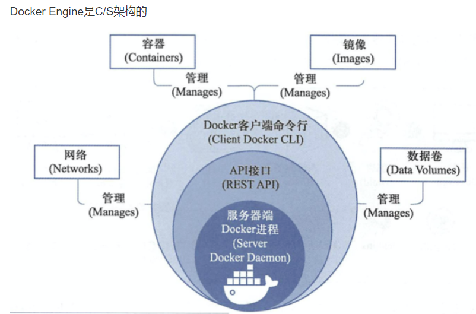

Docker由已下几个部件组成。

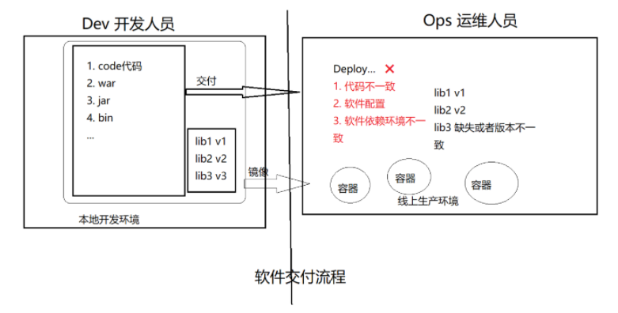

### Docker Daemon

安装使用Docker，得先运行Docker Daemon进程，用于管理docker，如：

- 镜像 images
- 容器 containers
- 网络 network
- 数据卷 Data Volumes

### Rest接口

提供和Daemon交互的API接口

### Docker Client

客户端使用REST API和Docker Daemon进行访问。

## Docker平台组成

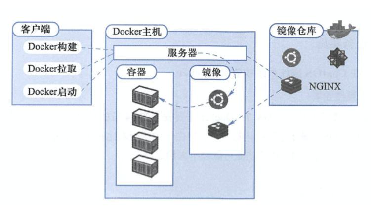

### Images

镜像是一个只读模板，用于创建容器，也可以通过Dockerfile文本描述镜像的内容。

镜像的概念类似于编程开发里面向对象的类，从一个基类开始（基础镜像Base Image）

构建容器的过程，就是运行镜像，生成容器实例。

Docker镜像的描述文件是Dockerfile，包含了如下的指令

- FROM 定义基础镜像
- MAINTAINER 作者
- RUN 运行Linux命令
- ADD 添加文件/目录
- ENV 环境变量
- CMD 运行进程

### Container

容器是一个镜像的运行实例，镜像 > 容器。

创建容器的过程

- 获取镜像，如`docker pull centos`，从镜像仓库拉取
- 使用镜像创建容器
- 分配文件系统，挂载一个读写层，在读写层加载镜像
- 分配网络/网桥接口，创建一个网络接口，让容器和宿主机通信
- 容器获取IP地址
- 执行容器命令，如/bin/bash
- 反馈容器启动结果。

### Registry

Docker镜像需要进行管理，docker提供了Registry仓库，其实它也是一个容器。可以用于可以基于该容器运行私有仓库。

也可以使用Docker Hub互联网公有镜像仓库。

## 安装初始化环境

机器环境初始化

```
1.防火墙
2.yum源
3.安装基础软件

wget -O /etc/yum.repos.d/CentOS-Base.repo http://mirrors.aliyun.com/repo/Centos-7.repo
wget -O /etc/yum.repos.d/epel.repo http://mirrors.aliyun.com/repo/epel-7.repo


yum install -y bash-completion vim lrzsz wget expect net-tools nc nmap tree dos2unix htop iftop iotop unzip telnet sl psmisc nethogs glances bc ntpdate  openldap-devel

[root@docker01 ~]# systemctl disable firewalld
[root@docker01 ~]# systemctl stop firewalld
[root@docker01 ~]# sed -i 's/SELINUX=enforcing/SELINUX=disabled/g' /etc/selinux/config
[root@docker01 ~]# iptables -F
[root@docker01 ~]# iptables -X
[root@docker01 ~]# iptables -Z
[root@docker01 ~]# iptables-save
```

## docker01机器准备

### 配置网卡转发

```
1.docker必须安装在centos7平台，内核版本不低于3.10
在centos平台运行docker可能会遇见些告警信息，修改内核配置参数，打开内核转发功能

# 写入
cat <<EOF >  /etc/sysctl.d/docker.conf
net.bridge.bridge-nf-call-ip6tables = 1
net.bridge.bridge-nf-call-iptables = 1
net.ipv4.conf.default.rp_filter = 0
net.ipv4.conf.all.rp_filter = 0
net.ipv4.ip_forward=1
EOF


2.重新加载内核参数
[root@docker01 ~]# sysctl -p /etc/sysctl.d/docker.conf

如果出现报错执行一下这个 modprobe br_netfilter

# 要保持本地软件源较新，可以用阿里云yum源更新软件

3.安装docker-ce社区版
## 下载阿里源repo文件
$ curl -o /etc/yum.repos.d/Centos-7.repo http://mirrors.aliyun.com/repo/Centos-7.repo
$ curl -o /etc/yum.repos.d/docker-ce.repo http://mirrors.aliyun.com/docker-ce/linux/centos/docker-ce.repo

$ yum clean all && yum makecache


## yum安装
$ yum install docker-ce-20.10.6 -y
## 查看源中可用版本
$ yum list docker-ce --showduplicates | sort -r
## 如果需要安装旧版本
##yum install -y docker-ce-18.09.9
```

## 镜像加速器

使用docker首要操作就是获取镜像文件，默认下载是从Docker Hub下载，网速较慢，国内很多云服务商都提供了加速器服务，阿里云加速器，Daocloud加速器，灵雀云加速器。

```
1.修改docker配置文件，我们选用七牛云镜像站


[root@docker01 ~]# cat /etc/docker/daemon.json
{"registry-mirrors": ["https://reg-mirror.qiniu.com"]}

# 也可以
## 配置源加速
## https://cr.console.aliyun.com/cn-hangzhou/instances/mirrors
mkdir -p /etc/docker
vim /etc/docker/daemon.json
{"registry-mirrors" : ["https://8xpk5wnt.mirror.aliyuncs.com"]}


2.重启，设置开机自启
## 设置开机自启
systemctl enable docker  
systemctl daemon-reload


[root@docker01 ~]# systemctl restart docker

# 查看docker-client信息
## docker-client
which docker
## docker daemon
ps aux |grep docker
## containerd
ps aux|grep containerd
systemctl status containerd
```

## docker管理

```
1.检查服务状态
[root@docker01 ~]# docker version

2.检查系统内核
[root@docker01 ~]# uname -a

3.检查系统是否安装了存储驱动，看到结果即可
[root@docker01 ~]# ls -l /sys/class/misc/device-mapper/

# 若是没有，单独安装即可
[root@docker01 ~]# yum install device-mapper -y

# 加载存储驱动模块
[root@docker01 ~]# modprobe dm-mod
```

## docker核心要素与操作

三大核心要素：镜像(Image)、容器(Container)、仓库(Registry)

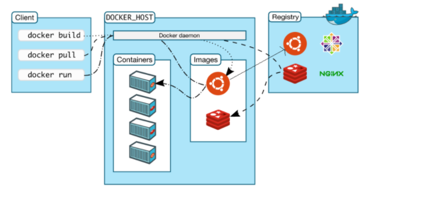

## 启动第一个容器

```
1.获取nginx镜像
docker search nginx
docker pull nginx

[root@docker01 ~]# docker run -d -p 80:80 nginx

# 参数解释
docker run 参数     镜像
-d 后台运行
-p 端口映射
nginx 镜像名

2.检查服务器上所有镜像
[root@docker01 ~]# docker images
REPOSITORY          TAG                 IMAGE ID            CREATED             SIZE
nginx               latest              4bb46517cac3        2 weeks ago         133MB

3.检查正在运行的docker容器
[root@docker01 ~]# docker ps
CONTAINER ID        IMAGE               COMMAND                  CREATED              STATUS              PORTS                NAMES
e1238321422c        nginx               "/docker-entrypoint.…"   About a minute ago   Up About a minute   0.0.0.0:80->80/tcp   ecstatic_gould

4.访问容器内的nginx服务
```

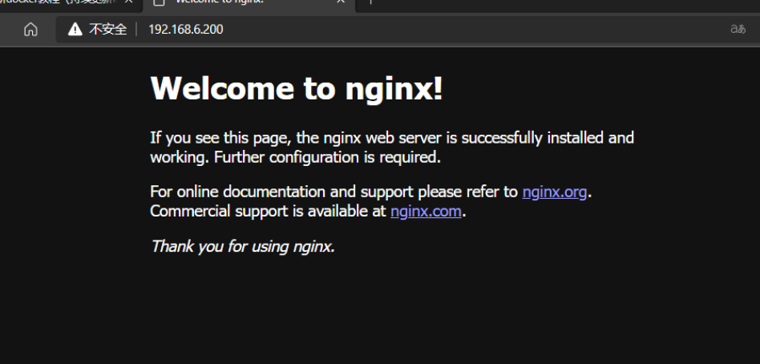

### docker生命周期

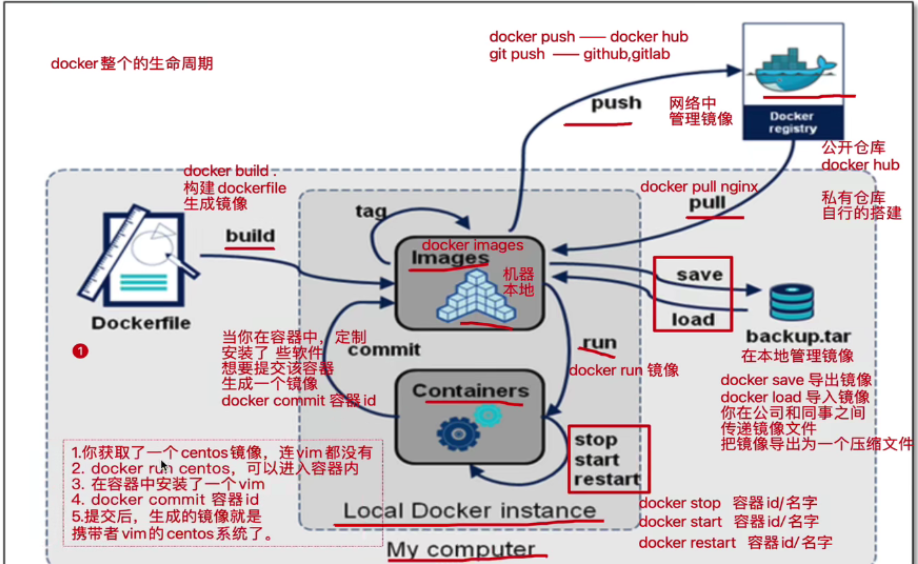

## Docker镜像管理

一个完成的Docker镜像可以支撑容器的运行，镜像提供文件系统

```
# 下载centos系统镜像
[root@docker01 ~]# docker pull centos
```

## 内核与发行版

传统的虚拟机安装操作系统所提供的系统镜像，包含两部分：

Linux内核版本，例如

```
[root@docker01 ~]# uname -r
3.10.0-862.el7.x86_64
```

系统发行版本（centos，ubuntu）

```
[root@docker01 ~]# cat /etc/redhat-release
CentOS Linux release 7.5.1804 (Core)
```

而docker镜像：

docker镜像是不包含系统内核的，下载的是某一个发行版。

例如

```
# 获取centos7.5发行版本
[root@docker01 ~]# docker search centos:7.5

# 获取mysql5.7
[root@docker01 ~]# docker search mysql:5.7
```

## docker镜像定义

docker镜像不包含linux内核，和宿主机共用。

我们如果想要定义一个mysql5.6镜像，我们会这么做

- 获取基础镜像，选择一个发行版平台
- 在centos镜像中安装mysql5.6软件

导出镜像，可以命名为mysql:5.6镜像文件。

从这个过程，我们可以感觉出这是一层一层的添加的，docker镜像的层级概念就出来了，底层是centos镜像，上层是mysql镜像，centos镜像层属于父镜像。

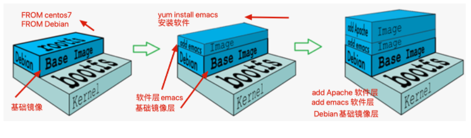

Docker镜像是在基础镜像之后，然后安装软件，配置软件，添加新的层，构建出来。

这种现象在dockerfile构建时候，更为清晰。

## Docker为什么分层镜像

镜像分享一大好处就是共享资源，例如有多个镜像都来自于同一个base镜像，那么在docker host只需要存储一份base镜像。

内存里也只需要加载一份host，即可为多个容器服务。

即使多个容器共享一个base镜像，某个容器修改了base镜像的内容，例如修改/etc/下配置文件，其他容器的/etc/下内容是不会被修改的，修改动作只限制在单个容器内，这就是容器的写入时复制特性（Copy-on-write）。

### 可写的容器层

当容器启动后，一个新的可写层被加载到镜像的顶部，这一层通常被称为`容器层`，`容器层`下的都称为`镜像层`。

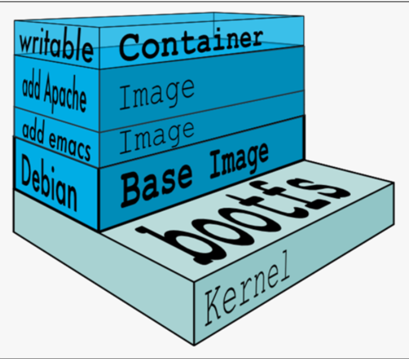

所有对容器的修改动作，都只会发生在`容器层`里，只有`容器层`是可写的，其余`镜像层`都是只读的。

| **文件操作** | **说明**                                                     |
| ------------ | ------------------------------------------------------------ |
| **添加文件** | 在容器中创建文件时，新文件被添加到容器层中。                 |
| **读取文件** | 在容器中读取某个文件时，Docker 会从上往下依次在各镜像层中查找此文件。一旦找到，立即将其复制到容器层，然后打开并读入内存。 |
| **修改文件** | 在容器中修改已存在的文件时，Docker 会从上往下依次在各镜像层中查找此文件。一旦找到，立即将其复制到容器层，然后修改之。 |
| **删除文件** | 在容器中删除文件时，Docker 也是从上往下依次在镜像层中查找此文件。找到后，会在容器层中**记录下此删除操作**。（只是记录删除操作） |

只有当需要修改时才复制一份数据，这种特性被称作 Copy-on-Write。可见，容器层保存的是镜像变化的部分，不会对镜像本身进行任何修改。

这样就解释了我们前面提出的问题：容器层记录对镜像的修改，所有镜像层都是只读的，不会被容器修改，所以镜像可以被多个容器共享。

## Docker镜像的内容

docker镜像层级管理的方式大大便捷了Docker镜像的分发和存储。Docker hub是为全世界的镜像仓库。

- Docker镜像代表一个容器的文件系统内容
- 镜像层级技术属于`联合文件系统`
- 容器是一个动态的环境，每一层镜像里的文件都属于静态内容
  - dockerfile里的ENV、VOLUME、CMD等内容都会落实到容器环境里

**UnionFS**

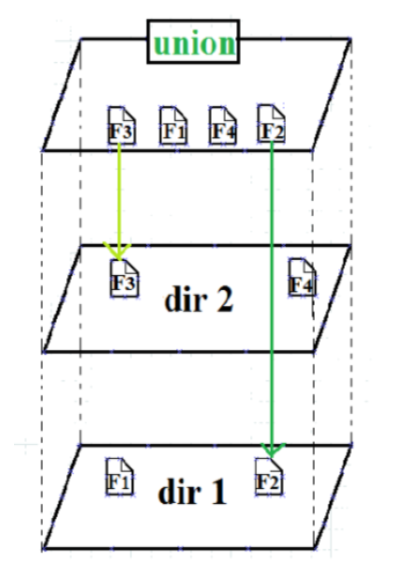


## docker具体解决什么问题

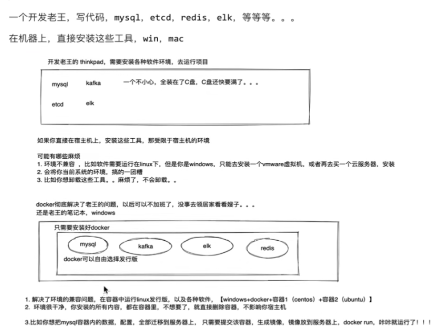

## docker镜像原理

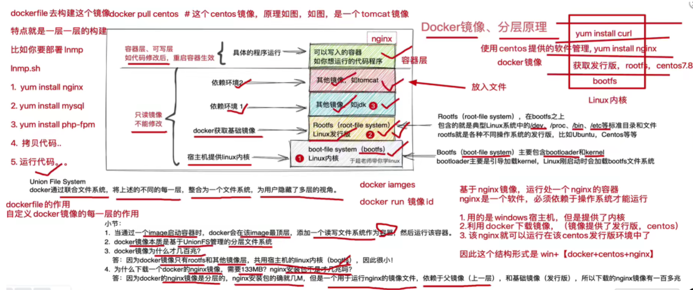


## 获取Docker镜像

```
1.获取镜像，docker hub里有大量高质量的镜像
[root@docker01 ~]# docker pull centos  # 默认标签tag是centos:latest

[root@docker01 ~]# docker pull  centos:7.2.1511  # 指定版本下载

2.查看所有镜像
[root@docker01 ~]# docker images
REPOSITORY          TAG                 IMAGE ID            CREATED             SIZE
nginx               latest              4bb46517cac3        3 weeks ago         133MB
centos              latest              0d120b6ccaa8        3 weeks ago         215MB
centos              7.2.1511            9aec5c5fe4ba        17 months ago       195MB

3.docker本地镜像，都放在
[root@docker01 ~]# ll /var/lib/docker/
total 4
drwx------  2 root root   24 Sep  4 01:37 builder
drwx--x--x  4 root root   92 Sep  4 01:37 buildkit
drwx------  2 root root    6 Sep  4 19:08 containers
drwx------  3 root root   22 Sep  4 01:37 image
drwxr-x---  3 root root   19 Sep  4 01:37 network
drwx------ 10 root root 4096 Sep  4 19:08 overlay2
drwx------  4 root root   32 Sep  4 01:37 plugins
drwx------  2 root root    6 Sep  4 19:05 runtimes
drwx------  2 root root    6 Sep  4 01:37 swarm
drwx------  2 root root    6 Sep  4 19:06 tmp
drwx------  2 root root    6 Sep  4 01:37 trust
drwx------  2 root root   25 Sep  4 01:37 volumes


# 可以通过docker info查看
[root@docker01 docker]# docker info | grep "Docker Root Dir"
 Docker Root Dir: /var/lib/docker

# 所有镜像存储的位置
[root@docker01 sha256]# pwd
/var/lib/docker/image/overlay2/imagedb/content/sha256

# 该目录都是json文件，记录镜像和容器的关系
[root@docker01 sha256]# ll
total 16
-rw------- 1 root root 2180 Sep  4 02:00 0d120b6ccaa8c5e149176798b3501d4dd1885f961922497cd0abef155c869566
-rw------- 1 root root 7512 Sep  4 01:48 4bb46517cac397bdb0bab6eba09b0e1f8e90ddd17cf99662997c3253531136f8
-rw------- 1 root root 2604 Sep  4 19:06 9aec5c5fe4ba9cf7a8d2a50713dd197c3b0cbd5f5fcd03babe4c1d65c455dabf


4.运行镜像，以某一个base镜像来启动一个容器，参数解释
-i
-t
--rm
bash

[root@docker01 ~]# docker run -it --rm centos:7.2.1511 bash
[root@ade0c7e6bb85 /]#
[root@ade0c7e6bb85 /]#
[root@ade0c7e6bb85 /]# cat /etc/redhat-release
CentOS Linux release 7.2.1511 (Core)

5.运行centos8容器
[root@docker01 ~]# docker run -it --rm  centos:latest bash
[root@1f2b4e7eb18c /]# cat /etc/redhat-release
CentOS Linux release 8.2.2004 (Core)

6.退出容器
[root@1f2b4e7eb18c /]# exit
exit
[root@docker01 ~]#

7.centos支持下载的镜像标签列表
https://hub.docker.com/_/centos
```

### 镜像操作管理

```
1.查询镜像
[root@docker01 ~]# docker images
REPOSITORY          TAG                 IMAGE ID            CREATED             SIZE
nginx               latest              4bb46517cac3        3 weeks ago         133MB
centos              latest              0d120b6ccaa8        3 weeks ago         215MB
centos              7.2.1511            9aec5c5fe4ba        17 months ago       195MB

列表展示了仓库名，标签，镜像ID，创建时间，占用空间

2.docker镜像体积
docker镜像是多层存储结构，可以继承，复用。因此不同的镜像也会使用相同的base images，从而使用些共同的层layer。
因此docker使用联合文件系统，相同的层只需要保存一份，实际镜像占用硬盘空间要比列表镜像小的多。
```

### none镜像

none镜像（dangline image 虚悬镜像）

出现none镜像的原因：

- 在docker hub上镜像如果更新后，名称变化，用户再docker pull就会出现该情况
- docker build时候，镜像名重复，也会导致新旧镜像同名，旧镜像名称被取消，出现none

### 列出镜像

```
1.根据仓库名列出镜像
[root@docker01 ~]# docker images centos
REPOSITORY          TAG                 IMAGE ID            CREATED             SIZE
centos              latest              0d120b6ccaa8        3 weeks ago         215MB
centos              8.2.2004            831691599b88        2 months ago        215MB
centos              7.2.1511            9aec5c5fe4ba        17 months ago       195MB

2.列出指定镜像
[root@docker01 ~]# docker images centos:8.2.2004
REPOSITORY          TAG                 IMAGE ID            CREATED             SIZE
centos              8.2.2004            831691599b88        2 months ago        215MB

3.列出特定格式，镜像id
-q 只列出id 
-q, --quiet  Only show numeric IDs

[root@docker01 ~]# docker images -q
4bb46517cac3
0d120b6ccaa8
831691599b88
9aec5c5fe4ba
```

### 查找镜像

```
1.默认是先在本地寻找镜像，没有去docker hub搜索
[root@docker01 ~]# docker search centos
```

### 删除本地镜像

```
# 删除镜像，可以用 ID，名字，摘要等

# 根据id删除(前三位或全位)
[root@docker01 ~]# docker rmi bf7

# 删除镜像名
docker rmi hello-world

#删除所有镜像(谨慎执行)
[root@docker01 ~]# docker rmi `docker images -aq`
```

### 导出镜像

```
[root@docker01 my_docker]# docker image save centos:7.2.1511 > centos-7.2.1511.tgz
[root@docker01 my_docker]# ll -h
total 193M
-rw-r--r-- 1 root root 193M Sep  5 00:30 centos-7.2.1511.tgz
```

### 导入镜像

```
1.删除centos7.2镜像
2.导入镜像压缩文件
[root@docker01 my_docker]# docker image load -i centos-7.2.1511.tgz
a11c91bfd866: Loading layer [==================================================>]    202MB/202MB
Loaded image: centos:7.2.1511
[root@docker01 my_docker]#
```

### 查看镜像详细信息

```
[root@docker01 my_docker]# docker image inspect 9aec5c5fe4ba
```

### 批量删除none镜像

```
docker rm `docker ps -aq`
docker rmi $(docker images|grep "none"|awk '{print $3}')
```
