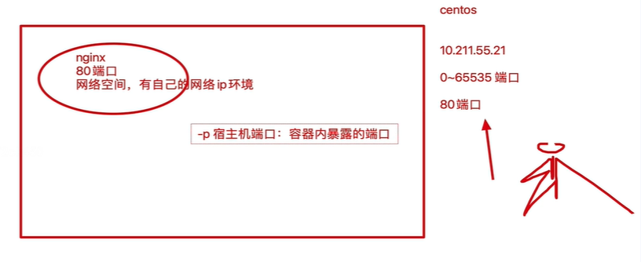
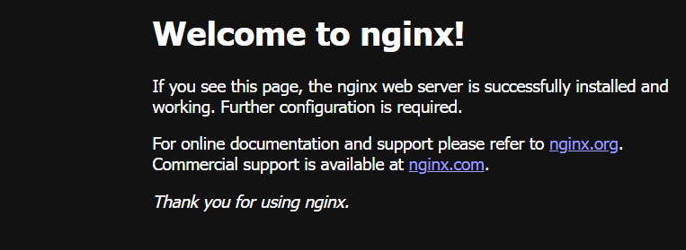

## docker容器管理

`docker run` 等于创建+启动

> docker run 镜像名、如果镜像不存在本地、则会在线去下载镜像

**注意：容器内的进程必须处于前台运行状态，否则容器就会直接退出**

如果容器内，什么事也没做，容器也会挂掉，容器内必须有一个进程在前台运行

我们运行nginx基础镜像，没有运行任何程序，因此容器直接挂掉

```
1.这个写法会产生多独立容器记录，且容器内没有程序再跑，因此挂了
[root@docker01 ~]#docker run centos:7.2.1511

2.开启一个容器，让它帮你运行某个程序，属于前台运行，会卡住一个终端
[root@docker01 ~]# docker run -it centos:7.2.1511 ping baidu.com

3.运行容器，进入容器内执行某个命令
[root@docker01 ~]# docker run -it centos:7.2.1511 
[root@cc4afc310a53 /]# cat /etc/redhat-release 
CentOS Linux release 7.2.1511 (Core)

4.运行一个活着的容器，docer ps 可以看到容器
-d 参数，让容器在后台跑着(针对宿主机而言)
[root@docker01 ~]# docker run -d centos:7.2.1511  ping baidu.com
bbafc24670a8783d44529e3d9a435c78a06d89c510826ad6a868ee7593904b79

5.丰富docker运行的参数
-d 后台运行
--rm 容器挂掉后自动被删除
--name 容器起名

[root@docker01 ~]# docker run -d --name pythonav --rm centos:7.2.1511 ping pythonav.cn

```

### 停止容器记录

```
docker stop 214a389dfe28(容器id)
```

### 查看容器日志

```
 docker logs bbafc24670a8(容器id)
 docker logs bbafc24670a8|tail -5  #容器最新日志
```

### 进入正在运行容器内操作

```
[root@docker01 ~]# docker exec -it 89d33f4526d9 bash

[root@89d33f4526d9 /]# ps -ef
UID         PID   PPID  C STIME TTY          TIME CMD
root          1      0  0 03:53 ?        00:00:00 ping pythonav.cn
root          7      0  0 04:04 pts/0    00:00:00 bash
root         21      7  0 04:04 pts/0    00:00:00 ps -ef

```

### 查看容器详细信息

```
docker container inspect 容器id
```

### 容器端口映射



```
docker run -d --name nginx_1 -p 80:80 nginx
```

```
[root@docker01 ~]# docker ps
CONTAINER ID   IMAGE             COMMAND                  CREATED         STATUS         PORTS                               NAMES
382188721aaf   nginx             "/docker-entrypoint.…"   7 minutes ago   Up 7 minutes   0.0.0.0:88->80/tcp, :::88->80/tcp   nginx_1
```



### 查看端口转发

```
[root@docker01 ~]# docker port 382188721aaf
80/tcp -> 0.0.0.0:88
80/tcp -> :::88
```

### 容器的提交

```
运行基础的cnetos7.2，在容器内安装vim，然后提交新的镜像
新的镜像在运行出的容器默认就携带了vim了

[root@docker01 ~]# docker commit 4dccb253af88 yzh/centos_vim_7.2
```

