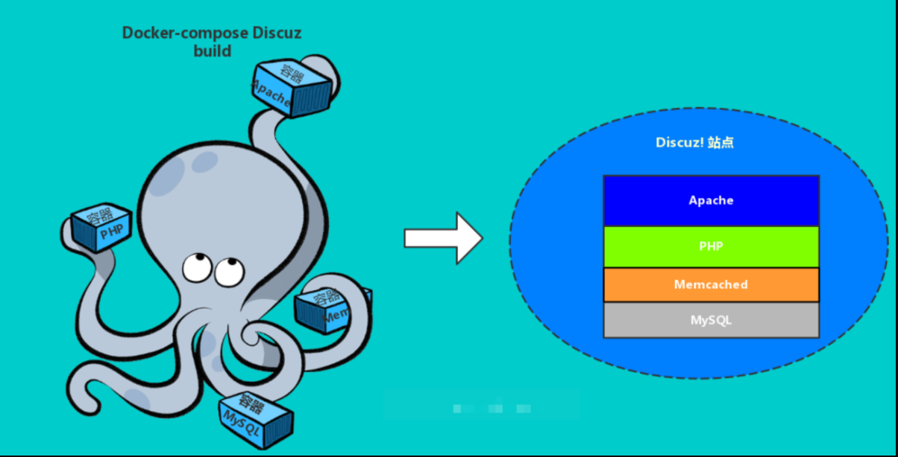
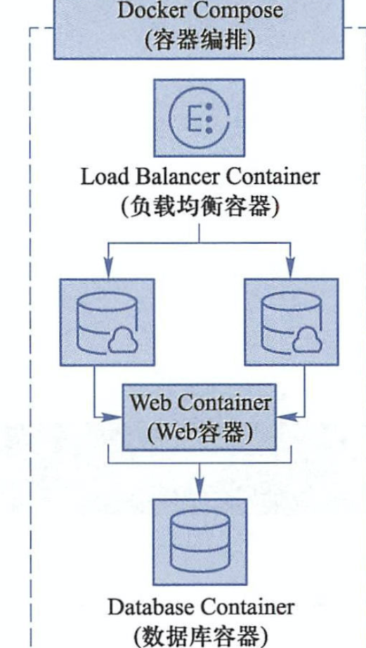

## 容器编排



随着网站架构的升级，容器也使用的越发频繁，应用服务和容器间的关系也越发复杂。这就要求研发人员能够更好的方法去管理数量较多的容器服务，而不能手动的去挨个管理。

例如一个LNMP的架构，就得部署web服务器，后台程序，数据库，负载均衡等等都需要统一部署在容器里，那么这时候就需要使用统一的容器编排服务`docker-compose`，通过一个单独的`docker-compose.yml`模板文件为一个项目定义一组相关联的应用容器。

## 容器编排导图


## docker-compose

docker-compose的定位就是定义和运行多个docker容器应用。

之前我们了解可以用dockerfile模板文件让用户方便的定义一个单独的应用容器，然而，如LNMP这样的Web项目，就涉及多个服务之间的配合，如nginx,mysql,php,redis等。



docker-compose就可以满足这样的需求，允许用户通过`docker-compose.yml`模板文件，来定义各容易间的关系。

## compose两个重要的概念

- 服务，service：一个应用的容器，实际上可以包括若干个相同镜像的容器实例。
- 项目，project：由一组关联的应用容器组成的一个完成业务单元。

Compose默认管理的是project，通过子命令对项目中的一组容器进行生命周期管理。

Compose由python语言开发，调用了Docker提供的API对容器进行管理。

## 安装compose

compose需要`docker engine 1.7.1+`

安装形式

- python的pip包管理工具
- 二进制文件
- 运行在容器里

```
1.daocloud下载
sudo curl -L https://get.daocloud.io/docker/compose/releases/download/1.25.1/docker-compose-`uname -s`-`uname -m` -o /usr/local/bin/docker-compose

2.添加可执行权限
sudo chmod +x /usr/local/bin/docker-compose

3.测试安装结果
[root@docker01 ~]# docker-compose --version
docker-compose version 1.25.1, build a82fef07


-----pip安装------
sudo pip install docker-compose
```


## docker-compose文件结构和示例

### docker-compose文件结构

docker-compose.yml:

```vbnet

```

```
version: "3"
services:
 
  redis:
    image: redis:alpine
    ports:
      - "6379"
    networks:
      - frontend
    deploy:
      replicas: 2
      update_config:
        parallelism: 2
        delay: 10s
      restart_policy:
        condition: on-failure
 
  db:
    image: postgres:9.4
    volumes:
      - db-data:/var/lib/postgresql/data
    networks:
      - backend
    deploy:
      placement:
        constraints: [node.role == manager]
 
  vote:
    image: dockersamples/examplevotingapp_vote:before
    ports:
      - 5000:80
    networks:
      - frontend
    depends_on:
      - redis
    deploy:
      replicas: 2
      update_config:
        parallelism: 2
      restart_policy:
        condition: on-failure
 
  result:
    image: dockersamples/examplevotingapp_result:before
    ports:
      - 5001:80
    networks:
      - backend
    depends_on:
      - db
    deploy:
      replicas: 1
      update_config:
        parallelism: 2
        delay: 10s
      restart_policy:
        condition: on-failure
 
  worker:
    image: dockersamples/examplevotingapp_worker
    networks:
      - frontend
      - backend
    deploy:
      mode: replicated
      replicas: 1
      labels: [APP=VOTING]
      restart_policy:
        condition: on-failure
        delay: 10s
        max_attempts: 3
        window: 120s
      placement:
        constraints: [node.role == manager]
 
  visualizer:
    image: dockersamples/visualizer:stable
    ports:
      - "8080:8080"
    stop_grace_period: 1m30s
    volumes:
      - "/var/run/docker.sock:/var/run/docker.sock"
    deploy:
      placement:
        constraints: [node.role == manager]
 
networks:
  frontend:
  backend:
 
volumes:
  db-data:
```

## docker-compose使用示例

通过docker-compose构建一个在docker中运行的基于python flask框架的web应用。

> 注意：确保你已经安装了Docker Engine和Docker Compose。 您不需要安装Python或Redis，因为这两个都是由Docker镜像提供的。
> 

Step 1: 定义python应用

```
1 .创建工程目录
mkdir compose_test
cd compose_test
mkdir src      # 源码文件夹
mkdir docker  # docker配置文件夹
```

```
目录结构如下： 

└── compose_test
    ├── docker
    │   └── docker-compose.yml
    ├── Dockerfile
    └── src
        ├── app.py
        └── requirements.txt
————————————————
```

2 .在compose_test/src/目录下创建python flask应用 compose_test/src/app.py文件。

```
from flask import Flask
from redis import Redis
 
app = Flask(__name__)
redis = Redis(host='redis', port=6379)
 
@app.route('/')
def hello():
    count = redis.incr('hits')
    return 'Hello World! I have been seen {} times.\n'.format(count)
 
if __name__ == "__main__":
    app.run(host="0.0.0.0", debug=True)
```

3.创建python 需求文件 compose_test/src/requirements.txt

```
flask
redis
```

**Step 2: 创建容器的Dockerfile文件**

一个容器一个Dockerfile文件，在compose_test/目录中创建Dockerfile文件：

```bash
FROM python:3.7
 
COPY src/ /opt/src
WORKDIR /opt/src
 
RUN pip install -r requirements.txt
CMD ["python", "app.py"]


Dockerfile文件告诉docker了如下信息：
从Python 3.7的镜像开始构建一个容器镜像。 
复制src（即compose_test/src）目录到容器中的/opt/src目录。 
将容器的工作目录设置为/opt/src（通过docker exec -it your_docker_container_id_or_name bash 进入容器后的默认目录）。 
安装Python依赖关系。
将容器的默认命令设置为python app.py。


```

**Step 3: 定义docker-compose脚本**

在compose_test/docker/目录下创建docker-compose.yml文件，并在里面定义服务，内容如下：

```
version: '3'
services:
  web:
    build: ../
    ports:
     - "5000:5000"
  redis:
    image: redis:3.0.7
    

这个compose文件定义了两个服务，即定义了web和redis两个容器。 
web容器： 
使用当前docker-compose.yml文件所在目录的上级目录（compose_test/Dockerfile）中的Dockerfile构建映像。 
将容器上的暴露端口5000映射到主机上的端口5000。 我们使用Flask Web服务器的默认端口5000。

redis容器： 
redis服务使用从Docker Hub提取的官方redis镜像3.0.7版本。
```

**Step 4: 使用Compose构建并运行您的应用程序**

在compose_test/docker/目录下执行docker-compose.yml文件：

```
$ docker-compose up
# 若是要后台运行： $ docker-compose up -d
# 若不使用默认的docker-compose.yml 文件名：
$ docker-compose -f server.yml up -d 
```

## compose运行wordpress

```
--default_authentication_plugin=mysql_native_password
有关mysql8的密码加密插件修改

yml参数解释：解决容器的依赖、启动先后的问题。先启动，然后启动wordpress
depends_on:
  - db
```

编写wordpress.yml

```
[root@docker01 docker]# cat wordpress.yml 
version: "3"
services:

   db:
     image: mysql:8.0
     command:
      - --default_authentication_plugin=mysql_native_password
      - --character-set-server=utf8mb4
      - --collation-server=utf8mb4_unicode_ci
     volumes:
       - db_data:/var/lib/mysql
     restart: always
     environment:
       MYSQL_ROOT_PASSWORD: 1234
       MYSQL_DATABASE: wordpress
       MYSQL_USER: wordpress
       MYSQL_PASSWORD: wordpress

   wordpress:
     depends_on:
       - db
     image: wordpress:latest
     ports:
       - "9008:80"
     restart: always
     environment:
       WORDPRESS_DB_HOST: db:3306
       WORDPRESS_DB_USER: wordpress
       WORDPRESS_DB_PASSWORD: wordpress
volumes:
  db_data:

```

运行

```
docker-compose -f wordpress.yml up -d
```

访问wordpress


