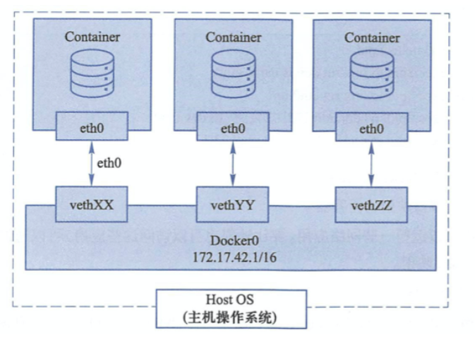

## docker网络

我们使用容器，不单是运行单机程序，当然是需要运行网络服务在容器中，那么如何配置docker的容器网络，基础网络配置，网桥配置，端口映射，还是很重要。

## docker网络功能

docker的网络功能就是利用Linux的`network namespace`，`network bridge`，虚拟网络设备实现的。

默认情况下，docker安装完毕会生成网桥`docker0`

docker的网络接口默认都是虚拟的网络接口。

Docker容器网络在宿主机和容器内分别创建一个虚拟接口，让他们彼此通信。

```
# 默认的网桥
[root@docker01 db_backup]# ifconfig
docker0: flags=4163<UP,BROADCAST,RUNNING,MULTICAST>  mtu 1500
        inet 172.17.0.1  netmask 255.255.0.0  broadcast 172.17.255.255
        inet6 fe80::42:8dff:fe7b:916f  prefixlen 64  scopeid 0x20<link>
        ether 02:42:8d:7b:91:6f  txqueuelen 0  (Ethernet)
        RX packets 105087  bytes 4543670 (4.3 MiB)
        RX errors 0  dropped 0  overruns 0  frame 0
        TX packets 134319  bytes 628048552 (598.9 MiB)
        TX errors 0  dropped 0 overruns 0  carrier 0  collisions 0
```

docker创建一个容器的流程

- 创建一对虚拟接口，分别放到本地主机和新容器中。
- 宿主机一端桥接到默认的docker0，且有一个唯一的名字。
- 另一端放入容器里，改名为eth0，该接口只能在容器的命名空间里可见。
- 从网桥可用地址段获取一个空闲ip，分配给容器的eth0，且配置默认路由桥接到宿主机网卡
- 完成这些之后，容器可以使用eth0虚拟网卡和其他容器连接。


```
docker run 启动的时候，若没有添加--net参数，默认使用bridge桥接模式
docker实际是通过iptables做了DNAT规则，实现端口转发
```

## --net参数

```
--net=bridge 这个是默认值，连接到默认的网桥。

--net=host 告诉 Docker 不要将容器网络放到隔离的命名空间中，即不要容器化容器内的网络。此时容器使用本地主机的网络，它拥有完全的本地主机接口访问权限。容器进程可以跟主机其它 root 进程一样可以打开低范围的端口，可以访问本地网络服务比如 D-bus，还可以让容器做一些影响整个主机系统的事情，比如重启主机。因此使用这个选项的时候要非常小心。如果进一步的使用 --privileged=true，容器会被允许直接配置主机的网络堆栈。

--net=container:NAME_or_ID 让 Docker 将新建容器的进程放到一个已存在容器的网络栈中，新容器进程有自己的文件系统、进程列表和资源限制，但会和已存在的容器共享 IP 地址和端口等网络资源，两者进程可以直接通过 lo 环回接口通信。

--net=none 让 Docker 将新容器放到隔离的网络栈中，但是不进行网络配置。之后，用户可以自己进行配置。
```


### docker高级网络配置

首先，要实现网络通信，机器需要至少一个网络接口（物理接口或虚拟接口）来收发数据包；此外，如果不同子网之间要进行通信，需要路由机制。

Docker 中的网络接口默认都是虚拟的接口。虚拟接口的优势之一是转发效率较高。 Linux 通过在内核中进行数据复制来实现虚拟接口之间的数据转发，发送接口的发送缓存中的数据包被直接复制到接收接口的接收缓存中。对于本地系统和容器内系统看来就像是一个正常的以太网卡，只是它不需要真正同外部网络设备通信，速度要快很多。

Docker 容器网络就利用了这项技术。它在本地主机和容器内分别创建一个虚拟接口，并让它们彼此连通（这样的一对接口叫做 `veth pair`）。



docker在启动时，在主机上创建一个docker0虚拟网桥，实际上是一个Linux的网桥，理解就是一个软件交换机。

docker随机分配一个本地未占用的私有网断地址给docker0接口。例如`172.17.42.1 子网掩码255.255.0.0`

此后启动的容器接口也会分配一个同一网段`172.17.0.0/16`

当创建一个Docker容器的时候，同时创建一对`veth pair(数据包发送到一个接口时，另一个接口也会得到同样数据包)`接口

这样的接口一端在容器，即eth0，另一端在宿主机，并且挂载到bridge0，例如veth***。

这样，主机就可以和容器通信，容器之间也可以相互通信了。

如下，三个容器，三个虚拟网络接口


## 配置容器网络 --net=none

```
1.运行容器使用--net=none参数
[root@docker01 ~]# docker run -it --rm --net=none centos /bin/bash

2.此容器没有网络接口
[root@5f91d12567c9 /]# ip addr
1: lo: <LOOPBACK,UP,LOWER_UP> mtu 65536 qdisc noqueue state UNKNOWN group default qlen 1000
    link/loopback 00:00:00:00:00:00 brd 00:00:00:00:00:00
    inet 127.0.0.1/8 scope host lo
       valid_lft forever preferred_lft forever


3.可以在宿主机检查容器id号
#docker的容器其实就是宿主机上的一个轻量级进程
[root@docker01 ~]# docker inspect -f "{{.State.Pid}}" a345(容器前4位id)
7105

4.手动给容器，创建网络环境 ，networknamespace

#该容器进程的pid号，以及对应的namespace
[root@docker01 ~]# ps -ef|grep 7105
root       7105   7087  0 23:08 pts/0    00:00:00 /bin/bash
root       7630   6397  0 23:18 pts/1    00:00:00 grep --color=auto 7105
[root@docker01 ~]# ls /proc/7105

5.手动给容器添加netns
[root@docker01 ~]# mkdir /var/run/netns/ -p

#做软连接，把该容器的网络名称空间，进程链接出来
#后续直接修改链接目录就表示，修改容器内的网络信息
[root@docker01 ~]# ln -s /proc/7105/ns/net  /var/run/netns/7105

6.查看宿主机的网咯信息
....

7.给容器添加虚拟网络接口
ip link add A veth peer name B
安装linux的网桥管理工具
yum install -y bridge-utils

#将自己创建的虚拟网络接口挂到docker上
brctl addif docker0 A
#启用虚拟接口
ip link set A up

8.将B放入容器的网络名称空间，命名为eth0
[root@docker01 ~]# ip link set B netns 7105$pid
[root@docker01 ~]# ip netns exec $pid ip link set dev B name eth0

[root@docker01 ~]# ip netns exec $pid ip link set eth0 up
#ip
[root@docker01 ~]# ip netns exec 7105 ip addr add 172.17.0.50/16 dev eth0
#路由
[root@docker01 ~]# ip netns exec 7105 ip route add default via 172.17.0.1
```

查看--net容器

```
[root@a34548decdcf /]# ip addr
1: lo: <LOOPBACK,UP,LOWER_UP> mtu 65536 qdisc noqueue state UNKNOWN group default qlen 1000
    link/loopback 00:00:00:00:00:00 brd 00:00:00:00:00:00
    inet 127.0.0.1/8 scope host lo
       valid_lft forever preferred_lft forever
192: eth0@if193: <BROADCAST,MULTICAST,UP,LOWER_UP> mtu 1500 qdisc noqueue state UP group default qlen 1000
    link/ether 56:05:b8:72:f7:9b brd ff:ff:ff:ff:ff:ff link-netnsid 0
    inet 172.17.0.50/16 scope global eth0
       valid_lft forever preferred_lft forever
       
[root@a34548decdcf /]# ping 172.17.0.1
PING 172.17.0.1 (172.17.0.1) 56(84) bytes of data.
64 bytes from 172.17.0.1: icmp_seq=1 ttl=64 time=0.156 ms
64 bytes from 172.17.0.1: icmp_seq=2 ttl=64 time=0.098 ms
64 bytes from 172.17.0.1: icmp_seq=3 ttl=64 time=0.095 ms
^C
```

已经有网络了..

## 配置容器端口


容器内运行web服务，想要外部访问容器内的条件是


指定端口映射`-p`参数

```
-p port:port  (宿主机:容器)

[root@docker01 ~]# docker run -d -p 8880:80 --name my_nginx_p nginx
0acb932d31d9fae9d71fe56990c1fd433cdc0604c966761be1ab3f6feb3b5555

[root@docker01 ~]# docker ps
CONTAINER ID   IMAGE     COMMAND                  CREATED          STATUS          PORTS                                     NAMES
0acb932d31d9   nginx     "/docker-entrypoint.…"   12 seconds ago   Up 12 seconds   0.0.0.0:8880->80/tcp, :::8880->80/tcp     my_nginx_p
```

查看容器主机端口情况

```
[root@docker01 ~]# netstat -tunlp | grep 8880
tcp        0      0 0.0.0.0:8880            0.0.0.0:*               LISTEN      14509/docker-proxy  
tcp6       0      0 :::8880                 :::*                    LISTEN      14513/docker-proxy  
```

`-P`随机映射

```
1.使用-P参数
[root@docker01 ~]# docker run -d -P --rm --name my_nginx01  nginx
937d8b8bad459e921c810e1534320c387b921e8a45f71cee1932f698827f188c

[root@docker01 ~]# docker ps
CONTAINER ID   IMAGE     COMMAND                  CREATED         STATUS         PORTS                                     NAMES
937d8b8bad45   nginx     "/docker-entrypoint.…"   4 seconds ago   Up 2 seconds   0.0.0.0:49156->80/tcp, :::49156->80/tcp   my_nginx01


2.检查端口转发情况
[root@docker01 ~]# docker port 937
80/tcp -> 0.0.0.0:49156
80/tcp -> :::49156

3.检查容器内日志信息
[root@docker01 ~]# docker logs 937
/docker-entrypoint.sh: /docker-entrypoint.d/ is not empty, will attempt to perform configuration
```

### 绑定指定地址

此时容器内服务，只能在宿主机本地访问了

```
[root@docker01 db_backup]#
[root@docker01 db_backup]# docker run -d -p 127.0.0.1:5000:5000 training/webapp python app.py
0746b0626ee5baceb291b76bab3f4a3eca6ec3e2cacb35e0b8df55b57f05bb30
[root@docker01 db_backup]# docker ps
CONTAINER ID        IMAGE               COMMAND             CREATED             STATUS              PORTS                      NAMES
0746b0626ee5        training/webapp     "python app.py"     3 seconds ago       Up 1 second         127.0.0.1:5000->5000/tcp   eloquent_raman
[root@docker01 db_backup]#
[root@docker01 db_backup]#
[root@docker01 db_backup]# netstat -tunlp
Active Internet connections (only servers)
Proto Recv-Q Send-Q Local Address           Foreign Address         State       PID/Program name
tcp        0      0 127.0.0.1:5000          0.0.0.0:*               LISTEN      53557/docker-proxy

```

## 配置容器互联网络link


```
--link参数，指定容器间的链接
配置docker 0网桥
```

```
docker run --link <容器名name>:<容器名alias>
```


## 部署mysql5.6镜像

```
[root@docker01 ~]# docker pull mysql:5.6

[root@docker01 ~]# docker images
mysql                 5.6        dd3b2a5dcb48   2 months ago    303MB

#运行mysql实例
-e参数 : env设置环境变量
[root@docker01 ~]# docker run -d -p 3377:3306 --name mysql01 -e MYSQL_ROOT_PASSWORD=1234 mysql:5.6 
ab3f20ad744724a2d1ef947d9d24031bd08faf79cdac8bbe6774cae40b9c46fd


[root@docker01 ~]# docker ps 
CONTAINER ID   IMAGE       COMMAND                  CREATED          STATUS          PORTS                                       NAMES
ab3f20ad7447   mysql:5.6   "docker-entrypoint.s…"   30 seconds ago   Up 29 seconds   0.0.0.0:3377->3306/tcp, :::3377->3306/tcp   mysql01
```

进入mysql,宿主机要有mysql客户端

```
[root@docker01 ~]# mysql -uroot -p1234 -h 127.0.0.1 -P3377
Welcome to the MariaDB monitor.  Commands end with ; or \g.
Your MySQL connection id is 1
Server version: 5.6.51 MySQL Community Server (GPL)

Copyright (c) 2000, 2018, Oracle, MariaDB Corporation Ab and others.

Type 'help;' or '\h' for help. Type '\c' to clear the current input statement.

MySQL [(none)]> 
```

查看数据库里面的一些信息

```
[root@docker01 ~]# docker exec mysql01  env
PATH=/usr/local/sbin:/usr/local/bin:/usr/sbin:/usr/bin:/sbin:/bin
HOSTNAME=ab3f20ad7447
MYSQL_ROOT_PASSWORD=1234
GOSU_VERSION=1.12
MYSQL_MAJOR=5.6
MYSQL_VERSION=5.6.51-1debian9
HOME=/root
```

创建一个测试数据库，设置支持中文，创建一个表

```
MySQL [(none)]> create database test1234 charset utf8;
Query OK, 1 row affected (0.00 sec)


MySQL [(none)]> create table if not exists test1234.lol(id int,name varchar(50),skill varchar(255),primary key(id)) charset=utf8mb4;
Query OK, 0 rows affected (0.02 sec)

```

## shell脚本开发

## 构建shell容器

