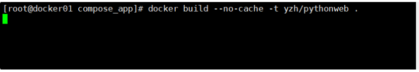
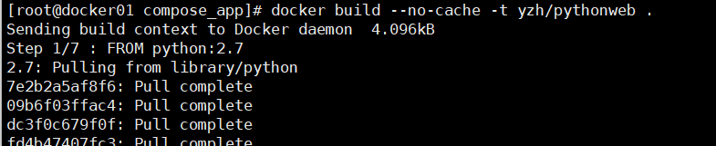

## 一些问题

### 1.执行docker命令卡死

我在部署docker-compose的时候，在构建镜像中使用了命令发现是这个样子



出现了这种卡死的状况,只能ctrl c强制退出

然后我又执行了一些基础命令


发现还是如此，我又重启了一下服务和重启机器(当然实验可以这样，生产环境下可不能这样搞，，哈哈)

接着我又检查了一下docker进程

```
[root@docker01 compose_app]# ps -ef|grep docker
root       1920      1  0 09:12 ?        00:00:00 /usr/bin/dockerd -H tcp://0.0.0.0:2375

```

原来是之前改了api配置现在是网络接口的形式运行着docker。。。(浪费的10分钟真的是，下次注意)

将api配置改回到默认的配置后重启服务

```
[root@docker01 compose_app]# vim /usr/lib/systemd/system/docker.service 
[root@docker01 compose_app]# cat /usr/lib/systemd/system/docker.service |grep dockerd
ExecStart=/usr/bin/dockerd -H fd:// --containerd=/run/containerd/containerd.sock
#ExecStart=/usr/bin/dockerd -H tcp://0.0.0.0:2375

[root@docker01 compose_app]# systemctl daemon-reload
[root@docker01 compose_app]# systemctl restart docker
[root@docker01 compose_app]# ps -ef|grep docker
root       2163      1  3 09:31 ?        00:00:00 /usr/bin/dockerd -H fd:// --containerd=/run/containerd/containerd.sock
root       2302   1555  0 09:31 pts/0    00:00:00 grep --color=auto docker

```

最后我们再次使用docker命令构建一下，发现已经可以正常使用了

