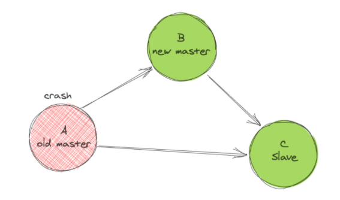

## MySQL之GTID复制

### 什么是事务？

事务是指单个逻辑工作单元执行得一系列操作，要么都做，要么都不做，是不可分割的工作单位，是数据库环境中的的最小工作单元。

### 为什么需要事务？

事务包含了一组操作，这些操作可以是一条SQL语句、一组SQL语句或整个程序。如果其中一个操作不成功，这些操作都不会执行，前面执行的操作也会回滚原状态，用来保证数据的一致性和完整性。例如，就像银行转账，张三给李四转账，只有当张三的钱转走了，并且李四账户的钱收到了之后才会事务提交，否则事务会回滚到转账前的状态，保证数据的一致性，保证数据不会出错。

### 事务的四大特征：

1、原子性

整个事务要么成功提交要么全部失败回滚。

2、隔离性

一个事务在完成前对其他事务是不可见的，一个事务执行前就代表上一个事务一定结束了。

3、一致性

事务操作前后，数据表中的数据是不会发生变化的，直到成功提交前。

4、持久性

一旦事务提交则会永久保存在数据库当中。

### 事务类型

1、显示事务

需要我们手动的提交或回滚；

DML语言所有的操作都是显示事务；

2、隐式事务

数据库自动提交不需要我们做任何处理，同时也不具备回滚性；

DDL、DCL语言都是隐式事务操作；


### 事务的实现


## GTID是什么

从 MySQL 5.6.5 开始新增了一种基于 GTID 的复制方式。

通过 GTID 保证了每个在主库上提交的事务在集群中有一个唯一的ID。

这种方式强化了数据库的主备一致性，故障恢复以及容错能力。

在原来基于二进制日志的复制中，从库需要告知主库要从哪个偏移量进行增量同步，如果指定`错误会造成数据的遗漏，从而造成数据的不一致。`

借助GTID，在发生主备切换的情况下，MySQL的其它从库可以自动在新主库上找到正确的复制位置，`这大大简化了复杂复制拓扑下集群的维护`，也减少了人为设置复制位置发生误操作的风险。

另外，基于GTID的复制可以忽略已经执行过的事务，减少了数据发生不一致的风险。

## GTID长啥样

GTID (Global Transaction ID) 是对于一个已提交事务的编号，并且是一个全局唯一的编号。

GTID 实际上 是由 UUID+TID 组成的。

其中 UUID 是一个 MySQL 实例的唯一标识。

TID 代表了该实例上已经提交的事务数量，并且随着事务提交单调递增。下面是一个GTID的具体形式：

```
形式语法  
GTID = source_id ：transaction_id

具体结果
2E11FA47-61CA-11E1-9E33-C70AA9429562:28
```

在上面的定义中，每一个GTID均代表一个数据库的事务，等号右边的source_id表示执行事务的源服务器主库的uuid（也就是server_uuid）

而transaction_id是一个从1开始的自增的序列号，表示在这个主库上执行的第n个事务。

只要保证每台数据库的server_uuid全局唯一，以及每台数据库生成的transaction_id自身唯一，就能保证GTID的全局唯一性。

## server_uuid是什么

my.cnf中配置了一个参数`server_id=5`,且master、slave的server_id必须唯一

> 为什么换成server_uuid

MySQL 5.6用128位的server_uuid代替了原本32位的server_id的大部分功能。

server_id依赖于my.cnf的手工配置，可能会产生冲突，`而自动产生128位uuid的算法可以保证所有的MySQL uuid都不会发生冲突。`

在进行首次启动时，MySQL会自动生成一个server_uuid，并且保存到数据库目录下的auto.cnf文件里，这个文件目前存在的唯一目的就是保存server_uuid。

在MySQL再次启动时其会读取auto.cnf文件，继续使用上次生成的server_uuid。

## GTID原理

> GTID复制原理流程

1.master进行数据更新时、在事务前产生GTID号、一起记录到binlog日志。

2.slave的I/O线程将变更的binlog数据，写入到本地中继日志`relay_log`

3.slave的SQL线程从中继日志中获取`GTID`号，和本地的binlog对比查看是否有记录

4.有记录，说明该GTID事务已执行，slave数据库会忽略

5.如果没有记录，slave数据库从`relay_log中继日志`中获取数据，且执行该GTID的事务，记录到binlog中

## 主从故障切换

> 如图、在没有GTID以前，主从复制的故障切换




1.master-A宕机，需要将应用程序切换到master-B

2.slave-C得和master-B建立新的复制关系

> 只需要在slave-C上执行新的change master to xxx ，指定master-B即可
>
> 问题是，同一个事务、在每台服务器上的binlog名字和位置点、可能都是不一样的

比如执行一条SQL，创建了一个新数据库，执行了一个事务，在master-A机器的binlog中数据位置如下

```
mysql> show master status;
+------------------+----------+--------------+------------------+-------------------+
| File             | Position | Binlog_Do_DB | Binlog_Ignore_DB | Executed_Gtid_Set |
+------------------+----------+--------------+------------------+-------------------+
| mysql-bin.000003 |     557 |              |                  |                   |
+------------------+----------+--------------+------------------+-------------------+
1 row in set (0.00 sec)
```

但是可能在机器master-B中的bin中，同一个SQL执行后，binlog数据位置可能是

```
mysql> show master status;
+------------------+----------+--------------+------------------+-------------------+
| File             | Position | Binlog_Do_DB | Binlog_Ignore_DB | Executed_Gtid_Set |
+------------------+----------+--------------+------------------+-------------------+
| mysql-bin.000005 |     1251 |              |                  |                   |
+------------------+----------+--------------+------------------+-------------------+
1 row in set (0.00 sec)
```

> 如果master-A宕机，需要切换到master-B,slave-C如何知道当前同步的起停数据位置点呢？master_log_file和master_log_pos填什么？
>
> 所以需要用到了GTID复制的方法

往后，同一个事务的GTID在所有节点上都是一致的，slave-C机器根据GTID就可以知道数据的停止点在哪。并且，mysql还提供了非常方便的参数`master_auto_position`，能够自动的获取GTID值，让运维更加省心了。

## GTID优缺点

优点

- 根据GTID可以明确知道事务最开始是在哪个数据库提交的
- GTID对于宕机切换，非常方便，明确数据起止点。

缺点

- 开启了GTID的数据库，和未开启GTID的数据库实例之间、是无法混用复制的

## GTID复制实践

准备两台初始化的mysql节点机器

```
m1 192.168.6.79
m2 192.168.6.30
```

### 配置文件

> master

```
[client]
port=3306
socket=/data/3306/mysql.sock
default-character-set=utf8

[mysqld]
character-set-server=utf8
user=mysql
port=3306
socket=/data/3306/mysql.sock
basedir=/appmysql/mysql
datadir=/data/3306/data
log-bin=/data/3306/mysql-bin
server-id=1
expire_logs_days=7
log-slave-updates=1
binlog-format=ROW
gtid-mode=on
enforce-gtid-consistency=true

[mysqld_safe]
log-error=/data/3306/mysql_3306_error.log
pid-file=/data/3306/mysqld_3306.pid
sql_mode=NO_ENGINE_SUBSTITUTION,STRTICT_TRANS_TABLES

```

> slave

```
[client]
port=3306
socket=/data/3306/mysql.sock
default-character-set=utf8

[mysqld]
character-set-server=utf8
user=mysql
port=3306
socket=/data/3306/mysql.sock
basedir=/appmysql/mysql
datadir=/data/3306/data
log-bin=/data/3306/mysql-bin
server-id=4
relay_log_purge = 0
expire_logs_days=7
log-slave-updates=1
binlog-format=ROW
gtid-mode=on
enforce-gtid-consistency=true

[mysqld_safe]
log-error=/data/3306/mysql_3306_error.log
pid-file=/data/3306/mysqld_3306.pid
sql_mode=NO_ENGINE_SUBSTITUTION,STRTICT_TRANS_TABLES

```

## master1--gtid主从

m1操作，创建用于slave复制的账号、权限

```
grant replication slave on *.* to gtidrepl@'192.168.6.%' identified by '1234';

flush privileges;
```

导出数据库

```
mysql提示: 当前数据库实例中开启了 GTID 功能, 在开启有 GTID 功能的数据库实例中, 导出其中任何一个库, 如果没有显示地指定--set-gtid-purged参数, 都会提示这一行信息. 意思是默认情况下, 导出的库中含有 GTID 信息, 如果不想导出包含有 GTID 信息的数据库, 需要显示地添加--set-gtid-purged=OFF参数. 于是乎, dump 变成了如下样子

➜ mysqldump -uroot -p --set-gtid-purged=OFF userdb > userdb.sql

使用以上这条命令 dump 出来的库是不包含 GTID 信息的
```

命令

```
mysqldump -p1234  -S  /data/3306/mysql.sock -A -B -x --set-gtid-purged=OFF|gzip > /data/m1_alldb_$(date +%F).sql.gz

```

### 查看GTID信息

```
mysql> show global variables like '%gtid%';
+---------------------------------+------------------------------------------+
| Variable_name                   | Value                                    |
+---------------------------------+------------------------------------------+
| binlog_gtid_simple_recovery     | OFF                                      |
| enforce_gtid_consistency        | ON     # 确保这里打开                      |
| gtid_executed                   | 20bdbbd9-a5cd-11eb-a6af-001c4279bcf3:1-4 |
| gtid_mode                       | ON     # 确保这里打开        
| gtid_owned                      |                                          |
| gtid_purged                     |                                          |
| simplified_binlog_gtid_recovery | OFF                                      |
+---------------------------------+------------------------------------------+
7 rows in set (0.00 sec)

# 查看uuid信息
mysql> show global variables like 'server%';
+----------------+--------------------------------------+
| Variable_name  | Value                                |
+----------------+--------------------------------------+
| server_id      | 1                                    |
| server_id_bits | 32                                   |
| server_uuid    | 20bdbbd9-a5cd-11eb-a6af-001c4279bcf3 |
+----------------+--------------------------------------+
3 rows in set (0.00 sec)

# 数据插入后，会生成新的GTID
mysql> show master status;
+------------------+----------+--------------+------------------+------------------------------------------+
| File             | Position | Binlog_Do_DB | Binlog_Ignore_DB | Executed_Gtid_Set                        |
+------------------+----------+--------------+------------------+------------------------------------------+
| mysql-bin.000004 |      811 |              |                  | 20bdbbd9-a5cd-11eb-a6af-001c4279bcf3:1-4 |
+------------------+----------+--------------+------------------+------------------------------------------+
1 row in set (0.00 sec)


```

### 发送数据给slave

```
[root@mysql data]# scp -rp /data/m1_alldb_2022-03-11.sql.gz root@192.168.6.30:/data
```

## slave操作

> 导入m1发来的数据

```
[root@node01 ~]# zcat /data/m1_alldb_2022-03-11.sql.gz |mysql -S /data/3306/mysql.sock -p1234
```

> 登录slave，配置m1的复制信息

```
[root@node01 ~]# mysql -uroot -p1234 -h127.0.0.1

mysql> change master to
    -> master_host='192.168.6.79',
    -> master_port=3306,
    -> master_user='gtidrepl',
    -> master_password='1234',
    -> master_auto_position=1;
Query OK, 0 rows affected, 2 warnings (0.00 sec)

```

### 启动slave start

```
# 启动slave，测试主从复制

mysql> start slave;
Query OK, 0 rows affected (0.00 sec)


mysql> show slave status\G;
*************************** 1. row ***************************
               Slave_IO_State: Waiting for master to send event
                  Master_Host: 192.168.6.79
                  Master_User: gtidrepl
                  Master_Port: 3306
                Connect_Retry: 60
              Master_Log_File: mysql-bin.000002
          Read_Master_Log_Pos: 661
               Relay_Log_File: mysqld_3306-relay-bin.000002
                Relay_Log_Pos: 871
        Relay_Master_Log_File: mysql-bin.000002
             Slave_IO_Running: Yes
            Slave_SQL_Running: Yes
```

## 测试数据写入

```
# master上写入数据
mysql> create database test_gtid;
Query OK, 1 row affected (0.00 sec)


# slave检查数据
mysql> show databases like '%test_gtid%';
+------------------------+
| Database (%test_gtid%) |
+------------------------+
| test_gtid              |
+------------------------+
1 row in set (0.00 sec)


# 查看slave的GTID信息
mysql> show master status\G;
*************************** 1. row ***************************
             File: mysql-bin.000002
         Position: 644652
     Binlog_Do_DB: 
 Binlog_Ignore_DB: 
Executed_Gtid_Set: eb6a401a-a0f9-11ec-8c8e-00505623f6c6:1-4,
fc09df68-a0fc-11ec-8ca2-000c299743ac:1-116
1 row in set (0.00 sec)

```

数据写入后，gtid变化，事务更新

```
# master数据更新

mysql> use test_gtid;
Database changed
mysql> create table test(
    -> id int,
    -> name varchar(50));
Query OK, 0 rows affected (0.01 sec)

#master
mysql> show master status\G;
*************************** 1. row ***************************
             File: mysql-bin.000002
         Position: 994
     Binlog_Do_DB: 
 Binlog_Ignore_DB: 
Executed_Gtid_Set: eb6a401a-a0f9-11ec-8c8e-00505623f6c6:1-5
1 row in set (0.00 sec)


#slave
mysql> show master status\G;
*************************** 1. row ***************************
             File: mysql-bin.000002
         Position: 644828
     Binlog_Do_DB: 
 Binlog_Ignore_DB: 
Executed_Gtid_Set: eb6a401a-a0f9-11ec-8c8e-00505623f6c6:1-5,   <-----------更新
fc09df68-a0fc-11ec-8ca2-000c299743ac:1-116
1 row in set (0.00 sec)

```

