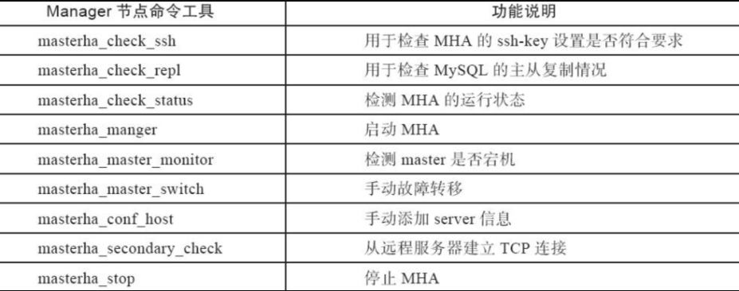
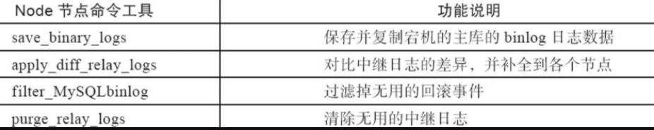
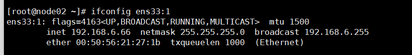

## 什么是MHA

MHA（Master High Availability）目前在MySQL高可用方面是一个相对成熟的解决方案，是一套优秀的作为MySQL高可用性环境下故障切换和主从提升的高可用软件。

MHA作用是保证MySQL主从复制集群中的master高可用性，也就保证整个数据库集群业务不被故障影响。

- master故障时，MHA会在30s内实现故障自动检测+故障转移
- 选择一个最优的slave接替为新的master，并且保证new_master和其他slave继续保持数据一致性

> 高可用性HA、high availability
>
> 指的是一个经过设计的系统，能保证减少架构故障时的停工时间，保证业务程序的高度可用性

## MHA架构

整个MHA软件由两部分角色组成，即MHA Manager（管理节点）和MHA Node（数据节点）。

`MHA Manager`服务可以独立部署在一台linux机器，也可以部署在某一台主从复制从节点或者其他应用服务器节点上。

而`MHA Node`服务需要运行在每一个MySQL服务器上。

MHA Manager会定时通过主库上的MHA Node服务监测主库，当master出现故障时，它可以自动将最优slave（可以提前指定或由MHA判定）提升为新的master，然后让所有其他的从库与新的主库重新保持正常的复制状态。

故障的整个切换和转移的过程对客户以及应用程序几乎是完全透明的（也就是用户不会感知到有故障发生）

## MHA工作原理

MHA主要功能

- master宕机、切换新的master，且保证其他slave和新的master保持一致复制
- 故障切换过程中，集群数据丢失量最小

> 一、选择新master

old_master宕机，在集群中选择一个新的slave作为new_master，这要根据MHA的配置，如根据其他slave的binlog位置点，选择最新的slave作为new_master

> 二、数据补全

进行故障切换、转移之前，必须要进行数据补全，否则即使故障切换了，数据丢了那也是不允许的

**数据补全过程**

- old_master数据库服务器还可以连接，MHA会SSH连接主库，保存主库所有的binlog
  - 若ssh无法连接，放弃主库的binlog数据
- 以切换好的new_master主库的binlog位置点位基准点，通过`relay_log`进行数据补全，使得其他所有slave和new_master数据一直
- 将宕机时从old_master上保存下来的binlog日志（如果存在的话）恢复到所有的数据库节点.

> 三、角色切换

- 已选择好的new_master正式提升为主库角色
- 其他的slave和new_master保持主从复制关系

> 四、有关master主库IP切换的问题，可以结合keepalived的VIP漂移来实现

## MHA软件包介绍

> MHA由2部分组成
>
> Manager节点
>
> Node节点

### Manager节点命令



### Node命令



## MHA特点

- old_master宕机，slave快速切换为new_master
- 部署MHA与不会对现有的MySQL集群做大量改动
- MHA——manager功能强大，可以管理上百个节点、多套mysql集群
- 可以监控mysql状态，隔N秒向master发送ping包，性能不受影响
- 只要mySQL主从复制支持的存储引擎，MHA也都支持，不限于InnoDB

## mha高可用集群部署

环境

```
至少准备3台以上的机器

master1 192.168.6.79 MHA-node

Slave1 192.168.6.30 MHA-node

Slave2 192.168.6.44 MHA-node，MHA-Manager
```

注意时间同步问题

```
ntpdate -u ntp.aliyun.com
```

### 准备一主两从-GTID

MHA需要支持一主多从架构，至少三台数据库，三台机器，基于GTID的主从复制，三个配置文件，仅有server-id不同

一个master

一个备用master

一个slave

### master配置

my.cnf

```
[client]
socket=/data/3306/mysql.sock

[mysqld]
character-set-server=utf8
socket=/data/3306/mysql.sock
basedir=/appmysql/mysql
datadir=/data/3306/data
log-bin=/data/3306/mysql-bin

server-id=1
relay_log_purge = 0
expire_logs_days=7
log-slave-updates=1
binlog-format=row
gtid-mode=on
enforce-gtid-consistency=true

[mysqld_safe]
log-error=/data/3306/mysql_3306_error.log
pid-file=/data/3306/mysqld_3306.pid
sql_mode=NO_ENGINE_SUBSTITUTION,STRTICT_TRANS_TABLES
```

创建复制账号

```
grant replication slave on *.* to gtidrepl@'10.211.55.%' identified by '1234';

flush privileges;
```

数据导出

```
mysqldump -p1234  -S  /data/3306/mysql.sock -A -B -x --set-gtid-purged=OFF|gzip > /data/m1_alldb_$(date +%F).sql.gz
```

数据发给所有slave

```
scp -rp /data/m1_alldb_2022-03-11.sql.gz root@192.168.6.30:/data

scp -rp /data/m1_alldb_2022-03-11.sql.gz root@192.168.6.44:/data
```

查看GTID信息

```
mysql> show global variables like '%gtid%';
mysql> show global variables like 'server%';
```

### slave01配置

my.cnf

```
[client]
socket=/data/3306/mysql.sock


[mysqld]
character-set-server=utf8
socket=/data/3306/mysql.sock
basedir=/appmysql/mysql
datadir=/data/3306/data
log-bin=/data/3306/mysql-bin

server-id=4
relay_log_purge = 0
expire_logs_days=7
log-slave-updates=1
binlog-format=ROW
gtid-mode=on
enforce-gtid-consistency=true

[mysqld_safe]
log-error=/data/3306/mysql_3306_error.log
pid-file=/data/3306/mysqld_3306.pid
sql_mode=NO_ENGINE_SUBSTITUTION,STRTICT_TRANS_TABLES
```

导入master数据

```
[root@node01 ~]# zcat /data/m1_alldb_2022-03-11.sql.gz |mysql -S /data/3306/mysql.sock -p1234
```

登录slave，配置master的复制信息

```
[root@node01 ~]# mysql -uroot -p1234 -h127.0.0.1

mysql> change master to
    -> master_host='192.168.6.79',
    -> master_port=3306,
    -> master_user='gtidrepl',
    -> master_password='1234',
    -> master_auto_position=1;
Query OK, 0 rows affected, 2 warnings (0.00 sec)
```

启动slave start

```
# 启动slave，测试主从复制

mysql> start slave;
Query OK, 0 rows affected (0.00 sec)


mysql> show slave status\G
*************************** 1. row ***************************
               Slave_IO_State: Waiting for master to send event
                  Master_Host: 192.168.6.79
                  Master_User: gtidrepl
                  Master_Port: 3306
                Connect_Retry: 60
              Master_Log_File: mysql-bin.000002
          Read_Master_Log_Pos: 661
               Relay_Log_File: mysqld_3306-relay-bin.000002
                Relay_Log_Pos: 871
        Relay_Master_Log_File: mysql-bin.000002
             Slave_IO_Running: Yes
            Slave_SQL_Running: Yes
```

slave2配置

> 同上，更改server-id

## SSH免密登录

MHA_Manager管理节点是通过ssh服务连接其他node节点进行探测、以及获取数据，必须提前做好ssh免密连接

```
#每天机器都执行，# 生成公私钥
ssh-keygen -t dsa -P '' -f ~/.ssh/id_dsa > /dev/null 2>&1

#传输公钥,每台机器都要执行
ssh-copy-id -i ~/.ssh/id_dsa.pub 192.168.6.79
ssh-copy-id -i ~/.ssh/id_dsa.pub 192.168.6.30
ssh-copy-id -i ~/.ssh/id_dsa.pub 192.168.6.44
```

## 所有节点依赖安装

> 所有节点，安装MHA基础依赖

配置好yum源

```
yum install -y perl-DBD-MySQL \
perl-Config-Tiny \
perl-Log-Dispatch \
perl-Parallel-ForkManager \
perl-ExtUtils-CBuilder \
perl-ExtUtils-MakeMaker \
perl-CPAN
```

## 所有mysql节点安装MHA-node

> 安装rpm包

```
#所有节点
wget https://github.com/yoshinorim/mha4mysql-node/releases/download/v0.58/mha4mysql-node-0.58-0.el7.centos.noarch.rpm

#rmp方式安装
rpm -ivh mha4mysql-node-0.58-0.el7.centos.noarch.rpm

#检查安装命令
ls -l /usr/bin/*_*log*
```

MHA工具会检测mysql命令，这里还需要加一个软连接

```
ln -s /appmysql/mysql/bin/mysqlbinlog /usr/bin/mysqlbinlog
```

所有节点，创建MHA管理账号，三台机器都操作

```
mysql> grant all privileges on *.* to mha@'192.168.6.%' identified by '1234';
```

## MHA-Manager管理节点

安装管理节点的依赖

```
yum install -y perl-Config-Tiny epel-release perl-Log-Dispatch perl-Parallel-ForkManager perl-Time-HiRes
```

> 这里我选择安装到slave02节点上
>
> 因为Manager管理节点，通过ssh检测mysql集群，如果`master`节点服务器宕机，或者网络故障，MHA也无法完成故障切换了。
>
> 因此mha-manager不能装在`master节点`

```
wget https://github.com/yoshinorim/mha4mysql-manager/releases/download/v0.58/mha4mysql-manager-0.58-0.el7.centos.noarch.rpm

rpm -ivh mha4mysql-manager-0.58-0.el7.centos.noarch.rpm
```

检查mha-manager的命令(slave2机器)

```
ls -l /usr/bin/masterha_*
```

## 配置主机host信息

所有节点都要配置

```
vim /etc/hosts

192.168.6.79 mysql
192.168.6.30 node01
192.168.6.44 node02              
```

## 创建MHA配置文件

详细配置方法(我们刚才选择的是node02节点来当slave02，在这个节点配置mha文件)

```
mkdir -p /etc/mha           #<==在/etc下创建mha目录。
mkdir -p /var/log/mha/app1  #<==在/etc下创建mha目录。
vim /etc/mha/app1.cnf       #<==编辑mha配置文件，增加配置内容。

[server default]                           #<==默认模块标签。
manager_log=/var/log/mha/app1/manager.log  #<==配置日志路径。
manager_workdir=/var/log/mha/app1.log      #<==配置工作日志路径。
master_binlog_dir=/mm_data/3306/data/      #<==配置MHA保存主库binlog日志的路径。
user=mha                                   #<==MySQL数据中授权的用户。
password=mha_chaoge                               #<==MySQL数据中授权的用户。
ping_interval=2                       #<==设置监控主库发送ping数据包的时间间隔，
                                       若尝试三次没有回应则自动进行failover。
repl_user=repl_chaoge                              #<==主从复制对应的用户。
repl_password=chaoge668                    #<==主从复制用户对应的密码。
ssh_user=root                              #<==ssh远程连接服务器的用户。
report_script=/usr/local/send_report       #<==设置故障发生切换后触发执行的脚本。
secondary_check_script=/usr/local/bin/masterha_secondary_check -s 10.211.55.9  -s 10.211.55.11  --user=root --master_host=mysql-server56 --master_ip=10.211.55.12 --master_port=3306
#<==当MHA Manager节点到MASTER节点（mysql-server56）的监控之间出现问题时，MHA Manager将会尝试从其他路径登录到MASTER节点。
#<==注：此配置在MHA Manager节点只有单独一台机器时起作用。意思就是，在Manager节点联系不上Master时，通过两个从节点去探视Master节点的状态。

shutdown_script="" #<==设置故障发生后执行主机脚本关闭故障机（防止故障机活过来发生脑裂）脚本文件
[server1]                                  #<==第一个mysql-master主机模块标签。
hostname=192.168.6.79                        #<==第一个mysql-master主机IP。
port=3306                                  #<==第一个mysql主机端口。

[server2]
hostname=192.168.6.30                        #<==第一个mysql-master主机IP。
port=3306
candidate_master=1           #<==设定此参数后，server2标签的主机，将优先作为主库宕机的候选服务器（切换主库优先选择）。
check_repl_delay=0  #<==设定此参数后，MHA会忽略主从复制延迟，将此服务器作为后选主机。


[server3]
hostname=192.168.6.44
port=3306
```

配置文件

```
[root@node02 ~]# cat /etc/mha/app1.cnf 
[server default]
manager_log=/var/log/mha/app1/manager.log
manager_workdir=/var/log/mha/app1.log
master_binlog_dir=/data/3306/data/
# 该脚本暂时先注释
#master_ip_failover_script=/usr/local/bin/master_ip_failover
user=mha
password=1234
ping_interval=2
repl_user=masterrepl
repl_password=1234
ssh_user=root
shutdown_script=""

[server1]
candidate_master=1
check_repl_delay=0
hostname=192.168.6.79
port=3306

[server2]
hostname=192.168.6.30
port=3306
candidate_master=1
check_repl_delay=0

[server3]
hostname=192.168.6.44
port=3306
```

## 检测SSH登录

```
masterha_check_ssh --conf=/etc/mha/app1.cnf 
```

## 检测主从复制情况

```
masterha_check_repl --conf=/etc/mha/app1.cnf
```

## 配置VIP漂移

```
# 先前注释得脚本
#master_ip_failover_script=/usr/local/bin/master_ip_failover
```

这个作用是当master发生故障，迁移后数据库IP发生变化，解决这个问题，因此得使用VIP进行漂移

> MHA已经提供好了perl脚本
>
> 我们只需要创建VIP即可，首先在master节点上创建

```
[root@mysql data]# ifconfig ens33:1 192.168.6.66/24 # 创建
[root@mysql data]# ifconfig ens33:1 del 192.168.6.66/24 # 删除
[root@mysql data]# ifconfig ens33:1 down #关闭
```

## 使用vip脚本

脚本代码，在slave02中配置

> master_ip_failover_script=/usr/local/bin/master_ip_failover

如下

> vim /usr/local/bin/master_ip_failover
>
> 给与执行权限
>
> chmod +x /usr/local/bin/master_ip_failover

```
[root@mysql data]# cat /usr/local/bin/master_ip_failover 
#!/usr/bin/env perl
use strict;
use warnings FATAL => 'all';

use Getopt::Long;

my (
    $command,          $ssh_user,        $orig_master_host, $orig_master_ip,
    $orig_master_port, $new_master_host, $new_master_ip,    $new_master_port
);

my $vip = '192.168.6.66/24';
my $key = '1';
my $ssh_start_vip = "/sbin/ifconfig eth0:$key $vip";
my $ssh_stop_vip = "/sbin/ifconfig eth0:$key down";

GetOptions(
    'command=s'          => \$command,
    'ssh_user=s'         => \$ssh_user,
    'orig_master_host=s' => \$orig_master_host,
    'orig_master_ip=s'   => \$orig_master_ip,
    'orig_master_port=i' => \$orig_master_port,
    'new_master_host=s'  => \$new_master_host,
    'new_master_ip=s'    => \$new_master_ip,
    'new_master_port=i'  => \$new_master_port,
);


exit &main();

sub main {

    print "\n\nIN SCRIPT TEST====$ssh_stop_vip==$ssh_start_vip===\n\n";

    if ( $command eq "stop" || $command eq "stopssh" ) {

        my $exit_code = 1;
        eval {
            print "Disabling the VIP on old master: $orig_master_host \n";
            &stop_vip();
            $exit_code = 0;
        };
        if ($@) {
            warn "Got Error: $@\n";
            exit $exit_code;
        }
        exit $exit_code;
    }
    elsif ( $command eq "start" ) {

        my $exit_code = 10;
        eval {
            print "Enabling the VIP - $vip on the new master - $new_master_host \n";
            &start_vip();
            $exit_code = 0;
        };
        if ($@) {
            warn $@;
            exit $exit_code;
        }
        exit $exit_code;
    }
    elsif ( $command eq "status" ) {
        print "Checking the Status of the script.. OK \n";
        exit 0;
    }
    else {
        &usage();
        exit 1;
    }
}


sub start_vip() {
    `ssh $ssh_user\@$new_master_host \" $ssh_start_vip \"`;
}
sub stop_vip() {
     return 0  unless  ($ssh_user);
    `ssh $ssh_user\@$orig_master_host \" $ssh_stop_vip \"`;
}

sub usage {
    print
    "Usage: master_ip_failover --command=start|stop|stopssh|status --orig_master_host=host --orig_master_ip=ip --orig_master_port=port --new_master_host=host --new_master_ip=ip --new_master_port=port\n";
}

```

### 检查一下mha程序

```
masterha_check_repl --conf=/etc/mha/app1.cnf
```

## 启动mha

> 在mha得master节点，启动

```
nohup masterha_manager --conf=/etc/mha/app1.cnf --ignore_last_failover /var/log/mha/app1/manager.log 2>&1 &


ps -ef|grep master


tail -f /var/log/mha/app1/manager.log
```

参数

```
nohup masterha_manager --conf=/etc/mha/app1.cnf --ignore_last_failover /var/log/mha/app1/manager.log 2>&1 &

命令参数：
--remove_dead_master_conf       该参数代表当发生主从切换后，老的主库的ip将会从配置文件中移除。
--manger_log                    日志存放位置
--ignore_last_failover          在缺省情况下，如果MHA检测到连续发生宕机，且两次宕机间隔不足8小时的话，则不会进行Failover，之所以这样限制是为了避免ping-pong效应。该参数代表忽略上次MHA触发切换产生的文件，默认情况下，MHA发生切换后会在日志目录，也就是上面设置的manager_workdir目录中产生app1.failover.complete文件，下次再次切换的时候如果发现该目录下存在该文件将不允许触发切换，除非在第一次切换后收到删除该文件，为了方便，这里设置为--ignore_last_failover。


# 停止命令
masterha_stop --conf=/etc/mha/app1.conf
```

## 检测MHA状态

检测mysql主从集群的状态

```
[root@node01 data]# masterha_check_status --conf=/etc/mha/app1.cnf
app1 (pid:33152) is running(0:PING_OK), master:192.168.6.79
```

检查VIP当前在哪，在当前的mysql-master机器

```
[root@mysql data]# ifconfig ens33:1
ens33:1: flags=4163<UP,BROADCAST,RUNNING,MULTICAST>  mtu 1500
        inet 192.168.6.66  netmask 255.255.255.0  broadcast 192.168.6.255
        ether 00:50:56:23:f6:c6  txqueuelen 1000  (Ethernet)


```

第一次进行VIP脚本自动切换，VIP要在master机器上

## 模拟master主库宕机

查看结果：master切换 vip切换

```
[root@mysql data]# /data/3306/mysql_3306 stop
Stoping MySQL...
```

查看mha日志

```
[root@node01 /]# tail -f /var/log/mha/app1/manager.log
```

最后结果变化

- MHA软件在切换后会自动停止进程

- VIP发生漂移

- 主从复制关系发生变化

  

vip已经切换到新主库节点


