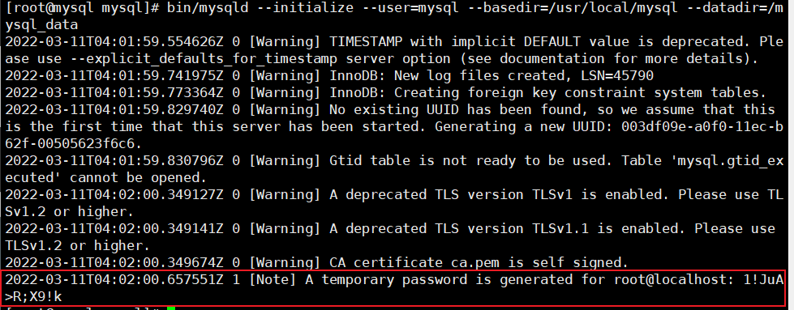

## mysql5.7二进制部署

## 下载地址

https://downloads.mysql.com/archives/community/

## 创建mysql用户

```text
useradd mysql -r -M -s /sbin/nologin
```

## 安装mysql依赖包

```
yum install -y ncurses-devel libaio-devel gcc gcc-c++ numactl libaio glibc cmake autoconf
```

## 解压mysql软件包

```text
tar -xvf mysql-5.7.36-linux-glibc2.12-x86_64.tar.gz -C /usr/local/
#注：-C 直接指定解压到目标路径
```

## 建立目录软链接

```text
ln -s /usr/local/mysql-5.7.36-linux-glibc2.12-x86_64/ /usr/local/mysql 
```

## **修改目录所属用户权限**

```text
chown -R mysql.mysql /usr/local/mysql/ 
chown -R mysql.mysql /usr/local/mysql-5.7.36-linux-glibc2.12-x86_64/
```

## **创建mysql数据库，保存数据的路径，并创建日志**

```text
mkdir /mysql_data 			#注：本文件夹创建到根目录下 
chown -R mysql.mysql /mysql_data 		#注：赋予权限 
touch /var/log/mysqld.log 
chown -R mysql.mysql /var/log/mysqld.log
```

## **进行初始化**

```text
cd /usr/local/mysql/ 
bin/mysqld --initialize --user=mysql --basedir=/usr/local/mysql --datadir=/mysql_data


1!JuA>R;X9!k
```

初始密码如下图：



## 编写配置文件

```text
vim /etc/my.cnf
[mysqld]
basedir=/usr/local/mysql
datadir=/mysql_data
port=3306
socket=/usr/local/mysql/mysql.sock
character-set-server=utf8mb4
log-error=/var/log/mysqld.log
pid-file=/tmp/mysqld.pid
log-bin=/usr/local/mysql/mysql-bin
[mysql]
socket=/usr/local/mysql/mysql.sock
[client]
socket=/usr/local/mysql/mysql.sock
```

## **生成启动脚本，并添加到系统变量中**

```text
cp /usr/local/mysql/support-files/mysql.server /etc/init.d/mysqld
chmod +x /etc/init.d/mysqld
vim /etc/init.d/mysqld

#进入mysqld脚本修改这两项
basedir=/usr/local/mysql	# mysql路径
datadir=/mysql_data	# 数据存放路径
添加变量
vim /etc/profile
最底部添加
export PATH=$PATH:/usr/local/mysql/bin
执行编译命令
source /etc/profile
```

## 启动mysql，并修改默认密码

```bash
/etc/init.d/mysqld start
```

```text
# 登录进mysql
mysql -uroot -pOSlVgIvy1s-v	# -p后面为密码，根据自己安装完成之后提示的填写
# 修改密码
set password for root@localhost = password('新密码');

mysql> set password for root@localhost=password('1234');
Query OK, 0 rows affected, 1 warning (0.00 sec)


# 退出mysql
exit;或quit;
```

## **将myslq加入systemctl管理**

```text
vim /usr/lib/systemd/system/mysql.service
[Unit]
Description=MySQL Server
Documentation=man:mysqld(8)
Documentation=https://dev.mysql.com/doc/refman/en/using-systemd.html
After=network.target
After=syslog.target
[Install]
WantedBy=multi-user.target
[Service]
User=mysql
Group=mysql
ExecStart=/usr/local/mysql/bin/mysqld --defaults-file=/etc/my.cnf
LimitNOFILE = 5000

重载
systemctl daemon-reload
开启mysql服务
systemctl start mysql
查看状态
systemctl status mysql
```