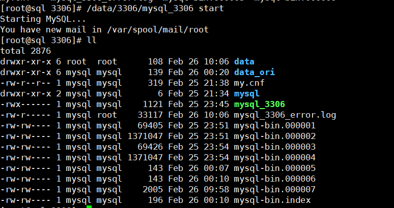
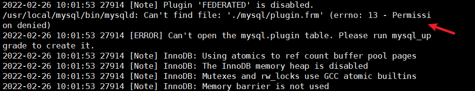
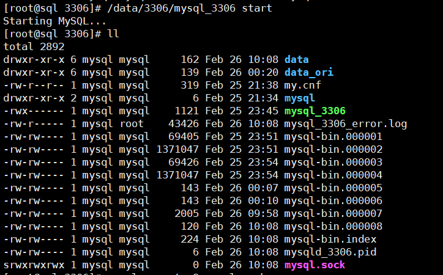
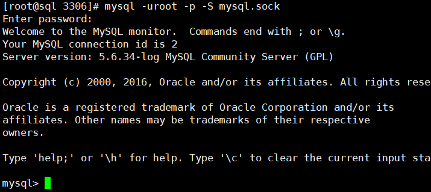
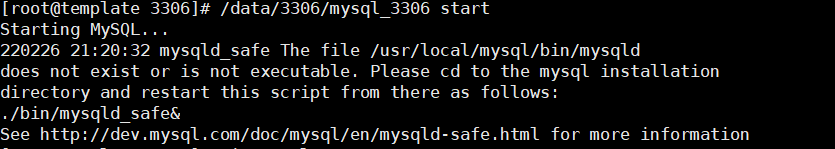
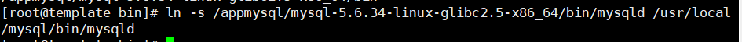
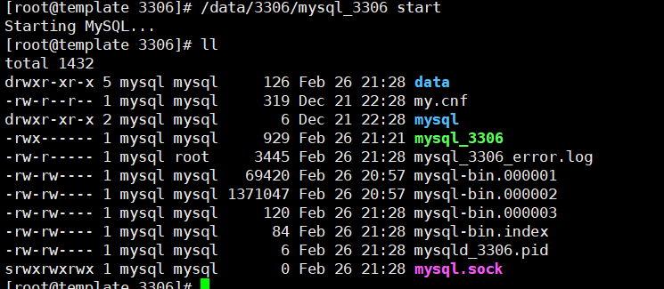

## 问题1

> xtrabackup工具做全量数据恢复时候出现了报错

!> 大家遇到问题一定要先看报错日志！！！

当我模拟删除 mysql3306实例下面的data目录后，用

```
innobackupex --defaults-file=/data/3306/my.cnf --copy-back --rsync /xtrabackup/data/all_db/
```

恢复数据之后重启了mysql发现并未找到mysql.sock，也就是说mysql启动失败



> 查看报错日志



这是权限问题，授权成mysql用户


重启mysql,问题解决





## 问题2

> mysqld_safe启动报错问题

在我启动第一次启动mysql脚本时候发现



1、mysqld_safe只认识/usr/local/mysql/bin/mysqld（也许是配置问题）
2、my.cnf只能放置在/etc/下面，不然使用–defaults-file也不能读取my.cnf文件（疑惑？？？）

> 解决方法

配置一个软连接指向 /usr/local/mysql/bin

```
mkdir /usr/local/mysql/bin

[root@template bin]# ln -s /appmysql/mysql-5.6.34-linux-glibc2.5-x86_64/bin/mysqld /usr/local/mysql/bin/mysqld
```



再次启动查看结果


