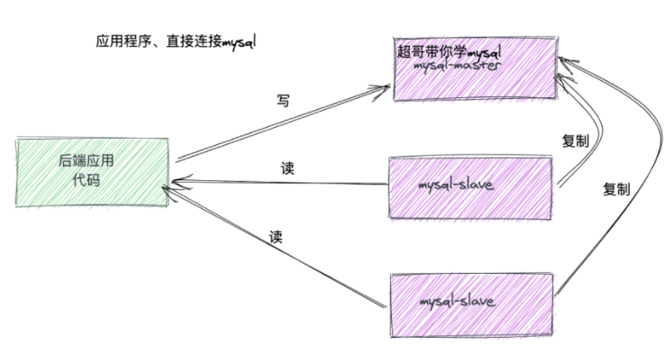
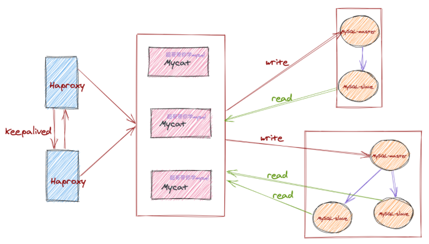
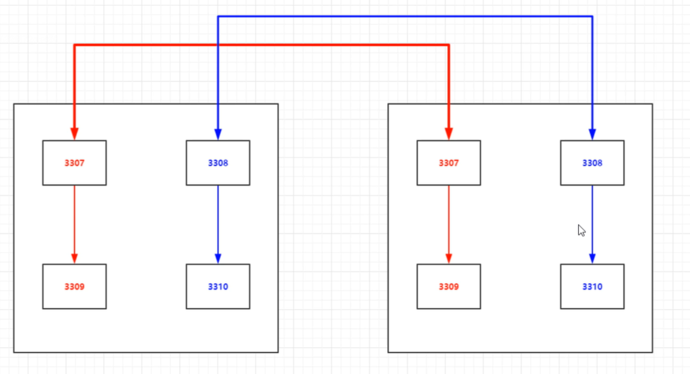
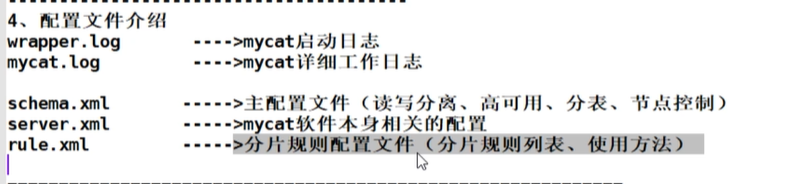

## 什么是中间件

> 中间件的定义：将具体业务和底层逻辑解耦的软件。

之前看过一个很生动的例子：我要开一家炸鸡店（业务端），需要鸡肉，有很多养鸡场（底层），我需要一个一个比较价钱，然后找一家性价比高的养鸡场合作（适配不同底层逻辑）。可能一段时间后，我需要重新选一家养鸡场合作，进货方式、交易方式等要重新制定（重新适配）。

这一套事情太复杂了，于是我找到了一个专门整合养鸡场的第三方代理（中间件），跟他谈好价格和质量后（统一接口），以后我就只需要给代理钱，然后拿肉就行。具体这个第三方代理怎么操作，我不用管。

> 数据库中间件
>
> 理解了什么是中间件，什么是数据库中间件就好理解了吧

尝试着按照大白话描述：“数据库中间件是一个软件，他可以让上层的软件对数据库做一些操作，而不用去知道是怎么实现的”。

> 例如mycat这个数据库中间件工具，提供了很多方便，方便我们对mysql集群的管理

## 为什么用中间件

首先数据库技术发展的基础还是在业务推动的背景下，能够实现相关的技术保障。

业务需求的提升必然会在数据量，访问量等方面有更高的要求，而映射到数据库层面就不是简单的扩容和添加资源了，我们有时候更需要`弹性，需要快速实现，需要更高的性能`。

> 背景

早期的很多数据库，从一主一从，一主多从的架构，逐步演变到了读写分离，分库分表，然后就是分布式。

MySQL的中间件其实有很多，官方的、开源的。

> MySQL中间件到底能干什么?

首先我们要明确数据库会出现的性能瓶颈问题

- 单台服务器无法承载访问压力
- 数据库单张表容量过大
- 频繁、大量的读、写、需求无法平衡，数据库压力大
- 服务器资源扩容，应用改变较大

## 读写分离


## MyCat

官网：http://www.mycat.org.cn/

mycat功能非常强大、需要学习的内容也很多，未来在工作场景下，可以针对性的深入学习

> 数据库中间件，mycat

- 一个彻底开源的，面向企业应用开发的大数据库集
- 支持事务、ACID、可以替代MySQL的加强版数据库
- 一个可以视为MySQL集群的企业级数据库，用来替代昂贵的Oracle集群
- 一个融合内存缓存技术、NoSQL技术、HDFS大数据的新型SQL Server
- 结合传统数据库和新型分布式数据仓库的新一代企业级数据库产品
- 一个新颖的数据库中间件产品

> 用来干什么

- 用于支持海量数据存储，对海量数据进行分库分表
- 支持分库分表场景下的分布式事务
- 对多个数据源进行统一整合
- 高并发应用场景下，降低请求对单个数据库节点带来的灾难性压力
- 可以通过数据库中间间层面实现数据库读写分离，使其Java程序与数据库访问解耦

## MyCat介绍

MyCat是一个开源的分布式数据库系统，是一个实现了MySQL协议的服务器，前端用户可以把它看作是一个数据库代理**（类似于Mysql Proxy）**，用MySQL客户端工具和命令行访问，而其后端可以用MySQL原生协议与多个MySQL服务器通信，也可以用JDBC协议与大多数主流数据库服务器通信，其核心功能是分表分库，即将一个大表水平分割为N个小表，存储在后端MySQL服务器里或者其他数据库里。

MyCat发展到目前的版本，已经不是一个单纯的MySQL代理了，它的后端可以支持MySQL、SQL Server、Oracle、DB2、PostgreSQL等主流数据库，也支持MongoDB这种新型NoSQL方式的存储，未来还会支持更多类型的存储。

而在最终用户看来，无论是那种存储方式，在MyCat里，都是一个传统的数据库表，支持标准的SQL语句进行数据的操作，这样一来，对前端业务系统来说，可以大幅降低开发难度，提升开发速度。

**Mycat可以简单概括为** - 一个彻底开源的，面向企业应用开发的大数据库集群 - 支持事务、ACID、可以替代MySQL的加强版数据库 - 一个可以视为MySQL集群的企业级数据库，用来替代昂贵的Oracle集群 - 一个融合内存缓存技术、NoSQL技术、HDFS大数据的新型SQL Server - 结合传统数据库和新型分布式数据仓库的新一代企业级数据库产品 - 一个新颖的数据库中间件产品

**Mycat关键特性** - 支持SQL92标准 - 遵守Mysql原生协议，跨语言，跨平台，跨数据库的通用中间件代理 - 基于心跳的自动故障切换，支持读写分离，支持MySQL主从，以及galera cluster集群 - 支持Galera for MySQL集群，Percona Cluster或者MariaDB cluster - 基于Nio实现，有效管理线程，高并发问题 - 支持数据的多片自动路由与聚合，支持sum,count,max等常用的聚合函数,支持跨库分页 - 支持单库内部任意join，支持跨库2表join，甚至基于caltlet的多表join - 支持通过全局表，ER关系的分片策略，实现了高效的多表join查询 - 支持多租户方案 - 支持分布式事务（弱xa） - 支持全局序列号，解决分布式下的主键生成问题 - 分片规则丰富，插件化开发，易于扩展 - 强大的web，命令行监控 - 支持前端作为mysq通用代理，后端JDBC方式支持Oracle、DB2、SQL Server 、 mongodb 、巨杉 - 支持密码加密 - 支持服务降级 - 支持IP白名单 - 支持SQL黑名单、sql注入攻击拦截 - 支持分表（1.6） - 集群基于ZooKeeper管理，在线升级，扩容，智能优化，大数据处理（2.0开发版）

## mycat工作原理

Mycat的原理中最重要的一个动词是`拦截`，它拦截了用户发送过来的SQL语句，首先对SQL语句做了一些特定的分析：

如分片分析、路由分析、读写分离分析、缓存分析等，然后将此SQL发往后端的真实数据库，并将返回的结果做适当的处理，最终再返回给用户。

使用mycat之前



使用mycat中间件之后

mycat可以实现主从复制的高可用

当某一个master挂掉之后，mycat能够迁移一个slave继续进行读写操作




## mycat部署

多实例环境准备db01 ,db02

准备两台主机，建议内存2.5G以上配置多实例

> 架构规划 部署mysql5.7.36(两台服务器一样的操作)

```
#删除之前主机得mysql服务
pkill mysql*

#删除和mysql所有有关的信息
find / -name "mysql*" |xargs rm -rf 

#备份mysql配置文件
mv /etc/my.cnf /etc/my.cnf.bak

#进入 usr/local目录安装
cd /usr/local

#下载mysql二进制文件包...

#解压缩
tar -xf mysql-5.7.36-linux-glibc2.12-x86_64.tar.gz

#改名
mv mysql-5.7.36-linux-glibc2.12-x86_64 mysql

#授权给mysql用户
chown -R mysql.mysql /usr/local/mysql

#修改环境变量
export PATH=/usr/local/mysql/bin:$PATH

#刷新 配置文件生效
source /etc/profile

#查看是否生效
mysql -V

```

> 开始搭建

```
两台机器一样
mkdir /data/33{07..10}/data -p


初始化数据
mysqld --initialize-insecure --user=mysql --datadir=/data/3307/data --basedir=/usr/local/mysql
mysqld --initialize-insecure --user=mysql --datadir=/data/3308/data --basedir=/usr/local/mysql
mysqld --initialize-insecure --user=mysql --datadir=/data/3309/data --basedir=/usr/local/mysql
mysqld --initialize-insecure --user=mysql --datadir=/data/3310/data --basedir=/usr/local/mysql
```

> 准备配置文件
>
> (注意serverid:
>
> db1:7,8,9,10 
>
> db2:17,18,19,20
>
> )和端口号
>
> 可以编辑一个脚本用cat >> 路径 <<EOF来实现部署

```
vim /data/3307/my.cnf
[mysqld]
basedir=/usr/local/mysql
datadir=/data/3307/data
socket=/data/3307/mysql.sock
port=3307
log-error=/data/3307/mysql.log
log-bin=/data/3307/mysql-bin
binlog_format=row
skip-name-resolve
server-id=7
gtid-mode=on
enforce-gtid-consistency=true
log-slave-updates=1
```

> mysqld加入systemctl启动(注意修改端口号)

```
vim /usr/lib/systemd/system/mysqld3307.service

[Unit]
Description=MySQL Server
Documentation=man:mysqld(8)
Documentation=https://dev.mysql.com/doc/refman/en/using-systemd.html
After=network.target
After=syslog.target
[Install]
WantedBy=multi-user.target
[Service]
User=mysql
Group=mysql
ExecStart=/usr/local/mysql/bin/mysqld --defaults-file=/data/3307/my.cnf
LimitNOFILE = 5000
```

授权，启动多实例

```
chown -R mysql.mysql /data/*

systemctl start mysqld3307.service
systemctl start mysqld3308.service
systemctl start mysqld3309.service
systemctl start mysqld3310.service

mysql -S /data/3307/mysql.sock -e "show variables like 'server_id'"
mysql -S /data/3308/mysql.sock -e "show variables like 'server_id'"
mysql -S /data/3309/mysql.sock -e "show variables like 'server_id'"
mysql -S /data/3310/mysql.sock -e "show variables like 'server_id'"
```

> 搭建主从关系：双主双从

```
规划：箭头指向谁谁是主库

192.168.6.79:3307          <-------->       192.168.6.97:3307
192.168.6.79:3307          <--------       192.168.6.79:3309
192.168.6.97:3309          -------->       192.168.6.97:3307


192.168.6.79:3308          <-------->       192.168.6.97:3308
192.168.6.79:3308          <--------       192.168.6.79:3310
192.168.6.97:3310          -------->       192.168.6.97:3308
```

## mycat规划图



```
shard1:

master 192.168.6.79:3307
slave1 192.168.6.79:3309
standby master  192.168.6.97:3307
slave2  192.168.6.97:3309

shard2:

master 192.168.6.79:3308
slave1 192.168.6.79:3310
standby master  192.168.6.97:3308
slave2  192.168.6.97:3310
```

> shard1

```
db02:
mysql -S /data/3307/mysql.sock
grant replication slave on *.* to repl@'192.168.6.%' identified by '1234';

db01:
mysql -S /data/3307/mysql.sock

change master to 
master_host='192.168.6.97',
master_port=3307,
master_user='repl',
master_password='1234',
master_auto_position=1;

start slave;

show slave status\G
```

```
192.168.6.79:3307   <---------- 192.168.6.97:3307


db02:
mysql -S /data/3307/mysql.sock

change master to 
master_host='192.168.6.79',
master_port=3307,
master_user='repl',
master_password='1234',
master_auto_position=1;

start slave;

show slave status\G
```

```
192.168.6.79:3309 -------> 192.168.6.79:3307

db01:
mysql -S /data/3309/mysql.sock

change master to 
master_host='192.168.6.79',
master_port=3307,
master_user='repl',
master_password='1234',
master_auto_position=1;

start slave;

show slave status\G
```

```
192.168.6.97:3309 -------> 192.168.6.97:3307

db02:
mysql -S /data/3309/mysql.sock

change master to 
master_host='192.168.6.97',
master_port=3307,
master_user='repl',
master_password='1234',
master_auto_position=1;

start slave;

show slave status\G
```

> shard2

```
192.168.6.79:3308 <-------->  192.168.6.97:3308

db01:
mysql -S /data/3308/mysql.sock
grant replication slave on *.* to repl@'192.168.6.%' identified by '1234';

db02:
mysql -S /data/3308/mysql.sock

change master to 
master_host='192.168.6.79',
master_port=3308,
master_user='repl',
master_password='1234',
master_auto_position=1;

start slave;

show slave status\G
```

```
db01:
mysql -S /data/3308/mysql.sock

change master to 
master_host='192.168.6.97',
master_port=3308,
master_user='repl',
master_password='1234',
master_auto_position=1;

start slave;

show slave status\G
```

```
192.168.6.79:3310 -------> 192.168.6.79:3308

db01:
mysql -S /data/3310/mysql.sock

change master to 
master_host='192.168.6.79',
master_port=3308,
master_user='repl',
master_password='1234',
master_auto_position=1;

start slave;

show slave status\G
```

```
192.168.6.97:3310 -------> 192.168.6.97:3308

db02:
mysql -S /data/3310/mysql.sock

change master to 
master_host='192.168.6.97',
master_port=3308,
master_user='repl',
master_password='1234',
master_auto_position=1;

start slave;

show slave status\G
```

> 检测主从复制关系是否开启，两边都检查

```
[root@mysql data]# mysql -S /data/3307/mysql.sock -e "show slave status\G"|grep Yes
             Slave_IO_Running: Yes
            Slave_SQL_Running: Yes
[root@mysql data]# mysql -S /data/3308/mysql.sock -e "show slave status\G"|grep Yes
             Slave_IO_Running: Yes
            Slave_SQL_Running: Yes
[root@mysql data]# mysql -S /data/3309/mysql.sock -e "show slave status\G"|grep Yes
             Slave_IO_Running: Yes
            Slave_SQL_Running: Yes
[root@mysql data]# mysql -S /data/3310/mysql.sock -e "show slave status\G"|grep Yes
             Slave_IO_Running: Yes
            Slave_SQL_Running: Yes
```

## 安装mycat

```
#安装jdk，java运行环境
yum install -y java

java -version
```

mycat 下载地址：http://dl.mycat.org.cn/1.6.7.4/Mycat-server-1.6.7.4-release/

```
[root@mysql local]# tar xf Mycat-server-1.6.7.4-release-20200105164103-linux.tar.gz

[root@mysql local]# cd mycat/

├── bin                # mycat命令行
├── catlet        # 一个扩展功能
├── conf          # 配置文件
├── lib                # mycat是java开发的，lib下是jar包
├── logs          # 日志文件
└── version.txt

#配置环境变量
vim /etc/profile
export PATH=/usr/local/mycat/bin:$PATH
source /etc/profile

创建一个授权用户
grant all privileges on *.* to root@'192.168.6.%' identified by '1234';
```

测试启动mycat

```
[root@mysql local]# mycat start

[root@mysql local]# ps -ef|grep mycat

[root@mysql local]# tail /usr/local/mycat/logs/wrapper.log


如果启动不成功说明服务器配置低，修改/conf/wrapper.conf 的配置文件
#默认配置
wrapper.java.additional.10=-Xmx4G
wrapper.java.additional.11=-Xms1G
#修改为
wrapper.java.additional.10=-Xmx640M
wrapper.java.additional.11=-Xms256M


[root@mysql mycat]# mysql -uroot -p123456 -h127.0.0.1 -P8066

mysql> show databases;
+----------+
| DATABASE |
+----------+
| TESTDB   |
+----------+
1 row in set (0.01 sec)

```

## 配置文件介绍



## 应用前环境准备

```
创建用户
db01:
mysql -S /data/3307/mysql.sock
grant all on *.* to root@'192.168.6.%' identified by '1234';

mysql -S /data/3308/mysql.sock
grant all on *.* to root@'192.168.6.%' identified by '1234';


create database kings;

create table `tanks`(
    id int,
    name varchar(100),
    skills varchar(255),
    price int
)engine=innodb default charset=utf8;

insert into tanks values(1,'赵信','回扫跃迁',7999);
insert into tanks values(2,'瑟提','蓄意轰拳',9999);

mysql> select * from tanks;
+------+--------+--------------+-------+
| id   | name   | skills       | price |
+------+--------+--------------+-------+
|    1 | 赵信   | 回扫跃迁     |  7999 |
|    2 | 瑟提   | 蓄意轰拳     |  9999 |
+------+--------+--------------+-------+
2 rows in set (0.00 sec)

```

### 定义schema.xml配置(读写分离单节点基本结构)

```xml
<?xml version="1.0"?>
<!DOCTYPE mycat:schema SYSTEM "schema.dtd">
<mycat:schema xmlns:mycat="http://io.mycat/">

        <schema name="TESTDB" checkSQLschema="false" sqlMaxLimit="100" dataNode="shard1">
        </schema>

<dataNode name="shard1" dataHost="localhost1" database="kings" />

    <dataHost name="localhost1" maxCon="1000" minCon="10" balance="1" writeType="0" dbType="mysql" dbDriver="native" switchType="1"  slaveThreshold="100">
        <heartbeat>show slave status</heartbeat>
        <writeHost host="db1_master1" url="192.168.6.79:3307" user="root" password="1234">             <readHost host="db1_slave1" url="192.168.6.79:3309" user="root" password="1234">
             </readHost>
        </writeHost>
    </dataHost>
</mycat:schema>


#注意添加本地hosts解析，否则启动不成功

[root@mysql ~]# tail -1 /etc/hosts
192.168.6.79 mysql
```

配置完成后重启一下mycat

```
mycat restart
```

登录mycat测试一下，测试读写分离

```
mysql> show databases;
+----------+
| DATABASE |
+----------+
| TESTDB   |
+----------+
1 row in set (0.00 sec)

mysql> use TESDB;

mysql> show tables;
+-----------------+
| Tables_in_kings |
+-----------------+
| tanks           |
+-----------------+
1 row in set (0.00 sec)

#我们可以看到kings库中的数据

#测试读写分离
show variables like 'server_id';

#读节点，是3309的server_id
mysql> show variables like 'server_id';
+---------------+-------+
| Variable_name | Value |
+---------------+-------+
| server_id     | 9     |
+---------------+-------+
1 row in set (0.01 sec)

#写节点，是3307的server_id

#模拟要做事务
mysql> begin;
Query OK, 0 rows affected (0.00 sec)

mysql> show variables like 'server_id';
+---------------+-------+
| Variable_name | Value |
+---------------+-------+
| server_id     | 7     |
+---------------+-------+
1 row in set (0.00 sec)

```

### 总结：

上面的步骤实现了一主一从的读写分离功能，写操作落到主库，读操作落到从库，如果主库宕机，从库不能在继续提供服务了。

## 配置读写分离以及高可用

```xml
[root@mysql conf]# cat schema.xml
<?xml version="1.0"?>
<!DOCTYPE mycat:schema SYSTEM "schema.dtd">
<mycat:schema xmlns:mycat="http://io.mycat/">

        <schema name="TESTDB" checkSQLschema="false" sqlMaxLimit="100" dataNode="shard1">
        </schema>

<dataNode name="shard1" dataHost="localhost1" database="kings" />

    <dataHost name="localhost1" maxCon="1000" minCon="10" balance="1" writeType="0" dbType="mysql" dbDriver="native" switchType="1"  slaveThreshold="100">
        <heartbeat>show slave status</heartbeat>
        <writeHost host="db1_master1" url="192.168.6.79:3307" user="root" password="1234">
             <readHost host="db1_slave1" url="192.168.6.79:3309" user="root" password="1234">
             </readHost>
        </writeHost>
	  <writeHost host="db2_master1" url="192.168.6.97:3307" user="root" password="1234">
             <readHost host="db2_slave1" url="192.168.6.97:3309" user="root" password="1234">
             </readHost>
        </writeHost>
	

    </dataHost>
</mycat:schema>

```

> 解释：


### 测试

```
mysql -uroot -p123456 -h 127.0.0.1 -P 8066

测试读节点：三个节点作为读节点
mysql> show variables like 'server_id';
+---------------+-------+
| Variable_name | Value |
+---------------+-------+
| server_id     | 9     |
+---------------+-------+
1 row in set (0.06 sec)

mysql> show variables like 'server_id';
+---------------+-------+
| Variable_name | Value |
+---------------+-------+
| server_id     | 19    |
+---------------+-------+
1 row in set (0.00 sec)

mysql> show variables like 'server_id';
+---------------+-------+
| Variable_name | Value |
+---------------+-------+
| server_id     | 17    |
+---------------+-------+
1 row in set (0.01 sec)


#测试写节点 一个节点作为写节点
mysql> begin;
Query OK, 0 rows affected (0.00 sec)

mysql> show variables like 'server_id';
+---------------+-------+
| Variable_name | Value |
+---------------+-------+
| server_id     | 7     |
+---------------+-------+
1 row in set (0.00 sec)


```

> 测试主库宕机

```
#干掉主库
systemctl stop mysqld3307.service 

#我们接着测试现在的写节点，看一下备用主库有没有生效
mysql> begin;
Query OK, 0 rows affected (0.00 sec)

mysql> show variables like 'server_id';
+---------------+-------+
| Variable_name | Value |
+---------------+-------+
| server_id     | 17    |
+---------------+-------+
1 row in set (0.00 sec)

mysql> commit;
Query OK, 0 rows affected (0.00 sec)

#读节点，只有备用从节点了
mysql> show variables like 'server_id';
+---------------+-------+
| Variable_name | Value |
+---------------+-------+
| server_id     | 19    |
+---------------+-------+
1 row in set (0.01 sec)

#恢复主库之后，发现又自动切换回来一读三写节点了
#注意： 没有切换主库的概念，主库宕机了，自然备用主库就变成主库了
mysql> show variables like 'server_id';
+---------------+-------+
| Variable_name | Value |
+---------------+-------+
| server_id     | 19    |
+---------------+-------+
1 row in set (0.01 sec)

mysql> show variables like 'server_id';
+---------------+-------+
| Variable_name | Value |
+---------------+-------+
| server_id     | 7     |
+---------------+-------+
1 row in set (0.00 sec)

mysql> show variables like 'server_id';
+---------------+-------+
| Variable_name | Value |
+---------------+-------+
| server_id     | 9     |
+---------------+-------+
1 row in set (0.01 sec)

```

