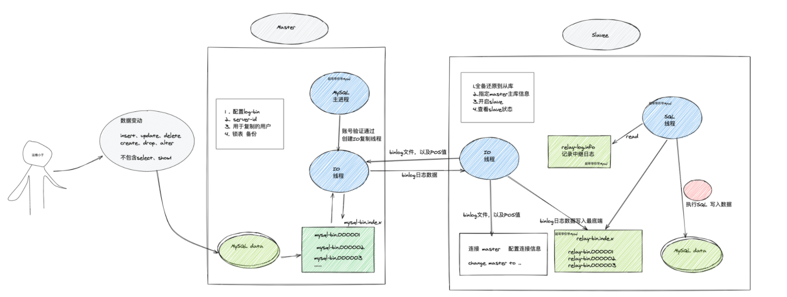

## MySQL主从复制架构

主从、也就是有一个master机器、以及一个、或者多个slave机器，用于数据的同步、备份。

MySQL数据库的主从复制技术与使用scp/rsync等命令进行的异机文件级别复制类似，都是数据的远程传输，只不过MySQL的主从复制技术是其软件自身携带的功能，无须借助第三方工具

> 并且，MySQL的主从复制并不是直接复制数据库磁盘上的文件，而是将逻辑的记录数据库更新的binlog日志发送到需要同步的数据库服务器本地，然后再由本地的数据库线程读取日志中的SQL语句并重新应用到MySQL数据库中，从而即可实现数据库的主从复制。

## MySQL主从复制介绍

MySQL数据库支持单向、双向、链式级联、环状等不同业务场景的主从复制。

在复制过程中，一台服务器（严格来讲是实例）作为主数据库（Master），接收来自用户的、对其内容的更新，而一个或多个其他的服务器则作为从服务器（Slave），接收来自主服务器binlog文件的日志内容，然后将该日志内容解析出的SQL语句重新应用到其他从服务器中，使得主从服务器数据达到一致。


如果设置了链式级联复制，那么，从服务器本身除了作为从服务器之外，也会同时作为其下面从服务器的主数据库服务器。链式级联复制形式类似于A==>B==>C。

## 官网mysql复制架构图


在当前的生产工作环境中，MySQL主从复制默认都是异步的复制方式，即不是严格实时的数据同步，但是在正常情况下带给用户的体验几乎都是实时的

## 为什么用主从复制

mysql主从复制集群使得mysql数据库支持高并发读写操作成为可能，同时又可以解决物理服务器宕机场景的数据备份和进行快速业务切换的问题。

对于企业生产环境来说，MySQL主从复制主要有以下几个重要的应用场景。

### salve(从)作为master(主)实时数据备份

主从服务架构设计，可以加强mysql数据库的稳定性，例如：当主库出现问题时，可以自动切换到从库继续工作，

此时从库和宕机之前的主库数据几乎一致。

这有些类似于NFS存储数据通过inotify+rsync将数据同步到备份的NFS服务器，只不过MySQL的复制方案是其自带的工具，实现的方式是逻辑的复制，而非文件层级的复制。

> 缺点

mysql主从复制进行备份时，在硬软件故障，人为在数据库操作的场景下，该数据备份是有效的；但是对于人为执行drop，delete等语句删除数据时，从库备份功能就没有了，因此从服务器也会执行删除语句。

### slave与master实现读写分离

mysql主从服务器架构可通过程序(php,java)等或代理软件(maxscale，atlas)实现对用户(客户端)的请求按读和写进行分离访问

即让从服务器仅仅处理用户的select（查询）请求，以降低用户查询的响应时间及同时在主服务器上读写所带来的访问压力。

对于更新的数据（例如update、insert、delete语句）仍然会交给主服务器处理，以确保主服务器和从服务器保持实时同步。

> 百度、淘宝、新浪等绝大多数的网站都是用户浏览的页面多于用户发布内容的页面，因此通过在从服务器上接收只读请求，就可以很好地减轻主库的读压力

且从服务器可以很容易地扩展为多台，使用LVS进行负载均衡（读写分离软件自身大多也有负载均衡的功能），效果就非常棒了，这就是传说中的数据库读写分离架构。

## 读写分离架构

通过程序代码，可以通过设置多个连接文件，实现对数据库的读写分离

逻辑

- 当关键字是select，读取slave从库
- 当update、insert、delete，连接master库，写入


> 读写分离，是程序代码，对整体程序架构改造实现

> mysql自身无法直接实现读写分离

> 能够实现读写分离的一些工具

有如下开源软件可以实现

- Maxscale
- Atlas
- Mycat

可以实现mysql的读写分离，且支持负载均衡

> 读写分离原理图


## 主从复制原理

mysql主从复制是一个异步复制过程，数据将从主库(mater)复制到从库(slave),在主库与从库之间实现整个主从复制的过程是由`三个线程`参与完成的。

其中两个线程sql线程和io线程在从库端，另外一个线程binlog dump线程在主库端(MySQL 5.5及以前是3个线程完成复制，从MySQL 5.6起SQL线程可以是多个）。

> 要实现mysql的主从复制功能，首先必须打开master端的binlog日志功能。

因为整个复制过程实际上就是Slave从Master端获取binlog日志，然后再在Slave上以相同的顺序执行获取的binlog日志中所记录的各种SQL操作，从而实现主从数据一致的功能。

配置文件如下

```perl
[mysqld]
user=mysql
port=3306
socket=/data/3306/mysql.sock
basedir=/application/mysql-5.6.40-linux-glibc2.12-x86_64/
datadir=/data/3306/data
log-bin=/data/3306/mysql-bin        # 这里是定义二进制日志文件，用于复制
server-id=6
secure_file_priv= ''
#general_log=on
#general_log_file=/data/3307/data/mysql-server56.log
# slow-log
slow-query-log = ON                        #<==慢查询开启开关
long_query_time = 2                        #<==记录大于2秒的SQL语句。
log_queries_not_using_indexes = ON         #<==没有使用到索引的SQL语句。
slow-query-log-file = /data/3306/slow.log  #<==记录SQL语句的文件。
min_examined_row_limit = 800               #<==记录结果集大于800行的SQL语句。
# 编码
character-set-server=utf8
```

## 详细原理过程



- slave机器`start slave`，开启主从复制

- slave机器的I/O线程会通过在master上已授权的复制用户，连接master服务器

  - 通过该用户再从指定的binlog日志文件的指定位置，发送binlog日志的内容
  - （binglog文件名，pos值，都通过change master命令指定了）

- Master服务器接收到slave的I/O线程请求之后，负责复制的binlog dump线程会根据slave服务器的I/O线程的请求信息，进行读取binlog，以及pos值之后的日志信息

  - 然后返回给slave的I/O线程
  - 返回的信息除了binlog日志内容以外，以及master服务端新的binlog文件，以及POS值

- slave此时的I/O线程接收到master发来的日志信息后，将binlog日志内容，写入到slave本身的

  ```
  relay-log中继日志中，如mysql-relay-bin.xxxxxx
  ```

  的末端

  - 并且记录新的binlog文件信息，名字、pos值，写入master-info文件中，用于下一次读取binlog数据时，可以明确知道数据读取的起点

- slave服务器的SQL线程会实时监测本地的Relay Log新增的日志内容，然后将Reloy Log文件中的内容，解析为SQL语句，且在自身slave按顺序执行这些SQL。

经过这些，就可以确保，master和slave执行了同样的SQL。

在`复制状态正常`的情况下，master和slave的数据是完全一样的。

## 复制小结

- 主从复制是异步的进行SQL语句的复制
- 复制时，主库有一个`binlog dump 线程`，从库有2个线程`I/O线程`、`SQL线程`
- 在MySQL5.6之后，slave的SQL线程有多个
- 实现主从复制的必要条件、主库开启binlog，基于binlog复制
- 用于复制的所有mysql节点，server-id不能相同
- binlog文件只记录数据库有`更改`的SQL，（主数据库有变化），对`select、show`以及未修改数据库的语句不会记录

## 主从复制实践

mysql主从复制、机器数量可以是

- 单机、单数据库多实例
- 多台服务器、每个机器单独部署数据库

### 环境

> master 192.168.6.80 3306

> slave1 192.168.6.79 3306

确认两个服务器启动了mysql

```
ps -ef|grep 3306
```

## master主库操作

> master复制操作，必须开启binglog

```
 [client]
 port=3306
 socket=/data/3306/mysql.sock
 
 [mysqld]
 user=mysql
 port=3306
 socket=/data/3306/mysql.sock
 basedir=/appmysql/mysql-5.6.34-linux-glibc2.5-x86_64
 datadir=/data/3306/data
 log-bin=/data/3306/mysql-bin  #开启binglog
 server-id=5                   #server-id要和从库区分
 
 [mysqld_safe]
 log-error=/data/3306/mysql_3306_error.log
 pid-file=/data/3306/mysqld_3306.pid

```

检查binlog状态是否开启

```
[root@sql ~]# mysql -uroot -p1234 -P3306 -h127.0.0.1 -e "show variables like 'log_bin'"
Warning: Using a password on the command line interface can be insecure.
+---------------+-------+
| Variable_name | Value |
+---------------+-------+
| log_bin       | ON    |
+---------------+-------+

[root@sql ~]# mysql -p -S /data/3306/mysql.sock -e "show variables like 'server_id'"
Enter password: 
+---------------+-------+
| Variable_name | Value |
+---------------+-------+
| server_id     | 5     |
+---------------+-------+

```

### master操作

slave和master链接同步，需要有一个账号链接master，允许同步数据

```
mysql> grant replication slave on *.* to yzhrepl@'192.168.6.%' identified by '1234';
Query OK, 0 rows affected (0.00 sec)


mysql> flush privileges;
Query OK, 0 rows affected (0.00 sec)


#检查用户和授权信息
mysql> select user,host from mysql.user;
+---------+-------------+
| user    | host        |
+---------+-------------+
| root    | %           |
| root    | 127.0.0.1   |
| yzhrepl | 192.168.6.% |

mysql> mysql> show grants for yzhrepl@'192.168.6.%';
+------------------------------------------------------------------------------------------------------------------------------+
| Grants for yzhrepl@192.168.6.%                                                                                               |
+------------------------------------------------------------------------------------------------------------------------------+
| GRANT REPLICATION SLAVE ON *.* TO 'yzhrepl'@'192.168.6.%' IDENTIFIED BY PASSWORD '*A4B6157319038724E3560894F7F932C8886EBFCF' |
+------------------------------------------------------------------------------------------------------------------------------+
1 row in set (0.00 sec)

```

### master锁表

既然要开始同步数据。锁表，防止数据写入

```
mysql> flush table with read lock;
Query OK, 0 rows affected (0.02 sec)

# 锁表对于不同的引擎，有超时时间
mysql> show variables like '%timeout';
+-----------------------------+----------+
| Variable_name               | Value    |
+-----------------------------+----------+
| connect_timeout             | 10       |
| delayed_insert_timeout      | 300      |
| innodb_flush_log_at_timeout | 1        |
| innodb_lock_wait_timeout    | 50       |
| innodb_rollback_on_timeout  | OFF      |
| interactive_timeout         | 28800    |  # mysql 连接超时
| lock_wait_timeout           | 31536000 |
| net_read_timeout            | 30       |
| net_write_timeout           | 60       |
| rpl_stop_slave_timeout      | 31536000 |
| slave_net_timeout           | 3600     |
| wait_timeout                | 28800    |    # mysql 连接超时
+-----------------------------+----------+
12 rows in set (0.00 sec)

查看锁库状态 无法写入数据
mysql> create database kings;
ERROR 1223 (HY000): Can't execute the query because you have a conflicting read lock

查看主库状态
mysql> show master status;
+------------------+----------+--------------+------------------+-------------------+
| File             | Position | Binlog_Do_DB | Binlog_Ignore_DB | Executed_Gtid_Set |
+------------------+----------+--------------+------------------+-------------------+
| mysql-bin.000009 |      854 |              |                  |                   |
+------------------+----------+--------------+------------------+-------------------+


```

当前的binlog文件名`mysql-bin.000009`，日志偏移量的位置，`POS值 854`

> 这里的信息需要记录下来，数据锁定在这里了

> slave开始复制也就从这里开始

### 导出主库数据

锁表后，可以导出数据库中现有所有的数据

- 如果数据库过大，超过30G以上，采用Xtrabackup备份

```
--all--database，-A
---database，-B

[root@sql ~]# mysqldump -p1234 -S /data/3306/mysql.sock -A -B |gzip > /data/3306/backup/alldb_$(date +%F).sql.gz

数据导出来后再次查看binglog状态，应该没有变化
mysql> show master status;
```

导出数据后，解所主库，恢复可写

```
mysql> unlock tables;
```

### master数据发给slave

scp,rsync命令都可以 ，将备份数据发给slave机器

```
[root@sql ~]# scp -rp /data/3306/backup/alldb_2022-03-01.sql.gz root@192.168.6.79:/opt/

查看一下从库的信息
[root@template opt]# ls
alldb_2022-03-01.sql.gz
```

## slave从库操作

> 从库机器的server_id参数必须唯一，和master区别开
>
> 并且要关闭`binlog`参数配置，禁用二进制日志（如果该从库不需要级联复制的话）

如下情况，从库才会开启binlog，记录从库的数据更新。

- 级联同步，A > B > C，那这里的B数据库，就需要开启binlog
- 在从库下做数据备份，也需要开启binlog，数据库备份必须有全备、以及binlog备份，才是完整的

### slave配置文件

```
[root@template 3306]# cat my.cnf 
[client]
port=3306
socket=/data/3306/mysql.sock

[mysqld]
user=mysql
port=3306
socket=/data/3306/mysql.sock
basedir=/appmysql/mysql-5.6.34-linux-glibc2.5-x86_64
datadir=/data/3306/data

server-id=6    id要和主库区分
read-only        开启只读模式

[mysqld_safe]
log-error=/data/3306/mysql_3306_error.log
pid-file=/data/3306/mysqld_3306.pid

```

> 检查slave数据库状态

> 限制只读 mysql> set global read_only=1;

```
[root@template 3306]# mysql -S /data/3306/mysql.sock -uroot -p
Enter password: 

#查看logbin日志关闭与否
mysql> show variables like 'log_bin';
+---------------+-------+
| Variable_name | Value |
+---------------+-------+
| log_bin       | OFF   |
+---------------+-------+
1 row in set (0.00 sec)


#查看server-id
mysql> show variables like 'server_id';
+---------------+-------+
| Variable_name | Value |
+---------------+-------+
| server_id     | 6     |
+---------------+-------+
1 row in set (0.00 sec)

#设置只读权限
mysql> set global read_only=1;
Query OK, 0 rows affected (0.00 sec)

```

### slave导入master数据


在复制之前，应该让master和slave的数据一致、然后再开始复制

```
# slave 导入数据
[root@template 3306]# zcat /opt/alldb_2022-03-01.sql.gz |mysql -S /data/3306/m
ysql.sock 

[root@template 3306] gzip -d alldb_2022-03-01.sql.gz
mysql > source /opt/alldb_2022-03-01.sql
```

### slave连接master-info

mysql从库连接配置

```
将master信息写入到slave的master.info文件记录
mysql> change master to
    -> master_host='192.168.6.80',
    -> master_port=3306,
    -> master_user='yzhrepl',
    -> master_password='1234',
    -> master_log_file='mysql-bin.000009',
    -> master_log_pos=854;
Query OK, 0 rows affected, 2 warnings (0.02 sec)

```

> 查看master.info

```
[root@template 3306]# cat /data/3306/data/master.info 
23
mysql-bin.000009
854
192.168.6.80
yzhrepl
1234
3306
60
0


0
1800.000

0

86400


0

```

### 启动主从同步

```
#先查看一下线程状态
# 关注如下2参数，两个IO线程
# Slave_IO_Running: No
# Slave_SQL_Running: No

mysql> show slave status\G
*************************** 1. row ***************************
               Slave_IO_State: 
                  Master_Host: 192.168.6.80
                  Master_User: yzhrepl
                  Master_Port: 3306
                Connect_Retry: 60
              Master_Log_File: mysql-bin.000009
          Read_Master_Log_Pos: 854
               Relay_Log_File: mysqld_3306-relay-bin.000001
                Relay_Log_Pos: 4
        Relay_Master_Log_File: mysql-bin.000009
             Slave_IO_Running: No
            Slave_SQL_Running: No

#开启复制
mysql> start slave;
Query OK, 0 rows affected (0.01 sec)


#再次查看线程状态
mysql> show slave status\G

Slave_IO_Running: Yes
Slave_SQL_Running: Yes
Seconds_Behind_Master: 0

```

> 解释

- Slave_IO_Running：Yes，这个表示I/O的线程状态，I/O线程负责从主库中读取Binlog日志，并将Binlog日志写入从库的中继日志中，状态为Yes表示I/O线程工作正常，否则异常。
- Slave_SQL_Running：Yes，这个表示SQL的线程状态，SQL线程负责读取中继日志（relay-log）中的数据并转换为SQL语句应用到从数据库中，状态为Yes表示I/O线程工作正常，否则异常。
- Seconds_Behind_Master：0，这个表示在复制过程中，从库比主库延迟的秒数，这个参数很重要，但企业里有更准确地判断主从延迟的方法：在主库中写时间戳，然后通过从库读取时间戳，与当前数据库时间进行比较，从而认定是否真的延迟。

## master写入数据

写入master数据，看看slave从库变化

```
mysql> create database student;
Query OK, 1 row affected (0.00 sec)
```

slave数据库查看

```
[root@template 3306]# mysql -uroot -h127.0.0.1 -e "show databases"
+--------------------+
| Database           |
+--------------------+
| information_schema |
| kings              |
| mysql              |
| performance_schema |
| student            |
| test               |
+--------------------+
```

到这里master,slave两个数据库数据同步了，单向主从复制基本上完成。

## Master复制线程

线程也就是操作系统，实际干活的一个资源单位，就好比是一个工人，在努力的搬运数据。

> 查看MySQL线程状态
>
> Master

```perl
mysql> show processlist\G
# 线程1，用于复制binlog数据
*************************** 1. row ***************************
     Id: 5
   User: repl_chaoge
   Host: chaoge-slave1.shared:56564
     db: NULL
Command: Binlog Dump    # 用于复制的master线程
   Time: 608
   # state状态，该线程已正确把binlog数据发给了save，并且当前等待binlog日志更新
  State: Master has sent all binlog to slave; waiting for binlog to be updated
   Info: NULL

# 线程2，是我们当前这个查询进程的命令，query语句
*************************** 2. row ***************************
     Id: 11
   User: root
   Host: localhost
     db: NULL
Command: Query
   Time: 0
  State: init
   Info: show processlist
2 rows in set (0.00 sec)
```

> state有如下常见状态


## Slave复制线程

slave从库干活的工人(线程)

```perl
[root@chaoge_slave1 3306]# mysql -S /data/3306/mysql.sock -e "show processlist\G"
# slave进行 I/O的线程，从master接收数据
*************************** 1. row ***************************
     Id: 5
   User: system user
   Host:
     db: NULL
Command: Connect
   Time: 823
   # 等待master发来数据
  State: Waiting for master to send event
   Info: NULL

 # 执行SQL写入到slave数据库的线程

*************************** 2. row ***************************
     Id: 6
   User: system user
   Host:
     db: NULL
Command: Connect
   Time: 406
 # slave当前以读取所有中继日志，等待上面的I/O线程更新binlog
  State: Slave has read all relay log; waiting for the slave I/O thread to update it
   Info: NULL


# 这是当前命令的线程
*************************** 3. row ***************************
     Id: 9
   User: root
   Host: localhost
     db: NULL
Command: Query
   Time: 0
  State: init
   Info: show processlist

```

## 配置一主两从

> 新增一个从库多配置一次，注意server_id的区分

## 手动主从切换

### 设置从库slave01

> 先查看一下主库

```
#在主库查看一下当前有哪些节点在工作
mysql> show processlist\G;

#查看主库当前状态
mysql> show master status\G
*************************** 1. row ***************************
             File: mysql-bin.000003
         Position: 850
     Binlog_Do_DB: 
 Binlog_Ignore_DB: 
Executed_Gtid_Set: 
1 row in set (0.00 sec)

```

> 开始操作从节点

```
#停止slave01的io线程，不读取master的binlog了
stop slave IO_THREAD;

#查看一下从库的线程
show processlist\G;
```

> 切换slave从库状态为主库
>
> 开启binglog日志功能

```
1#注意在配置文件中my.cnf中添加binlog配置 
log-bin=/data/3306/mysql-bin

2#重启数据库
[root@node01 /]# /data/3306/mysql_3306 restart

#因为是从主库导入的数据，所有登录信息也变成主库的信息了
[root@node01 /]# mysql -uroot -S /data/3306/mysql.sock -p1234

3#停止从库角色
stop slave;

4#清空所有旧的binlog日志，重置为主库角色
reset master;

5#重置slave信息
reset slave all;

6#查看当前从库，是否有了binlog信息
show master status \G;
```

> 创建一个用于复制的用户

```
grant replication slave on *.* to repl@'192.168.6.%' identified by '1234';

flush privileges;
```

### 设置主库master

```
1.清空binglog数据
reset master;

2.清空slave信息
reset slave all;

3.配置slave链接master的binlog信息
#填入slave01信息

change master to
master_host='192.168.6.30',
master_port=3306,
master_user='repl',
master_password='1234',
master_log_file='mysql-bin.000001',
master_log_pos=486;
```

### 启动旧的master机器进行slave角色，进行同步

```
开启复制同步
start slave;


#看一下链接状态
mysql> show slave status\G;
*************************** 1. row ***************************
               Slave_IO_State: Waiting for master to send event
                  Master_Host: 192.168.6.30
                  Master_User: repl
                  Master_Port: 3306
                Connect_Retry: 60
              Master_Log_File: mysql-bin.000001
          Read_Master_Log_Pos: 486
               Relay_Log_File: mysqld_3306-relay-bin.000002
                Relay_Log_Pos: 283
        Relay_Master_Log_File: mysql-bin.000001
             Slave_IO_Running: Yes
            Slave_SQL_Running: Yes

```

此时查看新主库的主从链接状态

```
mysql> show processlist\G;
*************************** 1. row ***************************
     Id: 7
   User: root
   Host: localhost:49272
     db: NULL
Command: Query
   Time: 0
  State: init
   Info: show processlist
*************************** 2. row ***************************
     Id: 8
   User: repl
   Host: 192.168.6.79:45214
     db: NULL
Command: Binlog Dump
   Time: 99
  State: Master has sent all binlog to slave; waiting for binlog to be updated
   Info: NULL
2 rows in set (0.00 sec)

```

### 接着切换slave02链接新主库

```
stop slave;


#查看一下主库的binglog日志是否改变
change master to
master_host='192.168.6.30',
master_port=3306,
master_user='repl',
master_password='1234',
master_log_file='mysql-bin.000001',
master_log_pos=586;


start slave;

```

此时就已经完成手动主从切换。。
