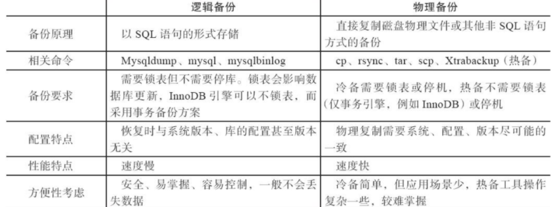
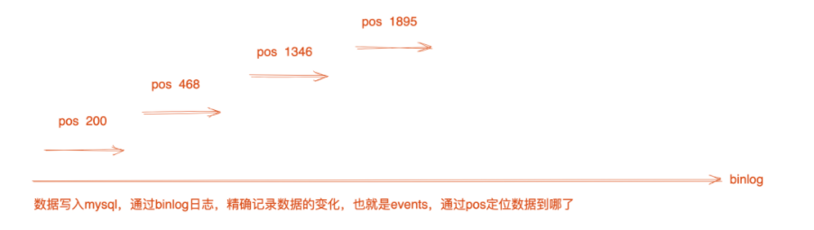

## 全量备份

全量数据，指的是某一整个数据库（如kings）中所有的表、以及表数据，进行备份。

> 例如备份所有数据库、以及所有数据

> --all--database，-A

```
[root@sql ~]# mysqldump -uroot -p1234 -P3306 -h127.0.0.1 --master-data=2 -A|gzip \
 > /data/3306/all-data.sql.gz
```

备份其中一个db

```
[root@sql ~]# mysqldump -uroot -p1234 -P3306 -h127.0.0.1 --master-data=2 kings|gzip > \
> /data/3306/kings_data.sql.gz
```

## 增量备份

增量指的就是，`在上一次全量备份数据之后，到下一次全量备份之间的新增数据`。

增量数据，也就是以binlog形式进行记录数据，基于binlog日志的备份，也就是增量备份。

## 全量备份特点

优点

- 恢复数据时需要的数据文件数量少，维护成本低

缺点

- 每天一个全量备份，占用磁盘，且全量备份时，消耗计算机资源，造成极其压力上升。

中小公司最常用的就是全量备份，定制备份数据删除规则，例如仅保留7天内的数据，若是有特殊需求，可以长时间保留备份数据。

## 备份方案

### 逻辑备份

逻辑备份指的是用mysqldump命令或者其他工具，把mysql的数据以SQL的形式导出。

恢复的时候，导入该数据，source或者mysql命令，重新将SQL还原为数据。

#### 特点

逻辑备份优点是简单、方便、可靠、备份后的数据可以跨平台、跨版本、跨操作系统恢复，因为都遵循SQL语句。

缺点：比起物理备份，效率较低，海量数据下，效率很低。

### 物理备份

物理备份是直接备份mysql的数据源，例如`datadir=/data/3307/data`

### 冷备

物理备份指的就是，利用`cp,rsync,tar,scp`等工具把mysql数据文件复制多份，但是在备份期间，仍可能有用户在写入数据，因此该方案，会导致数据丢失，数据复制不完整。

为了确保备份期间的数据一致性，可以人工的停止数据库，或者锁表，再进行复制数据，但是这种方案还是太粗暴。

因此是不推荐使用的，只是大家需要有这个概念，知道备份的方式。

> 冷备，指的是，停机情况下对数据备份

### 热备

> 热备，指的是，不停机，进行数据备份

结合`Xtrabackup`备份工具，可以实现`物理全备+增量备份`。

### 特点

和逻辑备份相反

优点：速度快，效率极高

缺点：不支持跨平台、版本、软件、操作系统，恢复麻烦些



## 全量备份实战

中小公司，一般是逻辑备份，mysqldump即可，设置每天进行全量备份，备份时间在业务流量最低谷时操作。

多实例环境，加上点参数

```bash
 + mysqldump.sh                                                                         
 #!/bin/bash
 #Date： 2022-02-24
 
 bak_path=/data/3306/
 [ -d $bak_path ] && mkdir -p $bak_path
 # 备份数据，逻辑备份
 mysqldump -uroot -p1234 -P3306 -h127.0.0.1 -B -A --master-data=2|gzip >$bak_path/       $(date +%F)_3306.sql.gz
 
 # md5验证完整文件，用于未来检查传输结果
 md5sum $bak_path/$(date +%F)_3306.sql.gz > $bak_path/$(date +%F)_3306.sql.gz.md5
 
 
 # 复制、同步备份文件，物理备份
 # 需要配置好rsync服务 
 rsync -az $bak_path/ rsync_backup@192.168.6.80::mysql/ --password-file=/etc/rsync.      password
 
 # 删除超过7天的备份
 find $bak_path/ -type f -name "*.sql.gz" -mtime +7|xargs rm -f

```

定时任务

```
[root@sql 3306]# crontab -l
0 0 * * * /bin/bash  /data/3306/mysqldump.sh &>/dev/null
```

## 增量备份实战

> 既然用增量备份

> 表示全量的数据文件，无法达到恢复的目的

### 如何恢复

1.得有全量备份的数据

2.得有binlog增量日志

实现环境

当前kings库下tanks表内容

```
[root@sql 3306]# mysql -uroot -p1234 -P3306 -h127.0.0.1 -e "select * from kings.tanks"
Warning: Using a password on the command line interface can be insecure.
+----+--------------+--------------+-----------------+-------+-----------------------------+--------+----------------------------------------------------------------+
| id | name         | skills       | summoner_skills | price | introduction                | camp   | pic_url                                                        |
+----+--------------+--------------+-----------------+-------+-----------------------------+--------+----------------------------------------------------------------+
|  1 | 凯           |              | flush           |     0 |                             | NULL   | NULL                                                           |
|  2 | 亚瑟         | 圣剑裁决     | flush           |  5888 | 能抗能打，技能沉默          | 近战   | https://img.18183.com/uploads/allimg/190924/266-1Z9241Q224.jpg |
|  3 | 东皇太一     | 堕神契约     | flush           |     0 |                             | NULL   | NULL                                                           |
|  4 | 吕布         | 魔神降临     | flush           | 18888 |                             | NULL   | NULL                                                           |
|  5 | 露娜         | 大招         | flush           |     0 |                             | NULL   | NULL                                                           |
+----+--------------+--------------+-----------------+-------+-----------------------------+--------+----------------------------------------------------------------+

```

> 基于binlog的增量备份

在执行mysqldump备份时，添加的--master-data=2参数，能够立即计算出当前的数据在哪一个位置，表示，目前数据一直写到了这里。



```bash
#备份脚本
[root@sql 3306]# cat bak_db.sh 
#!/bin/bash
#Date： 2022-02-24
date -s "2022/02/24"
mysqldump -uroot -p1234 -P3306 -h127.0.0.1 -B --master-data=2 kings|gzip > /data/3306/$(date +%F)_3306.sql.gz


#执行脚本查看备份文件
[root@sql 3306]# bash bak_db.sh 
Thu Feb 24 00:00:00 EST 2022
Warning: Using a password on the command line interface can be insecure.


[root@sql 3306]# ls -l /data/3306/2022-02-24_3306.sql.gz 
-rw-r--r-- 1 root root 1340 Feb 24 00:00 /data/3306/2022-02-24_3306.sql.gz
```

模拟0点全量备份后，继续写入数据

```
mysql> insert into tanks(name)values("测试数据1");
Query OK, 1 row affected, 3 warnings (0.00 sec)

mysql> insert into tanks(name)values("测试数据2");
Query OK, 1 row affected, 3 warnings (0.00 sec)

mysql> select name from tanks;
+---------------+
| name          |
+---------------+
| 凯            |
| 亚瑟          |
| 东皇太一      |
| 吕布          |
| 露娜          |
| 测试数据1     |
| 测试数据2     |
+---------------+
7 rows in set (0.00 sec)

```


> 模拟上午11点，误删除整个kings数据库

```
[root@sql 3306]# cat drop_db.sh 
#!/bin/bash
#Date： 2022-02-24
date -s "2022/02/25"
mysql -uroot -p1234 -P3306 -h127.0.0.1 -e "drop database kings;show databases;"


[root@sql 3306]# bash drop_db.sh 
Fri Feb 25 00:00:00 EST 2022
Warning: Using a password on the command line interface can be insecure.
+--------------------+
| Database           |
+--------------------+
| information_schema |
| cnblog             |
| mysql              |
| performance_schema |
| student            |
| test               |
| test01             |
+--------------------+

```

### 问题排查

上午11时，kings数据库被删除，后端代码，监控会报错，使用该kings数据的人员，一定会投诉到dba,运维部门

此时需要做如下检查：

- 检查网站报错

- 检查linux上后端代码日志，这里基本上就可以知道无法连接数据库
- 登录数据库机器，发现数据库消失

> 所以说数据库配置相关权限尤为重要

### 恢复数据

- 准备全量数据备份，0点整的备份文件
- 备份所有binlog增量日志，防止二次破坏

```
[root@sql 3306]# mkdir bak

[root@sql 3306]# cp -a /data/3306/mysql-bin.* ./bak

[root@sql 3306]# ls bak
mysql-bin.000001  mysql-bin.000003  mysql-bin.000005  mysql-bin.000007
mysql-bin.000002  mysql-bin.000004  mysql-bin.000006  mysql-bin.index

```

停止数据库访问,设置防火墙规则

```
# 非127.0.0.1的请求，禁止访问3306端口，这样就禁止除了本地，其他人都无法连接

[root@sql 3306]# iptables -I INPUT -p tcp --dport 3306 ! -s 127.0.0.1 -j DROP
```

解压全量备份的数据

确保其中，没有刚才插入的两条数据(测试数据1，测试数据2)

```
[root@sql 3306]# cp -r 2022-02-24_3306.sql.gz ./bak
[root@sql 3306]# cd ./bak
[root@sql bak]# ls
2022-02-24_3306.sql.gz  mysql-bin.000003  mysql-bin.000006
mysql-bin.000001        mysql-bin.000004  mysql-bin.000007
mysql-bin.000002        mysql-bin.000005  mysql-bin.index
[root@sql bak]# gzip -cd 2022-02-24_3306.sql.gz > kings.sql
[root@sql bak]# ls -lrt kings.sql 
-rw-r--r-- 1 root root 4478 Feb 24 09:40 kings.sql


[root@sql bak]# egrep  "tanks" kings.sql 
-- Table structure for table `tanks`
DROP TABLE IF EXISTS `tanks`;
CREATE TABLE `tanks` (
-- Dumping data for table `tanks`
LOCK TABLES `tanks` WRITE;
/*!40000 ALTER TABLE `tanks` DISABLE KEYS */;
INSERT INTO `tanks` VALUES (1,'凯','','flush',0,'',NULL,NULL),(2,'亚瑟','圣剑裁决','flush',5888,'能抗能打，技能沉默','近战','https://img.18183.com/uploads/allimg/190924/266-1Z9241Q224.jpg'),(3,'东皇太一','堕神契约','flush',0,'',NULL,NULL),(4,'吕布','魔神降临','flush',18888,'',NULL,NULL),(5,'露娜','大招','flush',0,'',NULL,NULL);
/*!40000 ALTER TABLE `tanks` ENABLE KEYS */;


```

### 分析binlog日志

基于binlog的位置，pos参数

全量备份时，添加了--master-data=2参数，当时记录了数据的一个切割点，也就是如下的mysql-bin.000007，数据位置是3517

```
[root@sql bak]# sed -n '19,22p' kings.sql
-- Position to start replication or point-in-time recovery from
--

-- CHANGE MASTER TO MASTER_LOG_FILE='mysql-bin.000007', MASTER_LOG_POS=3517;
```

用于主从数据复制，或者恢复的位置是

`mysql-bin.000007` ,`位置是3517`

### 解析binlog

找到基于binlog解析出的sql文件中增量写入的新数据

```
[root@sql bak]# mysqlbinlog -d kings mysql-bin.000007 --start-position=3517 -r kings_binlog.sql


[root@sql bak]# egrep -v "^#|\*|^$|--" kings_binlog.sql 
BINLOG '
5wUXYg8FAAAAdAAAAHgAAAABAAQANS42LjM0LWxvZwAAAAAAAAAAAAAAAAAAAAAAAAAAAAAAAAAA
AAAAAAAAAAAAAAAAAAAAAAAAEzgNAAgAEgAEBAQEEgAAXAAEGggAAAAICAgCAAAACgoKGRkAATOQ
AZw=
BEGIN
insert into tanks(name)values("测试数据1")
BEGIN
insert into tanks(name)values("测试数据2")
DELIMITER ;
```

找到问题sql删除掉

```
[root@sql bak]# grep -w drop kings_binlog.sql
drop database kings
[root@sql bak]# sed -i "/drop database kings/d" kings_binlog.sql 
[root@sql bak]# grep -w drop kings_binlog.sql
```

### 执行恢复

首先恢复全量备份，0点之前的内容

```
[root@sql bak]# mysql -uroot -p1234 -P3306 -h127.0.0.1 < /data/3306/bak/kings.sql
```

全量恢复结果

tanks表恢复了，后续插入的测试数据没有回来

```
[root@sql bak]# mysql -uroot -p1234 -P3306 -h127.0.0.1 -e "select * from kings.tanks\G"
```

### 恢复增量数据

```
[root@sql bak]# mysql -uroot -p1234 -P3306 -h127.0.0.1 < /data/3306/bak/kings_binlog.sql 
```

```
[root@sql bak]# mysql -uroot -p1234 -P3306 -h127.0.0.1 -e "select * from kings.tanks" 
Warning: Using a password on the command line interface can be insecure.
+----+---------------+--------------+-----------------+-------+-----------------------------+--------+----------------------------------------------------------------+
| id | name          | skills       | summoner_skills | price | introduction                | camp   | pic_url                                                        |
+----+---------------+--------------+-----------------+-------+-----------------------------+--------+----------------------------------------------------------------+
|  1 | 凯            |              | flush           |     0 |                             | NULL   | NULL                                                           |
|  2 | 亚瑟          | 圣剑裁决     | flush           |  5888 | 能抗能打，技能沉默          | 近战   | https://img.18183.com/uploads/allimg/190924/266-1Z9241Q224.jpg |
|  3 | 东皇太一      | 堕神契约     | flush           |     0 |                             | NULL   | NULL                                                           |
|  4 | 吕布          | 魔神降临     | flush           | 18888 |                             | NULL   | NULL                                                           |
|  5 | 露娜          | 大招         | flush           |     0 |                             | NULL   | NULL                                                           |
|  6 | 测试数据1     |              | flush           |     0 |                             | NULL   | NULL                                                           |
|  7 | 测试数据2     |              | flush           |     0 |                             | NULL   | NULL                                                           |
+----+---------------+--------------+-----------------+-------+-----------------------------+--------+----------------------------------------------------------------+

```

此时mysql数据全量备份+binlog增量备份，恢复完毕


改回时间

```
ntpdate -u ntp.aliyun.com
```

## mysql备份架构总结

> 中小公司做法一般是，每天0点全量备份，数据按照日期备份到数据库本地，且进行定期如七天删除脚本。
>
> 主从复制架构，两台mysql服务器，机器A挂了，可以切换机器B，保证数据安全。
>
> 但是该方案，无法解决如drop、delete语句这样的删除问题（主从复制，是从库执行一遍主库的动作）
>
> 方案是可以通过从库的延迟复制解决。

## 练习

- 总结
- 数据库增量备份、全量备份
- 逻辑备份、物理备份
- mysql增量备份全流程
- mysql分库分表备份脚本开发