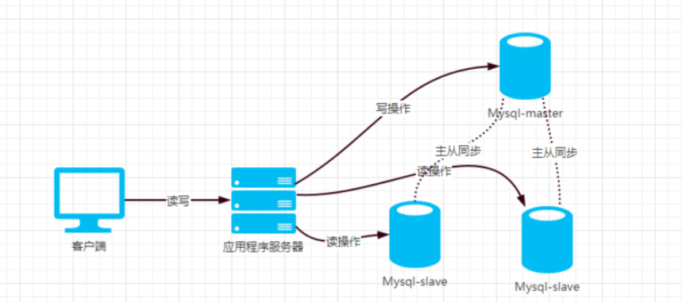
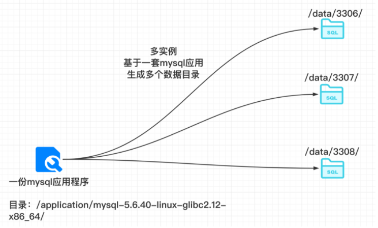
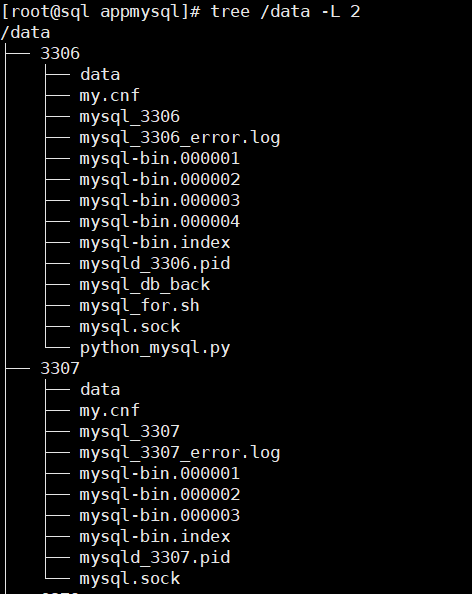

## 什么是多实例

> 多实例，就是一台linux上，同时运行多个mysql，当然是区别了不同的端口，例如3306、3307、3308。运行三个mysql数据库

这三个mysql，就相当于三个独立的卧室，互相没关系，在linux上的呈现区别就是

- 不同的端口
- 不同的数据目录，不同的配置文件
- 不同的mysql进程，不同的pid

打个比方，MySQL多实例就相当于房子的多个卧室，每个实例可以看作是一间卧室，整个服务器就是一套房子，服务器的硬件资源（cpu、mem、disk）、软件资源（CentOS操作系统）可以看作是房子的卫生间、厨房、客厅，是房子的公用资源。咱们北漂的懂得都懂(笑)

> nginx、apache、redis、memcached都可以多实例，只要他们的端口、数据文件、进程都是单独的就好

## 多实例的好处

可有效利用服务器资源。当单个服务器资源有剩余时，可以充分利用剩余的资源提供更多的服务，且可以实现资源的逻辑隔离。

节约服务器资源。若公司资金紧张，但是数据库又需要各自尽量独立地提供服务，而且还需要用到主从复制等技术，那么选择多实例就再好不过了。

> 例如公司有多个业务，需要用到好几套mysql数据库，都得单独的部署，数据区分开

## 多实例的弊端

MySQL多实例有它的好处，也有其弊端，比如，会存在资源互相抢占的问题。当某个数据库实例并发很高或者有SQL慢查询时，整个实例会消耗大量的系统CPU、磁盘I/O等资源，导致服务器上的其他数据库实例提供服务的质量一起下降。

不同实例获取的资源是相对独立的，无法像虚拟化一样完全隔离。(毕竟大家都是在同一个文件系统下)

## 多实例用在哪些场景

- 节约资金的企业
- 用户并发量不大的业务

门户网站通常都会使用多实例，因为配置硬件好的服务器，可以节省IDC机柜空间，同时，运行多实例也会减少硬件资源占用率不满的浪费。

> 百度公司的很多数据库都是多实例的，不过，一般是`从库`采用多实例，例如某部门中使用的IBM服务器为48核CPU，内存96GB，一台服务器运行3~4个实例；



## MySQL多实例部署



每个实例都有单独的

- 配置文件
- 启动脚本
- 数据目录

```
[root@sql data]# tree /data/
/data/
├── 3306
│   ├── data
│   ├── my.cnf
│   └── mysql_3306
└── 3307
    ├── data
    ├── my.cnf
    └── mysql_3307
```

## 部署多实例

!>此部署是基于mysql5.6版本，7和8部署有区别

> 安装方式有如下几种

- 二进制安装（软件包名字较长、带有版本号、平台信息、等）

  - 源代码已经被编译过，下载、解压后，可以直接在对应的系统平台上运行，二进制包比较大，使用比较简单。
  - 如`mysql-5.0.45-linux-x86_64-glibc23.tar.gz`

- 源代码安装（软件包基本只是一个携带版本号的tar包）

  - 需要在机器上重新编译安装，时间较久，对于系统环境依赖性比较重
  - 如`mysql-5.0.45.tar.gz`

- RPM包安装

  - rpm是红包的一个软件包管理系统

  - rpm包也是二进制包的一种，但是也分为两种

    - 源码rpm包，源代码被打包成了rpm格式（看不到源代码了，tar包可以看到源代码），还得重新编译

      ```
      rpmbuild --rebuild
      ```

      - 如`name-version-release.arch.src.rpm`

    - 二进制rpm包，可以直接安装rpm包使用

      - 如`name-version-release.arch.rpm`

**rpm和源码的优缺点**

RPM包优点： 1）RPM包管理简单，只需要通过几个简单的命令就可以实现软件包的安装升级卸载和查询 2）安装速度比源码包形式快（源码包主要是make编译花费时间较长）

RPM包缺点： 1）RPM包是事先已经经过编译的二进制包，可以直接安装使用，因此无法再看到源码 2）如上所述，功能已经被固定，无法灵活的删除或新增功能 3）RPM包存在很强的依赖性，大部分RPM包的顺利安装需要安装很多个依赖RPM包 4）卸载软件包的时候，如果不小心，会卸载涉及到依赖关系，很有可能就会卸载移除掉系统所需软件，导致系统奔溃

对于已经编译成二进制的rpm包，由于操作系统环境不同，一般不能混用。

## 二进制安装mysql

> 下载地址 https://downloads.mysql.com/archives/community/

## 安装流程

> 如果是centos，最小化安装系统，可以安装如下的基础环境依赖包，【可选】

```perl
yum  clean all
yum -y update
yum -y install gcc-c++ gd libxml2-devel libjpeg-devel libpng-devel net-snmp-devel wget telnet vim zip unzip
yum -y install curl-devel libxslt-devel pcre-devel libjpeg libpng libcurl4-openssl-dev
yum -y install libcurl-devel libcurl freetype-config freetype freetype-devel unixODBC libxslt
yum -y install gcc automake autoconf libtool openssl-devel
yum -y install perl-devel perl-ExtUtils-Embed  *libnuma* screen
yum -y install cmake ncurses-devel.x86_64  openldap-devel.x86_64 lrzsz  openssh-clients gcc-g77  bison
yum -y install libmcrypt libmcrypt-devel mhash mhash-devel bzip2 bzip2-devel
yum -y install ntpdate rsync svn  patch  iptables iptables-services
yum -y install libevent libevent-devel  cyrus-sasl cyrus-sasl-devel
yum -y install gd-devel libmemcached-devel memcached git libssl-devel libyaml-devel auto make
yum -y install gcc gcc-c++ make autoconf automake ncurses-devel bison ncurses  cmake libaio libaio-devel  boost
yum -y groupinstall "Server Platform Development" "Development tools"
yum -y groupinstall "Development tools"
```

### 二进制部署mysql多实例

```
# 1.下载代码
https://downloads.mysql.com/archives/community/

# 2.系统基础环境依赖安装
yum install ncurses-devel libaio-devel gcc make cmake -y

# 3.创建系统用户。
groupadd mysql
	
useradd -g mysql mysql


# 4.创建多实例的独立目录
[root@sql ~]# mkdir -p /data/{3306,3307}

[root@sql ~]# tree -L 1 /data/
/data/
├── 3306
├── 3307


5.解压缩二进制mysql
tar xvf mysql-5.6.40-linux-glibc2.12-x86_64.tar.gz


6.创建软连接
ln -s /appmysql/mysql-5.6.40-linux-glibc2.12-x86_64 /appmysql/mysql

7.更改目录所属，授权
[root@mysql appmysql]# chown -R mysql.mysql /appmysql/mysql
[root@mysql appmysql]# chown -R mysql.mysql /appmysql/mysql-5.6.40-linux-glibc2.12-x86_64
```

### 编写多实例配置文件

```
6.准备好多实例目录
[root@sql 3306]# tree /data/3306
/data/3306
├── data
├── my.cnf
└── mysql

2 directories, 1 file
[root@sql 3306]# tree /data/3307
/data/3307
├── data
├── my.cnf
└── mysql

    
8.准备多实例的配置文件
[root@sql data]# cat /data/3306/my.cnf
[client]
port=3306
socket=/data/3306/mysql.sock

[mysqld]
user=mysql
port=3306
socket=/data/3306/mysql.sock
basedir=/appmysql/mysql
datadir=/data/3306/data
log-bin=/data/3306/mysql-bin
server-id=1

[mysqld_safe]
log-error=/data/3306/mysql_3306_error.log
pid-file=/data/3306/mysqld_3306.pid

# 以及3307配置文件
sed 's/3306/3307/g;s/server-id=1/server-id=2/g' /data/3306/my.cnf > /data/3307/my.cnf
```

### 多实例启动脚本

```
[root@sql 3306]# cat mysql_3306
#!/bin/bash
port=3306
mysql_user="root"
Cmdpath="/appmysql/mysql/bin"
mysql_sock="/data/${port}/mysql.sock"
mysqld_pid_file_path=/data/${port}/mysqld_${port}.pid


start(){
if [ ! -e "$mysql_sock" ];then
    printf "Starting MySQL...\n"
    /bin/sh ${Cmdpath}/mysqld_safe --defaults-file=/data/${port}/my.cnf --pid-file=$mysqld_pid_file_path 2>&1 > /dev/null &
    sleep 3
else
    printf "MySQL is running...\n"
    exit 1
fi
}


stop(){
    if [ ! -e "$mysql_sock" ];then
        printf "MySQL is stopped...\n"
        exit 1
    else
        printf "Stoping MySQL...\n"
        mysqld_pid=`cat "$mysqld_pid_file_path"`
    if (kill -0 $mysqld_pid 2>/dev/null)
        then
        kill $mysqld_pid
        sleep 2
        fi
    fi
}


restart(){
    printf "Restarting MySQL...\n"
    stop
    sleep 2
    start
}


case "$1" in
start)
    start
;;
stop)
    stop
;;
restart)
    restart
;;
*)
    printf "Usage: /data/${port}/mysql{start|stop|restart}\n"
esac
```

### 授权mysql多实例

```
[root@sql 3306]# chown -R mysql.mysql /data/


# 针对mysql启停脚本，单独设置权限
# mysql启动文件，权限给低一点，防止非root用户访问，加大权限
find /data/ -name mysql_* |xargs chmod 700

# 命令检查权限
 find /data/ -name mysql_* -exec ls -l {} \;
-rwx------ 1 mysql mysql 998 Apr 15 11:17 /data/3306/mysql_3306
-rwx------ 1 mysql mysql 998 Apr 15 11:17 /data/3307/mysql_3307
```

### 命令添加入PATH

至于PATH的修改，因为我们机器上存在多个mysql，当我们执行`mysql -uroot -p`

这样的命令的时候，到底执行、读取的是哪一个mysql，这一点非常重要。

```
tail -2 /etc/profile
 export PATH=/appmysql/mysql/bin:$PATH

```

## 初始化mysql多实例数据

> 初始化多实例3306

```perl
# 初始化命令
/appmysql/mysql/scripts/mysql_install_db --defaults-file=/data/3306/my.cnf --basedir=/appmysql/mysql/ --datadir=/data/3306/data/ --user=mysql

# 检查数据目录，这里就是mysql数据库存储的地方了
ls /data/3306/data/
```

> 初始化3307实例

```
/appmysql/mysql/scripts/mysql_install_db --defaults-file=/data/3307/my.cnf --basedir=/appmysql/mysql/ --datadir=/data/3307/data/ --user=mysql

```

## 安装后的数据文件



## 多实例mysql启动

> 根据脚本直接启动即可

3306

```
/data/3306/mysql_3306 start

Starting MySQL...
210415 14:57:43 mysqld_safe error: log-error set to '/data/3306/mysql_3306_error.log', however file don't exists. Create writable for user 'mysql'.


# 发现启动报错了，缺少日志文件
touch /data/3306/mysql_3306_error.log
touch /data/3307/mysql_3307_error.log

# 再次启动
/data/3306/mysql_3306 start

netstat -tunlp|grep mysql
tcp6       0      0 :::3306                 :::*                    LISTEN      7412/mysqld
```

3307

```
/data/3307/mysql_3307 start
Starting MySQL...

netstat -tunlp|grep mysql
tcp6       0      0 :::3306                 :::*                    LISTEN      7412/mysqld
tcp6       0      0 :::3307                 :::*                    LISTEN      7913/mysqld
```

> 只有看到这个结果，才表示多实例，正确启动了

## 设置开机自启

> 添加入rc.local

```perl
echo "#mysql multi instances" >>/etc/rc.local
echo "/data/3306/mysql_3306 start" >>/etc/rc.local
echo "/data/3307/mysql_3307 start" >>/etc/rc.local

tail -3 /etc/rc.local
```

## 如何登陆多实例

> 根据进程套接字文件连接
>
> **mysql.sock是mysql的主机和客户机在同一host上的时候，使用unix domain socket做为通讯协议的载体，它比tcp快，在高并发场景下，效率更高。**
>
> 通过指定的不同sock文件，连接到不同的数据库，查看不同的信息

查看sock文件

```perl
[root@mysql-server56 ~]# find /data -name *.sock
/data/3306/mysql.sock
/data/3307/mysql.sock
```

若是mysql实例关闭，sock文件被销毁

```perl
[root@mysql-server56 ~]# /data/3307/mysql_3307 stop
Stoping MySQL...
[root@mysql-server56 ~]# /data/3306/mysql_3306 stop
Stoping MySQL...
[root@mysql-server56 ~]# find /data -name *.sock
```

### 连接命令

```perl
 mysql -uroot -p  -S /data/3306/mysql.sock


mysql> show variables like 'port';
+---------------+-------+
| Variable_name | Value |
+---------------+-------+
| port          | 3306  |
+---------------+-------+
1 row in set (0.00 sec)


```

> 登陆3307

```perl
[root@mysql-server56 ~]# mysql -uroot -p  -S /data/3307/mysql.sock

mysql> show variables like 'port';
+---------------+-------+
| Variable_name | Value |
+---------------+-------+
| port          | 3307  |
+---------------+-------+
1 row in set (0.00 sec)


```

## mysql安全配置

> mysql默认没有密码，大家可以通过mysqladmin命令修改密码

```
[root@sql 3306]# alias "mysql3306=/data/3306/mysql_3306"
[root@sql 3306]# alias "mysql3307=/data/3307/mysql_3307"


[root@sql 3306]# mysql3306 start
Starting MySQL...

[root@sql 3306]# mysql3307 start
Starting MySQL...

```

### 修改密码

```
mysqladmin -uroot -S /data/3306/mysql.sock password
New password:
Confirm new password:

mysqladmin -uroot -S /data/3307/mysql.sock password
New password:
Confirm new password:
```

## 远程登录多实例mysql设置root远程权限

- ip
- 端口

```
[root@mysql-server56 ~]# mysql -uroot -p  -h 127.0.0.1 -P 3307
[root@mysql-server56 ~]# mysql -uroot -p  -h 127.0.0.1 -P 3306
```

```
# linux数据库给与root远程权限，+设置密码
mysql> grant all privileges on *.* to root@'%' identified by '1234';
Query OK, 0 rows affected (0.00 sec)

# 客户端可以正确连接了
> $mysql -uroot -p1234 -h192.168.6.80 -P 3306
```

## 查看帮助

```
mysql> help
mysql> help create
```

## 安全策略

- 数据库内网运行，127.0.0.1，禁止外网
- root用户设置复杂密码

```
mysqladmin -uroot -p'dsa1234' password '1234' # 单实例
mysqladmin -uroot -p'sd1234' password '1234'  -S /data/3307/mysql.sock

# SQL修改密码
update mysql.user set password=PASSWORD("123456") WHERE user='root' and host='localhost';

flush privileges;
```

- 删除无用账号，只保留所需的user
- 删除test库
- 用户创建时，权限尽可能小，授权的主机范围，尽肯能小
- 数据库登录时，密码别遗漏在历史记录里

## 找回MySQL多实例密码

忘记密码如何找回？

### 1.mysqld_safe命令

```
直接运行mysqld程序来启动MySQL服务的方法很少见，mysqld_safe脚本会在启动MySQL服务器后继续监控其运行情况，并在其死机时重新启动它。用mysqld_safe脚本来启动MySQL服务器的做法在BSD风格的unix系统上很常见，非BSD风格的UNIX系统中的 mysql.server脚本其实也是调用mysqld_safe脚本去启动MySQL服务器的。它通常做如下事情：
1. 检查系统和选项。
2. 检查MyISAM表。
3. 保持MySQL服务器窗口。
4. 启动并监视mysqld，如果因错误终止则重启。
5. 将mysqld的错误消息发送到数据目录中的host_name.err 文件。
6. 将mysqld_safe的屏幕输出发送到数据目录中的host_name.safe文件。

使用mysqld_safe命令可以启动MySQL服务器。mysqld_safe增加了一些安全功能，比如发生错误时重新启动服务器，并记录运行信息到错误日志文件。

语法格式： mysqld_safe [参数]

常用参数：

--port    监听TCP/IP连接时，服务器应该使用的端口号。
--user    运行mysqld服务器的系统登录用户
--log-error    写入错误日志到指定文件
--pid-file    进程ID文件的路径名
```

> 启动时添加参数

```
# 停止数据库
[root@mysql-server56 ~]# /data/3307/mysql_3307 stop
Stoping MySQL...

# 执行命令，跳过授权表启动
[root@mysql-server56 ~]# mysqld_safe --defaults-file=/data/3307/my.cnf --skip-grant-tables > /dev/null 2>&1 &
[1] 22060
[root@mysql-server56 ~]#
[root@mysql-server56 ~]# netstat -tunlp|grep mysql
tcp6       0      0 :::3307                 :::*                    LISTEN      22247/mysqld

# 此时可以空密码直接登录
[root@mysql-server56 ~]# mysql -S /data/3307/mysql.sock

# 登录后，可以直接修改密码

mysql> update mysql.user set password=password("1234") where user='root' and host='localhost';
Query OK, 1 row affected (0.00 sec)
Rows matched: 1  Changed: 1  Warnings: 0

mysql> flush privileges;
Query OK, 0 rows affected (0.00 sec)
```

### 2.修改配置文件

```
# 修改配置文件，然后正常启动mysql即可
# 修改my.cnf
[mysqld]
user=mysql
port=3307
socket=/data/3307/mysql.sock
basedir=/application/mysql/
datadir=/data/3307/data
log-bin=/data/3307/mysql-bin
server-id=6
skip-grant-tables

# 后续正常启动就行，操作是一样的
```

## 


