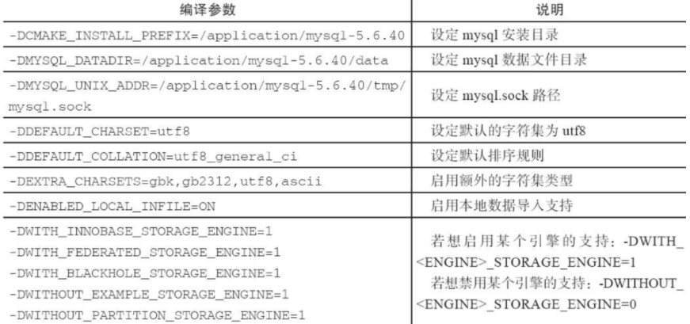
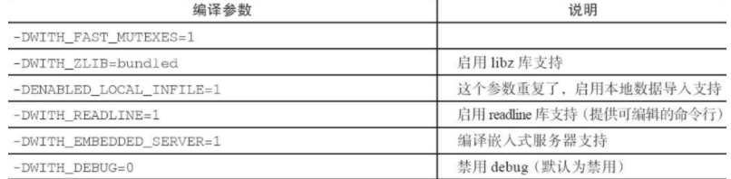

## MySQL特点

支持多种操作系统，Windows、MacOS、Linux等 支持多种语言API，如C、C++、Python、PHP、Java等 支持多线程、充分利用硬件资源 支持多种存储引擎

mysql就是一个基于socket编写的C/S架构的软件

客户端软件 　mysql自带：如mysql命令，mysqldump命令等 　　python模块：如pymysql

## MySQL服务端-客户端

B/S是**Browser/Server指浏览器和服务器端，**在客户机不需要装软件，只需要装一个浏览器。

C/S**是Client/Server指客户端和服务器，在客户机端必须装客户端软件及相应环境后，才能访问服务器**

MySQL是基于客户端-服务端的运行模式数据库，`服务端`负责数据处理，运行在数据库服务器上。

用户通过发送增删改查等请求，发送给`客户端软件`，然后通过网络提交请求给`服务端`，服务端接收到请求，再进行处理，然后返回。

> 服务端、客户端可以在不同的机器上，也可以在一台机器上。

这种服务端，客户端，就在生活里很常见，如打游戏时的登录，QQ、微信的登录，MySQL也是一个登录的过程。

## mysql下载

> 搜狐源: http://mirrors.sohu.com/mysql/

软件包解释

```perl
mysql-5.6.45.tar.gz

5 是主版本号
6 是发行级别，主版本号和发行级别组合，构成发行序列号
45 表示在此发行系列的一个版本，随着新版本发布，进行递增

例如
mysql-5.6.46.tar.gz
mysql-5.6.47.tar.gz
每次更新后，最后一个数字会递增
如果功能变化较大，字符串的第二个数字会递增，也就是如 5.7
如果软件格式大改动，第一个数字，主版本号会变化
```

## Centos7安装MySQL-5.6

- rpm
- yum
- 源码编译

### rpm方式：

rpm安装必须要提前准备好官网、第三方源提供好的rpm软件包，且无法满足定制化需求、编译参数、修改路径、依赖冲突问题，不建议使用。

### yum安装

```
yum install -y mysql
```

简单，无法定制化rpm包，可能yum源中版本较低，可以修改yum源头来解决

### CMAKE编译安装

> 编译命令

- make 读取makefile里面的指令，编译程序，makefile文件里调用gcc命令去编译源文件
- cmake命令也是一个编译命令，用于一些跨平台的编译设置

编译安装需要下载源码包、可以定制化编译参数，路径等信息，缺点就是对新手不友好。

#### 开始安装且配置mysql5.6

基础依赖

```
 yum install ncurses-devel libaio-devel 
 
 # 检查
[root@mysql-server56 ~]# rpm -qa ncurses-devel libaio-devel
libaio-devel-0.3.109-13.el7.x86_64
ncurses-devel-5.9-14.20130511.el7_4.x86_64
```

> mysql5.5之后需要用cmake命令编译

```
[root@mysql-server56 ~]# yum install cmake -y

[root@mysql-server56 ~]# rpm -qa cmake
cmake-2.8.12.2-2.el7.x86_64
```

> 创建用户

```perl
[root@mysql-server56 ~]# useradd -s /sbin/nologin -M mysql
[root@mysql-server56 ~]# id mysql
uid=1001(mysql) gid=1001(mysql) groups=1001(mysql)
```

#### 下载源码包

> 自行选择包版本

```
wget http://mirrors.sohu.com/mysql/MySQL-5.6/mysql-5.6.49.tar.gz

```

#### 解压安装mysql

编译参数解释

https://dev.mysql.com/doc/refman/5.6/en/source-configuration-options.html





> 编译代码

```
[root@docker01 data01]# tar xf mysql-5.6.34-linux-glibc2.5-x86_64.tar.gz 

cmake . -DCMAKE_INSTALL_PREFIX=/cmysql/mysql-5.6.49 \
-DMYSQL_DATADIR=/cmysql/mysql-5.6.49/data \
-DMYSQL_UNIX_ADDR=/cmysql/mysql-5.6.49/tmp/mysql.sock \
-DDEFAULT_CHARSET=utf8 \
-DDEFAULT_COLLATION=utf8_general_ci \
-DWITH_EXTRA_CHARSETS=all \
-DWITH_INNOBASE_STORAGE_ENGINE=1 \
-DWITH_FEDERATED_STORAGE_ENGINE=1 \
-DWITH_BLACKHOLE_STORAGE_ENGINE=1 \
-DWITHOUT_EXAMPLE_STORAGE_ENGINE=1 \
-DWITH_ZLIB=bundled \
-DWITH_SSL=bundled \
-DENABLED_LOCAL_INFILE=1 \
-DWITH_EMBEDDED_SERVER=1 \
-DENABLE_DOWNLOADS=1 \
-DWITH_DEBUG=0
```

