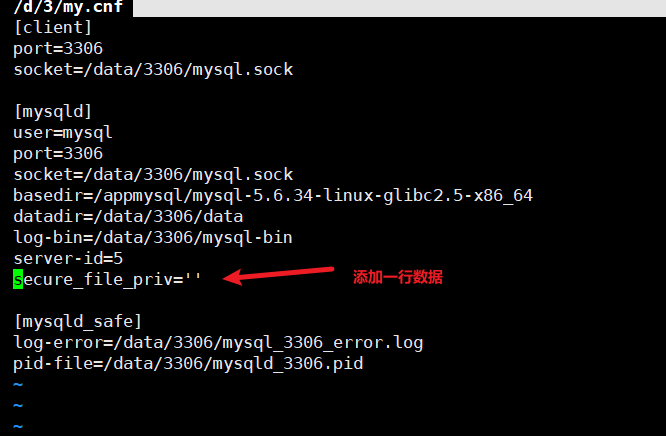
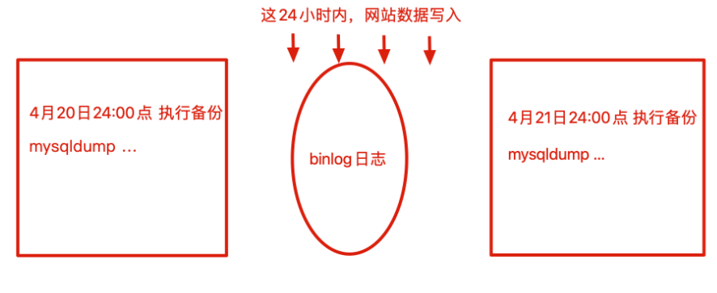
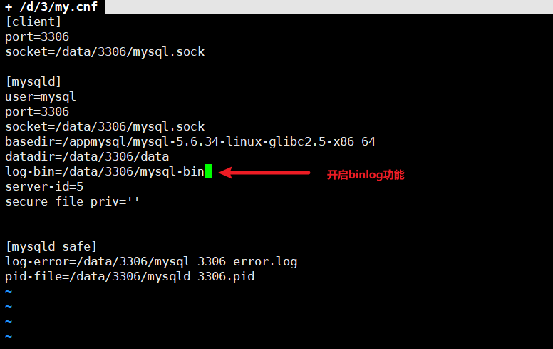
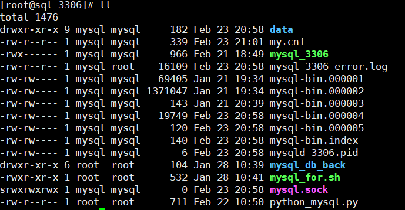
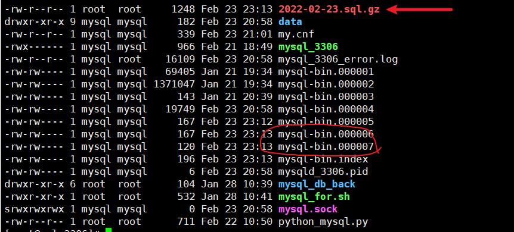
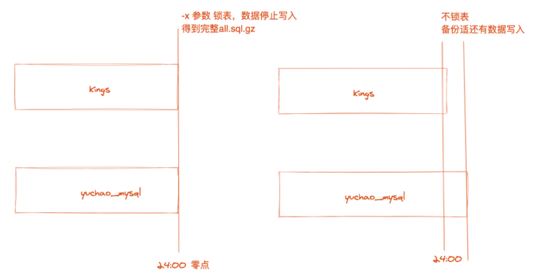

## MySQL备份

> mysqldump备份语法
>
> Mysqldump -u用户名 -p密码 参数 数据库名 > 数据备份文件
>
> 备份kings数据库

```perl
mysqldump -uroot -p1234 -P3306 -h127.0.0.1 -B kings > /opt/kings.sql
```

## 查看备份文件信息

```
#过滤掉无用信息
[root@sql opt]# egrep -v '#|\*|--|^$' /opt/king.sql 
```

备份的命令，导出的SQL语句，是相当于以后创建一个新的数据库，以及插入数据

为了恢复效率，mysqldump是把数据导出为数据插入语句

以及在插入数据的时候，lock tables锁表，数据插入结束后，解锁表

## 备份且压缩gzip

```
[root@sql opt]# mysqldump -uroot -p1234 -h127.0.0.1 -P3306 kings|gzip > /opt/kings.sql.gz
```

## mysqldump备份原理

mysqldump命令备份过程，实际上是把数据库、表，以SQL语句的形式，输出为文件的备份过程，这种方式称之为逻辑备份。

但是这种方式效率并不高，以SQL导出，在海量数据下，例如几十G的场景，备份、恢复的时间都会过长。

因此还会有其他备份方案。

## 备份多个库

```
[root@sql opt]# mysqldump -uroot -p1234 -P3306 -h127.0.0.1 -B cnblog kings test test01|gzip > /opt/more_db.sql.gz

```

- 备份命令，尽量携带 `-B`参数，会让sql更加完整
  - `-B`可以跟上多个数据库名，同时备份多个库
- 尽量结合gzip命令压缩

## 备份单个table

> 不能加-B参数

```
[root@sql opt]# mysqldump -uroot -p1234 -P3306 -h127.0.0.1 kings tanks > /opt/tanks.sql

#查看一下只针对tanks的数据表
[root@sql opt]# egrep -v "^#|\*|--|^$" /opt/tanks.sql
```

## 备份库中多个表

```
[root@sql opt]# mysqldump -uroot -p1234 -P3306 -h127.0.0.1 kings tanks heros > /opt/tanks_heros.sql
```

查看sql

```
[root@sql opt]# egrep -v "^#|--|\*|^$" /opt/tanks_heros.sql
```

通过sql看出

- 如果该表存在，则删除
- 创建table
- 锁表，防止数据写入
- 数据插入
- 解锁表

## 只备份table结构，不要数据

```
语法：
-d  (--no-data)
不写表的任何行信息。只想转储表的结构这很有用。
```

### 备份所有表结构

```
#备份kings库下面所有表结构
[root@sql opt]# mysqldump -uroot -p1234 -P3306 -h127.0.0.1 -d kings > /opt/king_struct.sql
```

### 单独备份表结构

```
[root@sql opt]# mysqldump -uroot -p1234 -P3306 -h127.0.0.1 -d kings tanks > /opt/tanks_struct.sql
```

## 只备份表数据，不要结构

```
语法
-t （--no-create-info）
不写重新创建每个转储表的CREATE TABLE语句。
```

### 备份所有表数据

```
[root@sql opt]# mysqldump -uroot -p1234 -P3306 -h127.0.0.1 -t kings > /opt/kings_data.sql
```

### 单独备份表数据

```
[root@sql opt]# mysqldump -uroot -p1234 -P3306 -h127.0.0.1 -t kings tanks > /opt/tanks_data.sql
```

## 分离结构--数据备份

> --compact 减少无用输出信息
> -T 分离数据为纯文本，结构为SQL

```
[root@sql opt]# mysqldump -uroot -p1234 -P3306 -h127.0.0.1 kings tanks --compact -T /tmp
```

报错了，是因为`--secure-file-priv option`，因为安全机制，不允许执行，可以修改参数

```
mysql> show global variables like '%secure_file_priv%';
+------------------+-------+
| Variable_name    | Value |
+------------------+-------+
| secure_file_priv | NULL  |
+------------------+-------+
1 row in set (0.00 sec)

# 这里想用set命令，临时修改变量值
mysql> set global secure_file_priv='';
ERROR 1238 (HY000): Variable 'secure_file_priv' is a read only variable
# 但是因为是只读参数，禁止修改，只能修改配置文件，重启程序
```

修改配置文件重启

```
vim /data/3306/my.cnf
```



```

[root@sql opt]# /data/3306/mysql_3306 restart

[root@sql opt]# mysqldump -uroot -p1234 -P3306 -h127.0.0.1 kings tanks --compact -T /tmpWarning: Using a password on the command line interface can be insecure.

#查看结果
cat /tmp/tank.sql
cat /tmp/tank.txt
```

## 小结

> -d 只备份库表结构，sql导出

> -t 只备份表数据，sql导出

> -T 分离数据、结构

## binlog

Binlog是一个二进制格式的文件，用于`记录用户对数据库更新的SQL语句信息`，例如`更改数据库库表`和`更改表内容的SQL语句`都会记录到binlog里，但是对库表等内容的查询则不会记录到日志中。

### binlog的作用

当有数据写入到数据库时，还会同时把`更新的SQL语句`写入到对应的binlog文件里，这个文件就是上文所说的binlog文件。

> 使用mysqldump备份时，例如我们一般会写crontab，例如夜里0点整，进行数据库备份。

### 使用binlog的背景

问题是，每天只有到0点整才进行备份，那未备份之前，也就是两次数据库备份的间隔是24小时。

一旦在这个期间发生故障，那么数据此时就是丢失的，即使使用mysqldump的备份，也只能找回当日0点的数据。

> 使用binlog功能，可以解决该问题

使用binlog文件，可以将两次完整备份间隔之间的数据还原

因为binlog文件的数据就是，写入数据库的数据

因此可以使用binlog来恢复数据，这种方式称之为二进制增量数据恢复



### 切割binlog

切割binlog作用是很有必要的

因为要确定，全量备份mysqldump和增量备份binlog的一个临界点。

当全量备份完成之后，上一次的binlog文件就没有作用了（因为此时的mysqldump全量备份，导出的数据已经包含了上一次的binlog数据）

下一次的全量备份中间的数据依然很重要，就还得存储在binlog文件里

因此需要要求，mysqldump的全量备份数据，和binlog的数据确定临界点

- binlog不能和mysqldump重复
- binlog和mysqldump也不能丢失

### 开启binlog

开启binlog功能，只需要配置文件，添加参数`log_bin`



### -F参数切割binlog日志

> -F 参数用于mysqldump全量备份后立即对binlog日志文件切割，生成一个新日志文件，且重新记录binlog日志，用于将来增量恢复，从新的binlog日志文件开始

### binlog实践

思路

- 目前现有的备份，还是4月20日24:00点的全量备份
- 但是还好我们开启了binlog功能

解决办法

- 先恢复4月20日24:00的全量数据
- 再恢复4月20日24:00到4月21日10:00之间的binlog数据

> 使用-F参数

此时mysql3306实例下现有的数据文件有：



执行mysqldump -F参数

```
[root@sql 3306]# mysqldump -uroot -p1234 -P3306 -h127.0.0.1 -F -B kings|gzip > /data/3306/$(date +%F).sql.gz
Warning: Using a password on the command line interface can be insecure.
```



> 利用 -F 参数切割出了新的binlog文件

### --master-data

-F参数，是给mysqldump提供的切割binlog，但是这也需要不断的执行，不断的切割

mysqldump也提供了`--master-data`参数，能够在备份的SQL文件中，添加`CHANGE MASTER`语句，以及`binlog`文件的`pos`位置，也就是记录数据的写入位置。

参数解释

```perl
--master-data[=value]
该选项将二进制日志的位置和文件名写入到输出中。该选项要求有RELOAD权限，并且必须启用二进制日志。
如果该选项值等于1，位置和文件名被写入CHANGE MASTER语句形式的转储输出，如果你使用该SQL转储主服务器以设置从服务器，从服务器从主服务器二进制日志的正确位置开始。
如果选项值等于2，CHANGE MASTER语句被写成SQL注释。
如果value被省略，这是默认动作。
```

实践

```
[root@sql 3306]# mysqldump -uroot -p1234 -P3306 -h127.0.0.1 --master-data=1 kings --compact > /data/3306/master-data.sql
Warning: Using a password on the command line interface can be insecure.

[root@sql 3306]# mysqldump -uroot -p1234 -P3306 -h127.0.0.1 --master-data=2 kings --compact > /data/3306/master-data.sql2
Warning: Using a password on the command line interface can be insecure.

```

区别

```
[root@sql 3306]# head -1 master-data.sql
CHANGE MASTER TO MASTER_LOG_FILE='mysql-bin.000007', MASTER_LOG_POS=120;

[root@sql 3306]# head -1 master-data.sql2
-- CHANGE MASTER TO MASTER_LOG_FILE='mysql-bin.000007', MASTER_LOG_POS=120;
```

作用

> 该参数主要是用于在mysql基于binlog的数据主从复制

### -x参数

既然是数据备份，比如说淘宝网的数据库要进行全量备份，但是例如在24:00整点，还有人在写入数据，那就无法保证数据的一致性。

因此得在备份时，将表锁住，防止数据写入，得到一个完整的数据备份，也就是24:00停止所有写入操作。



## mysqldump常用参数

> https://www.jianshu.com/p/18db0fbb02b8

## 恢复数据

### source

srouce命令可以恢复数据库数据，就是在mysql中，重新执行SQL语句。

> 备份方式

```perl
# 进入到数据库
mysql > use kings;

# 恢复数据
mysql > source /opt/kings.sql
```

## 快捷执行sql

不登陆mysql执行查看结果 

> -e 参数

```
[root@sql 3306]# mysql -uroot -p1234 -P3306 -h127.0.0.1 -e 'select database();'
Warning: Using a password on the command line interface can be insecure.
+------------+
| database() |
+------------+
| NULL       |
+------------+
```

### 查看SQL线程执行状态

> 检查mysql慢查询问题,哪些sql执行的很耗时

```
[root@sql 3306]# mysql -uroot -p1234 -P3306 -h127.0.0.1 -e 'show full processlist'
Warning: Using a password on the command line interface can be insecure.
+----+------+-----------------+------+---------+------+-------+-----------------------+
| Id | User | Host            | db   | Command | Time | State | Info                  |
+----+------+-----------------+------+---------+------+-------+-----------------------+
|  8 | root | localhost:53868 | NULL | Query   |    0 | init  | show full processlist |
+----+------+-----------------+------+---------+------+-------+-----------------------+
```

## mysqlbinlog命令

> http://linux.51yip.com/search/mysqlbinlog

该命令用于解析binlog日志文件的内容

```
参数
-d 指定数据库
-r 输出到文件

# 如果直接查看文件是二进制形式的，是无法查看的
[root@sql 3306]# tail -1 mysql-bin.000002

[root@sql 3306]# mysqlbinlog -d kings mysql-bin.000002 -r mysql-bin.000002.sql

[root@sql 3306]#cat mysql-bin.000002.sql
```

