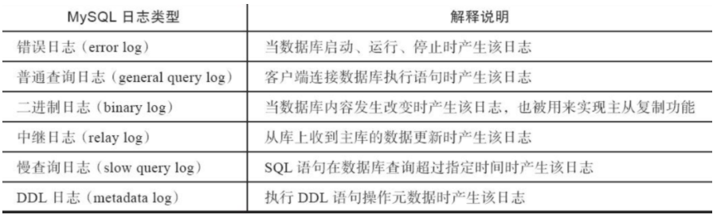
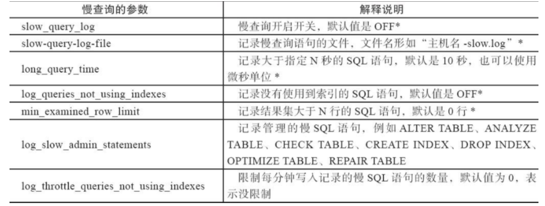

## 日志

> 日志作用：收集，检测程序的健康



默认日志大部分都未开启，通过配置文件，开启，定制路径

> mysql日志文件的作用：

1、能记录物理数据页面的修改的信息；

2、能将数据从逻辑上恢复至事务之前的状态；

3、能以二进制文件的形式记录了数据库中的操作；

4、能记录错误的相关信息；

5、能从主服务器中二进制文件取的事件等等。

## 普通日志

记录了服务器接收到的每一个查询或是命令，无论这些查询或是命令是否正确甚至是否包含语法错误，general log 都会将其记录下来 ，记录的格式为 {Time ，Id ，Command，Argument }。

也正因为mysql服务器需要不断地记录日志，开启General log会产生不小的系统开销。 因此，Mysql默认是把General log关闭的。

```
mysql> show variables like 'general_log%';
+------------------+------------------------------------+
| Variable_name    | Value                              |
+------------------+------------------------------------+
| general_log      | OFF                                |
| general_log_file | /data/3306/data/mysql-server56.log |
+------------------+------------------------------------+
2 rows in set (0.00 sec)
```

> 可以开启该功能，命令临时修改

```perl
mysql> set global general_log = on;
Query OK, 0 rows affected (0.00 sec)

mysql> set global general_log = on;
Query OK, 0 rows affected (0.00 sec)

mysql> show variables like 'general_log%';
+------------------+------------------------------------+
| Variable_name    | Value                              |
+------------------+------------------------------------+
| general_log      | ON                                 |
| general_log_file | /data/3307/data/mysql-server56.log |
+------------------+------------------------------------+
2 rows in set (0.00 sec)
```

> 可以永久开启生效

```perl
# 修改/data/3306/my.cnf

[mysqld]
user=mysql
port=3306
socket=/data/3306/mysql.sock
basedir=/application/mysql-5.6.40-linux-glibc2.12-x86_64/
datadir=/data/3306/data
log-bin=/data/3306/mysql-bin
server-id=6
secure_file_priv=''
general_log=on
general_log_file=/data/3306/data/mysql-server56.log
```

> 重启mysql查看

```perl
[root@mysql-server56 ~]# /data/3306/mysql_3306 restart
Restarting MySQL...
Stoping MySQL...
Starting MySQL...
[root@mysql-server56 ~]#
```

## 二进制日志binlog

binlog是记录数据库被修改的SQL语句，对数据造成影响了。

一般是DDL和DML语句，包含

- insert
- update
- delete
- create
- drop
- alter
- 等关键字

### 作用

- 记录mysql数据的增量数据，且用来做增量数据恢复，

- 用在主从数据复制

### 查看binlog

```

[mysqld]
user=mysql
port=3307
socket=/data/3307/mysql.sock
basedir=/application/mysql-5.6.40-linux-glibc2.12-x86_64/
datadir=/data/3307/data
log-bin=/data/3307/mysql-bin        # 二进制日志开启
server-id=6
secure_file_priv=''
# 关掉普通日志
#general_log=on
#general_log_file=/data/3307/data/mysql-server56.log
```

重启mysql,查看日志

```
 mysql -uroot -pyuchao7777 -P3307 -h127.0.0.1 -e "show variables like 'log_bin';"
Warning: Using a password on the command line interface can be insecure.
+---------------+-------+
| Variable_name | Value |
+---------------+-------+
| log_bin       | ON    | # 记录binlog开关
+---------------+-------+

 mysql -uroot -pyuchao7777 -P3307 -h127.0.0.1 -e "show variables like '%log_bin';"
Warning: Using a password on the command line interface can be insecure.
+---------------+-------+
| Variable_name | Value |
+---------------+-------+
| log_bin       | ON    | # 记录binlog开关
| sql_log_bin   | ON    | # 临时关闭binlog开关
```

### 临时关闭binlog

作用在于用户进行数据恢复的时候，某些SQL（例如恢复的SQL语句）不希望被记录到binlog，可以临时关闭binlog的记录。

```
[root@mysql-server56 ~]# mysql -uroot -pyuchao7777 -P3307 -h127.0.0.1
Warning: Using a password on the command line interface can be insecure.
Welcome to the MySQL monitor.  Commands end with ; or \g.
Your MySQL connection id is 6
Server version: 5.6.40-log MySQL Community Server (GPL)

Copyright (c) 2000, 2018, Oracle and/or its affiliates. All rights reserved.

Oracle is a registered trademark of Oracle Corporation and/or its
affiliates. Other names may be trademarks of their respective
owners.

Type 'help;' or '\h' for help. Type '\c' to clear the current input statement.

mysql> set session sql_log_bin = OFF;
Query OK, 0 rows affected (0.00 sec)

mysql> show variables like '%log_bin';
+---------------+-------+
| Variable_name | Value |
+---------------+-------+
| log_bin       | ON    |
| sql_log_bin   | OFF   |
+---------------+-------+
2 rows in set (0.00 sec)

# 查看当前的binlog记录状态
mysql> show binary logs;
+------------------+-----------+
| Log_name         | File_size |
+------------------+-----------+
| mysql-bin.000001 |       167 |
| mysql-bin.000002 |       167 |
| mysql-bin.000003 |      7818 |
| mysql-bin.000004 |       143 |
| mysql-bin.000005 |       143 |
| mysql-bin.000006 |      1069 |
| mysql-bin.000007 |       143 |
| mysql-bin.000008 |       355 |
| mysql-bin.000009 |       120 | # 最新的binlog文件，以及数据的位置在哪
+------------------+-----------+
9 rows in set (0.00 sec)

# 也可以直接看最新的binlog
mysql> show master status;
+------------------+----------+--------------+------------------+-------------------+
| File             | Position | Binlog_Do_DB | Binlog_Ignore_DB | Executed_Gtid_Set |
+------------------+----------+--------------+------------------+-------------------+
| mysql-bin.000009 |      120 |              |                  |                   |
+------------------+----------+--------------+------------------+-------------------+
1 row in set (0.00 sec)
```

> 测试写入数据，查看binlog是否变化

```perl
mysql> create database yuyu;
Query OK, 1 row affected (0.00 sec)

# 没有变化
mysql> show master status;
+------------------+----------+--------------+------------------+-------------------+
| File             | Position | Binlog_Do_DB | Binlog_Ignore_DB | Executed_Gtid_Set |
+------------------+----------+--------------+------------------+-------------------+
| mysql-bin.000009 |      120 |              |                  |                   |
+------------------+----------+--------------+------------------+-------------------+
1 row in set (0.00 sec)
```

> 再开启binlog，发现binlog已经有了变化，因为我们又写入了新的数据

```perl
mysql> set session sql_log_bin=on;
Query OK, 0 rows affected (0.00 sec)

mysql> create database yuyu2;
Query OK, 1 row affected (0.00 sec)

mysql> show master status;
+------------------+----------+--------------+------------------+-------------------+
| File             | Position | Binlog_Do_DB | Binlog_Ignore_DB | Executed_Gtid_Set |
+------------------+----------+--------------+------------------+-------------------+
| mysql-bin.000009 |      217 |              |                  |                   |
+------------------+----------+--------------+------------------+-------------------+
1 row in set (0.00 sec)


# 删除动作，也会被binlog记录
mysql> drop database yuyu;
Query OK, 0 rows affected (0.00 sec)

mysql> drop database yuyu2;
Query OK, 0 rows affected (0.01 sec)

mysql> show master status;
+------------------+----------+--------------+------------------+-------------------+
| File             | Position | Binlog_Do_DB | Binlog_Ignore_DB | Executed_Gtid_Set |
+------------------+----------+--------------+------------------+-------------------+
| mysql-bin.000009 |      389 |              |                  |                   |
+------------------+----------+--------------+------------------+-------------------+
1 row in set (0.00 sec)
```

### 自动刷新binlog

binlog上面会发现有很多文件，这是因为

- 数据库重启，会自动切割新的binlog
- 执行`mysqldump -F`或者`mysqladmin flush-logs`都会刷新binlog
- binlog达到1G时，自动刷新binlog

> 查看binlog最大值

```perl
mysql> show variables like 'max_binlog_size';
+-----------------+------------+
| Variable_name   | Value      |
+-----------------+------------+
| max_binlog_size | 1073741824 |
+-----------------+------------+
1 row in set (0.00 sec)
```

### 二进制binlog索引文件

```perl
[root@mysql-server56 ~]# ls -l /data/3307/mysql-bin.*
-rw-rw---- 1 mysql mysql  167 Apr 20 20:55 /data/3307/mysql-bin.000001
-rw-rw---- 1 mysql mysql  167 Apr 20 20:55 /data/3307/mysql-bin.000002
-rw-rw---- 1 root  root   775 Apr 20 22:30 /data/3307/mysql-bin.000002.sql
-rw-rw---- 1 mysql mysql 7818 Apr 21 15:14 /data/3307/mysql-bin.000003
-rw-rw---- 1 mysql mysql  143 Apr 21 15:16 /data/3307/mysql-bin.000004
-rw-rw---- 1 mysql mysql  143 Apr 21 19:22 /data/3307/mysql-bin.000005
-rw-rw---- 1 mysql mysql 1069 Apr 21 22:08 /data/3307/mysql-bin.000006
-rw-rw---- 1 mysql mysql  143 Apr 22 10:31 /data/3307/mysql-bin.000007
-rw-rw---- 1 mysql mysql  355 Apr 22 11:03 /data/3307/mysql-bin.000008
-rw-rw---- 1 mysql mysql  389 Apr 22 11:26 /data/3307/mysql-bin.000009
-rw-rw---- 1 mysql mysql  252 Apr 22 11:03 /data/3307/mysql-bin.index
```

该文件用于记录binlog的索引号

```perl
[root@mysql-server56 ~]# cat /data/3307/mysql-bin.index
/data/3307/mysql-bin.000001
/data/3307/mysql-bin.000002
/data/3307/mysql-bin.000003
/data/3307/mysql-bin.000004
/data/3307/mysql-bin.000005
/data/3307/mysql-bin.000006
/data/3307/mysql-bin.000007
/data/3307/mysql-bin.000008
/data/3307/mysql-bin.000009
```

### 清除binlog

binlog日志也是需要删除的、如当全量备份后，之前的binlog也就无用了，一般我们会保留3~7天的binlog，通过mysql自带参数保留。

```perl
[root@mysql-server56 ~]# mysql -uroot -pyuchao7777 -P3307 -h127.0.0.1
Warning: Using a password on the command line interface can be insecure.
Welcome to the MySQL monitor.  Commands end with ; or \g.
Your MySQL connection id is 8
Server version: 5.6.40-log MySQL Community Server (GPL)

Copyright (c) 2000, 2018, Oracle and/or its affiliates. All rights reserved.

Oracle is a registered trademark of Oracle Corporation and/or its
affiliates. Other names may be trademarks of their respective
owners.

Type 'help;' or '\h' for help. Type '\c' to clear the current input statement.

mysql> show variables like 'expire_logs_days';
+------------------+-------+
| Variable_name    | Value |
+------------------+-------+
| expire_logs_days | 0     |
+------------------+-------+
1 row in set (0.00 sec)

mysql> set global expire_logs_days=7;
Query OK, 0 rows affected (0.00 sec)


# 或者写入配置文件也可以 my.cnf
```

### 删除binlog

超哥强烈不推荐直接删除binlog数据文件，而应该根据生产的需求，用命令删除binlog

> 删除binlog命令，删除到某一个文件停止

```perl
mysql> show binary logs;
+------------------+-----------+
| Log_name         | File_size |
+------------------+-----------+
| mysql-bin.000001 |       167 |
| mysql-bin.000002 |       167 |
| mysql-bin.000003 |      7818 |
| mysql-bin.000004 |       143 |
| mysql-bin.000005 |       143 |
| mysql-bin.000006 |      1069 |
| mysql-bin.000007 |       143 |
| mysql-bin.000008 |       355 |
| mysql-bin.000009 |       389 |
+------------------+-----------+
9 rows in set (0.00 sec)

mysql>
mysql>
mysql> purge binary logs to 'mysql-bin.000003';
Query OK, 0 rows affected (0.01 sec)

mysql> show binary logs;
+------------------+-----------+
| Log_name         | File_size |
+------------------+-----------+
| mysql-bin.000003 |      7818 |
| mysql-bin.000004 |       143 |
| mysql-bin.000005 |       143 |
| mysql-bin.000006 |      1069 |
| mysql-bin.000007 |       143 |
| mysql-bin.000008 |       355 |
| mysql-bin.000009 |       389 |
+------------------+-----------+
7 rows in set (0.00 sec)
```

> 根据时间戳删除binlog，例如删除某 年月日 时分秒的 binlog

```perl
# 当前的时间戳
[root@mysql-server56 ~]# ls -l --time-style=long-iso  /data/3307/mysql-bin.*
-rw-rw---- 1 root  root   775 2021-04-20 22:30 /data/3307/mysql-bin.000002.sql
-rw-rw---- 1 mysql mysql 7818 2021-04-21 15:14 /data/3307/mysql-bin.000003
-rw-rw---- 1 mysql mysql  143 2021-04-21 15:16 /data/3307/mysql-bin.000004
-rw-rw---- 1 mysql mysql  143 2021-04-21 19:22 /data/3307/mysql-bin.000005
-rw-rw---- 1 mysql mysql 1069 2021-04-21 22:08 /data/3307/mysql-bin.000006
-rw-rw---- 1 mysql mysql  143 2021-04-22 10:31 /data/3307/mysql-bin.000007
-rw-rw---- 1 mysql mysql  355 2021-04-22 11:03 /data/3307/mysql-bin.000008
-rw-rw---- 1 mysql mysql  389 2021-04-22 11:26 /data/3307/mysql-bin.000009
-rw-rw---- 1 mysql mysql  196 2021-04-22 11:41 /data/3307/mysql-bin.index
```

> 删除2021-04-21 23:00之前的binlog

```perl
mysql> purge master logs before '2021-04-21 23:00';
Query OK, 0 rows affected (0.01 sec)

[root@mysql-server56 ~]# ls -l --time-style=long-iso  /data/3307/mysql-bin.*
# 这个sql文件和binlog无关，是根据mysql-bin.index来查找的
-rw-rw---- 1 root  root  775 2021-04-20 22:30 /data/3307/mysql-bin.000002.sql
-rw-rw---- 1 mysql mysql 143 2021-04-22 10:31 /data/3307/mysql-bin.000007
-rw-rw---- 1 mysql mysql 355 2021-04-22 11:03 /data/3307/mysql-bin.000008
-rw-rw---- 1 mysql mysql 389 2021-04-22 11:26 /data/3307/mysql-bin.000009
-rw-rw---- 1 mysql mysql  84 2021-04-22 11:50 /data/3307/mysql-bin.index
```

> 清除所有的binlog，重新记录

```perl
mysql> reset master;
Query OK, 0 rows affected (0.02 sec)


# 重新从01记录
[root@mysql-server56 ~]# cat /data/3307/mysql-bin.index
/data/3307/mysql-bin.000001
```

## 慢查询日志

慢查询日志（slow query log）用于记录执行时间拆过指定值（long_query_time）或者没有使用索引、结果集大于1000行的SQL语句。

### 慢日志参数



慢查询参数调整，是数据库SQL优化重要手段

修改my.cnf

```perl
[mysqld]
user=mysql
port=3307
socket=/data/3307/mysql.sock
basedir=/application/mysql-5.6.40-linux-glibc2.12-x86_64/
datadir=/data/3307/data
log-bin=/data/3307/mysql-bin
server-id=6
secure_file_priv=''
#general_log=on
#general_log_file=/data/3307/data/mysql-server56.log
# slow-log
slow-query-log = ON                        #<==慢查询开启开关
long_query_time = 2                        #<==记录大于2秒的SQL语句。
log_queries_not_using_indexes = ON         #<==没有使用到索引的SQL语句。
slow-query-log-file = /data/3307/slow.log  #<==记录SQL语句的文件。
min_examined_row_limit = 800               #<==记录结果集大于800行的SQL语句。

# 重启
[root@mysql-server56 ~]# /data/3307/mysql_3307 restart
Restarting MySQL...
Stoping MySQL...
Starting MySQL...
```

### 检查参数

```perl
[root@mysql-server56 ~]# mysql -uroot -pyuchao7777 -P3307 -h127.0.0.1 -e "show variables like '%slow_query%'"
Warning: Using a password on the command line interface can be insecure.
+---------------------+---------------------+
| Variable_name       | Value               |
+---------------------+---------------------+
| slow_query_log      | ON                  | # 开关
| slow_query_log_file | /data/3307/slow.log | # 慢日志位置
+---------------------+---------------------+


[root@mysql-server56 ~]# mysql -uroot -pyuchao7777 -P3307 -h127.0.0.1 -e "show variables like '%long_query%'"
Warning: Using a password on the command line interface can be insecure.
+-----------------+----------+
| Variable_name   | Value    |
+-----------------+----------+
| long_query_time | 2.000000 |    # 超过2秒的查询
+-----------------+----------+


[root@mysql-server56 ~]# mysql -uroot -pyuchao7777 -P3307 -h127.0.0.1 -e "show variables like '%log_queries_not%'"
Warning: Using a password on the command line interface can be insecure.
+-------------------------------+-------+
| Variable_name                 | Value |
+-------------------------------+-------+
| log_queries_not_using_indexes | ON    |    # 记录没有使用索引的查询
+-------------------------------+-------+


[root@mysql-server56 ~]# mysql -uroot -pyuchao7777 -P3307 -h127.0.0.1 -e "show variables like '%min_examined_row_limit%'"
Warning: Using a password on the command line interface can be insecure.
+------------------------+-------+
| Variable_name          | Value |
+------------------------+-------+
| min_examined_row_limit | 800   |    # 查询结果集大于800行的SQL
+------------------------+-------+
```

### 慢日志切割脚本

慢日志此时已经能够被记录，且写入文件，问题是，如果该日志文件产生的信息过多，毕然要针对该日志文件，进行切割处理。

```perl
[root@mysql-server56 mysql_script]# cat cut_slow_log.sh
#!/bin/bash
cd /data/3307/ && mv slow.log slow.log.$(date +%F) && mysqladmin  -uroot -pyuchao7777 -P3307 -h127.0.0.1 flush-log
[root@mysql-server56 mysql_script]#
```

脚本执行结果

```perl
[root@mysql-server56 mysql_script]# bash cut_slow_log.sh
Warning: Using a password on the command line interface can be insecure.

[root@mysql-server56 mysql_script]# ls /data/3307/slow.log*
/data/3307/slow.log  /data/3307/slow.log.2021-04-22
```