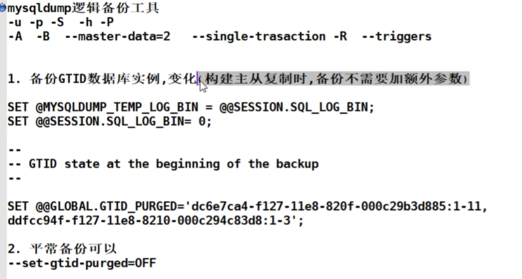

## 备份工具

### mysqldump逻辑备份

配合binlog使用

-P 链接数据库端口号

-p 链接数据库密码

-A 备用所有数据库

-B 备份多个库

--master-data=1/2  1：写成转储输出 2：写成sql注释

-t 只要数据




### xtrabackup物理备份

--user 

--password

--host

--no-timestamp

--incremental-basedir  指定基于谁来做增量

--incremental  开启增量得功能

--incremental-dir   恢复之前进行合并得时候进行增量备份

--apply-log 准备备份，进行reload前滚和unload回滚

--redo-only 增量备份得时候，最后一次不需要加这个参数，之前都需要加这个参数

### 主从复制

### 1.原理：

线程：

主库: 

​	dump(io)thread(投递线程)：主库发从二进制日志给从库的线程

从库：

​	io thread：请求binlog,接收binlog的线程

​	sql thread: 执行relay日志的线程


1.数据库有个bin-log二进制文件，记录了所有sql语句。

2.我们的目标就是把主数据库的bin-log文件的sql语句复制过来。

3.让其在从数据的relay-log重做日志文件中再执行一次这些sql语句即可。

4.下面的主从配置就是围绕这个原理配置

5.具体需要三个线程来操作：

1.binlog输出线程:每当有从库连接到主库的时候，主库都会创建一个线程然后发送binlog内容到从库。

在从库里，当复制开始的时候，从库就会创建两个线程进行处理：

2.从库I/O线程:当START SLAVE语句在从库开始执行之后，从库创建一个I/O线程，该线程连接到主库并请求主库发送binlog里面的更新记录到从库上。从库I/O线程读取主库的binlog输出线程发送的更新并拷贝这些更新到本地文件，其中包括relay log文件。

3.从库的SQL线程:从库创建一个SQL线程，这个线程读取从库I/O线程写到relay log的更新事件并执行。

可以知道，对于每一个主从复制的连接，都有三个线程。拥有多个从库的主库为每一个连接到主库的从库创建一个binlog输出线程，每一个从库都有它自己的I/O线程和SQL线程。


1.主库db的更新事件(update、insert、delete)被写到binlog

2.从库发起连接，连接到主库

3.此时主库创建一个binlog dump thread线程，把binlog的内容发送到从库

4.从库启动之后，创建一个I/O线程，读取主库传过来的binlog内容并写入到relay log.

5.还会创建一个SQL线程，从relay log里面读取内容，从Exec_Master_Log_Pos位置开始执行读取到的更新事件，将更新内容写入到slave的db.

### 2.故障

> io:

机房断电，存二进制日志的磁盘坏掉了，日志丢了，主从复制io线程异常，重新搭建

> sql:

开发人员误登录从库，sql

> 主从延时：

sql语句执行的慢。。架构设计有一些出入，从库太多，多级主从架构。。

> 3.主从复制监控:

传统监控：监控pos位置 ，从库relaylog和binlog日志的对应关系

gtid：来多少，运行多少都好监控

> 监控到没有同步完成怎么办？

没有同步完说明主从架构有延时

### 3.高可用架构

主备系统：

MHA原理：

1.从库slave宕机崩溃的master保存二进制日志事件(binlog events);

2.识别含有最新的slave;

3.应用差异的中继日志(relay log)

4.应用从master保存的二进制日志事件(binlog events);

5.提升一个新的slave为新的master

6.使用其他的slave链接新的master进行复制。

故障处理：

节点修复好，恢复主从关系，把加到配置文件里面

> 多活系统

MGR(5.7)

PXC(percona)

### 4.高性能架构

读写分离：atlas,proxysql


分布式架构: mycat----->dble(衍生品)

### 5.redis缓存技术

数据类型：5种 

string ：访问量，点击量，应用游戏

hash：数据库缓存，将mysql数据库灌入到redis中

list：朋友圈，抖音，微博

set：在b站里将一个up主得所有粉丝存在一个集合中

sortset：排行榜应用

高可用：sentinel(哨兵)

集群：cluster(集群)

缓存穿透，缓存击穿，缓存雪崩

## 结构体系及基础管理

**MySQL有哪些安装方式？**

```
centos: 
生产环境常用二进制安装(绿色版本直接安装)
rpm(yum)
源码编译安装(适合二次开发)
```

**MySQL5.6、5.7安装过程有什么区别？**

```
初始化：
	5.6: /data/mysql/scripts/mysql_install_db
	5.7: mysqld --initialize-insercure  初始化后生成一个无密码管理用户
		 mysqld --initialize			生成一个随机密码，要修改使用管理数据库
```

**MySQL5.7、8.0在用户管理有什么区别，请举例说明？**

```
8.0之前：
	用户管理：
		1. create user yzh@'10.0.0.%' identified by '1234';
		2. grant all on *.* to yzh@'10.0.0.%';
		或者
		grant all on *.* to yzh@'10.0.0.%' identified by '1234';
8.0以后:
		1.只能先建用户后授权
		2.加密方式：从native插件方式改为sha2加密插件。远程客户端、主从MHA架构等
```

**请介绍MySQL授权表有哪些，都有什么作用？**

```
user :用户名，密码，加密插件，全库级别的用户权限。
db : 单库级别
```

**简述你在工作中MySQL远程连接的方式？**

```
管理：
mysql -uroot -p
mysql -uroot -p -h10.0.0.66 -P3306 

开发：
navicat
sqlyog
```

**请列举MySQL配置文件的读取顺序？**

```
mysqld --help --verbose | grep my.cnf

/etc/my.cnf
/etc/mysql/my.cnf 
/usr/local/mysql/etc/my.cnf
~/.my.cnf

从上到下依次读取，有重复的，以最后一个读取为准

免密登录设置
家目录下
[root@sql ~]# cat .my.cnf
[client]
user=root
password=1234
```

**请简述MySQL配置文件结构？列举至少5项基础配置项？**

```
server:[mysqld]  [mysqld_safe]  [server]
client:[msyql]  [mysqldump]  [client]

user=mysql
basedir=/data/3306/mysql #软件目录
datadir=/data/3306/data  #数据路径
server_id=6				
log_error=/data/3306/mysql.log
socket=/data/3306/mysql.sock
```

**请列举MySQL的启动和关闭方式？**

```
启动 sys-v systemd support-fils/mysql.server > mysqld_safe ->mysqld
关闭 sys -v systemd support-fils/mysql.server shutdown mysqladmin shutdown
```

**请简述MySQL忘记本地root密码的处理方法和其中的原理？**

```
1.关闭数据库
2.启动到安全模式：mysqld_safe --skip-grant-tables --skip-networking &
3.flush privileges; grant\ alter \ set password
4.重启数据库

原理：
主要考察连接层主要提供用户的验证功能和一些协议socket，tcp/ip连接串协议
--skip-grant-tables    跳过授权表
--skip-networking &    关闭远程链接功能
所以说要这两个功能在链接层做一些手脚可以进行免密登录

或者(简单方法)：
mysqladmin -uroot -h127.0.0.1 -P3306 -p password
```

**你们公司使用多实例环境吗？在什么地方用的？**

```
1.测试环境
2.分布式架构
3.备用系统

一般公司都会使用多实例，例如一台服务器坏掉可以快速更换免得更换服务器
```

**如何查看数据库当前连接情况？**

```
show full processlist;

select * from information_schema.processlist\G;
```

**简述数据库启动不了，你的排查过程？**

```
查看进程
端口

查看日志log_error

手动启动日志
mysqld --defaults-file=/etc/my.cnf &
```

**升级至5.7、8.0，升级方式上有什么区别？8.0要注意什么？**

```
区别：升级至5.7，需要执行mysql_upgrade，升级到8.0，直接用高版本软件挂载低版本库启动。
升级到8.0以前，一定要提前备份。
升级时候建议，不要跨多版本。5.6最新版升级到5.7，5.7最新版升级到8.0
在linux中执行如下命令，检查升级需要哪些操作
mysqlsh  root:123@10.0.0.51:3306  -e  “until.checkForServerUpgrade()”
```

**mysql查询表中数据中文字体乱码，原因可能是什么？如何修改？**

```
字符集问题
一般是客户端软件的字符集和服务器端不一致。

在my.cnf配置文件中
加入character_set_server=utf8mb4
set names utf8mb4;
替换字符集：逻辑导出数据，库alter,替换备份中的字符集，导入数据。
```

**什么是实例？**

```
公司=boss+经理+员工+办公室
实例=mysqld+master  thread +干活的 thread  +内部结构
```

**简述MySQL的程序结构？**

```
Mysqld=server层（连接层+SLQ层）+存储引擎层

连接层：
连接协议
验证
连接线程

SQL层：
语法、语义、权限
解析，预处理
优化
执行
日志记录

存储引擎层：
文件系统数据读写
锁
事务
MVCC
自动故障恢复
ACID
```

**请简述MySQL的逻辑结构和宏观物理结构？**

```
逻辑：
库
表
宏观：
Myisam:myi  myd  frm
InnoDB:ibd、frm、ibdata、ibtmp、undo、redo
```

**请简述段、区、页的构成？**

```
段：一个表就是一个段（分区表除外）
区：簇。一个区连续64个页。默认是1M
页：page。默认是16K，连续4个os block
```

## SQL

**请简述select语句的各个子句的执行顺序？**

```
select from where group by having order by limit
```

**请列举SQL语句的种类和代表命令？**

```
ddl数据定义: create database/table drop database/table alter database/table
dcl授权控制：grant revoke
dml数据操作：select insert  delete update
```

**请简述SQL_MODE的作用？ONLY_FULL_GROUP_BY是干什么用的**

```
规范SQL语句的。日期非0、除数不为0..,
控制group + 聚合函数。
select list中的列，要么在group by，要么聚合函数操作
```

**请简述MySQL utf8和utf8mb4区别？**

```
utf8最大支持3字节的字符
utf8mb4最大支持4字节长度的字符。比如，emoji表情字符
```

**请简述tinyint  int  bigint如何计算存储位数？**

```
tinyint  1个字节长度。2^8=256       0-256
int        4个字节
bigint   8个字节
```

**请简述char(10)和varchar(10)的区别，生产如何选择？并阐述为什么？**

```
char(10)定长
varchar(10)变长
```

**请简述datetime和timestap区别？**

```
datetime     8字节
timestap     4字节
```

**请简述你们数据库开发过程，选择数据类型的规范是什么？**

```
数字类型								
整数 
浮点数 
字符串类型 
char 
varchar 
enum 

时间类型 
datetime 
timestamp 
合适的、简短的、足够的。
```

**请列举你了解的数据库的约束有哪些？他们的特点是什么？**

```
Pk
not null
unique
unsined
```

**请简述你们公司在schema设计过程中有哪些开发规范？**

```
（1）名字：小写、16字符以内、业务相关、不要使用数字开头、不要是预留字符串
（2）设置字符集、存储引擎显示设置
（3）数据类型：合适的、简短的、足够的
（4）必须要有主键
（5）每个列尽量非空，可以设置默认值
（6）列名要有意义，不要预留字符，不要超过16个字符
（7）每个列、每个表都有注释
```

**请简述drop table、truncate table、delete  from  table的区别？**

```
都能删除表数据
drop：表结构+表空间
trucate：表数据，物理删除表段，清空所有数据项。立即释放磁盘空间。
delete：表数据，逻辑删除，打上删除标记。不立即释放磁盘空间。
```

**请简述如何利用update替换delete语句实现伪删除**

```
1.添加状态列
2.delete命令替换为update
3.select语句添加状态条件
```

**如果你规划一个10亿的大表，你有什么好的方案？**

```
索引应用、存储问题
1.分区表
2.分布式架构
3.归档表
```

**如果这张10亿单表已经存在了，想要删除1000W数据，如何处理？**

```
pt-archiver
```

**生产中使用过分区表吗？你们使用的是什么分表策略？分区表有什么优势和劣势**

```
range: id range 、 时间 range list
```

**请简述 group by 语句的执行原理**

```
分组列值进行排序、去重复、聚合函数其他列聚合
```

**Where和having语句的区别**

```
where group by having
```

**生产中进行数据库资产统计，都统统计什么？如何统计？**

```
information_schema.tables  columns  
```

**请介绍你常用的聚合函数及其作用**

```
avg  sum  min max count  group_concat
```

#### 简述多表连接的方式

```
内连接
外连接
```

