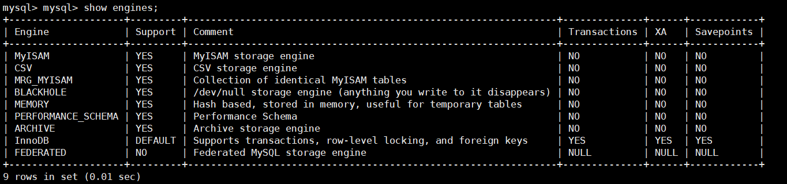
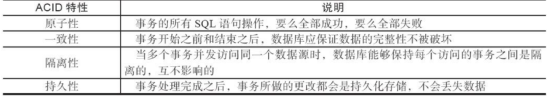
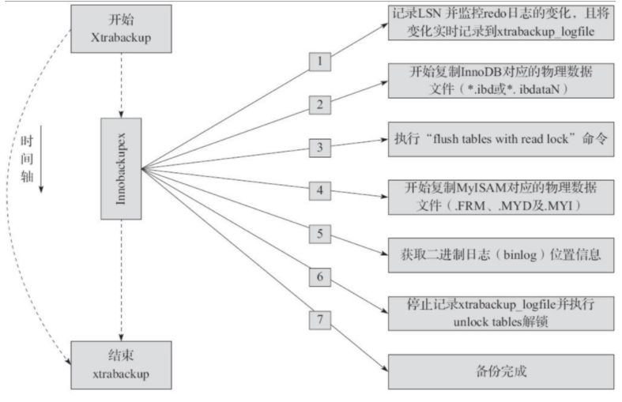
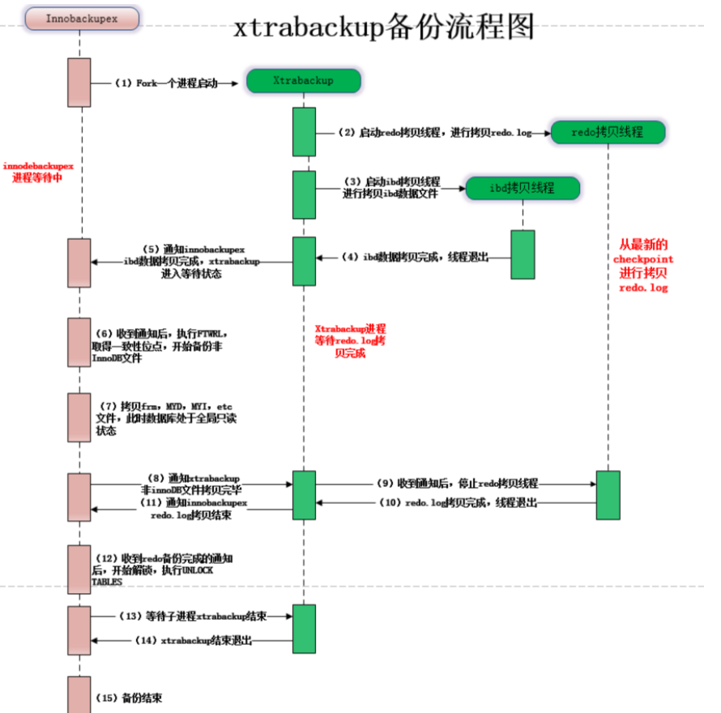
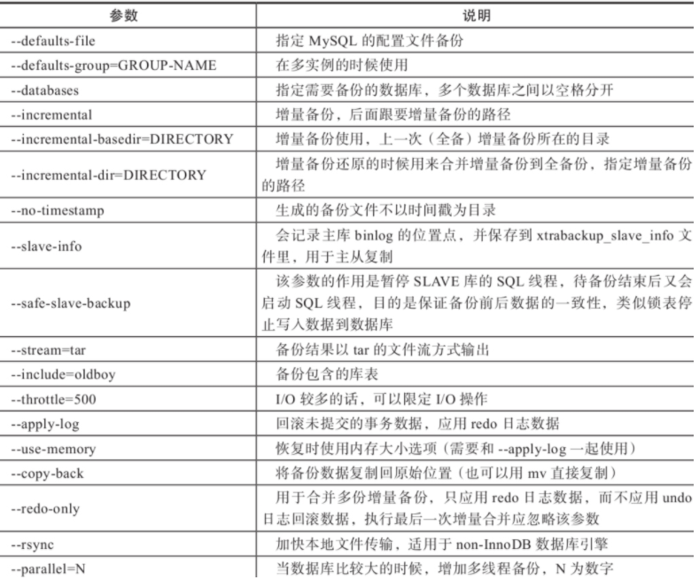
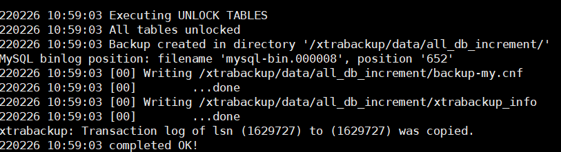
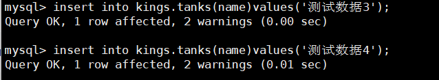

## 为什么要学这个工具

> 背景

一个合格的运维工程师或者dba工程师，如果有从事数据库方面的话，首先需要做的就是备份。

所以备份是重要的，但光有备份还不行，备份后如果出现问题，你还得使用备份数据来恢复，但恢复数据的时间一般都是很长的，不符合业务需求，所以一个快速备份与恢复的软件就很有必要。

## xtrabackup工具

Percona-xtrabackup是 Percona公司开发的一个用于MySQL数据库物理热备的备份工具，支持MySQL、Percona server和MariaDB，开源免费，是目前较为受欢迎的主流备份工具。xtrabackup只能备份innoDB和xtraDB两种数据引擎的表，而不能备份MyISAM数据表。

> 特点

- 物理备份工具，拷贝数据文件
- 备份和恢复数据的速度非常快，安全可靠
- 在备份期间执行的事务不会间断，备份`innodb`数据不影响业务
- 备份期间不增加太多数据库的性能压力
- 支持对备份的数据自动校验
- 运行全量，增量，压缩备份及流备份
- 支持在线迁移表以及快速创建新的从库
- 运行几乎所有版本的`mysql`和`maridb`

## 数据文件扩展名

| .idb文件    | 以独立表空间存储的InnoDB引擎类型的数据文件扩展名 |
| ----------- | ------------------------------------------------ |
| .ibdata文件 | 以共享表空间存储的InnoDB引擎类型的数据文件扩展名 |
| .frm文件    | 存放于表相关的元数据(meta)信息及表结构的定义信息 |
| .MYD文件    | 存放MyISAM引擎表的数据文件扩展名                 |
| .MYI文件    | 存放MyISAM引擎表的索引信息文件扩展名             |

## 事务型引擎

mysql的引擎是`InnoDB`

> mysql支持如下图中的几种引擎



查看当前mysql引擎

```
mysql> show variables like "storage_engine%";
+----------------+--------+
| Variable_name  | Value  |
+----------------+--------+
| storage_engine | InnoDB |
+----------------+--------+
1 row in set (0.00 sec)
```

## ACID特性

在MySQL中，InnoDB和MariaDB中的XtraDB都是事务型引擎，事务型引擎的共同特征是具备事务的4个特性，这4个特性分别是：

原子性（atomicity）

一致性（consistency）

隔离性（isolation）

持久性（durability）

又称为ACID特性。



## InnoDB日志名词

> nnoDB日志的原理词汇

- redo日志 `redo`日志，也称事务日志，是`innodb`引擎的重要组成部分，作用是记录`innodb`引擎中每一个数据发生的变化信息。主要用于保证`innodb`数据的完整性，以及丢数据后的恢复，同时可以有效提升数据库的`io`等性能。`redo`日志对应的配置参数为`innodb_log_file_size`和`innodb_log_files_in_group`
- Undo日志 `Undo`是记录事务的逆向逻辑操作或者向物理操作对应的数据变化的内容，`undo`日志默认存放在共享表空间里面的`ibdata*`文件，和`redo`日志功能不同`undo`日志主要用于回滚数据库崩溃前未完整提交的事务数据,确保数据恢复前后一致。
- LSN `LSN`，全拼`log sequence number`,中文是日志序列号，是一个`64`位的整型数字，`LSN`的作用是记录`redo`日志时，使用`LSN`唯一标识一条变化的数据。
- checkpoint 用来标识数据库崩溃后,应恢复的`redo log`的起始点

## Xtrabackup备份原理

> 工作原理流程

xtrabackup软件基于innodb等事务引擎自带的redo日志和undo功能来保证备份、恢复的数据一致性，确保数据可靠

redo日志文件会存储每一个table中的数据修改记录



> xtrabackup备份流程原理

- xtrabackup程序开始备份时，该软件记录当前redo日志的位置（对应的LSN）号，且在后台启动一个进程持续监视redo日志文件变化，将变化的信息，写入到xtrabackup_logfile中
- 针对所有的innodb数据文件进行复制，待inndob数据文件备份完成后
- 执行命令`flush tables with read lock`，对整个数据库锁表
- 然后再复制myisam非事务引擎的数据文件
- 待所有的数据文件全都备份完毕后，获取binlog位置信息，也就是当前数据写到哪了
- 解锁表`unlock tables`，恢复数据库的读写
- 备份完成

> 备份流程图解



## xtrabackup工具安装

> 我的环境是centos7,如果是其他版本的goole解决

基础环境

```
yum install perl perl-devel libaio libaio-devel perl-Time-HiRes perl-DBD-MySQL -y
```

下载地址

```
wget https://www.percona.com/downloads/XtraBackup/Percona-XtraBackup-2.4.9/binary/redhat/7/x86_64/percona-xtrabackup-24-2.4.9-1.el7.x86_64.rpm
```

yum本地安装

```
yum localinstall percona-xtrabackup-24-2.4.9-1.el7.x86_64.rpm -y
```

查看安装位置

```
[root@sql data]# ls -l `which xtrabackup innobackupex`
lrwxrwxrwx 1 root root       10 Feb 24 12:17 /usr/bin/innobackupex -> xtrabackup
-rwxr-xr-x 1 root root 21659096 Nov 23  2017 /usr/bin/xtrabackup
```

## 应用实践

### 命令介绍

```
Xtrabackup中主要包含两个工具：
xtrabackup：是用于热备innodb，xtradb表中数据的工具，不能备份其他类型的表，也不能备份数据表结构；
innobackupex：是将xtrabackup进行封装的perl脚本，提供了备份myisam表的能力。
常用选项:  
   --host     指定主机
   --user     指定用户名
   --password    指定密码
   --port     指定端口
   --databases     指定数据库
   --incremental    创建增量备份
   --incremental-basedir   指定包含完全备份的目录
   --incremental-dir      指定包含增量备份的目录   
   --apply-log        对备份进行预处理操作             

一般情况下，在备份完成后，数据尚且不能用于恢复操作，因为备份的数据中可能会包含尚未提交的事务或已经提交但尚未同步至数据文件中的事务。因此，此时数据文件仍处理不一致状态。“准备”的主要作用正是通过回滚未提交的事务及同步已经提交的事务至数据文件也使得数据文件处于一致性状态。
   --redo-only      不回滚未提交事务
   --copy-back     恢复备份目录
```

参数



Xtrabackup命令是专门用于对InnoDB和XtraDB等事务引擎的数据库热备份的工具，不能用于备份MyISAM等其他类型的引擎数据，其主要特点是备份数据时完全不用锁表。

Innobackupex命令是将上述Xtrabackup命令使用perl脚本进行二次封装的工具，除了可以用于InnoDB和XtraDB等引擎之外，还可以备份MyISAM及多种引擎混合使用的场景，该命令的主要特点是备份事务引擎数据而不用锁表，可以备份非事务引擎数据，但要锁表。

> DBA用的最多的是Innobackupex命令备份恢复

## 创建数据备份用户

```sql
[root@sql ~]# mysql -uroot -p1234 -P3306 -h127.0.0.1

# 创建用户
mysql> create user backup@'localhost' identified by '1234';
Query OK, 0 rows affected (0.00 sec)

# 回收用户所有的权限
mysql> revoke all privileges on *.* from backup@'localhost';
Query OK, 0 rows affected (0.00 sec)

# 授权部分权限
mysql> grant reload,lock tables,process,replication client on *.* to backup@'localhost';  

# 刷新
mysql> flush privileges;

```

创建mysql日志文件记录

```
[root@sql ~]# mkdir -p /xtrabackup/{log,cnf,data,mysql}
[root@sql ~]# chown -R mysql.mysql /xtrabackup/
[root@sql ~]# ls -l /xtrabackup/
total 0
drwxr-xr-x 2 mysql mysql 6 Feb 24 21:07 cnf
drwxr-xr-x 2 mysql mysql 6 Feb 24 21:07 data
drwxr-xr-x 2 mysql mysql 6 Feb 24 21:07 log
drwxr-xr-x 2 mysql mysql 6 Feb 24 21:07 mysql

```

编写新的配置文件

```
[root@sql cnf]# cat my.cnf 
[client]
user=root
password=1234

[mysqld]
basedir = /xtrabackup/mysql               
datadir = /xtrabackup/data            
                                               
###########binlog############
log_bin = /xtrabackup/logs/mysql-bin   

expire_logs_days = 7

###########slow log###########
slow-query-log = ON                    
long_query_time = 2                  
log_queries_not_using_indexes = ON     
slow-query-log-file = /xtrabackup/logs/slow.log   
min_examined_row_limit = 800    

[mysqld_safe]
log-error = /xtrabackup/logs/mysql-error.log      
sql_mode=NO_ENGINE_SUBSTITUTION,STRICT_TRANS_TABLES
```

```
[root@sql cnf]# cat my.cnf 
[client]
user=root
password=1234

[mysqld]
basedir = /xtrabackup/mysql                #<==增加MySQL根目录。    
datadir = /xtrabackup/data             #<==MySQL数据目录，Xtrabackup，恢复数据时需要这个目录。
                                               
###########binlog############
log_bin = /xtrabackup/logs/mysql-bin    #<==二进制日志路径调整，尽可能在装数据库前就调整好。

expire_logs_days = 7

###########slow log###########
slow-query-log = ON                    # 慢查询日志
long_query_time = 2                    # 查询阈值，超过了该阈值则记录到慢查询日志中
log_queries_not_using_indexes = ON     # 记录所有未使用索引的SQL，无论是否超过long_query_time所设置的值。
slow-query-log-file = /xtrabackup/logs/slow.log   #<==慢查询日志路径调整。
min_examined_row_limit = 800     # 表示返回行数大于等于该值的sql，将会被记录到slow log中。

[mysqld_safe]
log-error = /xtrabackup/logs/mysql-error.log      
sql_mode=NO_ENGINE_SUBSTITUTION,STRICT_TRANS_TABLES
```

## 全量备份与恢复

> 备份数据库kings

```
# 这是现有数据
[root@sql cnf]# mysql -uroot -p1234 -P3306 -h127.0.0.1 -e "select * from kings.tanks"
```

执行此备份命令

```
innobackupex --defaults-file=/data/3306/my.cnf --user=root --password=1234 --socket=/data/3306/mysql.sock --no-timestamp /xtrabackup/data/all_db
```

> xtrabackup备份的数据目录

```
[root@sql data]# ls /xtrabackup/data/all_db/ -l
total 77852
-rw-r----- 1 root root      418 Apr 21 18:54 backup-my.cnf    # 配置文件备份
drwxr-x--- 2 root root       20 Apr 21 18:54 blog    # 数据库备份
-rw-r----- 1 root root 79691776 Apr 21 18:54 ibdata1    # 共享表空间备份
drwxr-x--- 2 root root       20 Apr 21 18:54 K8S # 数据库备份
drwxr-x--- 2 root root       88 Apr 21 18:54 kings # 数据库备份
drwxr-x--- 2 root root       20 Apr 21 18:54 luffy # 数据库备份
drwxr-x--- 2 root root     4096 Apr 21 18:54 mysql # 数据库备份
drwxr-x--- 2 root root     4096 Apr 21 18:54 performance_schema # 数据库备份
# #mysql服务器当前正在使用的二进制日志文件和此时二进制日志时间的位置信息文件
-rw-r----- 1 root root       21 Apr 21 18:54 xtrabackup_binlog_info 
# 备份的类型、状态和LSN状态信息文件
-rw-r----- 1 root root      113 Apr 21 18:54 xtrabackup_checkpoints 
# 日志备份
-rw-r----- 1 root root      559 Apr 21 18:54 xtrabackup_info
-rw-r----- 1 root root     2560 Apr 21 18:54 xtrabackup_logfile
```

## 查看备份内容

> binlog记录数据位置，以及日志文件

```
[root@sql data]# cat /xtrabackup/data/all_db/xtrabackup_binlog_info 
mysql-bin.000007	8628

```

> 备份的数据信息

```
[root@sql data]# cat /xtrabackup/data/all_db/xtrabackup_checkpoints
backup_type = full-backuped    # 备份类型，全量备份
from_lsn = 0            # 起点
to_lsn = 1957778    # 结束点
last_lsn = 1957778 
compact = 0
recover_binlog_info = 0
```

## 全备恢复数据

模拟数据删除，直接操作mysql数据目录

```
[root@sql 3306]# mv /data/3306/data/ /data/3306/data_ori

[root@sql 3306]# mkdir data

```

在恢复数据之前，先执行如下命令，确保数据一致性，同时回滚未提交事务的日志数据

使用32M内存进行恢复，对内存限制，防止占用过多机器资源

--apply-log 读取redo日志

```
innobackupex --apply-log --use-memory=32M /xtrabackup/data/all_db/
```

## 恢复数据

可以直接用mv命令，恢复数据，和xtrabackup命令本质上一样的，都是直接复制物理文件

```
mv /xtrabackup/data/all_db/* /data/3306/data
```

软件自带命令

```
innobackupex --defaults-file=/data/3306/my.cnf --copy-back --rsync /xtrabackup/data/all_db/
```

记得要修改文件夹的用户权限，改成mysql用户

```
[root@sql 3306]# chown -R mysql.mysql data
```

重启

```
/data/3306/mysql_3306 start
```

启动数据库。。。

## 增量备份

增量备份之前，仍然是要进行一次全量备份

后续的增量备份，就是依次增加增量的数据

### 1.基础全备份

```
innobackupex --defaults-file=/data/3306/my.cnf --user=root --password=1234 --socket=/data/3306/mysql.sock --no-timestamp /xtrabackup/data/all_db2
```

```
[root@sql data]# ls /xtrabackup/data/
all_db  all_db2
```

### 2.增量数据写入

写入数据模拟增量备份

```
登录mysql后写入
mysql> insert into tanks(name)values('测试数据');
Query OK, 1 row affected, 2 warnings (0.00 sec)

mysql> insert into tanks(name)values('测试数据02');
Query OK, 1 row affected, 2 warnings (0.00 sec)

mysql> select * from tanks;
+----+----------------+--------+-------+
| id | name           | skills | price |
+----+----------------+--------+-------+
|  1 | 佐伊           |        |     0 |
|  2 | 而非六四       |        |     0 |
|  3 | 盲僧           |        |     0 |
|  4 | 测试数据       |        |     0 |
|  5 | 测试数据02     |        |     0 |
+----+----------------+--------+-------+
5 rows in set (0.00 sec)

```

### 3.做一次增量备份

> increment:增量
>
> --incremental-basedir=/xtrabackup/data/all_db2/ # 填入上一次全量备份的目录
>
> --incremental /xtrabackup/data/all_db_increment # 填入增量备份的目录

```
innobackupex --defaults-file=/data/3306/my.cnf --user=root --password=1234 --socket=/data/3306/mysql.sock --no-timestamp --incremental-basedir=/xtrabackup/data/all_db2/ --incremental /xtrabackup/data/all_db_increment

```

正确备份后结果



检查增量备份目录

```
[root@sql data]# ls /xtrabackup/data/all_db_increment/
backup-my.cnf  kings               test                    xtrabackup_info
ibdata1.delta  mysql               xtrabackup_binlog_info  xtrabackup_logfile
ibdata1.meta   performance_schema  xtrabackup_checkpoints
```

对于增量备份的数据，是

- 从全备信息的的LSN开始读取redo日志，对改变的数据进行增量备份

### 4.再次进行增量备份

继续插入数据，



进行第二次增量备份

!>这次要使用上一次增量备份目录

> --parallel=3 开启3个线程备份，当数据量较大时候

```
innobackupex --defaults-file=/data/3306/my.cnf --user=root --password=1234 --socket=/data/3306/mysql.sock --no-timestamp --parallel=3 --incremental-basedir=/xtrabackup/data/all_db_increment/ --incremental /xtrabackup/data/all_db_increment_2/
```

```
[root@sql data]# ls /xtrabackup/data/
all_db  all_db2  all_db_increment  all_db_increment_2
```

至此，就完成了一次全量备份，以及后两次的增量备份

## 增量恢复

步骤是

- 先恢复全量备份数据，`/xtrabackup/data/all_db2/`
- 再恢复第一次增量备份的数据，`/xtrabackup/data/all_db_increment/`
- 再恢复第二次增量的数据，依次类推`/xtrabackup/data/all_db_increment_2/`

### 合并多份增量备份日志

> 应用redo日志恢复全备数据
>
> 注意，只要不是最后一次合并增量数据，就要加`--redo-only`参数，作用是只应用redo日志恢复数据，不执行undo回滚未提交的数据。
>
> 等到最后一次增量日志合并，就要进行undo日志回滚，也就是不加该参数了。


> 第一步，应用redo日志恢复全备数据

```
innobackupex --apply-log --use-memory=32M --redo-only /xtrabackup/data/all_db2/
```

> 第二步，合并第一次的增量数据到全备数据目录

```
innobackupex --apply-log --use-memory=32M --redo-only --incremental-dir=/xtrabackup/data/all_db_increment/  /xtrabackup/data/all_db2/

```

> 第三步，合并第二次的增量数据，到全备目录，注意最后一次，没有 --redo-only参数

```
innobackupex --apply-log --use-memory=32M  --incremental-dir=/xtrabackup/data/all_db_increment_2/  /xtrabackup/data/all_db2/
```

> 第四步，对全量数据进行redo日志应用，执行undo回滚数据

```
innobackupex --apply-log --use-memory=32M /xtrabackup/data/all_db2/
```

### 恢复数据

> 模拟数据丢失，删除数据，用到`/xtrabackup/data/all_db2/`

```
# 1.停止数据库
[root@sql data]# /data/3306/mysql_3306 stop
Stoping MySQL...

# 2.清空原有3306数据库的所有数据
[root@sql 3306]# mv /data/3306/data /data/3306/data_ori_increment
# 3.此时mysql的数据目录，是空的，也无法正常启动

# 4.恢复数据
mkdir -p /data/3306/data
 
innobackupex --defaults-file=/data/3306/my.cnf --copy-back --rsync /xtrabackup/data/all_db2/

# 5.授权用户
chown -R mysql.mysql data
```

> 启动mysql,查看数据是否都回来了..

```
[root@sql 3306]# mysql -uroot -S /data/3306/mysql.sock -p
Enter password: 


mysql> select * from kings.tanks;
+----+----------------+--------+-------+
| id | name           | skills | price |
+----+----------------+--------+-------+
|  1 | 佐伊           |        |     0 |
|  2 | 而非六四       |        |     0 |
|  3 | 盲僧           |        |     0 |
|  4 | 测试数据       |        |     0 |
|  5 | 测试数据02     |        |     0 |
|  6 | 测试数据3      |        |     0 |
|  7 | 测试数据4      |        |     0 |
+----+----------------+--------+-------+
7 rows in set (0.01 sec)
```

恢复成功!
