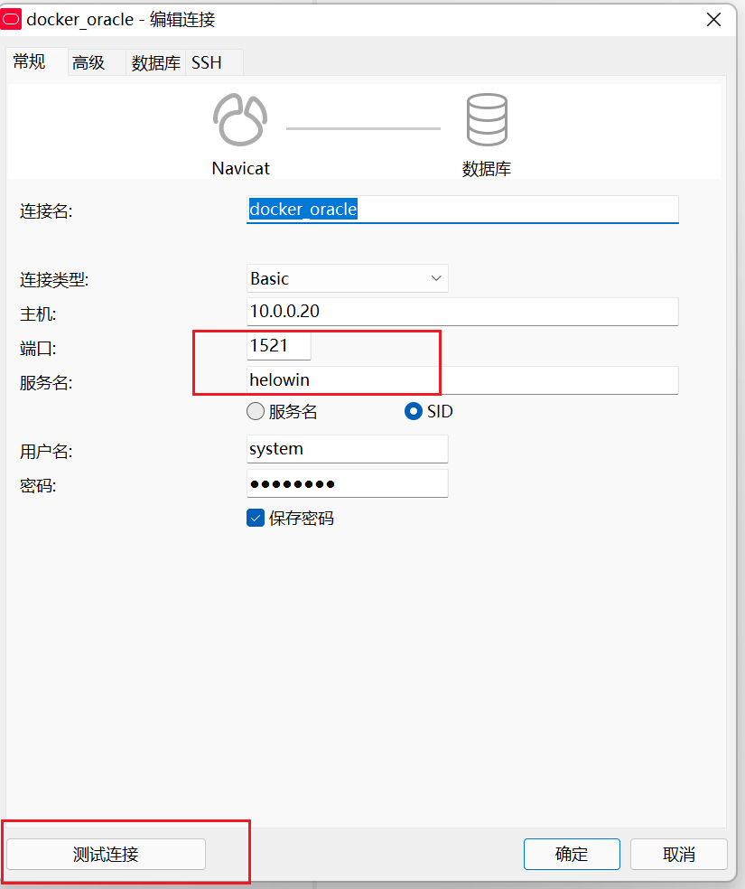

## oracle安装

首先安装docker

> [TP](/云计算/容器/docker安装与生命周期)


获取阿里云的oracle镜像

```
docker pull registry.cn-hangzhou.aliyuncs.com/helowin/oracle_11g
```

查看镜像

```
docker images
```

docker安装oracle

```
docker run -d -it -p 1521:1521 --name oracle11g --restart=always registry.cn-hangzhou.aliyuncs.com/helowin/oracle_11g

```

查看容器运行状态

```
docker ps
```

进入容器

```
docker exec -it 容器id或名字 bash
```

切换root账户

```
su - root

#密码
helowin
```

编辑环境变量

```
vi /etc/profile

export ORACLE_HOME=/home/oracle/app/oracle/product/11.2.0/dbhome_2
export ORACLE_SID=helowin
export PATH=$ORACLE_HOME/bin:$PATH
```

使用此命令配置文件生效

```
source /etc/profile
```

创建软连接

```
ln -s $ORACLE_HOME/bin/sqlplus /usr/bin
```

切换到oracle用户，登录sqlplus

```
su - oracle

sqlplus /nolog

conn /as sysdba
```

修改管理员sys、system用户的密码

```
alter user sys identified by 123456;

alter user system identified by 123456;
```

可以选择根据需要创建普通用户

```
create user yzh identified by 123456;

grant connect,resource,dba to yzh;
```

## navicat连接oracle

注意服务名；可以测试一下是否连接成功



## oracle默认账户密码

```
用户名 / 密码

登录身份

说明

sys/change_on_install

 

SYSDBA 或 SYSOPER

不能以 NORMAL 登录，可作为默认的系统管理员


system/manager

 

SYSDBA 或 NORMAL

不能以 SYSOPER 登录，可作为默认的系统管理员


sysman/oem_temp

 


sysman 为 oms 的用户名


scott/tiger

NORMAL

普通用户


aqadm /aqadm

SYSDBA 或 NORMAL

高级队列管理员


Dbsnmp/dbsnmp

SYSDBA 或 NORMAL

复制管理员
```


