## redis 简介

- redis 是一款开源，c 语言编写的，高级键值(key-value)缓存和支持永久存储的 nosql 数据库
- redis 采用内存(In-Memory)数据集(DataSet)
- 支持多数据类型
- 运行于大多数 posix，如 linux、`os` x 等

官网：[https://redis.io/](https://redis.io/)

中文网站：http://redis.cn/

## redis 特性优势

```
高速读写
数据类型丰富
支持持久化
支持高可用
支持分布式分片集群
多种内存分配回收策略
支持事务
消息队列、消息订阅

```

## redis 与 memcached 对比

**redis:**

优点：高性能读写，多数据类型支持，数据持久化，高可用架构，支持自定义虚拟内存，支持分布式卡片集群，单线程读写性能极高

缺点：多线程读写比 memcached 慢

**memcached:**

优点：高性能读写，单数据类型，支持客户端分布式集群，一致性 hash 多核结构，多线程读写性能高

缺点：没有持久化，节点故障可能出现缓存穿透，分布式需要客户端实现，跨机房数据同步困难，架构扩容复杂度高

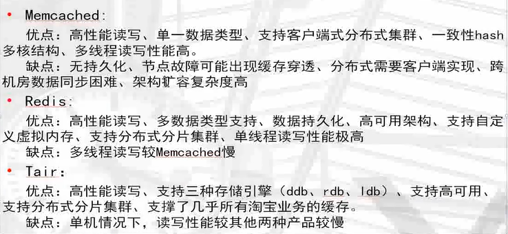

## redis 应用场景

- 数据高速缓存(mysql...热点内容)提高读取性能
- web 会话缓存(session)
- 排行榜应用
- 消息队列
- 发布订阅

## redis 各个版本下载地址

http://download.redis.io/releases/

```shell
#下载
wget http://download.redis.io/releases/redis-3.2.12.tar.gz

#解压缩
tar -xzf redis-3.2.12.tar.gz -C /data

#安装
cd redis-3.2.12
make

#修改配置文件
vim /etc/profile
export PATH=/data/redis3.2.12/src:$PATH

[root@docker01 data]# source /etc/profile

```

## 启动redis

```
[root@docker01 data]# redis-server &
[1] 43891
[root@docker01 data]# 43891:C 08 Feb 19:38:00.062 # Warning: no config file specified, using the default config. In order to specify a config file use redis-server /path/to/redis.conf
                _._                                                  
           _.-``__ ''-._                                             
      _.-``    `.  `_.  ''-._           Redis 3.2.12 (00000000/0) 64 bit
  .-`` .-```.  ```\/    _.,_ ''-._                                   
 (    '      ,       .-`  | `,    )     Running in standalone mode
 |`-._`-...-` __...-.``-._|'` _.-'|     Port: 6379
 |    `-._   `._    /     _.-'    |     PID: 43891
  `-._    `-._  `-./  _.-'    _.-'                                   
 |`-._`-._    `-.__.-'    _.-'_.-'|                                  
 |    `-._`-._        _.-'_.-'    |           http://redis.io        
  `-._    `-._`-.__.-'_.-'    _.-'                                   
 |`-._`-._    `-.__.-'    _.-'_.-'|                                  
 |    `-._`-._        _.-'_.-'    |                                  
  `-._    `-._`-.__.-'_.-'    _.-'                                   
      `-._    `-.__.-'    _.-'                                       
          `-._        _.-'                                           
              `-.__.-'            
```

```
[root@docker01 data]# ps -ef | grep redis
root      43891  43174  0 19:37 pts/0    00:00:00 redis-server *:6379
root      43975  43174  0 19:39 pts/0    00:00:00 grep --color=auto redis
```

```
[root@docker01 data]# redis-cli
127.0.0.1:6379> set name zhangsan
OK
127.0.0.1:6379> get name
"zhangsan"

```

## redis配置文件

```shell
[root@docker01 ~]# mkdir /data/6379

[root@docker01 ~]# vim /data/6379/redis.conf 
#是否打开redis后台运行
daemonize yes
#端口号
port 6379
#日志存放位置
logfile /data/6379/redis.log
#设定redis数据存储位置
dir /data/6379
#redis持久化的数据文件
dbfilename dump.rdb

```

## 关闭redis

```
[root@docker01 ~]# redis-cli
127.0.0.1:6379> shutdown
53486:M 09 Feb 00:20:40.341 # User requested shutdown...
53486:M 09 Feb 00:20:40.341 * Saving the final RDB snapshot before exiting.
53486:M 09 Feb 00:20:40.342 * DB saved on disk
53486:M 09 Feb 00:20:40.342 # Redis is now ready to exit, bye bye...
not connected> exit
[1]+  Done                    redis-server

#命令行关闭redis
[root@docker01 ~]# redis-cli shutdown
```

## 使用新的配置文件启动

```
[root@docker01 ~]# redis-server /data/6379/redis.conf 
[root@docker01 ~]# redis-cli
127.0.0.1:6379> 
```

## redis安全配置

- redis没有用户概念，redis只有密码
- redis默认在工作在保护模式下,不允许远程用户登录

## 尝试远程登录

```
[root@docker01 ~]# redis-cli -h 192.168.6.200
192.168.6.200:6379> set name zhangsan
(error) DENIED Redis is running in protected mode because protected mode is enabled, no bind address was specified, no authentication password is requested to clients. In this mode connections are only accepted from the loopback interface.
If you want to connect from external computers to Redis you may adopt one of the following solutions: 
1) Just disable protected mode sending the command 'CONFIG SET protected-mode no' from the loopback interface by connecting to Redis from the same host the server is running, however MAKE SURE Redis is not publicly accessible from internet if you do so. Use CONFIG REWRITE to make this change permanent. 
2) Alternatively you can just disable the protected mode by editing the Redis configuration file, and setting the protected mode option to 'no', and then restarting the server. 
3) If you started the server manually just for testing, restart it with the '--protected-mode no' option. 
4) Setup a bind address or an authentication password. NOTE: You only need to do one of the above things in order for the server to start accepting connections from the outside.

```

```
1)只需要在loopback接口上使用CONFIG SET protectmode no命令来禁用保护模式，并确保你不能从互联网上公开访问Redis。使用配置重写使此更改永久。
2)或者，你可以通过编辑Redis配置文件来禁用保护模式，并将保护模式选项设置为“no”，然后重新启动服务器。
3)如果你手动启动服务器只是为了测试，用“——protected-mode no”选项重新启动它。
4)设置绑定地址或认证密码。注意:为了让服务器开始接受来自外部的连接，您只需要做上面的一件事。
```

- protected-mode yes/no(保护模式，是否只允许本地访问)

## 设置登录规则

(1)bind：指定ip进行监听

(2)增加requirepass root

```bash
 [root@docker01 ~]# cat /data/6379/redis.conf
 bind 192.168.6.200 127.0.0.1
 requirepass root
```

## 重启生效

```bash
[root@docker01 ~]# redis-cli shutdown
[root@docker01 ~]# redis-server /data/6379/redis.conf
```

## 验证

```bash
#方法一
[root@docker01 ~]# redis-cli -h 192.168.6.200 -a root
192.168.6.200:6379> set name zhangsan
OK
192.168.6.200:6379> get name
"zhangsan"

#方法二
[root@docker01 ~]# redis-cli
127.0.0.1:6379> set name zhangsan
(error) NOAUTH Authentication required.
127.0.0.1:6379> auth root
OK

```

## 获取所有配置参数

```bash
[root@docker01 ~]# redis-cli -a root
127.0.0.1:6379> config get *
```

## 在线修改配置

```bash
127.0.0.1:6379> config set requirepass 1234
OK

[root@docker01 ~]# redis-cli -a root
127.0.0.1:6379> set a b
(error) NOAUTH Authentication required.
127.0.0.1:6379> auth 1234
OK
127.0.0.1:6379> set a b
OK
127.0.0.1:6379> get a
"b"
```

## redis数据持久化

## rdb持久化

`RDB` 持久化(内存数据保存到硬盘)

可以在指定的时间间隔内生成数据集的时间点快照(point-in-time snapshot)

`优点`：速度块，适用于做备份，主从复制也是基于`RDB`持久化功能实现的

`缺点`：会有数据流失

## rdb持久化核心配置参数

```
[root@docker01 ~]# cat /data/6379/redis.conf 
dir /data/6379
dbfilename dump.rdb
save 900 1
save 300 10
save 60 10000
```

```
配置分别表示:
900秒(15分钟)内有一个更改
300秒(5分钟)内有10个更改
60秒内有10000个更改
```

## aof持久化

记录服务器执行的所有写操作命令，并在服务器启动时，通过重新执行这些命令来还原数据集

`aof`文件中的命令全部以`redis`协议的格式来保存，新命令会被追加到文件的末尾

`优点`：可以最大程度保证数据不丢

`缺点`：日志记录量级比较大

## AOF持久化配置参数

```
[root@docker01 ~]# vim /data/6379/redis.conf
appendonly yes
appendfsync everysec
appendfsync always
```

```
配置表示:
是否开启aof日志功能
开启写入，每秒写一次
每一个命令都立即同步到aof
```

## 面试

redis持久化方式有哪些，有什么区别？

`rdb`:基于快照持久化，速度更快，一般用作备份，主从复制也是依赖于rdb持久化功能

`aof`：以追加的方式记录redis操作日志的文件。可以最大程度保证redis数据安全，类似于mysql的binlog

## redis数据类型

|                      |    key(键)     |                value(值)                |
| :------------------: | :------------: | :-------------------------------------: |
|                      | 自主定义的名字 |         多种数据类型的存储模式          |
|    string(字符串)    |      name      |               "zhangsan"                |
|      hash(字典)      |      stu       |         {id:101,name:zhangsan}          |
|      list(列表)      |     wechat     |          (v1,v2,v3)<br />0 1 2          |
|      set(集合)       |      set1      |          [m1,m2,m3]<br />0 1 2          |
| sorted set(有序集合) |     zset1      | [socre m1,score m2,score m3]<br />0 1 2 |

## string

应用场景：

- 基本键值对存储
- 计数器(互联网当中，点击量，访问量，关注量，游戏应用)

```bash
#定义一个键值对
127.0.0.1:6379> set name zhangsan
OK
127.0.0.1:6379> get name
"zhangsan"

#定义多个键值对
127.0.0.1:6379> mset id 101 name zhangsan age 20 gender maile
OK

#获取多个值
127.0.0.1:6379> mget age id name gender
1) "20"
2) "101"
3) "zhangsan"
4) "maile"

#查看定义键
127.0.0.1:6379> keys *
1) "age"
2) "id"
3) "name"
4) "gender"

#统计计量增加
127.0.0.1:6379> incr fensi
(integer) 1
127.0.0.1:6379> incr fensi
(integer) 2

#减少
127.0.0.1:6379> decr fensi
(integer) 1
127.0.0.1:6379> decr fensi
(integer) 0

#获取统计
127.0.0.1:6379> get fensi
"2"

#增加多条数据
127.0.0.1:6379> incrby fensi 20
(integer) 20
#减少
127.0.0.1:6379> decrby fensi 10
(integer) 10

```

## hash

应用场景：

- 最接近于mysql表结构的数据类型,存储部分变更的数据，如用户信息等
- 最多应用与数据库缓存(提前将mysql数据库数据灌入到redis中)

```bash
127.0.0.1:6379> hset zhangsan name zs
(integer) 1
127.0.0.1:6379> hmset student id 101 name zs age 20 gender male
OK
127.0.0.1:6379> hmset stu id 102 name lisi age 21 gender male
OK
127.0.0.1:6379> hmget stu
(error) ERR wrong number of arguments for 'hmget' command
127.0.0.1:6379> hmget stu id name age gender
1) "102"
2) "lisi"
3) "21"
4) "male"

127.0.0.1:6379> hgetall stu
1) "id"
2) "102"
3) "name"
4) "lisi"
5) "age"
6) "21"
7) "gender"
8) "male"

```

## list

应用场景：

- 通常应用于微信朋友圈、ins、微博、抖音等
- 简单的说，后入库的数据先访问到，先入库的数据后访问到

```bash
#举例：微信朋友圈更新动态
[root@sql 6379]# redis-cli -a root
127.0.0.1:6379> lpush wechat "today is 1"
(integer) 1
127.0.0.1:6379> lpush wechat "today is 2"
(integer) 2
127.0.0.1:6379> lpush wechat "today is 3"
(integer) 3

#取值
127.0.0.1:6379> lrange wechat 0 -1
1) "today is 3"
2) "today is 2"
3) "today is 1"

```

## set

应用场景：

- 在B站里，将一个up所有的关注人存在一个集合中，将其所有粉丝存在一个集合中
- redis还为集合提供了求交集，并集，差集等操作，可以非常方便的实现如共同关注，共同喜好，二度好友等功能，对所有的集合操作，可以使用不同的命令选择将结果返回给客户端还是存集到一个新的集合中

```bash
127.0.0.1:6379> sadd lxl pg1 pg2 baoqiang masu marong
(integer) 5
127.0.0.1:6379> sadd jnl baoqiang yufan basobeier zhouxingchi
(integer) 4

#并集操作(两个值集合中其他的所有值)
127.0.0.1:6379> sunion lxl jnl
1) "basobeier"
2) "yufan"
3) "baoqiang"
4) "pg2"
5) "zhouxingchi"
6) "masu"
7) "pg1"
8) "marong"

#交集(集合中共同拥有的值)
127.0.0.1:6379> sinter lxl jnl
1) "baoqiang"

#差集(取后面集合中没有的值)
127.0.0.1:6379> sdiff lxl jnl
1) "masu"
2) "pg1"
3) "marong"
4) "pg2"
127.0.0.1:6379> sdiff jnl lxl
1) "basobeier"
2) "zhouxingchi"
3) "yufan"
```

## sorted set

应用场景：

- 排行榜应用，取top n操作
- 例如网易云听歌次数排序，将要排序的值设置成sorted set 的score,将具体的数据设置成相对应的value，每次只需要执行一条zadd命令即可

```bash
127.0.0.1:6379> zadd music 0 ruyuan 0 chuanqi 0 tianshangrenjian
(integer) 3
127.0.0.1:6379> zincrby music 1000 ruyuan
"1000"
127.0.0.1:6379> zincrby music 1000 chuanqi
"1000"
127.0.0.1:6379> zincrby music 10000 tianshangrenjian
"10000"

#0 -1 从开始到最后
127.0.0.1:6379> zrevrange music 0 -1
1) "tianshangrenjian"
2) "ruyuan"
3) "chuanqi"

127.0.0.1:6379> zrevrange music 0 -1 withscores
1) "tianshangrenjian"
2) "10000"
3) "ruyuan"
4) "1000"
5) "chuanqi"
6) "1000"

```

## 生产消费模型

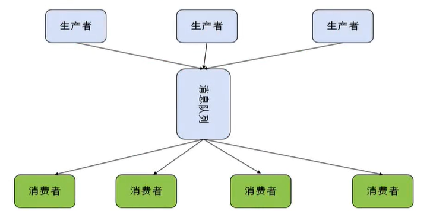

## 消息模式

redis 发布消息通常有两种模式：

- 队列模式(queuing)
- 发布-订阅模式(pubish-subscribe)

任务队列的好处：

- 松耦合
- 易于扩展

## redis 发布订阅


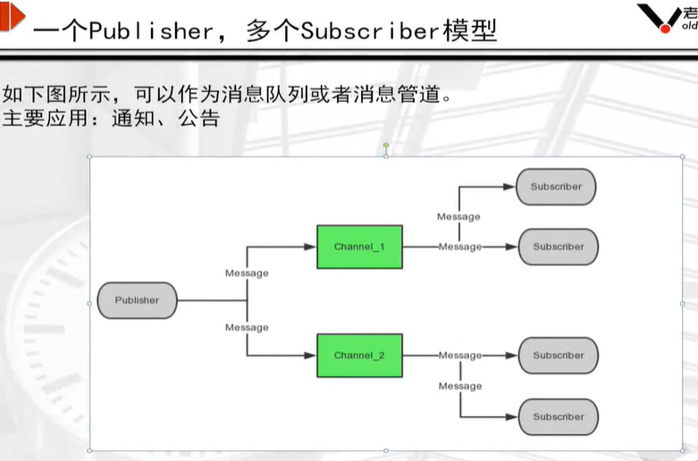


## 模拟发布订阅


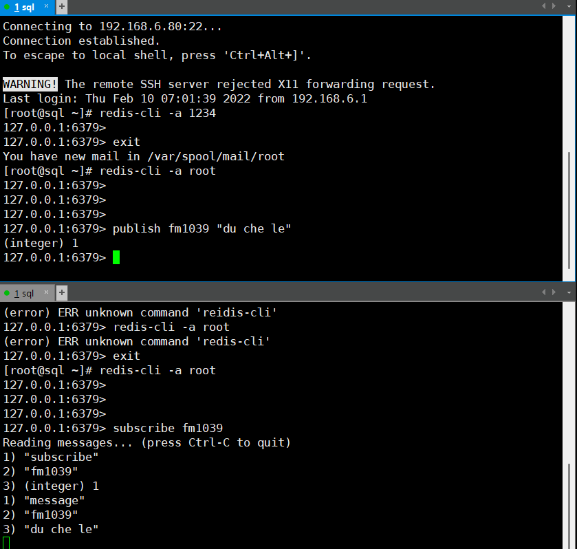

```
#订阅
subscribe
#发布
publish
```

## 消息队列系统对比


## reids服务器管理命令

## 版本信息

```bash
127.0.0.1:6379> info
#info信息关注的重点信息
#redis内存信息
# Memory
used_memory:824328
used_memory_human:805.01K
used_memory_rss:2469888
used_memory_rss_human:2.36M
used_memory_peak:844592
used_memory_peak_human:824.80K
total_system_memory:3953971200
total_system_memory_human:3.68G

#复制
## Replication
role:master
connected_slaves:0
master_repl_offset:0
repl_backlog_active:0
repl_backlog_size:1048576
repl_backlog_first_byte_offset:0
repl_backlog_histlen:0
```

## 会话占用资源情况

```bash
127.0.0.1:6379> client list
id=21 addr=127.0.0.1:58250 fd=7 name= age=88 idle=0 flags=N db=0 sub=0 psub=0 multi=-1 qbuf=0 qbuf-free=32768 obl=0 oll=0 omem=0 events=r cmd=client
```

## 杀掉进程

```bash
#一般用于杀掉远程链接
127.0.0.1:6379> client kill 127.0.0.1:58250
OK
```

## 查看当前配置情况

```bash
127.0.0.1:6379> config get bind
1) "bind"
2) "192.168.6.80 127.0.0.1"

#查询所有
127.0.0.1:6379> config get *
  1) "dbfilename"
  2) "dump.rdb"
  3) "requirepass"
  4) "root"

```

## 动态修改

```bash
127.0.0.1:6379> config set requirepass 1234
OK
```

## 查看key的个数

```bash
127.0.0.1:6379> dbsize
(integer) 9
```

## 清空键值对缓存数据

```bash
#(清空0-15所有库)有风险，慎用
127.0.0.1:6379> flushall
OK
127.0.0.1:6379> keys *
(empty list or set)

```

## 清空数据

```
#清空当前库
127.0.0.1:6379> flushdb
OK
127.0.0.1:6379> keys *
(empty list or set)

```

## 切换库

```
#默认有16个库从0-15,通常集群环境统一0号库
127.0.0.1:6379> select 0
OK
127.0.0.1:6379[0]>
```

## 监控实时指令

```bash
#通常用作redis审计日志
#窗口1
127.0.0.1:6379> monitor
OK
1644557973.699574 [0 127.0.0.1:58254] "set" "a" "10"
#窗口2
127.0.0.1:6379> set a 10
OK
```

## 关闭服务器

```
127.0.0.1:6379> shutdown
not connected>
#
[root@sql ~]# redis-cli -a root shutdown
```

## 数据保存

```
save
```

- slaveof host port 主从配置
- slaveof no one
- sync 主从同步
- role返回主从角色 

## 常用全局key操作

```bash
#查看所有键
127.0.0.1:6379> keys *
1) "a"
#删除键
127.0.0.1:6379> del a
(integer) 1
127.0.0.1:6379> exists a
(integer) 0
127.0.0.1:6379> set a 10
OK
#判断键是否存在
127.0.0.1:6379> exists a
(integer) 1
#判断键数据类型
127.0.0.1:6379> type a
string
#以秒设定键生存时间
127.0.0.1:6379> expire a 120
(integer) 1
#返回键所剩生存时间
127.0.0.1:6379> ttl a
(integer) 117
#取消键设定的生存时间
127.0.0.1:6379> persist a
(integer) 1

```

## redis主从复制特点

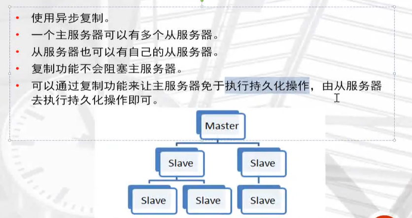

## redis主从复制原理

1.从服务器向主服务器发送sync命令。

2.接到sync命令的主服务器会调用bgsave命令，创建一个rdb文件，并使用缓冲区记录下来执行的所有写命令。

3.当主服务器执行完bgsave命令时，它会向从服务器发送rdb文件，而从服务器则会接收并载入这个文件。

4.主服务器将缓冲区存储的所有写命令发送给从服务器执行。

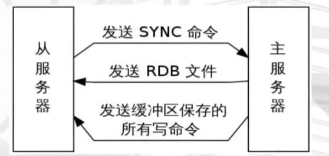

## sync命令执行示例

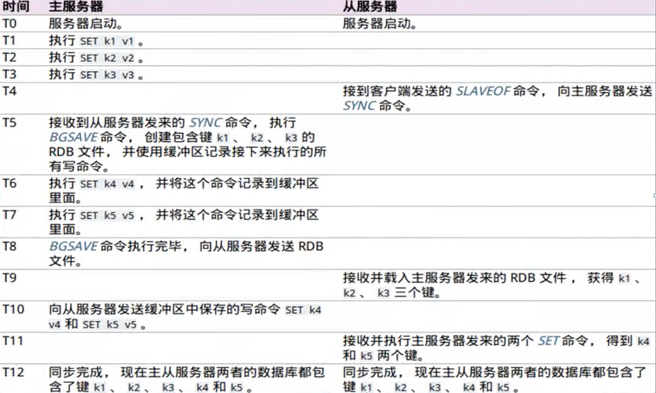

## 命令传播

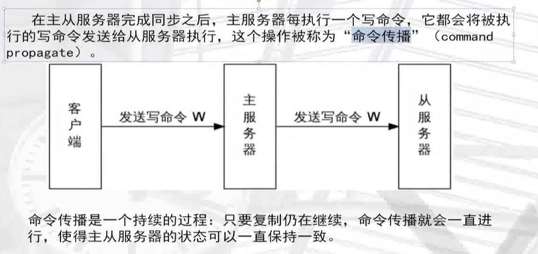

## sync处理断线重连

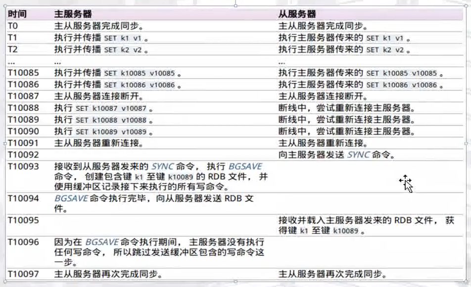

## psync处理断线重连

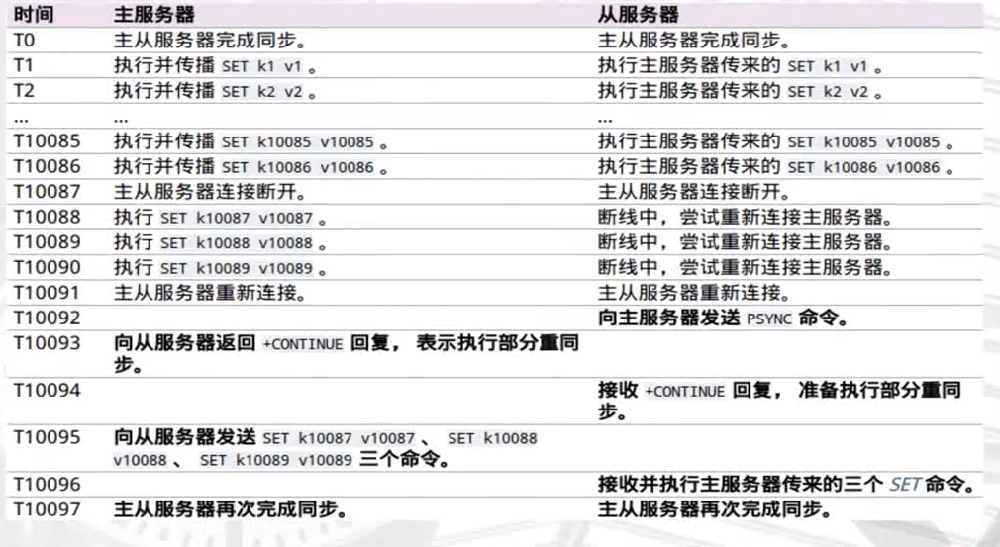

## 复制一致性问题

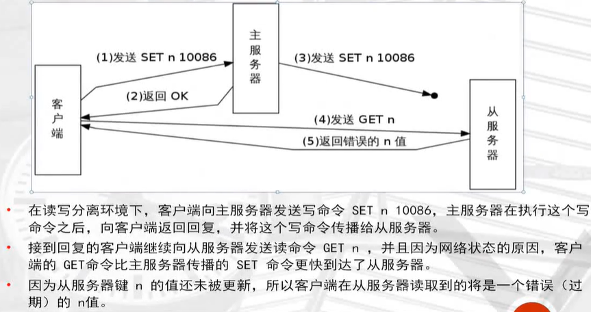

### 复制安全性提升


```
min-s|aves-to-write <number of slaves>

min-s|aves-max-lag <number of seconds>
```

## 主从复制构建

### 准备两个或以上redis实例

```
[root@redis data]# mkdir /data/638{0..2}

主节点：
6380
从节点：
6381 6382


配置文件示例：
vim /data/6380/redis.conf

port 6380
daemonize yes
pidfile /data/6380/redis.pid
loglevel notice
logfile "/data/6380/redis.log"
dbfilename dump.rdb
dir /data/6380
protected-mode no


vim /data/6381/redis.conf

port 6381
daemonize yes
pidfile /data/6381/redis.pid
loglevel notice
logfile "/data/6381/redis.log"
dbfilename dump.rdb
dir /data/6381
protected-mode no


vim /data/6382/redis.conf

port 6382
daemonize yes
pidfile /data/6382/redis.pid
loglevel notice
logfile "/data/6382/redis.log"
dbfilename dump.rdb
dir /data/6382
protected-mode no
```

### 启动多实例

```
[root@localhost data]# redis-server /data/6380/redis.conf 
[root@localhost data]# redis-server /data/6381/redis.conf 
[root@localhost data]# redis-server /data/6382/redis.conf 

[root@localhost data]# netstat -tlnp|grep 638
tcp        0      0 0.0.0.0:6380            0.0.0.0:*               LISTEN      4598/redis-server * 
tcp        0      0 0.0.0.0:6381            0.0.0.0:*               LISTEN      4602/redis-server * 
tcp        0      0 0.0.0.0:6382            0.0.0.0:*               LISTEN      4606/redis-server * 
tcp6       0      0 :::6380                 :::*                    LISTEN      4598/redis-server * 
tcp6       0      0 :::6381                 :::*                    LISTEN      4602/redis-server * 
tcp6       0      0 :::6382                 :::*                    LISTEN      4606
```

### 开启主从

```
#第1个从库
[root@localhost data]# redis-cli -p 6381
127.0.0.1:6381> slaveof 127.0.0.1 6380
OK

#第2个从库
127.0.0.1:6382> slaveof 127.0.0.1 6380
OK

#从库查看一下链接状态
127.0.0.1:6382> info replication
# Replication
role:slave         			# 状态：从库
master_host:127.0.0.1       #  ip
master_port:6380			# 主库
master_link_status:up		# 链接状态：开启

#主库
127.0.0.1:6380> info replication
# Replication
role:master
connected_slaves:2
slave0:ip=127.0.0.1,port=6381,state=online,offset=365,lag=0
slave1:ip=127.0.0.1,port=6382,state=online,offset=365,lag=1

```

### 主库宕机手动故障切换(failover)

```
1.模拟主库宕机
[root@localhost data]# redis-cli -p 6380 shutdown

2.从库信息中已经看到主库down掉了
[root@localhost data]# redis-cli -p 6381
127.0.0.1:6381> info replication
# Replication
role:slave
master_host:127.0.0.1
master_port:6380
master_link_status:down   <--------


#从库默认是不可以进行数据操作的
127.0.0.1:6381> set a 10
(error) READONLY You can't write against a read only slave.
127.0.0.1:6381> keys *
(empty list or set)

3.取消从库6381属性，恢复一个单一节点
127.0.0.1:6381> slaveof no one
OK

#可以写入信息了，现在可以充当我们原有的主库了
127.0.0.1:6381> set a 20
OK
127.0.0.1:6381> keys *
1) "a"

#6382从库链接到6381
[root@localhost data]# redis-cli -p 6382
127.0.0.1:6382> slaveof no one
OK
127.0.0.1:6382> slaveof 127.0.0.1 6381
OK
127.0.0.1:6382> info replication
# Replication
role:slave
master_host:127.0.0.1
master_port:6381
master_link_status:up

```

## redis高可用


## sentinel的构造

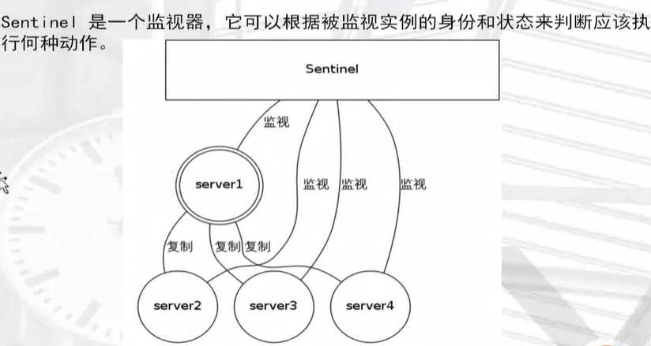

## sentinel功能

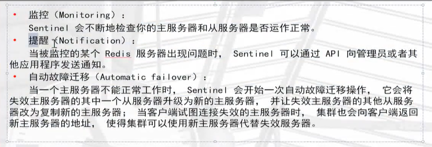

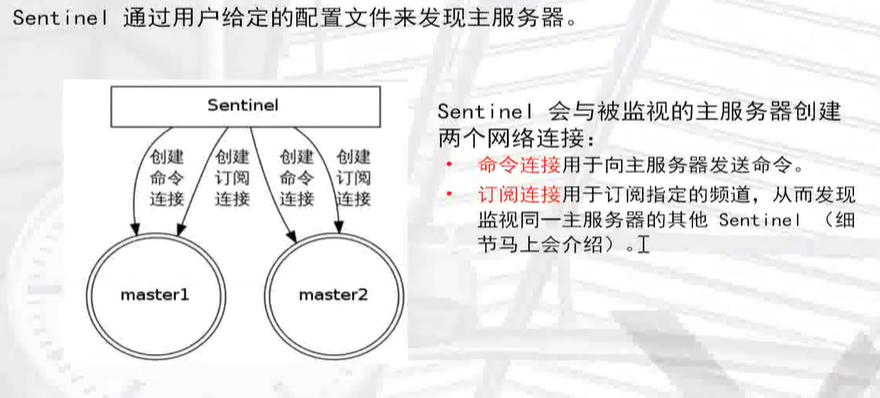

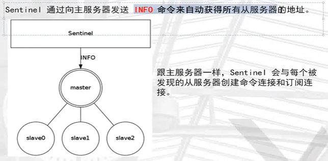

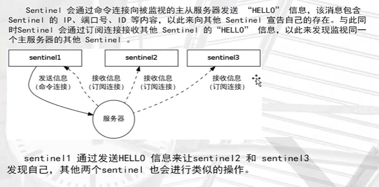

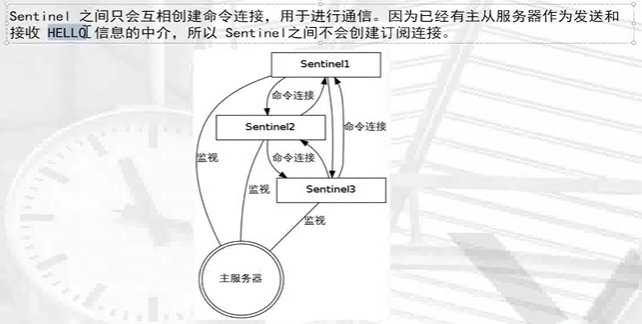

## 检测实例的状态

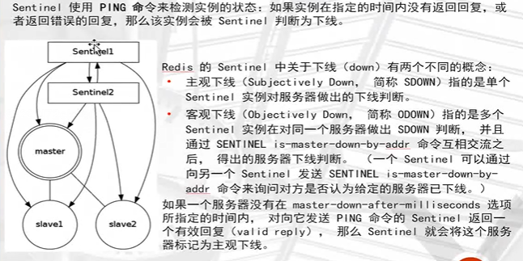

## 故障转移failover


## 搭建sentinel集群

```
[root@redis ~]# mkdir /data/26380
[root@redis ~]# cd /data/26380/


#sentinel配置文件
[root@redis 26380]# cat sentinel.conf 
port 26380
dir "/data/26380"
sentinel monitor mymaster 127.0.0.1 6380 1
sentinel down-after-milliseconds mymaster 2000
logfile "/data/26380/sentinel.log"
```

```
port 26380  #端口
dir "/data/26380"  #存放目录
sentinel monitor mymaster 127.0.0.1 6380 1  #主节点名 服务器ip  端口  1台sentinel写 1 ，两台及及以上写2
sentinel down-after-milliseconds mymaster 2000  #2秒还链接不上，就切换节点
logfile "/data/26380/sentinel.log"  #日志文件
```

## 启动sentinel集群

```
[root@redis 26380]# redis-sentinel /data/26380/sentinel.conf &
[1] 6290

[root@redis 26380]# ps -ef|grep redis
root       4602      1  0 04:05 ?        00:00:37 redis-server *:6381
root       4606      1  0 04:05 ?        00:00:37 redis-server *:6382
root       6270      1  0 12:30 ?        00:00:00 redis-server *:6380
root       6290   6023  0 12:32 pts/0    00:00:00 redis-sentinel *:26380 [sentinel]
root       6294   6023  0 12:32 pts/0    00:00:00 grep --color=auto redis

#查看sentinel后台日志
[root@redis 26380]# cat /data/26380/sentinel.log 
6249:X 06 Mar 12:26:53.050 * Increased maximum number of open files to 10032 (it was originally set to 1024).
                _._                                                  
           _.-``__ ''-._                                             
      _.-``    `.  `_.  ''-._           Redis 3.2.12 (00000000/0) 64 bit
  .-`` .-```.  ```\/    _.,_ ''-._                                   
 (    '      ,       .-`  | `,    )     Running in sentinel mode
 |`-._`-...-` __...-.``-._|'` _.-'|     Port: 26380
 |    `-._   `._    /     _.-'    |     PID: 6249
  `-._    `-._  `-./  _.-'    _.-'                                   
 |`-._`-._    `-.__.-'    _.-'_.-'|                                  
 |    `-._`-._        _.-'_.-'    |           http://redis.io        
  `-._    `-._`-.__.-'_.-'    _.-'                                   
 |`-._`-._    `-.__.-'    _.-'_.-'|                                  
 |    `-._`-._        _.-'_.-'    |                                  
  `-._    `-._`-.__.-'_.-'    _.-'                                   
      `-._    `-.__.-'    _.-'                                       
          `-._        _.-'                                           
              `-.__.-'                                               

6249:X 06 Mar 12:26:53.059 # WARNING: The TCP backlog setting of 511 cannot be enforced because /proc/sys/net/core/somaxconn is set to the lower value of 128.
6249:X 06 Mar 12:26:53.061 # Sentinel ID is 3073a0f3490bfdc4493fb38ed7ef9aaae19ff7ea
6249:X 06 Mar 12:26:53.061 # +monitor master mymaster 127.0.0.1 6380 quorum 1
```

## 模拟主库宕机

```
[root@redis 26380]# redis-cli -p 6380 shutdown

#发现日志中已经通过sentinel自动切换节点了
[root@redis 26380]# cat /data/26380/sentinel.log 
6290:X 06 Mar 12:34:12.367 # +try-failover master mymaster 127.0.0.1 6380
6290:X 06 Mar 12:34:12.370 # +vote-for-leader 3073a0f3490bfdc4493fb38ed7ef9aaae19ff7ea 1
6290:X 06 Mar 12:34:12.370 # +elected-leader master mymaster 127.0.0.1 6380
6290:X 06 Mar 12:34:12.370 # +failover-state-select-slave master mymaster 127.0.0.1 6380
6290:X 06 Mar 12:34:12.439 # +selected-slave slave 127.0.0.1:6381 127.0.0.1 6381 @ mymaster 127.0.0.1 6380
6290:X 06 Mar 12:34:12.439 * +failover-state-send-slaveof-noone slave 127.0.0.1:6381 127.0.0.1 6381 @ mymaster 127.0.0.1 6380
6290:X 06 Mar 12:34:12.526 * +failover-state-wait-promotion slave 127.0.0.1:6381 127.0.0.1 6381 @ mymaster 127.0.0.1 6380
6290:X 06 Mar 12:34:13.329 # +promoted-slave slave 127.0.0.1:6381 127.0.0.1 6381 @ mymaster 127.0.0.1 6380
6290:X 06 Mar 12:34:13.329 # +failover-state-reconf-slaves master mymaster 127.0.0.1 6380
6290:X 06 Mar 12:34:13.390 * +slave-reconf-sent slave 127.0.0.1:6382 127.0.0.1 6382 @ mymaster 127.0.0.1 6380
6290:X 06 Mar 12:34:14.354 * +slave-reconf-inprog slave 127.0.0.1:6382 127.0.0.1 6382 @ mymaster 127.0.0.1 6380
6290:X 06 Mar 12:34:14.354 * +slave-reconf-done slave 127.0.0.1:6382 127.0.0.1 6382 @ mymaster 127.0.0.1 6380
6290:X 06 Mar 12:34:14.430 # +failover-end master mymaster 127.0.0.1 6380
6290:X 06 Mar 12:34:14.430 # +switch-master mymaster 127.0.0.1 6380 127.0.0.1 6381
6290:X 06 Mar 12:34:14.431 * +slave slave 127.0.0.1:6382 127.0.0.1 6382 @ mymaster 127.0.0.1 6381
6290:X 06 Mar 12:34:14.431 * +slave slave 127.0.0.1:6380 127.0.0.1 6380 @ mymaster 127.0.0.1 6381
6290:X 06 Mar 12:34:16.465 # +sdown slave 127.0.0.1:6380 127.0.0.1 6380 @ mymaster 127.0.0.1 6381
```

> 查看6381节点

```
[root@redis 26380]# redis-cli -p 6381
127.0.0.1:6381> info replication
# Replication
role:master    <--------已经变成主节点了
connected_slaves:1
slave0:ip=127.0.0.1,port=6382,state=online,offset=2474,lag=1
master_repl_offset:2607
repl_backlog_active:1
repl_backlog_size:1048576
repl_backlog_first_byte_offset:2
repl_backlog_histlen:2606
127.0.0.1:6381> exit
[root@redis 26380]# ls
sentinel.conf  sentinel.log
```

> 恢复6380节点

```
[root@redis data]# redis-server /data/6380/redis.conf 
[root@redis data]# redis-cli -p 6380
127.0.0.1:6380> info replication
# Replication
role:slave         <--------6380自动切换为副节点了
master_host:127.0.0.1
master_port:6381
master_link_status:up
master_last_io_seconds_ago:1
master_sync_in_progress:0
slave_repl_offset:26395
slave_priority:100
slave_read_only:1
connected_slaves:0
master_repl_offset:0
repl_backlog_active:0
repl_backlog_size:1048576
repl_backlog_first_byte_offset:0
repl_backlog_histlen:0
```

## reids事务管理

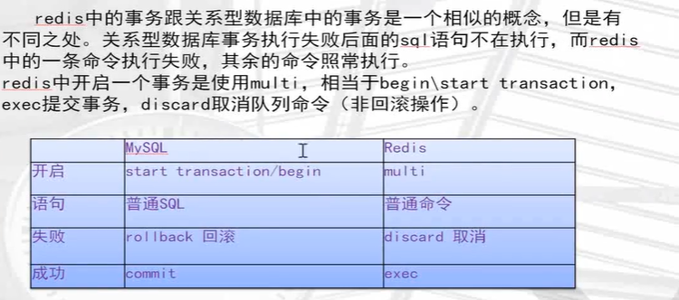

## 事务命令

discard

- 取消事务

exec

- 执行所有事务块内的命令

multi

- 标记一个事务块的开始

unwatch

- 取消watch命令对所有key的监视

watch key [key..]

- 监视一个或多个key，如果在事务执行之前这个key会被其他命令所改动，那么事务会被打断

```bash
127.0.0.1:6379> multi
OK
127.0.0.1:6379> set a 1
QUEUED
127.0.0.1:6379> set a 2
QUEUED
127.0.0.1:6379> set a 3
QUEUED
127.0.0.1:6379> exec
1) OK
2) OK
3) OK
127.0.0.1:6379> multi
OK
127.0.0.1:6379> set a 10
QUEUED
127.0.0.1:6379> set b 20
QUEUED
127.0.0.1:6379> set c 30
QUEUED
127.0.0.1:6379> discard
OK
127.0.0.1:6379> exec
(error) ERR EXEC without MULTI

```


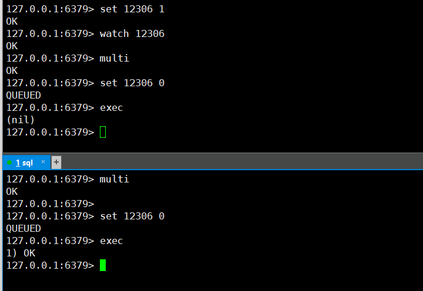

## redis cluster

结合高可用，可性能两个方面的技术。redis官方自带的解决方案


## redis集群

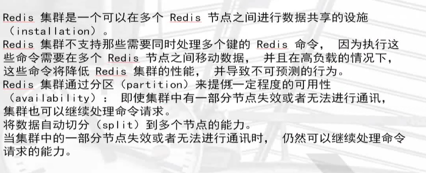

## redis集群示意图

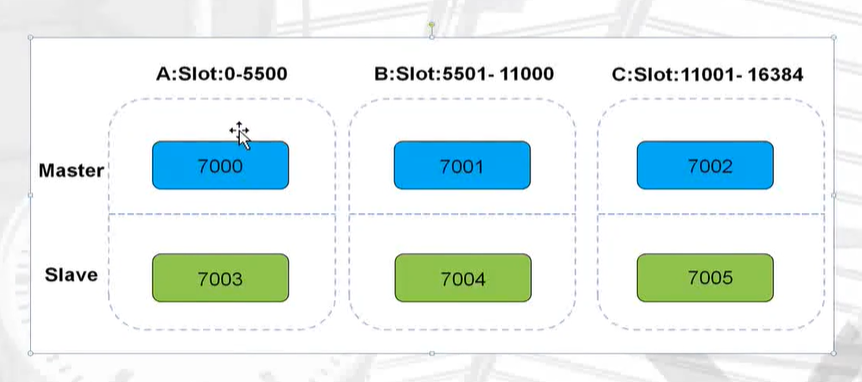

## redis集群数据共享

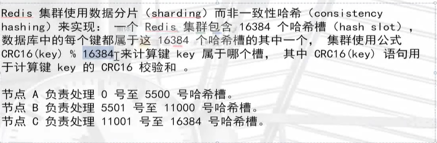

## 槽的计算公式

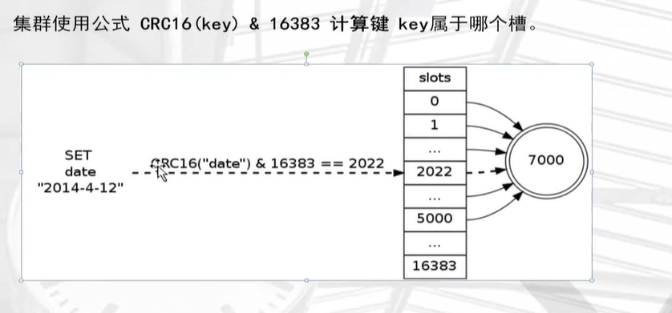

## 运行机制


## 集群的复制

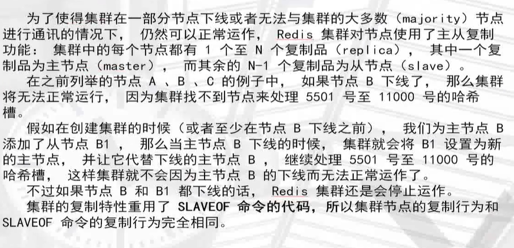

## 集群的故障转移


## 命令发送给正确的节点


## 命令发送给错误的节点

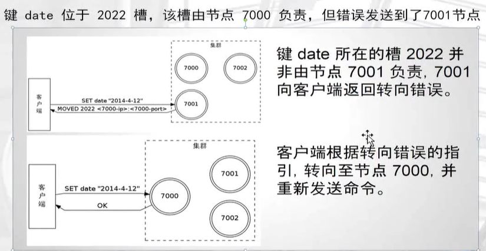

## 转向错误的实现


## 部署Cluster集群

```
安装ruby 源
yum install -y ruby rubygems

确实gem软件是否可用，替换阿里云源
gem sources -l
gem sources -a http://mirrors.aliyun.com/rubygems/
gem sources --remove https://rubygems.org/
gem sources -l

安装redis集群插件
gem install redis -v 3.3.3
```

准备三台linux虚拟机部署

```
redis 192.168.6.81      部署 7000 7003
node01 192.168.6.30		部署 7001 7004    ------>主从配置一台服务器配置一主一从
node02 192.168.6.44		部署 7002 7005

事先关闭防火墙，selinux
```

配置文件解释

```
port 7000   端口
daemonize yes   
pidfile /redisCluster/7000/redis.pid
loglevel notice
logfile "/redisCluster/7000/redis.log"
dbfilename dump.rdb
dir /redisCluster/7000
protected-mode no
cluster-enabled yes   打开集群功能
cluster-config-file nodes.conf   集群配置文件存放名字
cluster-node-timeout 2000       判断集群节点故障，设置实践为2秒
appendonly yes   aof持久化功能开启
```

准备配置文件(准备六个改端口，或者写脚本部署)

```
[root@redis redisCluster]# cat 7000/redis.conf 
port 7000
daemonize yes
pidfile /redisCluster/7000/redis.pid
loglevel notice
logfile "/redisCluster/7000/redis.log"
dbfilename dump.rdb
dir /redisCluster/7000
protected-mode no
cluster-enabled yes
cluster-config-file nodes.conf
cluster-node-timeout 2000
appendonly yes


[root@node02 redisCluster]# cat 7001/redis.conf 
port 7001
daemonize yes
pidfile /redisCluster/7001/redis.pid
loglevel notice
logfile "/redisCluster/7001/redis.log"
dbfilename dump.rdb
dir /redisCluster/7001
protected-mode no
cluster-enabled yes
cluster-config-file nodes.conf
cluster-node-timeout 2000
appendonly yes


[root@node02 redisCluster]# cat 7002/redis.conf 
port 7002
daemonize yes
pidfile /redisCluster/7002/redis.pid
loglevel notice
logfile "/redisCluster/7002/redis.log"
dbfilename dump.rdb
dir /redisCluster/7002
protected-mode no
cluster-enabled yes
cluster-config-file nodes.conf
cluster-node-timeout 2000
appendonly yes

```

启动节点

```
#redis
[root@redis redisCluster]# redis-server /redisCluster/7000/redis.conf 
[root@redis redisCluster]# redis-server /redisCluster/7003/redis.conf 

#node01
[root@node02 ~]# redis-server /redisCluster/7001/redis.conf
[root@node02 ~]# redis-server /redisCluster/7004/redis.conf

#node02
[root@node02 redisCluster]# redis-server /redisCluster/7002/redis.conf
[root@node02 redisCluster]# redis-server /redisCluster/7005/redis.conf
```

### 将节点加入集群管理

```
redis-trib.rb create --replicas 1 192.168.6.81:7000 192.168.6.30:7001 192.168.6.44:7002 192.168.6.81:7003 192.168.6.30:7004 192.168.6.44:7005

#解释：
通过ruby插件来创建 每台服务器是一主一从的结构，前三个节点是主，后三个节点是从
```

```
>>> Creating cluster
>>> Performing hash slots allocation on 6 nodes...
Using 3 masters:
192.168.6.81:7000
192.168.6.30:7001
192.168.6.44:7002
Adding replica 192.168.6.30:7004 to 192.168.6.81:7000
Adding replica 192.168.6.81:7003 to 192.168.6.30:7001
Adding replica 192.168.6.44:7005 to 192.168.6.44:7002
M: c2650ecef91df86d2d1720c650e6aab9cc5328d3 192.168.6.81:7000
   slots:0-5460 (5461 slots) master
M: caa42f7c0e2662409c5a308b82fcb169d4300276 192.168.6.30:7001
   slots:5461-10922 (5462 slots) master
M: 6cdeb14fca4ea27a9237228e9d050cbf480ce4f7 192.168.6.44:7002
   slots:10923-16383 (5461 slots) master
S: 1a03e9a6afb0f70bda02315f26cad16f7894edba 192.168.6.81:7003
   replicates caa42f7c0e2662409c5a308b82fcb169d4300276
S: 6ff19a0696823fa58983a206d7c1c43bfde3aceb 192.168.6.30:7004
   replicates c2650ecef91df86d2d1720c650e6aab9cc5328d3
S: 6050d56cce0d8c83ac45af05e1431c6b970d2e92 192.168.6.44:7005
   replicates 6cdeb14fca4ea27a9237228e9d050cbf480ce4f7
Can I set the above configuration? (type 'yes' to accept): yes
```

### 查看主从节点状态

主节点

```
[root@redis redisCluster]# redis-cli -p 7000 cluster nodes |grep master
caa42f7c0e2662409c5a308b82fcb169d4300276 192.168.6.30:7001 master - 0 1646568770490 2 connected 5461-10922
6cdeb14fca4ea27a9237228e9d050cbf480ce4f7 192.168.6.44:7002 master - 0 1646568769978 3 connected 10923-16383
c2650ecef91df86d2d1720c650e6aab9cc5328d3 192.168.6.81:7000 myself,master - 0 0 1 connected 0-5460
```

从节点

```
[root@redis redisCluster]# redis-cli -p 7000 cluster nodes |grep slave
1a03e9a6afb0f70bda02315f26cad16f7894edba 192.168.6.81:7003 slave caa42f7c0e2662409c5a308b82fcb169d4300276 0 1646568786307 4 connected
6050d56cce0d8c83ac45af05e1431c6b970d2e92 192.168.6.44:7005 slave 6cdeb14fca4ea27a9237228e9d050cbf480ce4f7 0 1646568786817 6 connected
6ff19a0696823fa58983a206d7c1c43bfde3aceb 192.168.6.30:7004 slave c2650ecef91df86d2d1720c650e6aab9cc5328d3 0 1646568786307 5 connected
```

## 集群节点管理

新增加两个节点7006 7007

```
[root@redis ~]# mkdir /redisCluster/700{6..7}
[root@redis redisCluster]# vim /redisCluster/7006/redis.conf
[root@redis redisCluster]# vim /redisCluster/7007/redis.conf

```

```
port 7006
daemonize yes
pidfile /redisCluster/7006/redis.pid
loglevel notice
logfile "/redisCluster/7006/redis.log"
dbfilename dump.rdb
dir /redisCluster/7006
protected-mode no
cluster-enabled yes
cluster-config-file nodes.conf
cluster-node-timeout 2000
appendonly yes
```

```
port 7007
daemonize yes
pidfile /redisCluster/7007/redis.pid
loglevel notice
logfile "/redisCluster/7007/redis.log"
dbfilename dump.rdb
dir /redisCluster/7007
protected-mode no
cluster-enabled yes
cluster-config-file nodes.conf
cluster-node-timeout 2000
appendonly yes
```

### 启动

```
[root@redis redisCluster]# redis-server /redisCluster/7006/redis.conf 
[root@redis redisCluster]# redis-server /redisCluster/7007/redis.conf 
```

### 查看节点

```
[root@redis redisCluster]# netstat -tunlp|grep 700
tcp        0      0 0.0.0.0:17000           0.0.0.0:*               LISTEN      7834/redis-server * 
tcp        0      0 0.0.0.0:17003           0.0.0.0:*               LISTEN      7839/redis-server * 
tcp        0      0 0.0.0.0:17006           0.0.0.0:*               LISTEN      33081/redis-server  
tcp        0      0 0.0.0.0:17007           0.0.0.0:*               LISTEN      33085/redis-server  
```

### 添加主节点

```
# 添加主节点 将7006加入到7000所在的集群当中
[root@redis redisCluster]# redis-trib.rb add-node 192.168.6.81:7006 192.168.6.81:7000
>>> Adding node 192.168.6.81:7006 to cluster 192.168.6.81:7000
>>> Performing Cluster Check (using node 192.168.6.81:7000)
M: c2650ecef91df86d2d1720c650e6aab9cc5328d3 192.168.6.81:7000
   slots:0-5460 (5461 slots) master
   1 additional replica(s)
M: caa42f7c0e2662409c5a308b82fcb169d4300276 192.168.6.30:7001
   slots:5461-10922 (5462 slots) master
   1 additional replica(s)
S: 1a03e9a6afb0f70bda02315f26cad16f7894edba 192.168.6.81:7003
   slots: (0 slots) slave
   replicates caa42f7c0e2662409c5a308b82fcb169d4300276
S: 6cdeb14fca4ea27a9237228e9d050cbf480ce4f7 192.168.6.44:7002
   slots: (0 slots) slave
   replicates 6050d56cce0d8c83ac45af05e1431c6b970d2e92
M: 6050d56cce0d8c83ac45af05e1431c6b970d2e92 192.168.6.44:7005
   slots:10923-16383 (5461 slots) master
   1 additional replica(s)
S: 6ff19a0696823fa58983a206d7c1c43bfde3aceb 192.168.6.30:7004
   slots: (0 slots) slave
   replicates c2650ecef91df86d2d1720c650e6aab9cc5328d3
[OK] All nodes agree about slots configuration.
>>> Check for open slots...
>>> Check slots coverage...
[OK] All 16384 slots covered.
>>> Send CLUSTER MEET to node 192.168.6.81:7006 to make it join the cluster.
[OK] New node added correctly.

```

### 查询7006加入主节点状态

```
[root@redis redisCluster]# redis-cli -p 7000 cluster nodes |grep master
caa42f7c0e2662409c5a308b82fcb169d4300276 192.168.6.30:7001 master - 0 1646875709504 2 connected 5461-10922
6a5a20c67fb3e9f5f7c7f4f6fee1e29c38c7873d 192.168.6.81:7006 master - 0 1646875708788 0 connected  《----新加入节点并未有槽位
6050d56cce0d8c83ac45af05e1431c6b970d2e92 192.168.6.44:7005 master - 0 1646875709504 14 connected 10923-16383
c2650ecef91df86d2d1720c650e6aab9cc5328d3 192.168.6.81:7000 myself,master - 0 0 1 connected 0-5460

```

### 重新分片转移solt

规划重新进行槽位分配(solt)

```perl
#正常如果分配4个节点，要按照16384 / 4 来进行分配槽位，每个节点是4096个

redis-trib.rb reshard 192.168.6.81:7000    

#交互式配置
How many slots do you want to move (from 1 to 16384)? 4096    <-----  分配槽位数
What is the receiving node ID? 6a5a20c67fb3e9f5f7c7f4f6fee1e29c38c7873d   <------7006 nodeid 
Please enter all the source node IDs.
  Type 'all' to use all the nodes as source nodes for the hash slots.
  Type 'done' once you entered all the source nodes IDs.
Source node #1:all      <----- 这里填写 all 均匀分配槽位
Do you want to proceed with the proposed reshard plan (yes/no)?   yes  <----- 接受建议
```

查看槽位

```
[root@redis redisCluster]# redis-cli -p 7000 cluster nodes |grep master
caa42f7c0e2662409c5a308b82fcb169d4300276 192.168.6.30:7001 master - 0 1646876431207 2 connected 6827-10922
6a5a20c67fb3e9f5f7c7f4f6fee1e29c38c7873d 192.168.6.81:7006 master - 0 1646876430905 15 connected 0-1364 5461-6826 10923-12287   《-----已经分配成功了
6050d56cce0d8c83ac45af05e1431c6b970d2e92 192.168.6.44:7005 master - 0 1646876431207 14 connected 12288-16383
c2650ecef91df86d2d1720c650e6aab9cc5328d3 192.168.6.81:7000 myself,master - 0 0 1 connected 1365-5460

```

### 添加从节点

```
# redis-trib.rb add-node --slave --master-id 主节点nodeid  192.168.6.81:7007 192.168.6.81:7000

redis-trib.rb add-node --slave --master-id c2650ecef91df86d2d1720c650e6aab9cc5328d3  192.168.6.81:7007 192.168.6.81:7000
```

### 删除节点

首先将需要删除的节点槽位slot移除

```
# 删除一个节点，删除master节点之前首先要使用reshard移除master的全部slot,然后在删除当前节点
[root@redis redisCluster]# redis-trib.rb reshard 192.168.6.81:7000
How many slots do you want to move (from 1 to 16384)? 4096    《---- 删除4096个槽位
What is the receiving node ID? c2650ecef91df86d2d1720c650e6aab9cc5328d3   <-----定位7000节点
Source node #1:6a5a20c67fb3e9f5f7c7f4f6fee1e29c38c7873d     《--------删除7006节点
Source node #2:done         《------没有节点直接done就好
Do you want to proceed with the proposed reshard plan (yes/no)? yes
```

先删除从节点

```
[root@redis redisCluster]# redis-trib.rb del-node 192.168.6.81:7007 8ce474f6c4ee93020cec02a451069110608506fe
>>> Removing node 8ce474f6c4ee93020cec02a451069110608506fe from cluster 192.168.6.81:7007
>>> Sending CLUSTER FORGET messages to the cluster...
>>> SHUTDOWN the node.
```

删除主节点

```
[root@redis redisCluster]# redis-trib.rb del-node 192.168.6.81:7006 6a5a20c67fb3e9f5f7c7f4f6fee1e29c38c7873d
>>> Removing node 6a5a20c67fb3e9f5f7c7f4f6fee1e29c38c7873d from cluster 192.168.6.81:7006
>>> Sending CLUSTER FORGET messages to the cluster...
>>> SHUTDOWN the node.
```

## redis_api

redis客户端链接工具官网：http://redis.cn/clients.html

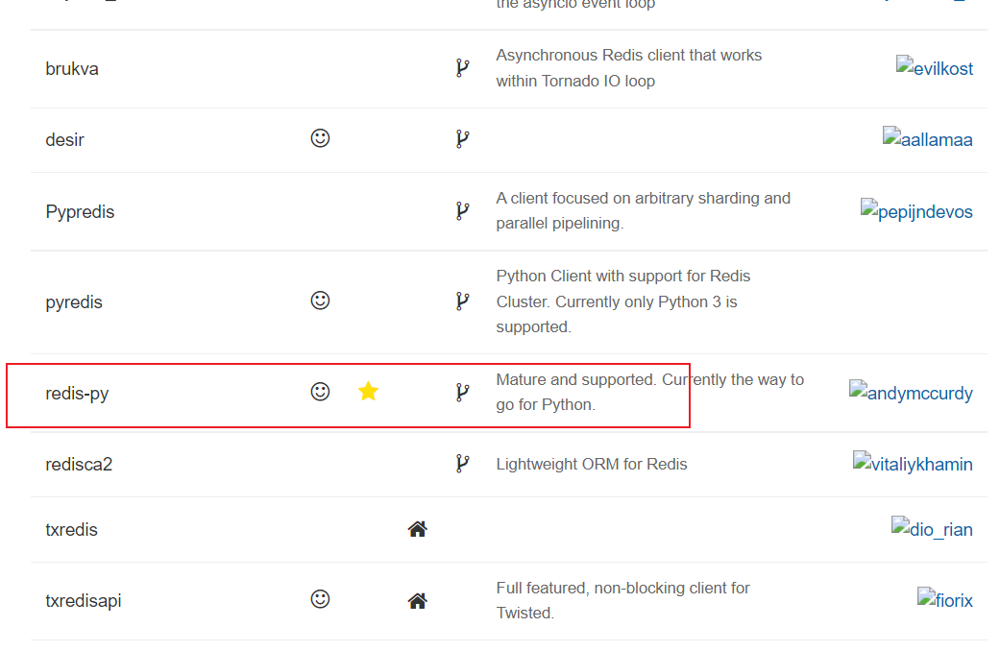

旧版本下载地址：https://github.com/Grokzen/redis-py-cluster/releases

##  搭建python开发环境

```
##安装之前，检查python版本
[root@redis python]# python --version
Python 2.7.5

tar -xf Python-3.5.2.tar.xz 
cd Python-3.5.2
./configure
make && make install

```

## 安装Redis-py驱动程序

Redis-py提供两个类Redis和StrictRedis用于实现Redis的命令：

1. StrictRedis用于实现大部分官方的命令，并使用官方的语法和命令（比如：SET命令对应与StrictRedis.set方法）。(**开发推荐使用**)
2. Redis是StrictRedis的子类，用于向后兼容旧版本的redis-py。

```
#下载
https://github.com/Grokzen/redis-py-cluster/releases

tar xf redis-py-cluster-2.1.0.tar.gz

cd redis-py-cluster-2.1.0

#安装驱动
python3 setup.py install

#导入redis包，没有报错，驱动安装成功
[root@redis redis-py-cluster-2.1.0]# python3
Python 3.5.2 (default, Mar 10 2022, 13:43:42) 
[GCC 4.8.5 20150623 (Red Hat 4.8.5-44)] on linux
Type "help", "copyright", "credits" or "license" for more information.
>>> import redis


#升级到2.10.6
pip3 install redis-py-cluster

```

## 安装Redis-py-cluster驱动程序

Redis-py并没有提供Redis-cluster的支持，需要下载redis-py-cluster包。

```
#下载源码包
wget https://github.com/Grokzen/redis-py-cluster/archive/1.3.6.tar.gz
#解压
tar xf 1.3.6.tar.gz 

cd redis-py-cluster-1.3.6

#安装
python3 setup.py install
```

## 测试API读写功能

python3

> 使用python交互模式，在命令开头不能有任何空格，否则，会出现报错。

```
from rediscluster import StrictRedisCluster
startup_nodes = [{"host": "192.168.6.81", "port": "7000"}]
conn = StrictRedisCluster(startup_nodes=startup_nodes, decode_responses=True)
conn.set("msg","Nice to meet you")
```

```
[root@redis redis-py-cluster-1.3.6]# python3
Python 3.5.2 (default, Mar 10 2022, 13:43:42) 
[GCC 4.8.5 20150623 (Red Hat 4.8.5-44)] on linux
Type "help", "copyright", "credits" or "license" for more information.
>>> from rediscluster import StrictRedisCluster
>>> startup_nodes = [{"host": "192.168.6.81", "port": "7000"}]
>>> conn = StrictRedisCluster(startup_nodes=startup_nodes, decode_responses=True)
>>> conn.set("msg","Nice to meet you")
True

```

