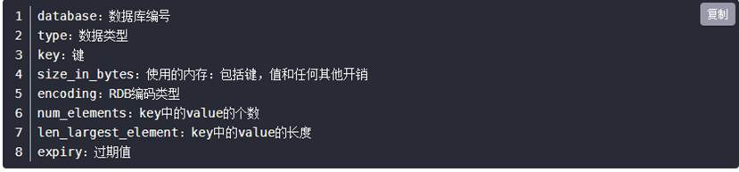
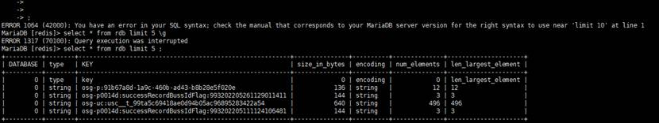

# Redis内存分析工具之redis-rdb-tools的安装与使用

## 1.在本地的虚拟机中安装redis-rdb-tools工具

首先需要安装python：

安装：

（1）安装libffi-devel：

```
yum -y install zlib-devel bzip2-devel openssl-devel ncurses-devel sqlite-devel readline-devel tk-devel gdbm-devel db4-devel libpcap-devel xz-devel libffi-devel
```

（2）下载python安装包（https://www.python.org/ftp/python/）

```
wget -P /tmp https://www.python.org/ftp/python/3.7.3/Python-3.7.3.tgz
```

（3）解压

```
mkdir -p /opt/python3 

tar -zxvf /tmp/Python-3.7.3.tgz -C /opt/python3
```

（4）编译

```
mkdir /usr/local/python3 

cd /opt/python3/Python-3.7.3 

./configure --prefix=/usr/local/python3

make && make install
```

（5）建立软连接

```
ln -s /usr/local/python3/bin/python3.7 /usr/bin/python3

ln -s /usr/local/python3/bin/pip3.7 /usr/bin/pip3
```

（6）测试

```
[root@192 Python-3.7.3]# python3

Python 3.7.3 (default, Mar 16 2022, 22:53:03)

[GCC 4.8.5 20150623 (Red Hat 4.8.5-44)] on linux

Type help, copyright, credits or license for more information.
```

2.使用pip安装rdb-tools

（1）安装依赖

```
sudo yum install python3-devel
```

（2）安装python-lzf

```
sudo pip3 install python-lzf
```

（3）安装rdbtools

```
sudo pip3 install rdbtools
```

3.使用rdb-tools工具分析rdb文件

```
将rdb文件转成csv文件   （dump.rdb文件是redis的全量备份文件）
rdb -c memory dump.rdb  > memory.csv 
```

（1）文件小的化可以直接用wps打开csv文件

用工具转化成csv文件后，会划分成8个列，分别是：



（2)文件过大也可以将生成的csv文件load进mysql数据库里方便查询

具体方法

安装mysql（这里使用的是mariadb）

```
yum -y install mariadb mariadb-server

systemctl start mariadb

mysql（进入mysql）
```

sql语句：

```
create database redis；

use redis

CREATE TABLE `rdb` (
	`database` int DEFAULT NULL,
	`type` varchar(128) DEFAULT NULL,
	`key` varchar(256) DEFAULT NULL,
	`size_in_bytes` int DEFAULT NULL,
	`encoding` varchar(256) DEFAULT NULL,
	`num_elements` int DEFAULT NULL,
	`len_largest_element` varchar(256) DEFAULT NULL,
	`expiry` varchar(256) DEFAULT NULL
) ENGINE=InnoDB DEFAULT CHARSET=utf8mb4;    

 load data infile 'memory.csv' into table redis.rdb CHARACTER SET utf8 FIELDS TERMINATED BY ',';
```

可以将一个redis的所有分片放进一个表里，创建多个表



 

 

 

 

 

 

 

 

 

 

 

 

 