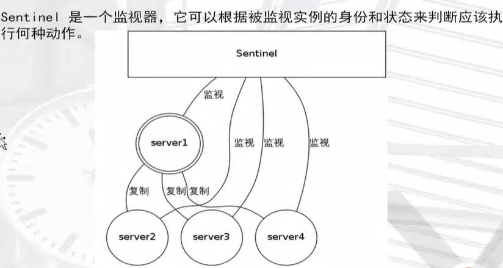
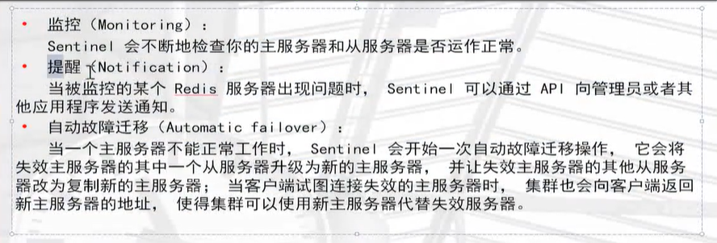
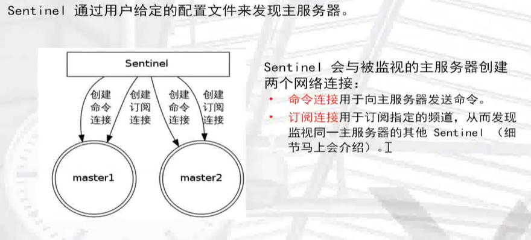
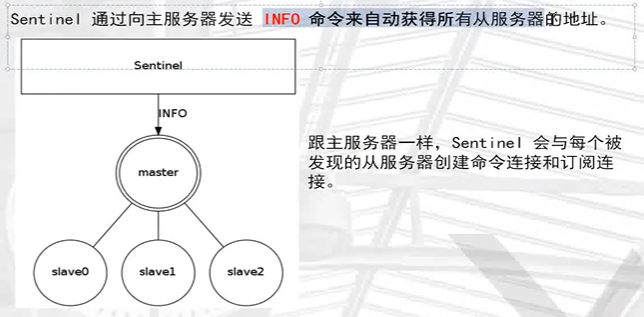
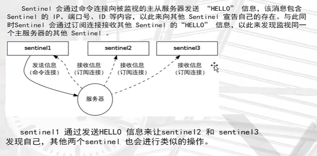
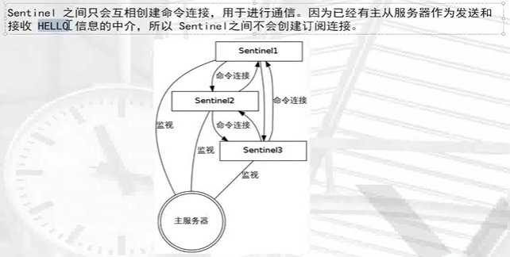
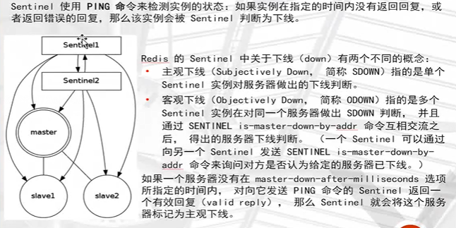
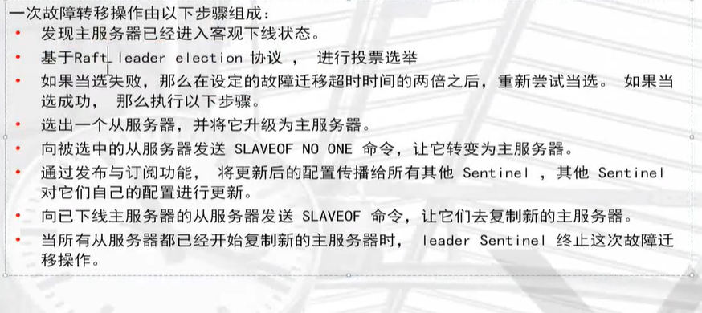

## redis高可用


## sentinel的构造



## sentinel功能











## 检测实例的状态



## 故障转移failover



## 搭建sentinel集群

```
[root@redis ~]# mkdir /data/26380
[root@redis ~]# cd /data/26380/


#sentinel配置文件
[root@redis 26380]# cat sentinel.conf 
port 26380
dir "/data/26380"
sentinel monitor mymaster 127.0.0.1 6380 1
sentinel down-after-milliseconds mymaster 2000
logfile "/data/26380/sentinel.log"
```

```
port 26380  #端口
dir "/data/26380"  #存放目录
sentinel monitor mymaster 127.0.0.1 6380 1  #主节点名 服务器ip  端口  1台sentinel写 1 ，两台及及以上写2
sentinel down-after-milliseconds mymaster 2000  #2秒还链接不上，就切换节点
logfile "/data/26380/sentinel.log"  #日志文件
```

## 启动sentinel集群

```
[root@redis 26380]# redis-sentinel /data/26380/sentinel.conf &
[1] 6290

[root@redis 26380]# ps -ef|grep redis
root       4602      1  0 04:05 ?        00:00:37 redis-server *:6381
root       4606      1  0 04:05 ?        00:00:37 redis-server *:6382
root       6270      1  0 12:30 ?        00:00:00 redis-server *:6380
root       6290   6023  0 12:32 pts/0    00:00:00 redis-sentinel *:26380 [sentinel]
root       6294   6023  0 12:32 pts/0    00:00:00 grep --color=auto redis

#查看sentinel后台日志
[root@redis 26380]# cat /data/26380/sentinel.log 
6249:X 06 Mar 12:26:53.050 * Increased maximum number of open files to 10032 (it was originally set to 1024).
                _._                                                  
           _.-``__ ''-._                                             
      _.-``    `.  `_.  ''-._           Redis 3.2.12 (00000000/0) 64 bit
  .-`` .-```.  ```\/    _.,_ ''-._                                   
 (    '      ,       .-`  | `,    )     Running in sentinel mode
 |`-._`-...-` __...-.``-._|'` _.-'|     Port: 26380
 |    `-._   `._    /     _.-'    |     PID: 6249
  `-._    `-._  `-./  _.-'    _.-'                                   
 |`-._`-._    `-.__.-'    _.-'_.-'|                                  
 |    `-._`-._        _.-'_.-'    |           http://redis.io        
  `-._    `-._`-.__.-'_.-'    _.-'                                   
 |`-._`-._    `-.__.-'    _.-'_.-'|                                  
 |    `-._`-._        _.-'_.-'    |                                  
  `-._    `-._`-.__.-'_.-'    _.-'                                   
      `-._    `-.__.-'    _.-'                                       
          `-._        _.-'                                           
              `-.__.-'                                               

6249:X 06 Mar 12:26:53.059 # WARNING: The TCP backlog setting of 511 cannot be enforced because /proc/sys/net/core/somaxconn is set to the lower value of 128.
6249:X 06 Mar 12:26:53.061 # Sentinel ID is 3073a0f3490bfdc4493fb38ed7ef9aaae19ff7ea
6249:X 06 Mar 12:26:53.061 # +monitor master mymaster 127.0.0.1 6380 quorum 1
```

## 模拟主库宕机

```
[root@redis 26380]# redis-cli -p 6380 shutdown

#发现日志中已经通过sentinel自动切换节点了
[root@redis 26380]# cat /data/26380/sentinel.log 
6290:X 06 Mar 12:34:12.367 # +try-failover master mymaster 127.0.0.1 6380
6290:X 06 Mar 12:34:12.370 # +vote-for-leader 3073a0f3490bfdc4493fb38ed7ef9aaae19ff7ea 1
6290:X 06 Mar 12:34:12.370 # +elected-leader master mymaster 127.0.0.1 6380
6290:X 06 Mar 12:34:12.370 # +failover-state-select-slave master mymaster 127.0.0.1 6380
6290:X 06 Mar 12:34:12.439 # +selected-slave slave 127.0.0.1:6381 127.0.0.1 6381 @ mymaster 127.0.0.1 6380
6290:X 06 Mar 12:34:12.439 * +failover-state-send-slaveof-noone slave 127.0.0.1:6381 127.0.0.1 6381 @ mymaster 127.0.0.1 6380
6290:X 06 Mar 12:34:12.526 * +failover-state-wait-promotion slave 127.0.0.1:6381 127.0.0.1 6381 @ mymaster 127.0.0.1 6380
6290:X 06 Mar 12:34:13.329 # +promoted-slave slave 127.0.0.1:6381 127.0.0.1 6381 @ mymaster 127.0.0.1 6380
6290:X 06 Mar 12:34:13.329 # +failover-state-reconf-slaves master mymaster 127.0.0.1 6380
6290:X 06 Mar 12:34:13.390 * +slave-reconf-sent slave 127.0.0.1:6382 127.0.0.1 6382 @ mymaster 127.0.0.1 6380
6290:X 06 Mar 12:34:14.354 * +slave-reconf-inprog slave 127.0.0.1:6382 127.0.0.1 6382 @ mymaster 127.0.0.1 6380
6290:X 06 Mar 12:34:14.354 * +slave-reconf-done slave 127.0.0.1:6382 127.0.0.1 6382 @ mymaster 127.0.0.1 6380
6290:X 06 Mar 12:34:14.430 # +failover-end master mymaster 127.0.0.1 6380
6290:X 06 Mar 12:34:14.430 # +switch-master mymaster 127.0.0.1 6380 127.0.0.1 6381
6290:X 06 Mar 12:34:14.431 * +slave slave 127.0.0.1:6382 127.0.0.1 6382 @ mymaster 127.0.0.1 6381
6290:X 06 Mar 12:34:14.431 * +slave slave 127.0.0.1:6380 127.0.0.1 6380 @ mymaster 127.0.0.1 6381
6290:X 06 Mar 12:34:16.465 # +sdown slave 127.0.0.1:6380 127.0.0.1 6380 @ mymaster 127.0.0.1 6381
```

> 查看6381节点

```
[root@redis 26380]# redis-cli -p 6381
127.0.0.1:6381> info replication
# Replication
role:master    <--------已经变成主节点了
connected_slaves:1
slave0:ip=127.0.0.1,port=6382,state=online,offset=2474,lag=1
master_repl_offset:2607
repl_backlog_active:1
repl_backlog_size:1048576
repl_backlog_first_byte_offset:2
repl_backlog_histlen:2606
127.0.0.1:6381> exit
[root@redis 26380]# ls
sentinel.conf  sentinel.log
```

> 恢复6380节点

```
[root@redis data]# redis-server /data/6380/redis.conf 
[root@redis data]# redis-cli -p 6380
127.0.0.1:6380> info replication
# Replication
role:slave         <--------6380自动切换为副节点了
master_host:127.0.0.1
master_port:6381
master_link_status:up
master_last_io_seconds_ago:1
master_sync_in_progress:0
slave_repl_offset:26395
slave_priority:100
slave_read_only:1
connected_slaves:0
master_repl_offset:0
repl_backlog_active:0
repl_backlog_size:1048576
repl_backlog_first_byte_offset:0
repl_backlog_histlen:0
```

