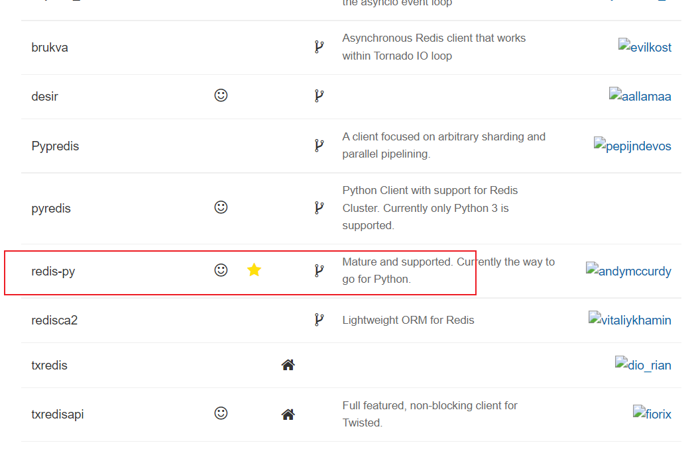

## redis_api

redis客户端链接工具官网：http://redis.cn/clients.html



旧版本下载地址：https://github.com/Grokzen/redis-py-cluster/releases

##  搭建python开发环境

```
##安装之前，检查python版本
[root@redis python]# python --version
Python 2.7.5

tar -xf Python-3.5.2.tar.xz 
cd Python-3.5.2
./configure
make && make install

```

## 安装Redis-py驱动程序

Redis-py提供两个类Redis和StrictRedis用于实现Redis的命令：

1. StrictRedis用于实现大部分官方的命令，并使用官方的语法和命令（比如：SET命令对应与StrictRedis.set方法）。(**开发推荐使用**)
2. Redis是StrictRedis的子类，用于向后兼容旧版本的redis-py。

```
#下载
https://github.com/Grokzen/redis-py-cluster/releases

tar xf redis-py-cluster-2.1.0.tar.gz

cd redis-py-cluster-2.1.0

#安装驱动
python3 setup.py install

#导入redis包，没有报错，驱动安装成功
[root@redis redis-py-cluster-2.1.0]# python3
Python 3.5.2 (default, Mar 10 2022, 13:43:42) 
[GCC 4.8.5 20150623 (Red Hat 4.8.5-44)] on linux
Type "help", "copyright", "credits" or "license" for more information.
>>> import redis


#升级到2.10.6
pip3 install redis-py-cluster

```

## 安装Redis-py-cluster驱动程序

Redis-py并没有提供Redis-cluster的支持，需要下载redis-py-cluster包。

```
#下载源码包
wget https://github.com/Grokzen/redis-py-cluster/archive/1.3.6.tar.gz
#解压
tar xf 1.3.6.tar.gz 

cd redis-py-cluster-1.3.6

#安装
python3 setup.py install
```

## 测试API读写功能

python3

> 使用python交互模式，在命令开头不能有任何空格，否则，会出现报错。

```
from rediscluster import StrictRedisCluster
startup_nodes = [{"host": "192.168.6.81", "port": "7000"}]
conn = StrictRedisCluster(startup_nodes=startup_nodes, decode_responses=True)
conn.set("msg","Nice to meet you")
```

```
[root@redis redis-py-cluster-1.3.6]# python3
Python 3.5.2 (default, Mar 10 2022, 13:43:42) 
[GCC 4.8.5 20150623 (Red Hat 4.8.5-44)] on linux
Type "help", "copyright", "credits" or "license" for more information.
>>> from rediscluster import StrictRedisCluster
>>> startup_nodes = [{"host": "192.168.6.81", "port": "7000"}]
>>> conn = StrictRedisCluster(startup_nodes=startup_nodes, decode_responses=True)
>>> conn.set("msg","Nice to meet you")
True

```

