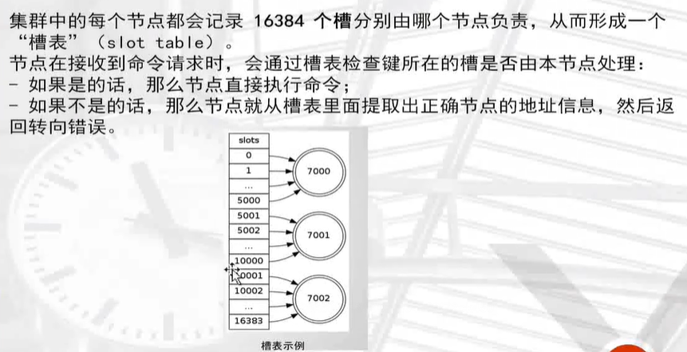

## redis cluster

结合高可用，可性能两个方面的技术。redis官方自带的解决方案


## redis集群


## redis集群示意图


## redis集群数据共享


## 槽的计算公式


## 运行机制


## 集群的复制


## 集群的故障转移


## 命令发送给正确的节点


## 命令发送给错误的节点


## 转向错误的实现




## 部署集群

```
安装ruby 源
yum install -y ruby rubygems

确实gem软件是否可用，替换阿里云源
gem sources -l
gem sources -a http://mirrors.aliyun.com/rubygems/
gem sources --remove https://rubygems.org/
gem sources -l

安装redis集群插件
gem install redis -v 3.3.3
```

准备三台linux虚拟机部署

```
redis 192.168.6.81      部署 7000 7003
node01 192.168.6.30		部署 7001 7004    ------>主从配置一台服务器配置一主一从
node02 192.168.6.44		部署 7002 7005

事先关闭防火墙，selinux
```

配置文件解释

```
port 7000   端口
daemonize yes   
pidfile /redisCluster/7000/redis.pid
loglevel notice
logfile "/redisCluster/7000/redis.log"
dbfilename dump.rdb
dir /redisCluster/7000
protected-mode no
cluster-enabled yes   打开集群功能
cluster-config-file nodes.conf   集群配置文件存放名字
cluster-node-timeout 2000       判断集群节点故障，设置实践为2秒
appendonly yes   aof持久化功能开启
```

准备配置文件(准备六个改端口，或者写脚本部署)

```
[root@redis redisCluster]# cat 7000/redis.conf 
port 7000
daemonize yes
pidfile /redisCluster/7000/redis.pid
loglevel notice
logfile "/redisCluster/7000/redis.log"
dbfilename dump.rdb
dir /redisCluster/7000
protected-mode no
cluster-enabled yes
cluster-config-file nodes.conf
cluster-node-timeout 2000
appendonly yes


[root@node02 redisCluster]# cat 7001/redis.conf 
port 7001
daemonize yes
pidfile /redisCluster/7001/redis.pid
loglevel notice
logfile "/redisCluster/7001/redis.log"
dbfilename dump.rdb
dir /redisCluster/7001
protected-mode no
cluster-enabled yes
cluster-config-file nodes.conf
cluster-node-timeout 2000
appendonly yes


[root@node02 redisCluster]# cat 7002/redis.conf 
port 7002
daemonize yes
pidfile /redisCluster/7002/redis.pid
loglevel notice
logfile "/redisCluster/7002/redis.log"
dbfilename dump.rdb
dir /redisCluster/7002
protected-mode no
cluster-enabled yes
cluster-config-file nodes.conf
cluster-node-timeout 2000
appendonly yes

```

启动节点

```
#redis
[root@redis redisCluster]# redis-server /redisCluster/7000/redis.conf 
[root@redis redisCluster]# redis-server /redisCluster/7003/redis.conf 

#node01
[root@node02 ~]# redis-server /redisCluster/7001/redis.conf
[root@node02 ~]# redis-server /redisCluster/7004/redis.conf

#node02
[root@node02 redisCluster]# redis-server /redisCluster/7002/redis.conf
[root@node02 redisCluster]# redis-server /redisCluster/7005/redis.conf
```

### 将节点加入集群管理

```
redis-trib.rb create --replicas 1 192.168.6.81:7000 192.168.6.30:7001 192.168.6.44:7002 192.168.6.81:7003 192.168.6.30:7004 192.168.6.44:7005

#解释：
通过ruby插件来创建 每台服务器是一主一从的结构，前三个节点是主，后三个节点是从
```

```
>>> Creating cluster
>>> Performing hash slots allocation on 6 nodes...
Using 3 masters:
192.168.6.81:7000
192.168.6.30:7001
192.168.6.44:7002
Adding replica 192.168.6.30:7004 to 192.168.6.81:7000
Adding replica 192.168.6.81:7003 to 192.168.6.30:7001
Adding replica 192.168.6.44:7005 to 192.168.6.44:7002
M: c2650ecef91df86d2d1720c650e6aab9cc5328d3 192.168.6.81:7000
   slots:0-5460 (5461 slots) master
M: caa42f7c0e2662409c5a308b82fcb169d4300276 192.168.6.30:7001
   slots:5461-10922 (5462 slots) master
M: 6cdeb14fca4ea27a9237228e9d050cbf480ce4f7 192.168.6.44:7002
   slots:10923-16383 (5461 slots) master
S: 1a03e9a6afb0f70bda02315f26cad16f7894edba 192.168.6.81:7003
   replicates caa42f7c0e2662409c5a308b82fcb169d4300276
S: 6ff19a0696823fa58983a206d7c1c43bfde3aceb 192.168.6.30:7004
   replicates c2650ecef91df86d2d1720c650e6aab9cc5328d3
S: 6050d56cce0d8c83ac45af05e1431c6b970d2e92 192.168.6.44:7005
   replicates 6cdeb14fca4ea27a9237228e9d050cbf480ce4f7
Can I set the above configuration? (type 'yes' to accept): yes
```

### 查看主从节点状态

主节点

```
[root@redis redisCluster]# redis-cli -p 7000 cluster nodes |grep master
caa42f7c0e2662409c5a308b82fcb169d4300276 192.168.6.30:7001 master - 0 1646568770490 2 connected 5461-10922
6cdeb14fca4ea27a9237228e9d050cbf480ce4f7 192.168.6.44:7002 master - 0 1646568769978 3 connected 10923-16383
c2650ecef91df86d2d1720c650e6aab9cc5328d3 192.168.6.81:7000 myself,master - 0 0 1 connected 0-5460
```

从节点

```
[root@redis redisCluster]# redis-cli -p 7000 cluster nodes |grep slave
1a03e9a6afb0f70bda02315f26cad16f7894edba 192.168.6.81:7003 slave caa42f7c0e2662409c5a308b82fcb169d4300276 0 1646568786307 4 connected
6050d56cce0d8c83ac45af05e1431c6b970d2e92 192.168.6.44:7005 slave 6cdeb14fca4ea27a9237228e9d050cbf480ce4f7 0 1646568786817 6 connected
6ff19a0696823fa58983a206d7c1c43bfde3aceb 192.168.6.30:7004 slave c2650ecef91df86d2d1720c650e6aab9cc5328d3 0 1646568786307 5 connected
```

## 集群节点管理

新增加两个节点7006 7007

```
[root@redis ~]# mkdir /redisCluster/700{6..7}
[root@redis redisCluster]# vim /redisCluster/7006/redis.conf
[root@redis redisCluster]# vim /redisCluster/7007/redis.conf

```

```
port 7006
daemonize yes
pidfile /redisCluster/7006/redis.pid
loglevel notice
logfile "/redisCluster/7006/redis.log"
dbfilename dump.rdb
dir /redisCluster/7006
protected-mode no
cluster-enabled yes
cluster-config-file nodes.conf
cluster-node-timeout 2000
appendonly yes
```

```
port 7007
daemonize yes
pidfile /redisCluster/7007/redis.pid
loglevel notice
logfile "/redisCluster/7007/redis.log"
dbfilename dump.rdb
dir /redisCluster/7007
protected-mode no
cluster-enabled yes
cluster-config-file nodes.conf
cluster-node-timeout 2000
appendonly yes
```

### 启动

```
[root@redis redisCluster]# redis-server /redisCluster/7006/redis.conf 
[root@redis redisCluster]# redis-server /redisCluster/7007/redis.conf 
```

### 查看节点

```
[root@redis redisCluster]# netstat -tunlp|grep 700
tcp        0      0 0.0.0.0:17000           0.0.0.0:*               LISTEN      7834/redis-server * 
tcp        0      0 0.0.0.0:17003           0.0.0.0:*               LISTEN      7839/redis-server * 
tcp        0      0 0.0.0.0:17006           0.0.0.0:*               LISTEN      33081/redis-server  
tcp        0      0 0.0.0.0:17007           0.0.0.0:*               LISTEN      33085/redis-server  
```

### 添加主节点

```
# 添加主节点 将7006加入到7000所在的集群当中
[root@redis redisCluster]# redis-trib.rb add-node 192.168.6.81:7006 192.168.6.81:7000
>>> Adding node 192.168.6.81:7006 to cluster 192.168.6.81:7000
>>> Performing Cluster Check (using node 192.168.6.81:7000)
M: c2650ecef91df86d2d1720c650e6aab9cc5328d3 192.168.6.81:7000
   slots:0-5460 (5461 slots) master
   1 additional replica(s)
M: caa42f7c0e2662409c5a308b82fcb169d4300276 192.168.6.30:7001
   slots:5461-10922 (5462 slots) master
   1 additional replica(s)
S: 1a03e9a6afb0f70bda02315f26cad16f7894edba 192.168.6.81:7003
   slots: (0 slots) slave
   replicates caa42f7c0e2662409c5a308b82fcb169d4300276
S: 6cdeb14fca4ea27a9237228e9d050cbf480ce4f7 192.168.6.44:7002
   slots: (0 slots) slave
   replicates 6050d56cce0d8c83ac45af05e1431c6b970d2e92
M: 6050d56cce0d8c83ac45af05e1431c6b970d2e92 192.168.6.44:7005
   slots:10923-16383 (5461 slots) master
   1 additional replica(s)
S: 6ff19a0696823fa58983a206d7c1c43bfde3aceb 192.168.6.30:7004
   slots: (0 slots) slave
   replicates c2650ecef91df86d2d1720c650e6aab9cc5328d3
[OK] All nodes agree about slots configuration.
>>> Check for open slots...
>>> Check slots coverage...
[OK] All 16384 slots covered.
>>> Send CLUSTER MEET to node 192.168.6.81:7006 to make it join the cluster.
[OK] New node added correctly.

```

### 查询7006加入主节点状态

```
[root@redis redisCluster]# redis-cli -p 7000 cluster nodes |grep master
caa42f7c0e2662409c5a308b82fcb169d4300276 192.168.6.30:7001 master - 0 1646875709504 2 connected 5461-10922
6a5a20c67fb3e9f5f7c7f4f6fee1e29c38c7873d 192.168.6.81:7006 master - 0 1646875708788 0 connected  《----新加入节点并未有槽位
6050d56cce0d8c83ac45af05e1431c6b970d2e92 192.168.6.44:7005 master - 0 1646875709504 14 connected 10923-16383
c2650ecef91df86d2d1720c650e6aab9cc5328d3 192.168.6.81:7000 myself,master - 0 0 1 connected 0-5460

```

### 重新分片转移solt

规划重新进行槽位分配(solt)

```perl
#正常如果分配4个节点，要按照16384 / 4 来进行分配槽位，每个节点是4096个

redis-trib.rb reshard 192.168.6.81:7000    

#交互式配置
How many slots do you want to move (from 1 to 16384)? 4096    <-----  分配槽位数
What is the receiving node ID? 6a5a20c67fb3e9f5f7c7f4f6fee1e29c38c7873d   <------7006 nodeid 
Please enter all the source node IDs.
  Type 'all' to use all the nodes as source nodes for the hash slots.
  Type 'done' once you entered all the source nodes IDs.
Source node #1:all      <----- 这里填写 all 均匀分配槽位
Do you want to proceed with the proposed reshard plan (yes/no)?   yes  <----- 接受建议
```

查看槽位

```
[root@redis redisCluster]# redis-cli -p 7000 cluster nodes |grep master
caa42f7c0e2662409c5a308b82fcb169d4300276 192.168.6.30:7001 master - 0 1646876431207 2 connected 6827-10922
6a5a20c67fb3e9f5f7c7f4f6fee1e29c38c7873d 192.168.6.81:7006 master - 0 1646876430905 15 connected 0-1364 5461-6826 10923-12287   《-----已经分配成功了
6050d56cce0d8c83ac45af05e1431c6b970d2e92 192.168.6.44:7005 master - 0 1646876431207 14 connected 12288-16383
c2650ecef91df86d2d1720c650e6aab9cc5328d3 192.168.6.81:7000 myself,master - 0 0 1 connected 1365-5460

```

### 添加从节点

```
# redis-trib.rb add-node --slave --master-id 主节点nodeid  192.168.6.81:7007 192.168.6.81:7000

redis-trib.rb add-node --slave --master-id c2650ecef91df86d2d1720c650e6aab9cc5328d3  192.168.6.81:7007 192.168.6.81:7000
```

### 删除节点

首先将需要删除的节点槽位slot移除

```
# 删除一个节点，删除master节点之前首先要使用reshard移除master的全部slot,然后在删除当前节点
[root@redis redisCluster]# redis-trib.rb reshard 192.168.6.81:7000
How many slots do you want to move (from 1 to 16384)? 4096    《---- 删除4096个槽位
What is the receiving node ID? c2650ecef91df86d2d1720c650e6aab9cc5328d3   <-----定位7000节点
Source node #1:6a5a20c67fb3e9f5f7c7f4f6fee1e29c38c7873d     《--------删除7006节点
Source node #2:done         《------没有节点直接done就好
Do you want to proceed with the proposed reshard plan (yes/no)? yes
```

先删除从节点

```
[root@redis redisCluster]# redis-trib.rb del-node 192.168.6.81:7007 8ce474f6c4ee93020cec02a451069110608506fe
>>> Removing node 8ce474f6c4ee93020cec02a451069110608506fe from cluster 192.168.6.81:7007
>>> Sending CLUSTER FORGET messages to the cluster...
>>> SHUTDOWN the node.
```

删除主节点

```
[root@redis redisCluster]# redis-trib.rb del-node 192.168.6.81:7006 6a5a20c67fb3e9f5f7c7f4f6fee1e29c38c7873d
>>> Removing node 6a5a20c67fb3e9f5f7c7f4f6fee1e29c38c7873d from cluster 192.168.6.81:7006
>>> Sending CLUSTER FORGET messages to the cluster...
>>> SHUTDOWN the node.
```

