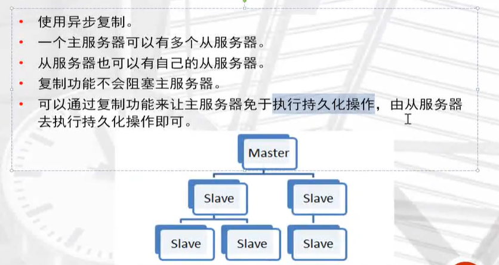
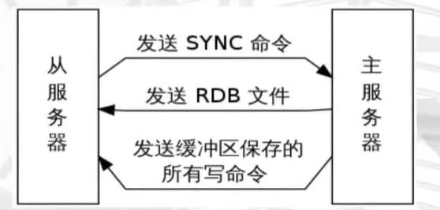
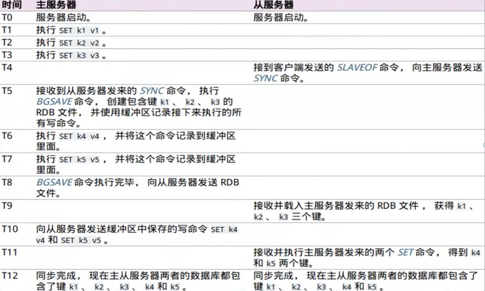
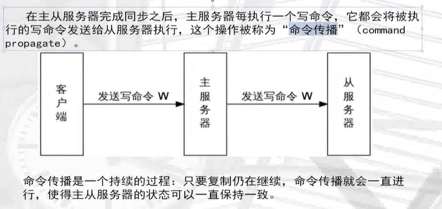
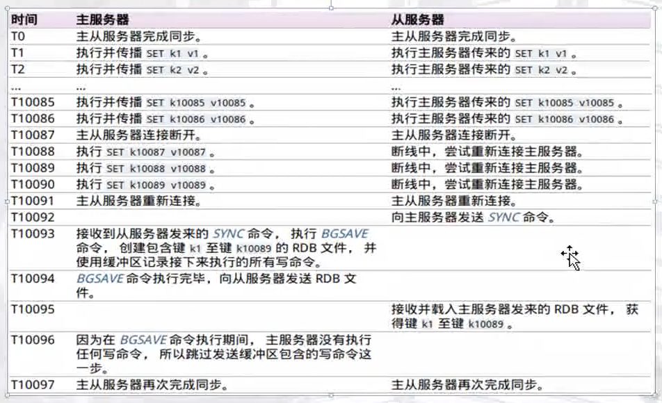
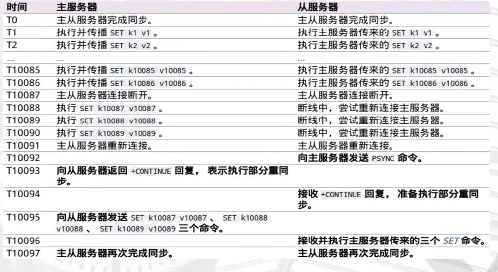
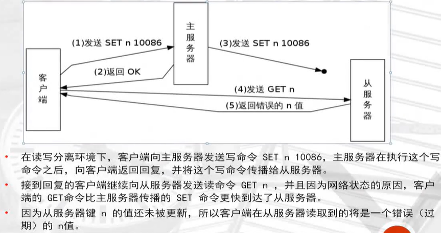
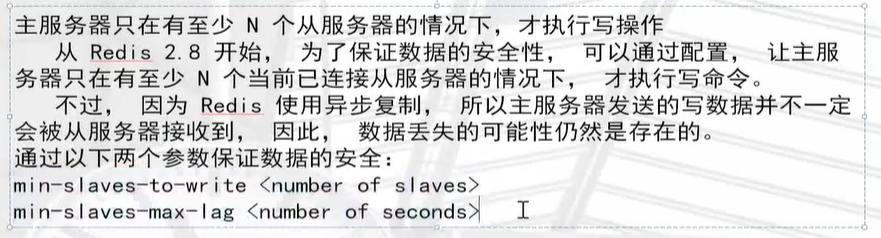

## redis主从复制特点



## redis主从复制原理

1.从服务器向主服务器发送sync命令。

2.接到sync命令的主服务器会调用bgsave命令，创建一个rdb文件，并使用缓冲区记录下来执行的所有写命令。

3.当主服务器执行完bgsave命令时，它会向从服务器发送rdb文件，而从服务器则会接收并载入这个文件。

4.主服务器将缓冲区存储的所有写命令发送给从服务器执行。



## sync命令执行示例



## 命令传播



## sync处理断线重连



## psync处理断线重连



## 复制一致性问题



### 复制安全性提升



```
min-s|aves-to-write <number of slaves>

min-s|aves-max-lag <number of seconds>
```

## 主从复制构建

### 准备两个或以上redis实例

```
[root@redis data]# mkdir /data/638{0..2}

主节点：
6380
从节点：
6381 6382


配置文件示例：
vim /data/6380/redis.conf

port 6380
daemonize yes
pidfile /data/6380/redis.pid
loglevel notice
logfile "/data/6380/redis.log"
dbfilename dump.rdb
dir /data/6380
protected-mode no


vim /data/6381/redis.conf

port 6381
daemonize yes
pidfile /data/6381/redis.pid
loglevel notice
logfile "/data/6381/redis.log"
dbfilename dump.rdb
dir /data/6381
protected-mode no


vim /data/6382/redis.conf

port 6382
daemonize yes
pidfile /data/6382/redis.pid
loglevel notice
logfile "/data/6382/redis.log"
dbfilename dump.rdb
dir /data/6382
protected-mode no
```

### 启动多实例

```
[root@localhost data]# redis-server /data/6380/redis.conf 
[root@localhost data]# redis-server /data/6381/redis.conf 
[root@localhost data]# redis-server /data/6382/redis.conf 

[root@localhost data]# netstat -tlnp|grep 638
tcp        0      0 0.0.0.0:6380            0.0.0.0:*               LISTEN      4598/redis-server * 
tcp        0      0 0.0.0.0:6381            0.0.0.0:*               LISTEN      4602/redis-server * 
tcp        0      0 0.0.0.0:6382            0.0.0.0:*               LISTEN      4606/redis-server * 
tcp6       0      0 :::6380                 :::*                    LISTEN      4598/redis-server * 
tcp6       0      0 :::6381                 :::*                    LISTEN      4602/redis-server * 
tcp6       0      0 :::6382                 :::*                    LISTEN      4606
```

### 开启主从

```
#第1个从库
[root@localhost data]# redis-cli -p 6381
127.0.0.1:6381> slaveof 127.0.0.1 6380
OK

#第2个从库
127.0.0.1:6382> slaveof 127.0.0.1 6380
OK

#从库查看一下链接状态
127.0.0.1:6382> info replication
# Replication
role:slave         			# 状态：从库
master_host:127.0.0.1       #  ip
master_port:6380			# 主库
master_link_status:up		# 链接状态：开启

#主库
127.0.0.1:6380> info replication
# Replication
role:master
connected_slaves:2
slave0:ip=127.0.0.1,port=6381,state=online,offset=365,lag=0
slave1:ip=127.0.0.1,port=6382,state=online,offset=365,lag=1

```

### 主库宕机手动故障切换(failover)

```
1.模拟主库宕机
[root@localhost data]# redis-cli -p 6380 shutdown

2.从库信息中已经看到主库down掉了
[root@localhost data]# redis-cli -p 6381
127.0.0.1:6381> info replication
# Replication
role:slave
master_host:127.0.0.1
master_port:6380
master_link_status:down   <--------


#从库默认是不可以进行数据操作的
127.0.0.1:6381> set a 10
(error) READONLY You can't write against a read only slave.
127.0.0.1:6381> keys *
(empty list or set)

3.取消从库6381属性，恢复一个单一节点
127.0.0.1:6381> slaveof no one
OK

#可以写入信息了，现在可以充当我们原有的主库了
127.0.0.1:6381> set a 20
OK
127.0.0.1:6381> keys *
1) "a"

#6382从库链接到6381
[root@localhost data]# redis-cli -p 6382
127.0.0.1:6382> slaveof no one
OK
127.0.0.1:6382> slaveof 127.0.0.1 6381
OK
127.0.0.1:6382> info replication
# Replication
role:slave
master_host:127.0.0.1
master_port:6381
master_link_status:up

```

