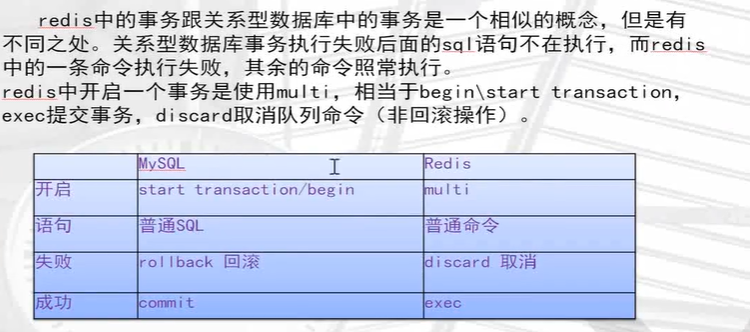
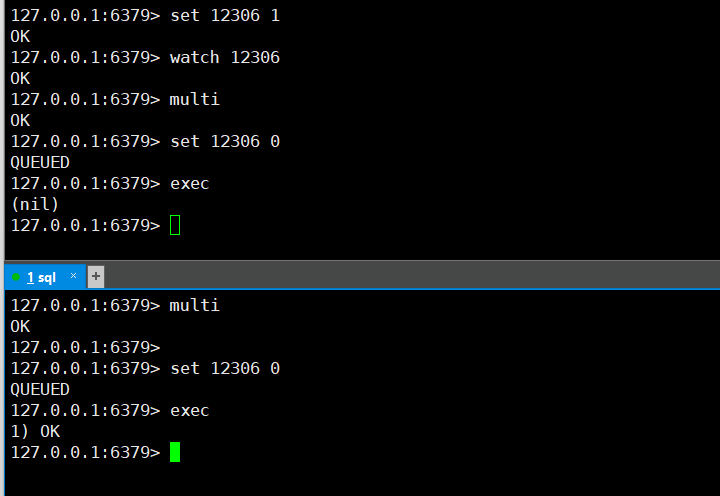

## reids事务管理



## 事务命令

discard

- 取消事务

exec

- 执行所有事务块内的命令

multi

- 标记一个事务块的开始

unwatch

- 取消watch命令对所有key的监视

watch key [key..]

- 监视一个或多个key，如果在事务执行之前这个key会被其他命令所改动，那么事务会被打断

```bash
127.0.0.1:6379> multi
OK
127.0.0.1:6379> set a 1
QUEUED
127.0.0.1:6379> set a 2
QUEUED
127.0.0.1:6379> set a 3
QUEUED
127.0.0.1:6379> exec
1) OK
2) OK
3) OK
127.0.0.1:6379> multi
OK
127.0.0.1:6379> set a 10
QUEUED
127.0.0.1:6379> set b 20
QUEUED
127.0.0.1:6379> set c 30
QUEUED
127.0.0.1:6379> discard
OK
127.0.0.1:6379> exec
(error) ERR EXEC without MULTI

```




