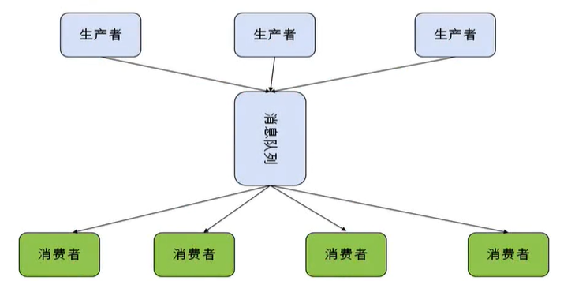
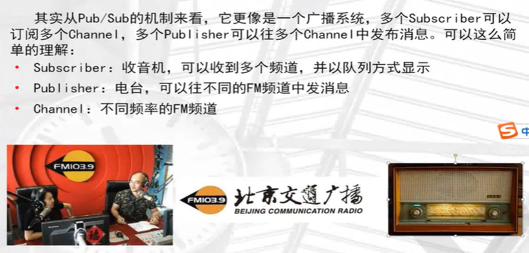
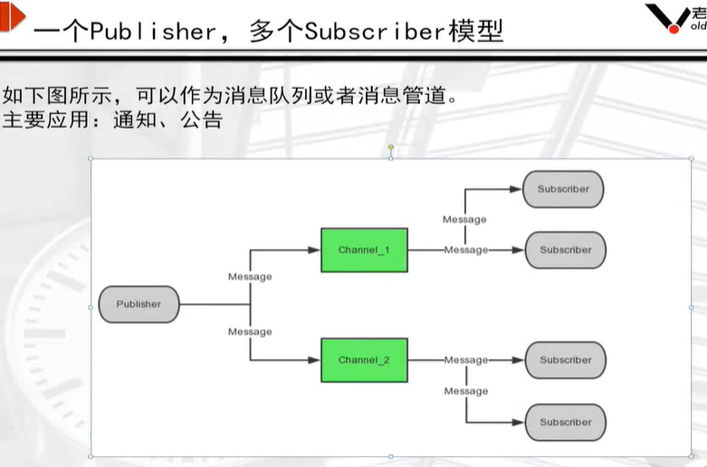
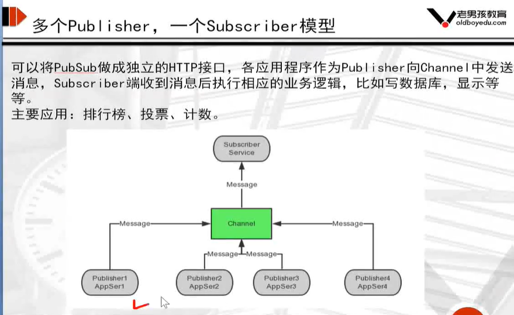
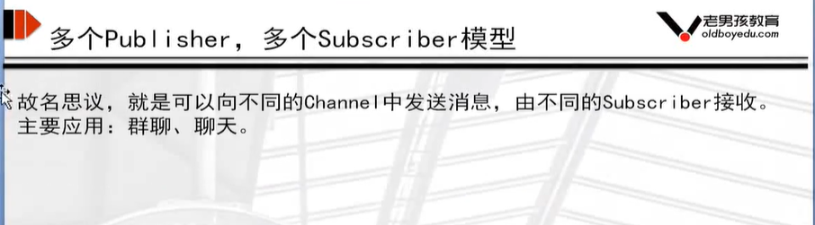
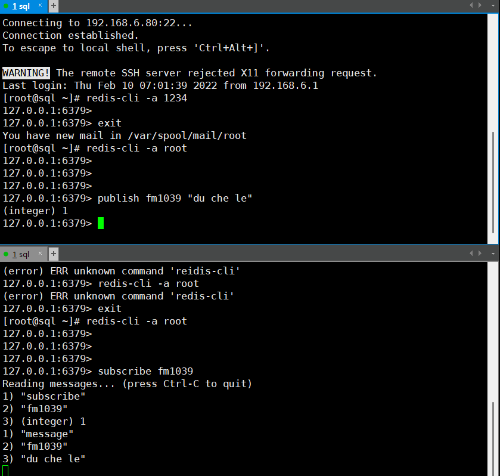
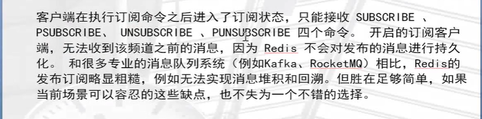

## 生产消费模型



## 消息模式

redis 发布消息通常有两种模式：

- 队列模式(queuing)
- 发布-订阅模式(pubish-subscribe)

任务队列的好处：

- 松耦合
- 易于扩展

## redis 发布订阅











## 模拟发布订阅




```
#订阅
subscribe
#发布
publish
```

## 消息队列系统对比



