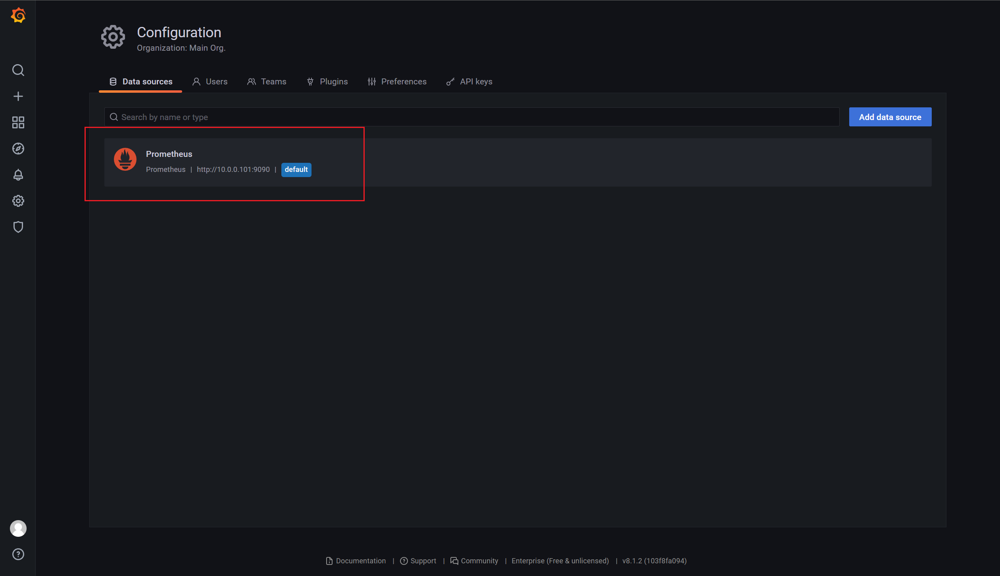
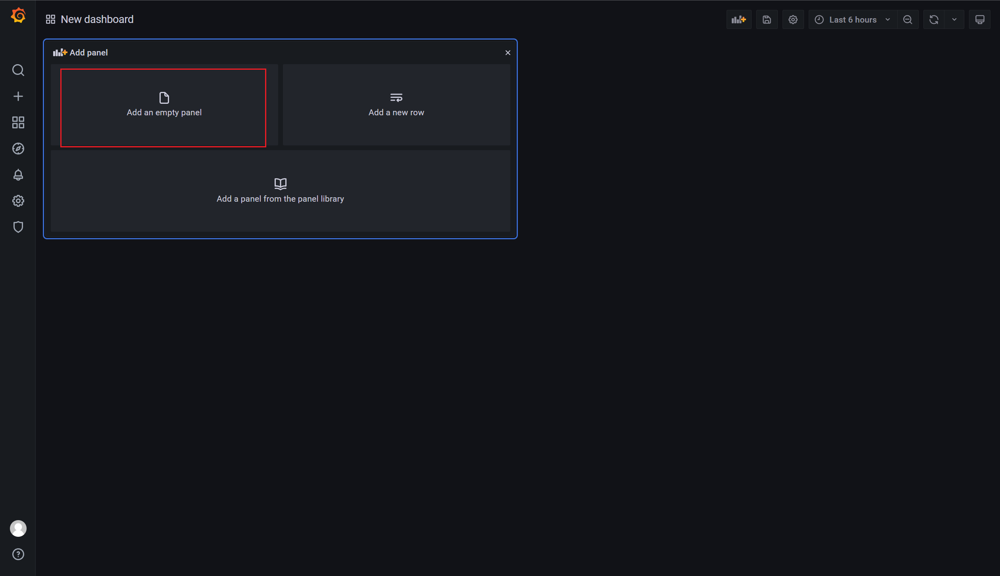
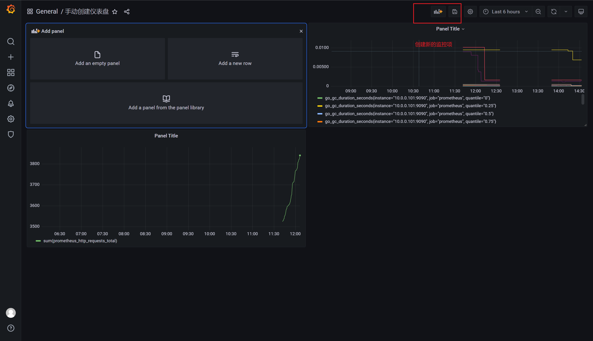
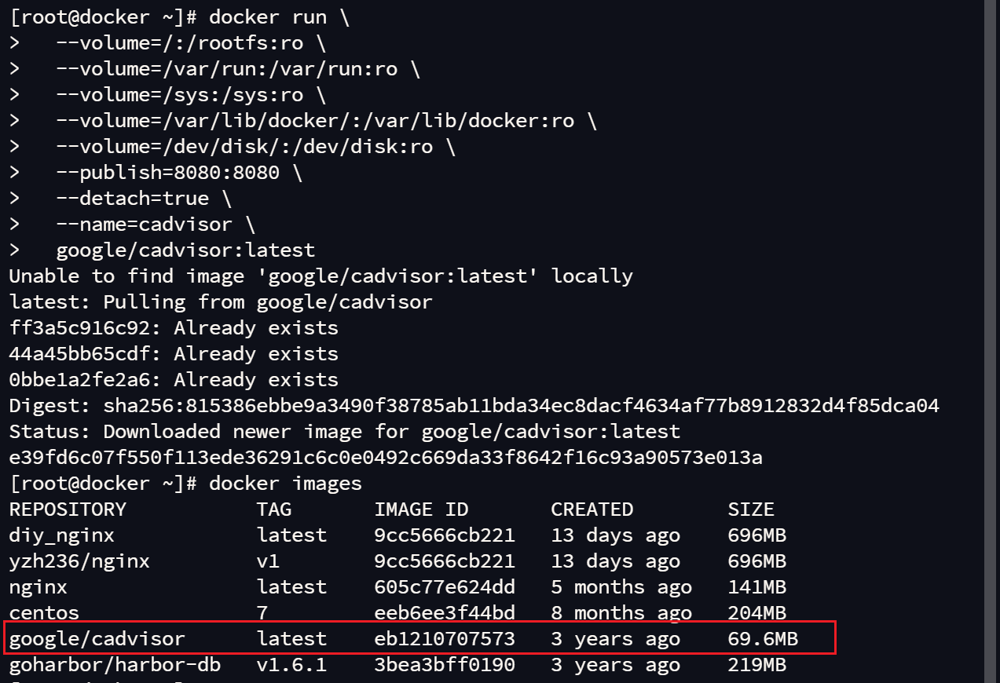

# Prometheus(监控告警系统)

## 背景

大数据主要解决的问题海量数据的

- 存储
- 传输
- 分析计算
  - 离线
  - 实时

​	不论是离线还是实时都是在服务器上面来执行，执行的过程中对我们的服务器一些相关的指标来进行监控，为了保证公司的线上业务运行平稳运行，我们需要来关注各项业务的指标是否正常，比如说服务器、网络设备、硬件资源，数据库，包括应用程序本身。这个时候我们就需要借助第三方的监控工具Prometheus，监控的目标是当服务器的指标不符合我们的需求的时候，监控工具应该把这些数据收集起来，及时的做展现并报警通知相关的责任人，并且把异常信息记录下来。

- Prometheus:监控收集
- Grafana:展示信息
- 睿象云:报警


## Prometheus介绍

​	Prometheus 受启发于 Google 的 Brogmon 监控系统（相似的 Kubernetes 是从 Google 的 Brog 系统演变而来），从 2012 年开始由前 Google 工程师在 Soundcloud 以开源软件的 形式进行研发，并且于 2015 年早期对外发布早期版本。 

​	2016 年 5 月继 Kubernetes 之后成为第二个正式加入 CNCF 基金会的项目，同年 6 月 正式发布 1.0 版本。2017 年底发布了基于全新存储层的 2.0 版本，能更好地与容器平台、 云平台配合。 

​	Prometheus 作为新一代的云原生监控系统，目前已经有超过 650+位贡献者参与到 Prometheus 的研发工作上，并且超过 120+项的第三方集成。

## Prometheus 的特点

#### 1.易于管理

​	Prometheus 核心部分只有一个单独的`二进制文件`，不存在任何的第三方依赖(数据库， 缓存等等)。唯一需要的就是`本地磁盘`，因此不会有潜在级联故障的风险。

​	Prometheus 基于 `Pull 模型`的架构方式，可以在任何地方（本地电脑，开发环境，测试环境）搭建我们的监控系统。 

​	 对于一些复杂的情况，还可以使用 Prometheus `服务发现(Service Discovery)`的能力 动态管理监控目标。

#### 2.监控服务的内部运行状态

​	Pometheus 鼓励用户监控服务的内部状态，基于 Prometheus 丰富的 Client 库，用户可以轻松的在应用程序中添加对 Prometheus 的支持，从而让用户可以获取服务和应用 内部真正的运行状态。


#### 3.强大的数据模型

​	所有采集的监控数据均以指标(metric)的形式保存在`内置的时间序列数据库`当中 (TSDB)。所有的样本除了基本的指标名称以外，还包含一组用于描述该样本特征的标签。 如下所示：

```perl
http_request_status{code='200',content_path='/api/path',environment='produment'} =>
[value1@timestamp1,value2@timestamp2...]

#参数解释
http_request_status：指标名称(Metrics Name) 
{code='200',content_path='/api/path',environment='produment'}：表示维度的 标签，基于这些 Labels 我们可以方便地对监控数据进行聚合，过滤，裁剪。
[value1@timestamp1,value2@timestamp2...]：按照时间的先后顺序 存储的样本值。
```

​	每一条时间序列由指标名称(Metrics Name)以及一组标签(Labels)唯一标识。每条时 间序列按照时间的先后顺序存储一系列的样本值。 

#### 4 .强大的查询语言 PromQL

 Prometheus 内置了一个强大的数据查询语言 PromQL。 通过 PromQL 可以实现对 监控数据的查询、聚合。同时 PromQL 也被应用于数据可视化(如 Grafana)以及告警当中。 

通过 PromQL 可以轻松回答类似于以下问题： 

➢ 在过去一段时间中 95%应用延迟时间的分布范围？ 

➢ 预测在 4 小时后，磁盘空间占用大致会是什么情况？ 

➢ CPU 占用率前 5 位的服务有哪些？(过滤)

#### 5.高效

对于监控系统而言，大量的监控任务必然导致有大量的数据产生。而 Prometheus 可 以高效地处理这些数据，对于单一 Prometheus Server 实例而言它可以处理： 

➢ 数以百万的监控指标 

➢ 每秒处理数十万的数据点

#### 6 .可扩展 

​	可以在每个数据中心、每个团队运行独立的 Prometheus Sevrer。Prometheus 对于 联邦集群的支持，可以让多个 Prometheus 实例产生一个逻辑集群，当单实例 Prometheus  Server 处理的任务量过大时，通过使用功能分区(sharding)+联邦集群(federation)可以对 其进行扩展。

#### 7.易于集成

​	使用 Prometheus 可以快速搭建监控服务，并且可以非常方便地在应用程序中进行集 成。目前支持：Java，JMX，Python，Go，Ruby，.Net，Node.js 等等语言的客户端 SDK， 基于这些 SDK 可以快速让应用程序纳入到 Prometheus 的监控当中，或者开发自己的监控数据收集程序。

​	同时这些客户端收集的监控数据，不仅仅支持 Prometheus，还能支持 Graphite 这些 其他的监控工具。

​	同时 Prometheus 还支持与其他的监控系统进行集成：Graphite，Statsd，Collected， Scollector， muini， Nagios 等。 Prometheus 社区还提供了大量第三方实现的监控数 据采集支持：JMX，CloudWatch，EC2，MySQL，PostgresSQL，Haskell，Bash，SNMP， Consul，Haproxy，Mesos，Bind，CouchDB，Django，Memcached，RabbitMQ， Redis，RethinkDB，Rsyslog 等等。

#### 8.可视化

​	Prometheus Server 中自带的 Prometheus UI，可以方便地直接对数据进行查询，并 且支持直接以图形化的形式展示数据。同时 Prometheus 还提供了一个独立的基于  Ruby On Rails 的 Dashboard 解决方案 Promdash。

​	 最新的 Grafana 可视化工具也已经提供了完整的 Prometheus 支持，基于 Grafana 可 以创建更加精美的监控图标。

​	基于 Prometheus 提供的 API 还可以实现自己的监控可视化 UI。

#### 9.开放性

​	通常来说当我们需要监控一个应用程序时，一般需要该应用程序提供对相应监控系统协议的支持，因此应用程序会与所选择的监控系统进行绑定。为了减少这种绑定所带来的限制， 对于决策者而言要么你就直接在应用中集成该监控系统的支持，要么就在外部创建单独的服 务来适配不同的监控系统。

​	而对于 Prometheus 来说，使用 Prometheus 的 client library 的输出格式不止支持 Prometheus 的格式化数据，也可以输出支持其它监控系统的格式化数据，比如 Graphite。 因此你甚至可以在不使用 Prometheus 的情况下，采用 Prometheus 的 client library 来让 你的应用程序支持监控数据采集

## Prometheus的架构


**Prometheus 生态圈组件** 

➢ Prometheus Server：主服务器，负责收集和存储时间序列数据 

➢ client libraies：应用程序代码插桩，将监控指标嵌入到被监控应用程序中 

➢ Pushgateway：推送网关，为支持 short-lived 作业提供一个推送网关

➢ exporter：专门为一些应用开发的数据摄取组件—exporter，例如：HAProxy、StatsD、 Graphite 等等。 

➢ Alertmanager：专门用于处理 alert 的组件

**架构理解**

Prometheus 既然设计为一个维度存储模型，可以把它理解为一个 [联机分析处理（OLAP)](https://www.jianshu.com/p/83cd370536dd)系统。

1、存储计算层 

➢ Prometheus Server，里面包含了存储引擎和计算引擎。 

➢ Retrieval 组件为取数组件，它会主动从 Pushgateway 或者 Exporter 拉取指标数据。 

➢ Service discovery，可以动态发现要监控的目标。 

➢ TSDB，数据核心存储与查询。 

➢ HTTP server，对外提供 HTTP 服务。

2、采集层 

采集层分为两类，一类是生命周期较短的作业，还有一类是生命周期较长的作业。 

➢ 短作业：直接通过 API，在退出时间指标推送给 Pushgateway。(先把数据推送到网关，在从网关拉取数据) 

➢ 长作业：Retrieval 组件直接从 Job 或者 Exporter 拉取数据。

3、应用层

应用层主要分为两种，一种是 AlertManager，另一种是数据可视化。

➢  AlertManager 对接 Pagerduty，是一套付费的监控报警系统。可实现短信报警、5 分钟无人 ack 

​	打电话通知、仍然无人 ack，通知值班人员 Manager... 

​	Emial，发送邮件

​	....

​	`睿象云`

➢  数据可视化 

​	Prometheus build-in WebUI 

​	`Grafana` 

​	其他基于 API 开发的客户端

## Prometheus安装

> 官网：https://prometheus.io/

> 下载地址：https://prometheus.io/download/

#### 1.安装 Prometheus Server

​	Prometheus 基于 Golang 编写，编译后的软件包，不依赖于任何的第三方依赖。只需下载对应平台的二进制包，解压并且添加基本的配置即可正常启动 Prometheus Server。

```perl
1.上传安装包prometheus-2.29.1.linux-amd64.tar.gz
至/usr/local/prometheus

2.解压,并修改目录名
tar xf prometheus-2.29.1.linux-amd64.tar.gz -C /module/

mv prometheus-2.29.1.linux-amd64/ prometheus-2.29.1

3.修改配置文件 prometheus.yml

- job_name: "prometheus"
    static_configs:
      - targets: ["10.0.0.101:9090"]

  - job_name: 'pushgateway'
    static_configs:
      - targets: ['10.0.0.101:9091']
        #labels:
        #instance: pushgateway
        
        
   - job_name: 'node exporter'
     static_configs:
     - targets: ['10.0.0.101:9100', '10.0.0.102:9100' ]

```

配置说明： 

1、`global 配置块`：控制 Prometheus 服务器的全局配置 

➢ scrape_interval：配置拉取数据的时间间隔，默认为 1 分钟。 

➢ evaluation_interval：规则验证（生成 alert）的时间间隔，默认为 1 分钟。 

2、`rule_files 配置块`：规则配置文件 

3、`scrape_configs 配置块`：配置采集目标相关， prometheus 监视的目标。

Prometheus 自身的运行信息可以通过 HTTP 访问，所以 Prometheus 可以监控自己的运行数据。 

➢ job_name：监控作业的名称 

➢ static_configs：表示静态目标配置，就是固定从某个 target 拉取数据 

➢ targets ： 指 定 监 控 的 目 标 ， 其 实 就 是 从 哪 儿 拉 取 数 据 。 Prometheus 会 从 http://10.0.0.101:9090/metrics 上拉取数据。 

Prometheus 是可以在运行时自动加载配置的。启动时需要添加：--web.enable-lifecycle

#### 2.安装 Pushgateway

​	Prometheus 在正常情况下是采用拉模式从产生 metric 的作业或者 exporter（比如专 门监控主机的 NodeExporter）拉取监控数据。但是我们要监控的是 Flink on YARN 作业， 想要让 Prometheus 自动发现作业的提交、结束以及自动拉取数据显然是比较困难的。 PushGateway 就是一个中转组件，通过配置 Flink on YARN 作业将 metric 推到 PushGateway，Prometheus 再从 PushGateway 拉取就可以了。

```shell
1.上传安装包pushgateway-1.4.1.linux-amd64.tar.gz

2.解压并改名
tar -xf pushgateway-1.4.1.linux-amd64.tar.gz -C /module/

mv pushgateway-1.4.1.linux-amd64/ pushgateway-1.4.1
```

#### 3.安装Alertmanager(选择性安装)

```shell
1.上传 安装包alertmanager-0.23.0.linux-amd64.tar.gz

2.解压并改名
tar -xf alertmanager-0.23.0.linux-amd64.tar.gz -C /module/

mv alertmanager-0.23.0.linux-amd64/ alertmanager-0.23.0

3.启动alertmanager

nohup ./alertmanager --config.file=alertmanager.yml > ./alertmanager.log 2>&1 &

```

#### 4.安装Node Exporter

​	在 Prometheus 的架构设计中，Prometheus Server 主要负责数据的收集，存储并且对外提供数据查询支持，而实际的监控样本数据的收集则是由 Exporter 完成。因此为了能够监控到某些东西，如主机的 CPU 使用率，我们需要使用到 Exporter。Prometheus 周期 性的从 Exporter 暴露的 HTTP 服务地址（通常是/metrics）拉取监控样本数据。

​	Exporter 可以是一个相对开放的概念，其可以是一个独立运行的程序独立于监控目标以外，也可以是直接内置在监控目标中。只要能够向 Prometheus 提供标准格式的监控样本数据即可。

​	为了能够采集到主机的运行指标如 CPU, 内存，磁盘等信息。我们可以使用 Node  Exporter。Node Exporter 同样采用 Golang 编写，并且不存在任何的第三方依赖，只需 要下载，解压即可运行。

​	可以从 https://prometheus.io/download/ 获取最新的 node  exporter 版本的二进制包。

```perl
1..上传 安装包node_exporter-1.2.2.linux-amd64.tar.gz

2.解压并改名
tar -xf /usr/local/prometheus/node_exporter-1.2.2.linux-amd64.tar.gz -C /module/

mv node_exporter-1.2.2.linux-amd64/ node_exporter-1.2.2

3.启动并通过页面查看是否成功采集到了数据
执行./node_exporter
浏览器输入http://10.0.0.101:9100/可以看到当前 node exporter 获取到的当前主机的所有监控数据。

4.节点分发
讲解压后的目录分发到要监控的机器节点
 /usr/local/sbin/xsync node_exporter-1.2.2
 
 4.1修改 Prometheus 配置文件 prometheus.yml
 
  - job_name: 'node exporter'
     static_configs:
     - targets: ['10.0.0.101:9100', '10.0.0.102:9100' ]
     
     
   4.2分发脚本
   [root@prous module]# cat /usr/local/sbin/xsync 
#!/bin/bash
#1. 判断参数个数
if [ $# -lt 1 ]
then
    echo Not Enough Arguement!
    exit;
fi

#2. 遍历集群所有机器
for host in 10.0.0.20
do
    echo ==================== $host ====================
    #3. 遍历所有目录，挨个发送
    for file in $@
    do
        #4. 判断文件是否存在
        if [ -e $file ]
            then
                #5. 获取父目录
                pdir=$(cd -P $(dirname $file); pwd)
                #6. 获取当前文件的名称
                fname=$(basename $file)
                ssh $host "mkdir -p $pdir"
                scp -r $pdir/$fname $host:$pdir
            else
                echo $file does not exists!
        fi
    done
done


# 修改权限
#chmod 777 xsync
     
   5.设置为开机自启动
cat /usr/lib/systemd/system/node_exporter.service

[Unit]
Description=node_export
Documentation=https://github.com/prometheus/node_exporter
After=network.target

[Service]
Type=simple
User=atguigu
ExecStart= /opt/module/node_exporter-1.2.2/node_exporter
Restart=on-failure

[Install]
WantedBy=multi-user.target

5.1分发文件
/usr/local/sbin/xsync  /usr/lib/systemd/system/node_exporter.service

5.2开机自启
systemctl enable node_exporter.service 
systemctl start node_exporter.service

```

## 启动prometheus

```perl
1.prometheus server目录下执行

nohup ./prometheus --config.file=prometheus.yml > ./prometheus.log 2>&1 &

2.node exporter监控主机下执行
nohup ./node_exporter >./exporter.log 2>&1 &


3.启动pushgateway
nohup ./pushgateway  --web.listen-address :9091 > ./pushgateway.log 2>&1 &

4.启动alertmanager

nohup ./alertmanager --config.file=alertmanager.yml > ./alertmanager.log 2>&1 &
```

启动脚本

```perl
1.prometheus server

[Unit]
Description=Prometheus
Wants=network-online.target
After=network-online.target

[Service]
User=root
Group=root
Type=simple
ExecStart=/module/prometheus/prometheus \
    --config.file /module/prometheus/prometheus.yml


[Install]
WantedBy=multi-user.target

2.node_exporter

[Unit]
Description=Node Exporter
Wants=network-online.target
After=network-online.target
[Service]
User=root
Group=root
Type=simple
ExecStart=/module/prometheus/node_exporter
[Install]
WantedBy=multi-user.target


cat /usr/lib/systemd/system/alertmanager.service

[Unit]
Description=alertmanager System
Documentation=alertmanager System
[Service]
ExecStart=/module/alertmanager-0.23.0/alertmanager \
--config.file=alertmanager.yml
[Install]
WantedBy=multi-user.target
```

## 网页查看


## PromQL 介绍

​	Prometheus 通过指标名称（metrics name）以及对应的一组标签（labelset）唯一 定义一条时间序列。指标名称反映了监控样本的基本标识，而 label 则在这个基本特征上为 采集到的数据提供了多种特征维度。用户可以基于这些特征维度`过滤，聚合，统计`从而产生 新的计算后的一条时间序列。PromQL 是 Prometheus **内置的数据查询语言**，其提供对时 间序列数据丰富的查询，聚合以及逻辑运算能力的支持。

​	并且被广泛应用在 Prometheus 的日常应用当中，包括对数据查询、可视化、告警处理当中。可以这么说，PromQL 是 Prometheus 所有应用场景的基础，理解和掌握 PromQL 是 Prometheus 入门的第一课。

#### 1.基本查询

​	当 Prometheus 通过 Exporter 采集到相应的监控指标样本数据后，我们就可以通过 PromQL 对监控样本数据进行查询。

当我们直接使用监控指标名称查询时，可以查询该指标下的所有时间序列。如：

```
prometheus_http_requests_total
```

等同于:

```
prometheus_http_requests_total{}
```

该表达式会返回指标名称为 prometheus_http_requests_total 的所有时间序列

```
prometheus_http_requests_total{code="200", handler="/-/ready", instance="10.0.0.101:9090", job="prometheus"}
53
prometheus_http_requests_total{code="200", handler="/alerts", instance="10.0.0.101:9090", job="prometheus"}
8
```

​	PromQL 还支持用户根据时间序列的标签匹配模式来对时间序列进行过滤，目前主要 支持两种匹配模式：完全匹配和正则匹配。

**PromQL 支持使用 = 和 != 两种完全匹配模式：**

- 通过使用 label=value 可以选择那些标签满足表达式定义的时间序列；

- 反之使用 label!=value 则可以根据标签匹配排除时间序列；

​	例如，如果我们只需要查询所有 prometheus_http_requests_total 时间序列中满足标 签 instance 为 10.0.0.101:9090 的时间 序列，则可以使用如下表达式：

```
prometheus_http_requests_total{instance="10.0.0.101:9090"}
```

​	反之使用 instance!="localhost:9090" 则可以排除这些时间序列：

```
prometheus_http_requests_total{instance!="10.0.0.101:9090"}
```

**PromQL还可以支持使用正则表达式作为匹配条件，多个表达式之间使用 | 进行分离：**

- 使用 label=~regx 表示选择那些标签符合正则表达式定义的时间序列；
- 反之使用 label!~regx 进行排除；

例如，如果想查询多个环节下的时间序列序列可以使用如下表达式：

```
prometheus_http_requests_total{environment=~"staging|testing|development",method!="GET"}
```

排除用法:

```
prometheus_http_requests_total{environment!~"staging|testing|development",method!="GET"}
```

#### 2.范围查询

​	直接通过类似于 PromQL 表达式 httprequeststotal 查询时间序列时，返回值中只会 包含该时间序列中的最新的一个样本值，这样的返回结果我们称之为瞬时向量。而相应的这 样的表达式称之为__**瞬时向量表达式**。

​	而如果我们想过去一段时间范围内的样本数据时，我们则需要使用**区间向量表达式**。区 间向量表达式和瞬时向量表达式之间的差异在于在区间向量表达式中我们需要定义时间选 择的范围，时间范围通过**时间范围选择器 []** 进行定义。 例如，通过以下表达式可以选择

最近 5 分钟内的所有样本数据：

```
prometheus_http_requests_total{}[5m]
```

该表达式将会返回查询到的时间序列中最近 5 分钟的所有样本数据：

```

prometheus_http_requests_total{code="200", handler="/-/ready", instance="10.0.0.101:9090", job="prometheus"}
56 @1654335199.426
prometheus_http_requests_total{code="200", handler="/alerts", instance="10.0.0.101:9090", job="prometheus"}
8 @1654335199.426
prometheus_http_requests_total{code="200", handler="/api/v1/label/:name/values", instance="10.0.0.101:9090", job="prometheus"}
16 @1654335199.426
```

通过区间向量表达式查询到的结果我们称为区间向量。 除了使用 m 表示分钟以外， PromQL 的时间范围选择器支持其它时间单位：

- s - 秒

- m - 分钟 

- h - 小时 

- d - 天  

- w - 周  

- y - 年

#### 3.时间位移操作

​	在瞬时向量表达式或者区间向量表达式中，都是以当前时间为基准：

​	prometheus_http_requests_total{} # 瞬时向量表达式，选择当前最新的数据

​	prometheus_http_requests_total{}[5m] # 区间向量表达式，选择以当前时间为基准， 5 分钟内的数据

​	而如果我们想查询，5 分钟前的瞬时样本数据，或昨天一天的区间内的样本数据呢? 这 个时候我们就可以使用位移操作，位移操作的关键字为 `offset`。 可以使用 offset 时间位移 操作：

```
prometheus_http_requests_total{} offset 5m
prometheus_http_requests_total{}[1d] offset 1d
```

#### 4.使用聚合操作

​	一般来说，如果描述样本特征的标签(label)在并非唯一的情况下，通过 PromQL 查询 数据，会返回多条满足这些特征维度的时间序列。而 PromQL 提供的聚合操作可以用来对 这些时间序列进行处理，形成一条新的时间序列：

```perl
查询系统所有 http 请求的总量
sum(prometheus_http_requests_total)

按照 mode 计算主机 CPU 的平均使用时间
avg(node_cpu_seconds_total) by (mode)

按照主机查询各个主机的 CPU 使用率
sum(sum(irate(node_cpu_seconds_total{mode!='idle'}[5m])) / sum(irate(node_cpu_seconds_total [5m]))) by (instance) 
```

#### 5 标量和字符串

​	除了使用瞬时向量表达式和区间向量表达式以外，PromQL 还直接支持用户使用标量 (Scalar)和字符串(String)。

​	**标量（Scalar）：一个浮点型的数字值**

​	标量只有一个数字，没有时序。 例如：

```
10
```

​	需要注意的是，当使用表达式 count(prometheus_http_requests_total)，返回的数 据类型，依然是瞬时向量。用户可以通过内置函数 scalar()将单个瞬时向量转换为标量。

​	**字符串（String）：一个简单的字符串值**

直接使用字符串，作为 PromQL 表达式，则会直接返回字符串。

```
"this is a string" 
```

#### 6.合法的 PromQL 表达式

​	所有的 PromQL 表达式都`必须至少包含一个指标名称`(例如 http_request_total)，或者 一个`不会匹配到空字符串`的标签过滤器(例如{code=”200”})。

​	因此以下两种方式，均为合法的表达式：

```perl
prometheus_http_requests_total # 合法
prometheus_http_requests_total{} # 合法
{method="get"} # 合法
```

​	而如下表达式，则不合法：

```perl
{job=~".*"} # 不合法
```

​	同时，除了使用 {label=value} 的形式以外，我们还可以使用内置的 __name__ 标签 来指定监控指标名称：

```perl
{__name__=~"prometheus_http_requests_total"} # 合法
{__name__=~"node_disk_bytes_read|node_disk_bytes_written"} # 合法
```

## PromQL 操作符

​	使用 PromQL 除了能够方便的按照查询和过滤时间序列以外，PromQL 还支持丰富的 操作符，用户可以使用这些操作符对进一步的对事件序列进行二次加工。这些操作符包括： 数学运算符，逻辑运算符，布尔运算符等等。

#### 1.数学运算

​	PromQL 支持的所有数学运算符如下所示：

- +(加法)  

- -(减法)  

* *(乘法) 
* / (除法) 
* % (求余) 
* ^ (幂运算)

#### 2.布尔运算

​	Prometheus 支持以下布尔运算符如下：

- == (相等)  
-  != (不相等)  
- `>`(大于)  
-  < (小于)  
- `>=` (大于等于)  
- <= (小于等于)

**使用 bool 修饰符改变布尔运算符的行为**

​	布尔运算符的默认行为是对时序数据进行过滤。而在其它的情况下我们可能需要的是真 正的布尔结果。例如，只需要 知道当前模块的 HTTP 请求量是否>=1000，如果大于等于 1000 则返回 1（true）否则返回 0（false）。这时可以使 用 bool 修饰符改变布尔运算的 默认行为。 例如：

```
prometheus_http_requests_total > bool 1000 
```

​	使用 bool 修改符后，布尔运算不会对时间序列进行过滤，而是直接依次瞬时向量中的 各个样本数据与标量的比较结果 0 或者 1。从而形成一条新的时间序列。

```
prometheus_http_requests_total{code="200",handler="query",instance="localhost:9090",jo
b="prometheus",method="get"} 1 
prometheus_http_requests_total{code="200",handler="query_range",instance="localhost:90
90",job="prometheus",method="get"} 0 
```

​	同时需要注意的是，如果是在两个标量之间使用布尔运算，则必须使用 bool 修饰符

```
2 == bool 2 # 结果为 1
```

#### 3.使用集合运算符

​	使用瞬时向量表达式能够获取到一个包含多个时间序列的集合，我们称为瞬时向量。通 过集合运算，可以在两个瞬时向量与瞬时向量之间进行相应的集合操作。

​	目前，Prometheus 支持以下集合运算符：

- and (并且)
- or (或者) 
- unless (排除)

​	vector1 and vector2 会产生一个由 vector1 的元素组成的新的向量。该向量包含 vector1 中完全匹配 vector2 中的元素组成。

​	vector1 or vector2 会产生一个新的向量，该向量包含 vector1 中所有的样本数据， 以及 vector2 中没有与 vector1 匹配到的样本数据。

​	vector1 unless vector2 会产生一个新的向量，新向量中的元素由 vector1 中没有与 vector2 匹配的元素组成。

#### 4.操作符优先级

​	对于复杂类型的表达式，需要了解运算操作的运行优先级。例如，查询主机的 CPU 使 用率，可以使用表达式：

```
100 * (1 - avg (irate(node_cpu_seconds_total{mode='idle'}[5m])) by(job) ) 
```

​	在 PromQL 操作符中优先级由高到低依次为：

- ^   
- *, /, % 
- +, -
- ==, !=, <=, =, > 
- and, unless 
- or

#### 5 PromQL 聚合操作

​	Prometheus 还提供了下列内置的聚合操作符，这些操作符作用域瞬时向量。可以将瞬 时表达式返回的样本数据进行 聚合，形成一个新的时间序列。

- sum (求和) 
- min (最小值) 
- max (最大值) 
- avg (平均值)
- stddev (标准差) 
- stdvar (标准差异) 
- count (计数) 
- count_values (对 value 进行计数) 
- bottomk (后 n 条时序) 
- topk (前 n 条时序) 
- quantile (分布统计) 

使用聚合操作的语法如下：

```
<aggr-op>([parameter,] <vector expression>) [without|by (<label list>)] 
```

​	其中只有 count_values , quantile , topk , bottomk 支持参数(parameter)。

​	`without` 用于从计算结果中移除列举的标签，而保留其它标签。`by` 则正好相反，结果向量中只保留列出的标签，其余标签则移除。通过 without 和 by 可以按照样本的问题对数据进行聚合。例如： 

```
sum(prometheus_http_requests_total) without (instance)  
```

等价于 

```
sum(prometheus_http_requests_total) by (code,handler,job,method)
```

​	如果只需要计算整个应用的 HTTP 请求总量，可以直接使用表达式：

```
 sum(prometheus_http_requests_total) 
```

​	count_values 用于时间序列中每一个样本值出现的次数。count_values 会为每一个唯一的 样本值输出一个时间序列，并且每一个时间序列包含一个额外的标签。 例如：

```
count_values("count", prometheus_http_requests_total) 
```

​	topk 和 bottomk 则用于对样本值进行排序，返回当前样本值前 n 位，或者后 n 位的 时间序列。

获取 HTTP 请求数前 5 位的时序样本数据，可以使用表达式：

```
topk(5, prometheus_http_requests_total)
```

​	quantile 用于计算当前样本数据值的分布情况 quantile(φ, express)其中 0 ≤ φ ≤ 1。 例如，当 φ 为 0.5 时，即表示找到当前样本数据中的中位数：

```
quantile(0.5, prometheus_http_requests_total)
```

## Prometheus 和 Grafana 集成

​	grafana 是一款采用 Go 语言编写的开源应用，主要用于大规模指标数据的可视化展现， 是网络架构和应用分析中最流行的时序数据展示工具，目前已经支持绝大部分常用的时序数 据库。下载地址：https://grafana.com/grafana/download

```
1 上传并解压
tar -xf grafana-enterprise-8.1.2.linux-amd64.tar.gz -C /module/


2.启动grafana
nohup ./bin/grafana-server web > ./grafana.log 2>&1 &


3.浏览器访问本机ip地址
10.0.0.101:3000
```

看到grafana登录页面


```
默认账号和密码
admin
admin
```

### 添加数据源




### 手动创建仪表盘 Dashboard




```
获取http总数
sum(prometheus_http_requests_total)
```


添加多个指标


保存仪表盘


可以创建新的监控项



## Prometheus 监控Docker服务器

cAdvisor（Container Advisor）用于收集正在运行的容器资源使用和性能信息。

1.被监控端安装完docker后，添加启动cadvisor容器

```perl
docker run \
  --volume=/:/rootfs:ro \
  --volume=/var/run:/var/run:ro \
  --volume=/sys:/sys:ro \
  --volume=/var/lib/docker/:/var/lib/docker:ro \
  --volume=/dev/disk/:/dev/disk:ro \
  --publish=8080:8080 \
  --detach=true \
  --name=cadvisor \
  google/cadvisor:latest
```



2、修改Promethus监控端配置文件：vim prometheus.yml

```perl

  - job_name: 'docker'
    static_configs:
    - targets: ['10.0.0.20:8080']
```

3.重启promethus服务

```
systemctl restart promethus
```

4、访问被监控端cAdvisor捕获的数据 ：http://10.0.0.20:8080/metrics


5.prometheus监控项查看是否介入


6、Prometheus监控端查docker数据

```
container_cpu_load_average_10s
```


7、Granfana 导入 Docker 监控图表

```
https://grafana.com/dashboards/193
```


8.导入后我们就可以查看到仪表盘了


## 集成第三方告警平台睿象云

​	邮件通知常会出现接收不及时的问题，为确L保通知信息被及时接收，可通过配置 Prometheus 或者 Grafana 与第三方平台告警平台（例如睿象云）集成，进而通过第三方 平台提供的多种告警媒介（例如电话，短信）等发送告警信息。

> 官网：https://www.aiops.com/

注册结束后的页面，点击智能告警平台


点击集成


选择grafana


填写昵称保存key


得到key后配置granfana,在 Grafana 中创建 Notification channel


完成后测试会接到邮件

设置分派策略


## alertmanager告警配置

进入网页查看：http://10.0.0.101:9093/#/alerts


检查配置文件语法

```
./amtool check-config alertmanager.yml
```

## 配置邮件告警

首先备份初始的配置文件方便调试

```
cp alertmanager.yml{,.bak}
```

自定义配置文件(注意格式的书写不要用tab ，要用空格，yaml文件对语法要求很严格)

```perl
[root@prous alertmanager-0.23.0]# cat alertmanager.yml
global:
  resolve_timeout: 5m
  smtp_smarthost: 'smtp.163.com:25' 
  smtp_from: 'yzh2361046420@163.com' 
  smtp_auth_username: 'yzh2360146420@163.com' 
  smtp_auth_password: 'NEXWNXCUQCYARCIH' 
  smtp_require_tls: false
 
route:
  group_by: ['alertname']
  group_wait: 10s
  group_interval: 10s
  repeat_interval: 1h
  receiver: 'email'

receivers:
- name: 'email'
  email_configs:
  - to: '2361046420@qq.com'
    send_resolved: true

inhibit_rules:
   - source_match:
        severity: 'critical'
     target_match:
        severity: 'warning' 
     equal: ['alertname', 'dev', 'instance'] 
```

重启配置文件

```
systemctl status alertmanager.service
```

修改prometheus.yml的alerting部分

```perl
alerting:
  alertmanagers:
    - static_configs:
        - targets:
           -- 10.0.0.101:9093   #填写本机ip地址
           
       
rule_files:
  - rules/*.yml
```

### 编写告警规则

```
[root@prous prometheus]# mkdir /module/prometheus/rules
[root@prous prometheus]# cd /module/prometheus/rules/
[root@prous rules]# vim host_monitor.yml
[root@prous rules]# cat host_monitor.yml 
groups:
- name: node-up
  rules:
   - alert: node-up
     expr: up == 0
     for: 15s
     labels:
       team: node
     annotations:
       summary: "{{$labels.instance}}Instance has been down for more than 15 seconds"
       
       
# alert：告警规则的名称。
# expr：基于 PromQL 表达式告警触发条件，用于计算是否有时间序列满足该条件。
# for：评估等待时间，可选参数。用于表示只有当触发条件持续一段时间后才发送告警。在
等待期间新产生告警的状态为 pending。
# labels：自定义标签，允许用户指定要附加到告警上的一组附加标签。
# annotations：用于指定一组附加信息，比如用于描述告警详细信息的文字等，annotations
的内容在告警产生时会一同作为参数发送到 Alertmanager。
# summary 描述告警的概要信息，description 用于描述告警的详细信息。
# 同时 Alertmanager 的 UI 也会根据这两个标签值，显示告警信息。
```

重启prometheus服务

```
systemctl restart prometheus.service
```

登录查看网页up数值此时为1，我们模拟把它down掉看看告警邮件的变化


查看网页端告警规则


状态说明 Prometheus Alert 告警状态有三种状态：Inactive、Pending、Firing。 

1、Inactive：非活动状态，表示正在监控，但是还未有任何警报触发。

 2、Pending：表示这个警报必须被触发。由于警报可以被分组、压抑/抑制或静默/静音，所 以等待验证，一旦所有的验证都通过，则将转到 Firing 状态。

 3、Firing：将警报发送到 AlertManager，它将按照配置将警报的发送给所有接收者。一旦警 报解除，则将状态转到 Inactive，如此循环。

此时停止node_exprot节点测试告警效果，页面出现告警信息


