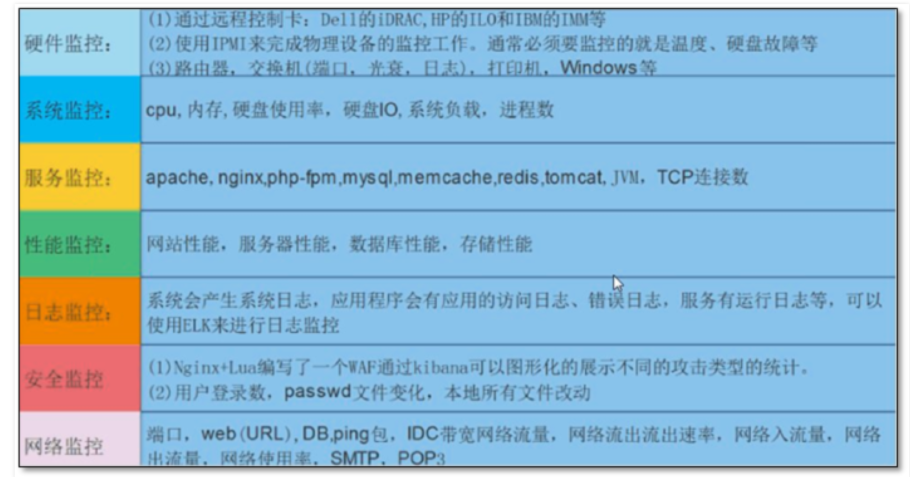

## 为什么需要监控

运维职责

```
1.保障企业数据的安全可靠。

2.为客户提供7*24小时服务。

3.不断提升用户的体验。

在关键时刻，提前提醒我们服务器要出问题了。

当出问题之后，可以便于找到问题的根源。
```

## 有了监控软件后

作为一个运维，会使用监控系统查看服务器状态以及网站流量指标，利用监控系统的数据去了解上线发布的结果，和网站的健康状态。

利用一个优秀的监控软件，我们可以：

- 通过一个友好的界面进行浏览整个网站所有的服务器状态
- 可以在web前端方便的查看监控数据
- 可以回溯寻找事故发生时系统的问题和报警情况

有了一套完善的监控体系，你就可以悠闲的喝着咖啡干活，而不用提心吊胆。

监控系统是整个运维自动化体系中非常重要的环节，从服务器上架到机房，到最后下架回收，整个过程都应该有监控的存在。

- 服务器上架的硬件监控，检测线路，服务器接口状态
- 服务器运行时的监控，系统指标监控，且在出现异常的时候发出报警通知对应的人员
- 在服务器回收的时候，要取消硬件，软件的监控

并且大型公司还会对监控系统进行开发，确保有API能够方便的和其他部门同事进行协同工作。

## 互联网公司里的运维

一般公司里的运维，大致可以分为基础运维、应用运维、运维开发、监控组四大部分。

- 基础运维，负责IDC运维，服务器上下架，网络设备等
- 应用运维，也就是system administrator，系统管理员
- 运维开发，负责运维工具的开发，系统开发等，例如开发监控系统，代码发布系统
- 监控组，也就是24小时值班的人员，需要时刻关注服务器，网站的状况，出现问题后，第一时间联系相关运维以及研发人员。

## 运维自动化

- 硬件标准化，包括服务器所有的硬件指标
- 软件标准化，软件版本，系统环境一致性等
- 运维自动化，监控体系，代码发布体系，CMDB。

监控体系，部署如zabbix等系统实现：

- 系统状态监控
- 应用状态监控
- 出错时即使告警

发布系统，部署CI/CD运维体系：

- 代码发布
- 代码检查
- 代码回滚，发布

服务器标准化，部署如cobbler+pxe实现自动化装机，ansible实现工程自动化配置，做到硬件，软件的标准化。

CMDB系统，也读作配置管理数据库，存储了所有的运维数据，包括服务器硬件信息，网络设备信息，属于运维的心脏。

## 监控系统

监控系统是所有运维人的天眼，能够帮助你盯着服务器且在第一时间发现网站的问题，发出告警，通知运维解决问题。

### 监控生命周期

服务器上架机柜

进行基础设施监控

- 服务器温度，风扇转速（ipmitool命令对服务器进行远程管理，注意只能用在物理机，vmware不行）
- 存储的容量，性能（df，fdisk，dd，iotop）
- CPU性能好坏（lscpu，uptime，top，htop，glances）
- 内存容量（free）
- 网络情况（iftop,nethogs）

应用监控

- 数据库mysql,redis
- nginx
- php-fpm
- python

若是服务器在维护中，还得暂停监控指标，否则监控会不停的报警。

监控系统在运维自动化系统中，实现如下功能

- 监控数据收集，可视化展示（图表展示，柱状图，曲线图，折线图）
- 异常数据报警
- 结合如CMDB等系统协同工作

## 理想化的运维监控利器



一个完善且理想的监控系统，得有如下特点

- 监控系统能够自定义监控的内容，自己通过脚本采集所需的数据
- 数据需要存入到数据库，日后对该数据进行分析计算
- 监控系统可以简易，快速的部署到服务器
- 数据可视化直观清晰

异常告警通知：

- 可以定义复杂度告警逻辑，做到监控项之间的关联告警，例如程序之间的依赖检测，而不是只单独检测某一个指标
- 告警可以确认响应，让运维组内的人知道已经有人在处理告警问题了
- 报警方式可以自定义，如短信，邮件，以及微信，钉钉等
- 告警内容可以自定义，能够写入一些简单的分析，便于运维人员直观了解数据，否则还得去服务器查看
- 报警后，可以预处理一些任务，如自我修复，重启，采集数据等

协同工作：

- 监控系统有强大的API，提供给研发同学调用，其他系统调用。
- 监控数据是开放性，数据结构主流，便于解析。
- 监控可视化可以简易的插件使用，而非复杂的js文件