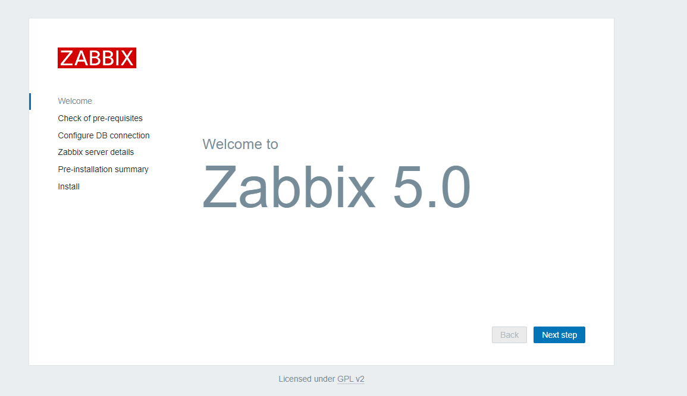

## zabbix介绍

Zabbix 是由 Alexei Vladishev 开发的一种网络监视、管理系统，基于 Server-Client 架构。可用于监视各种网络服务、服务器和网络机器等状态。

使用各种 Database-end 如 MySQL, PostgreSQL, SQLite, Oracle 或 IBM DB2 储存资料。Server 端基于 C语言、Web 管理端 frontend 则是基于 PHP 所制作的。

Zabbix 可以使用多种方式监视。可以只使用 Simple Check 不需要安装 Client 端，亦可基于 SMTP 或 HTTP ... 各种协议定制监视。

　　在客户端如 UNIX, Windows 中安装 Zabbix Agent 之后，可监视 CPU Load、网络使用状况、硬盘容量等各种状态。而就算没有安装 Agent 在监视对象中，Zabbix 也可以经由 SNMP、TCP、ICMP、利用 IPMI、SSH、telnet 对目标进行监视。

Zabbbix自带的Item足够满足普通小公司的监控需求，对于大公司也可以设定自定义的Item，自动生成报表，也有API可以和其他系统集成。

## zabbix特点

1.指标收集：从任何设备、系统、应用程序上进行指标采集

2.问题监测：定义智能阈值

3.可视化：单一界面管理平台

4.告警和修复：确保及时、有效的告警

5.安全和认证：保护您所有层级的数据

6.轻松搭建部署：大批模板，开箱即用，节省您宝贵的时间

7.自动发现：自动监控大型动态环境

8.分布式监控：无限制扩展

9.ZABBIX API ：将 Zabbix 集成到您 IT 环境的其他任何部分

## zabbix名词术语

- zabbix server，服务端，收集数据，写入数据
- zabbix agent，部署在被监控的机器上，是一个进程，和zabbix server进行交互，以及负责执行命令
- Host，服务器的概念，指zabbix监控的实体，服务器，交换机等
- Hosts，主机组
- Applications，应用
- Events，事件
- Media，发送通知的通道
- Remote command，远程命令
- Template，模板
- Item，对于某一个指标的监控，称之为Items，如某台服务器的内存使用状况，就是一个item监控项
- Trigger，触发器，定义报警的逻辑，有正常，异常，未知三个状态
- Action，当Trigger符合设定值后，zabbix指定的动作，如发个邮件给运维，说服务器有问题了

## zabbix程序组件

- Zabbix_server，服务端守护进程
- Zabbix_agentd，agent守护进程
- zabbix_proxy，代理服务器
- zabbix_database，存储系统，mysql，pgsql
- Zabbix_web，web GUI图形化界面
- Zabbix_get，命令行工具，测试向agent发起数据采集请求
- Zabbix_sender，命令行工具，测试向server发送数据
- Zabbix_java_gateway，java网关

## 安装zabbix5.0

> zabbix官网：https://www.zabbix.com/documentation/current/manual/installation/requirements

> 官网安装文档：https://www.zabbix.com/download?zabbix=5.0&os_distribution=red_hat_enterprise_linux&os_version=7&db=mysql&ws=apache
> 

步骤：

```
1.获取zabbix官方源
rpm -Uvh https://mirrors.aliyun.com/zabbix/zabbix/5.0/rhel/7/x86_64/zabbix-release-5.0-1.el7.noarch.rpm

#更改源
sed -i 's#http://repo.zabbix.com#https://mirrors.aliyun.com/zabbix#' /etc/yum.repos.d/zabbix.repo

yum clean all
yum makecache

2.安装zabbix server和agent
yum install zabbix-server-mysql zabbix-agent -y

3.安装 Software Collections，便于后续安装高版本的 php，默认 yum 安装的 php 版本为 5.4 过低。
SCL(Software Collections)可以让你在同一个操作系统上安装和使用多个版本的软件，而不会影响整个系统的安装包。
软件包会安装在/opt/rh目录下
为了避免系统广泛冲突，/opt/rh包安装在目录中，例如，这允许你在CentOS 7机器上安装Python 3.5，而不会删除或干扰Python 2.7.
/etc/opt/rh/软件包的所有配置文件都存储在目录中相应的目录中，SCL包提供了定义使用所包含应用程序所需的环境变量的shell脚本，例如，PATH，LD_LIBRARY_PATH和MANPATH ，这些脚本存储在文件系统中，作为 /opt/rh/package-name/enable 

yum install centos-release-scl -y

4.修改zabbix前端源
vim /etc/yum.repos.d/zabbix.repo  
[zabbix-frontend]
name=Zabbix Official Repository frontend - $basearch
baseurl=https://mirrors.aliyun.com/zabbix/zabbix/5.0/rhel/7/$basearch/frontend
enabled=1        # 修改这里
gpgcheck=1
gpgkey=file:///etc/pki/rpm-gpg/RPM-GPG-KEY-ZABBIX-A14FE591

5.安装zabbix前端环境
yum install zabbix-web-mysql-scl zabbix-apache-conf-scl -y

6.安装zabbix所需的数据库，直接用centos7自带的mariadb
yum install mariadb-server -y

7.启动数据库，且配置开机启动
[root@client ~]# systemctl enable --now mariadb
Created symlink from /etc/systemd/system/multi-user.target.wants/mariadb.service to /usr/lib/systemd/system/mariadb.service.

8.设置密码
mysqladmin -uroot password '1234'

9.使用root用户登录mariadb，建立zabbix数据库，这里的编码设置，否则zabbix无法安装
create database zabbix character set utf8 collate utf8_bin;
create user zabbix@localhost identified by '1234';
grant all privileges on zabbix.* to zabbix@localhost;
flush privileges;

10.使用以下命令导入 zabbix 数据库，zabbix 数据库用户为zabbix，密码1234(先复制下面，在输入密码)
zcat /usr/share/doc/zabbix-server-mysql*/create.sql.gz | mysql -uzabbix -p zabbix

11.修改 zabbix server 配置文件/etc/zabbix/zabbix_server.conf 里的数据库密码
[root@zabbix /]# egrep 'DBPassword' /etc/zabbix/zabbix_server.conf 
### Option: DBPassword
DBPassword=1234

12.修改 zabbix 的 php 配置文件 /etc/opt/rh/rh-php72/php-fpm.d/zabbix.conf 里的时区
[root@zabbix /]# grep 'timezone' /etc/opt/rh/rh-php72/php-fpm.d/zabbix.conf
php_value[date.timezone] = Asia/Shanghai


13.启动相关服务
systemctl restart zabbix-server zabbix-agent httpd rh-php72-php-fpm
systemctl enable zabbix-server zabbix-agent httpd rh-php72-php-fpm
```

### 访问zabbix

> http://192.168.6.233/zabbix/setup.php



> 检查zabbix组件是否都是正常


> 其他不用管，密码是1234(之前自己配置的密码)


> 这里直接下一步


> 安装细节


> 安装成功


登录账号： Admin

密码：zabbix

## zabbix首页


## 卸载zabbix

1.查看是否有安装的zabbix

```
[root@client ~]# rpm -qa |grep -i zabbix
zabbix-server-mysql-5.0.17-1.el7.x86_64
zabbix-release-5.0-1.el7.noarch
zabbix-java-gateway-5.0.18-1.el7.x86_64
zabbix-agent-5.0.17-1.el7.x86_64
zabbix-web-mysql-scl-5.0.17-1.el7.noarch
zabbix-apache-conf-scl-5.0.17-1.el7.noarch
zabbix-get-5.0.17-1.el7.x86_64
zabbix-web-5.0.17-1.el7.noarch
zabbix-web-deps-scl-5.0.17-1.el7.noarch

```

2.查找zabbix剩余文件全部删除

```
[root@client ~]# find / -name zabbix
/run/zabbix
/etc/selinux/targeted/active/modules/100/zabbix
/etc/zabbix
/var/lib/yum/repos/x86_64/7/zabbix
/var/lib/mysql/zabbix
/var/log/zabbix
/var/cache/yum/x86_64/7/zabbix
/usr/lib/zabbix
```

