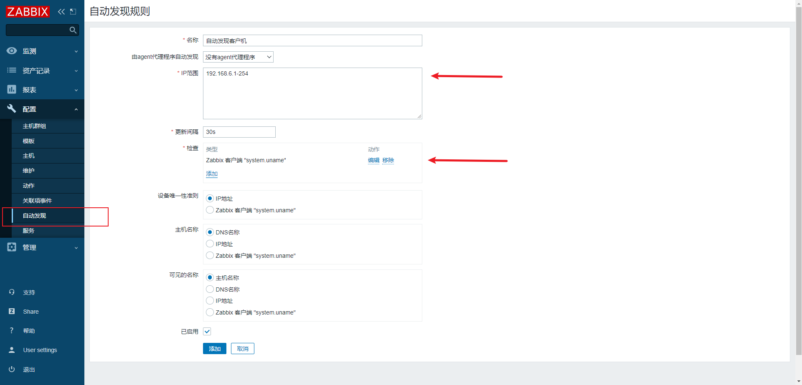

## 邮件报警


设置收件人邮箱


> 确定后，点击更新即可

## 全网监控服务器

如何利用zabbix去监控我们整个的web集群，假如我们有50台，100台机器，该怎么去监控，手动的挨个添加？肯定不行。

### 监控方案

问题：如何快速添加100台机器

思路：

- 克隆监控模板
- 自动注册和自动发现
- 使用zabbix和api接口，利用curl，或者python进行开发自己的运维监控平台

```
接口指的就是，好比笔记本提供的一个USB接口，我们无论使用金士顿的U盘，还是其他厂家的U盘，只要是符合这个接口的U盘规格，都可以插入且使用U盘，读写U盘或者笔记本里的数据。

我们所使用的各种软件也是一样，也提供了API接口给与开发人员使用，便于获取数据。
[root@zabbix-server01 ~]# curl -i -X POST -H 'Content-Type:application/json' -d'{"jsonrpc": "2.0","method":"user.login","params":{"user":"Admin","password":"zabbix"},"auth": null,"id":0}' "http://10.0.1.50/zabbix/api_jsonrpc.php"
HTTP/1.1 200 OK
Date: Wed, 12 Aug 2020 01:29:46 GMT
Server: Apache/2.4.6 (CentOS)
X-Powered-By: PHP/7.2.24
Access-Control-Allow-Origin: *
Access-Control-Allow-Headers: Content-Type
Access-Control-Allow-Methods: POST
Access-Control-Max-Age: 1000
Transfer-Encoding: chunked
Content-Type: application/json

{"jsonrpc":"2.0","result":"43fb04aa42fb8c9f7cf2248fbeb77498","id":0}
```

### 监控方案实施

#### 硬件监控

zabbix自带的模板，已经包含主要的监控项

#### 应用服务监控

1.rsync备份服务器监控，监控rsync端口

```
1.监控873端口存活  net.tcp.port[,873]
2.模拟推拉文件，查看结果
```

2.监控NFS服务器

```
1.监控端口111的存活，  net.tcp.port[,111]
2.通过nfs命令查看，showmount -e ip|wc -l
```

3.监控mysql服务器

```
1.监控3306端口， net.tcp.port[,3006]
2.进行登录测试，mysql -uroot -p -h
3.zabbix-agent自定义的模板
```

4.监控web服务器

```
1.监控80端口，net.tcp.port[,80]
2.通过状态码查看，如zabbix自带的web监控
```

5.通过url地址监控

```
zabbix自带web检测
```

6.监控代理服务器

```
检测nginx代理端口
```

#### 监控服务通用方法

1.端口监控

```
使用netstat
ss
lsof
等命令
结合grep查看是否有结果
```

2.进程监控

```
通过ps命令结合grep查看
```

3.模拟客户端连接

```
web服务，通过curl命令访问
mysql，SQL语句验证
memcached，set写入，get获取，查看结果
```

## 自动发现/自动注册介绍

**自动发现**

- 服务端主动发现所有客户端，然后将客户端等级到自己的配置中
- 缺点：server端压力大，网段客户端过多，时间消耗多

**自动注册**

- 客户端主动到服务端登记，报道
- 缺点：可能人为配置出错，客户端找不到服务端

### 两种模式

```
被动模式：默认 agent被server抓取数据 （都是在agent的立场上说）
主动模式：agent主动将数据发到server端 （都是在agent的立场上说）
```

!>注意：两种模式都是在客户端(agent)上进行配置

## hosts解析设置

server,agent都配置

```
主机ip        主机hostname

192.168.6.233 zabbix
192.168.6.79 template
192.168.6.200 docker01
```

## 配置自动发现

被动模式，提前部署好客户机上面的zabbix-agent2配置

```
在服务端验证客户端机器是否存活
[root@zabbix /]# zabbix_get -s 192.168.6.200 -p 10050 -k 'agent.ping'
1
[root@zabbix /]# zabbix_get -s 192.168.6.79 -p 10050 -k 'agent.ping'
1

```



> 配置好自动发现规则记得启用


等待客户端出现