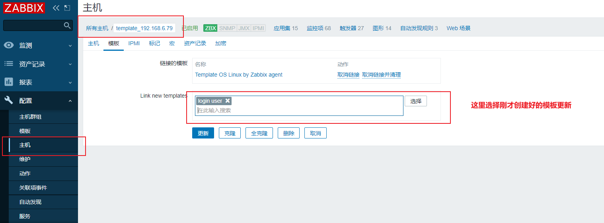

## 修改zabbix语言


## 部署zabbix客户端

Zabbix 5.0 版本推出了使用 go 语言重写的 Agent2，也是 5.0 版本新特性，Agent2 有如下特性：

- 完成的插件框架支持，可扩张服务及应用监控
- 支持灵活的采集周期调度
- 更高效的数据采集及传输
- 可完全替换先有的 agent
- …..

由于使用 go 语言编写,编译安装与之前版本有所区别。

Agent2 默认使用的 10050 端口，与 Zabbix Agent 端口一样，不修改端口情况下，同一台机器不能同时启动 Zabbix Agent 与 Zabbix Agent2。

### yum安装

配置好zabbix源

```
1.获取zabbix官方源
rpm -Uvh https://mirrors.aliyun.com/zabbix/zabbix/5.0/rhel/7/x86_64/zabbix-release-5.0-1.el7.noarch.rpm

#更改源
sed -i 's#http://repo.zabbix.com#https://mirrors.aliyun.com/zabbix#' /etc/yum.repos.d/zabbix.repo

yum clean all
yum makecache

# 注意时间正确
yum install -y ntp
ntpdate ntp.api.bz > /dev/null 2&>1


mv /etc/localtime{,.bak}
ln -s /usr/share/zoneinfo/Asia/Shanghai /etc/localtime
```

安装步骤

```
1.安装agent2
yum install zabbix-agent2 -y

2.配置文件了解
默认配置文件为 /etc/zabbix/zabbix_agent2.conf

默认二进制文件为 /usr/sbin/zabbix_agent2

3.启动agent2且开机自启
systemctl enable --now zabbix-agent2

4.检查端口
netstat -tunlp|grep zabbix

5.查看systemctl管理的单元文件
cat /lib/systemd/system/zabbix-agent2.service
```

修改agent2配置文件，修改如下，填写zabbix-server主机ip和主机名

```
[root@zbz-agent01 ~]# grep -Ev '^#|^$' /etc/zabbix/zabbix_agent2.conf
PidFile=/var/run/zabbix/zabbix_agent2.pid
LogFile=/var/log/zabbix/zabbix_agent2.log
LogFileSize=0
Server=服务端的ip地址
ServerActive=服务端的ip地址
Hostname=本地名
Include=/etc/zabbix/zabbix_agent2.d/*.conf
ControlSocket=/tmp/agent.sock
```

Server 和 ServerActive 配置为 zabibx server 或 zabbix proxy 地址，Hostname 配置为主机名即可。

Agent2 没有组件依赖，可直接拷贝编译好的二进制文件和配置文件在其他主机上运行即可。

改了配置文件，注意重启agent2

```
[root@zbz-agent01 ~]# systemctl restart zabbix-agent2
```

## 检测server-client连通性

> 在服务端测试一下客户端的链接性

```
yum install zabbix-get -y

[root@zabbix /]# zabbix_get  -s '192.168.6.79' -p 10050 -k "agent.ping"
1

[root@zabbix /]# zabbix_get  -s '192.168.6.79' -p 10050 -k "system.hostname"
template
```

## 解决zabbix乱码

乱码是改了中文的原因，解决方法;

**服务器需要安装字体**

```
[root@zabbix-server01 ~]# yum -y install wqy-microhei-fonts
[root@zabbix-server01 ~]# \cp /usr/share/fonts/wqy-microhei/wqy-microhei.ttc /usr/share/fonts/dejavu/DejaVuSans.ttf


此时zabbix已然正确展示中文数据
```

## 手动添加agent主机

1.创建主机


2.设置参数


3.等待一会，看到如下说明zabbix已经成功添加客户端了


## 查看监控内容


## 自定义监控

zabbix自带模板`Template OS Linux (Template App Zabbix Agent)`提供CPU、内存、磁盘、网卡等常规监控，只要新加主机关联此模板，就可自动添加这些监控项。

## 制作模板(监控登录人数)

**需求：限制登录人数不超过三个，超过三人则发出报警**

## 自定义监控项语法

当zabbix自带模板，以及监控项，无法满足我们需求，我们就可以自定义监控项

自定义监控其实就是添加监控的key，监控的命令

```
# 首先显示用户登录命令
who
who |wc -l  # 显示登录人数
```

需要添加监控项配置文件，路径(客户端)

```
/etc/zabbix/zabbix_agent2.d/

# zabbix配置文件，大多数软件配置都会使用include形式来优化配置文件
[root@zbz-agent01 zabbix_agent2.d]# grep -i '^include' /etc/zabbix/zabbix_agent2.conf
Include=/etc/zabbix/zabbix_agent2.d/*.conf

# 自定义的配置文件，语法是
UserParameter=<key>,<shell command>
UserParameter=login-user,who|wc -l
UserParameter=login-user,/bin/sh /server/scripts/login.sh


# 要注意的是key名要唯一，可以写入多个key
[root@zbz-agent01 zabbix_agent2.d]# cat /etc/zabbix/zabbix_agent2.d/userparameter_login.conf
UserParameter=login.user,who|wc -l
UserParameter=login.user2,who|wc -l

# 重启agent
systemctl restart zabbix-agent2
```

在服务端zabbix，用命令检测自定义的key

```
[root@zabbix /]# zabbix_get -s 192.168.6.79 -p 10050 -k "login.user"
3

# 客户端
[root@template ~]# who
root     tty1         2021-12-21 19:37
root     pts/0        2022-03-01 20:34 (192.168.6.1)
root     pts/2        2022-03-06 00:20 (192.168.6.1)
```

## zabbix-server注册模板(页面操作)

流程：

- 创建模板
- 创建应用集：对监控项分类
- 创建监控项：定义item，监控的内容
- 创建触发器：当监控项获取到值，且达到触发条件就会告警
- 创建图形
- 主机进行模板关联

### 创建模板


### 创建应用集

应用集的作用是给监控项分类


### 添加监控项


测试key是否可用


#### 创建触发器

创建触发器，当监控项获取的值，到达一定条件，就触发报警


#### 创建图形

以图形的方式展示监控的信息


#### 客户端主机关联模板

创建好监控模板后，关联的相关的客户端



#### 查看最新数据-图形

查看zabbix监控中的用户登录数

多登录些用户，超过3个，查看是否告警

```
[root@zabbix /]# zabbix_get -s 192.168.6.79 -p 10050 -k "login.user"
4
```


#### 确认问题

管理员可以在线确认该问题，修改描述，也可以修复问题，如踢出多余登录的用户等。

如果想要手动关闭该问题，可以在`触发器`里设置，允许手动关闭该问题。

