## 什么是服务器

服务器也就是台计算机而已，同样的由CPU、主板、内存、磁盘、网卡等硬件组成。

不同的是，服务器的定义是`高性能计算机`，作为网络中的节点，处理网络通信中的数据、信息，是网络时代的根本灵魂。

服务器通常指`一个管理资源且未用户提供服务的计算机`，通常服务器分为`文件服务器`、`数据库服务器`、`应用程序服务器`。

服务器对比普通PC、`稳定性`、`安全性`、`性能`、`可扩展性`、`可管理性`等方面要求更高。

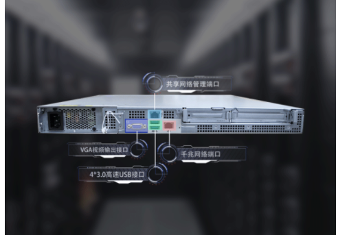

我们能够7*24小时的访问淘宝网，这是因为服务器强大的稳定性，它甚至可以十年不关机，因为你无法保证某一个时段没有用户在购买商品，并且能够承受大量用户并发的访问网站压力。

因此服务器的硬件配置更加强悍，需要大量的进行计算、处理，服务器可以安装多个处理器、更多的内存、更多的磁盘，因此主板、机箱都较大。

服务器对于屏幕显示的要求很低，基本上都是无显示器，通过`远程管理`的方式即可，因此服务器基本都是集成显卡，而无需单独装显卡。

我们很难见识到真实的物理服务器，因为服务器一般都防止在`机房`托管，闲人免进，比如appe.com苹果公司网站的数据就放在了 `云上贵州`的服务器机房。

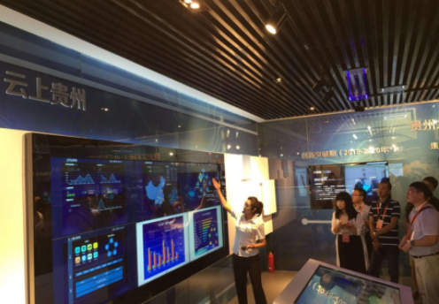

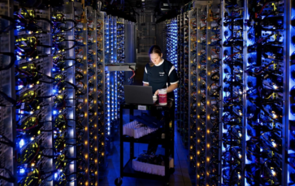

### 服务器分类

**主机种类**

按规模分：

- 大型服务器，计算中心、企业级
- 中级服务器，公司部分级
- 小型服务器，入门级服务器，个人云服务器

按用途分：

- web服务器
- 数据库服务器
- 文件服务器
- 邮件服务器
- 视频点播服务器

#### 服务器以外形分类

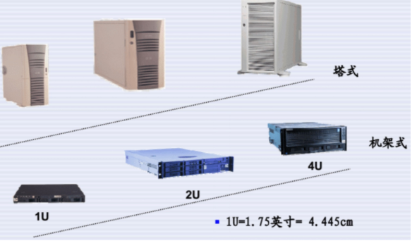

**`机架式服务器`**

- 机架式服务器的外形看来不像计算机，而像“抽屉”，有 1U、2U、4U 等规格。
- 机架式服务器安装在标准的 19 英寸机柜里面。这种结构的多为功能型服务器。

机架式服务器如下图所示。

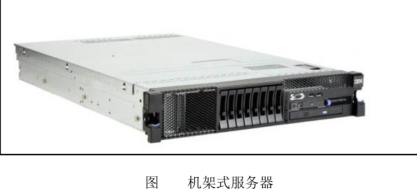

**`刀片式服务器`**

- 刀片式服务器是指在标准高度的机架式机箱内可插装多个卡式的服务器单元，实现高可用和高密度。
- 打个形象的比喻，刀片式服务器就像是箱子里摆放整齐的书。

每一块"刀片"实际上就是一块系统主板。

它们可以通过"板载"硬盘启动自己的操作系统，如`Windows NT/2000、Linux·`等，类似于一个个独立的服务器，在这种模式下，每一块母板独立运 行自己的系统，服务于指定的不同用户群，相互之间没有关联，因此相较于机架式服务器和机 柜式服务器，单片母板的性能较低。

不过，管理员可以使用系统软件将这些母板集合成一个服 务器集群。在集群模式下，所有的母板可以连接起来提供高速的网络环境，并同时共享资源， 为相同的用户群服务。在集群中插入新的"刀片"，就可以提高整体性能。而由于每块"刀片"都是热插拔的，所以，系统可以轻松地进行替换，并且将维护时间减少到最小。

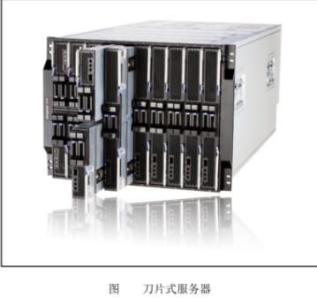

**`塔式服务器-更强壮的服务器`**

- 塔式服务器(Tower Server)应该是最容易理解的一种服务器结构类型。
- 因为它的外形以及结构都跟立式 PC 差不多，当然，由于服务器的主板扩展性较强、插槽也多出一堆，所以个头比普通主板大一些，因此塔式服务器的主机机箱也比标准的 ATX 机箱要大，一般都会预留足够的内部空间以便日后进行硬盘和电源的冗余扩展。
- 但这种类型服务器也有不少局限性，在需要采用多台服务器同时工作以满足较高的服务器应用需求时，由于其个体比较大，占用空间多，也不方便管理，便显得很不适合。

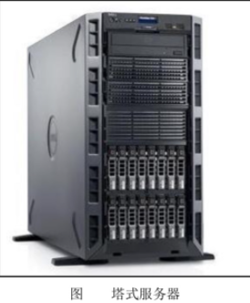

### 服务器尺寸

- 服务器以高度分类
- 高度指的是以Unit做统计单位，1U=1.75英寸=4.445 cm

### 互联网常见服务器品牌

- DELL（大多数公司在用）
- HP
- IBM（百度，银行，政府）（贵）
- 浪潮
- 联想

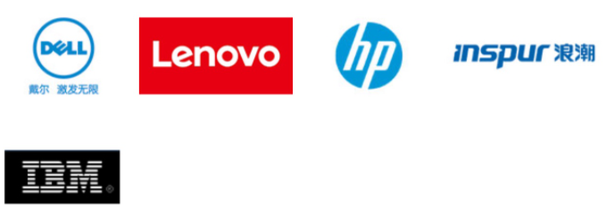

### 服务器品牌与型号

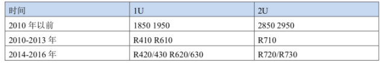

Dell服务器品牌

```
https://www.dell.com/zh-cn/work/shop/category/servers
```

Dell R720

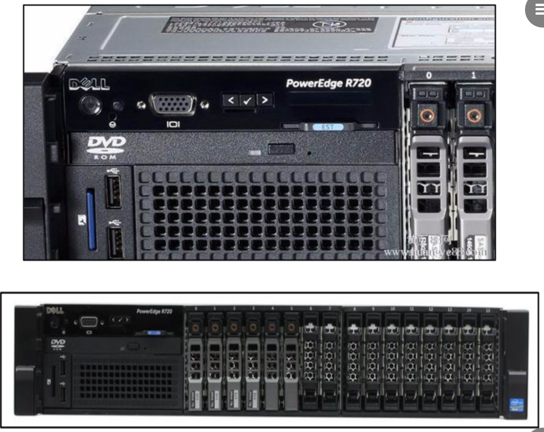

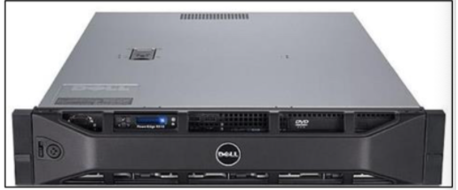

Dell R620

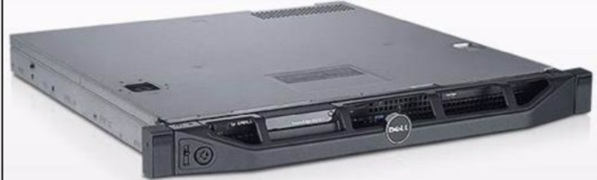

IBM品牌

- 1U服务器 ：3550/m3 3550/m5
- 2U服务器：3650
- 3U服务器：3850
- 8U服务器：3950

互联网公司在去IOE活动下，已不常用IBM品牌

```
IOE =  IBM Oracle Emc  （甲骨文 数据库  Emc存储设备）
```

HP品牌

DL380G7

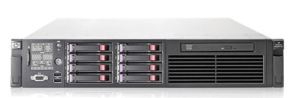

### 机房托管

首先，为什么说要将服务器放入机房而不是直接放在办公室或企业小机房，有以下几个原因：

1、企业的机房无法保证365天7*24小时都供电充足；

2、企业的机房无硬件防护，病毒容易入侵；

3、企业的机房接入的宽带或光纤是经过分流的民用带宽，速度慢；

4、企业必须以较高成本雇佣较高技术能力的工程师进行长期维护；

5、企业无法为服务器提供一个真正的机房运营环境，服务器使用寿命会缩短，并且容易出现故障，造成数据流失或损毁。

那么，真正的数据机房正是为了服务器更好、更稳、更快、更安全运行而建设的，IDC数据中心服务器托管业务它能提供更适合服务器运行的环境，能提供更强有力的安全保障，能提供更高效的带宽资源。

其次，在当下机房林立的IDC环境中，选择哪些机房做服务器托管会更安全，性价比更高呢？

1、专业的电信或联通或双线机房更能保证稳定；

2、位于国家CHINA NET骨干网上的机房更能保证速度；

3、技术和业务口碑都比较好的机房更能提供好的技术服务和安全防护

### 云服务器

**1、云服务器操作及升级更方便**

传统服务器中的资源都是有限的，如果想要获得更好的技能，只能升级云服务器，所谓“云”，就是网络、互联网的意思，云服务器就是一种简单高效、安全可靠、处理能力可弹性伸缩的计算服务。其操作起来更加简便，如果原来使用的配置过低，完全可以在不重装系统的情况下升级CPU、硬盘、内存等，不会影响之前的使用。

**2、云服务器的访问速度更快**

云服务器又叫云主机。其使用的带宽通常是多线互通，网络能够自动检测出那种网络速度更快，并自动切换至相对应的网络上进行数据传输。

**3、云服务器的存储更便捷**

云服务器上能够进行数据备份，因此即使是硬件出现问题，其数据也不会丢失。并且，使用云服务器只需要服务商后期正常维护就可以了，为企业解决了很多后顾之忧。

**4、云服务器安全稳定**

云服务器是一种集群式的服务器，可以虚拟出多个类似独立服务器的部分，具有很高的安全稳定性。而且云服务器是支持异节点快速重建的，即使计算节点异常中断或损坏，也可以在极短时间内通过其他不同节点重建虚拟机，且不影响数据完整。

**5、云服务器有更高的性价比**

云服务器是按需付费的，与传统服务器相比，具有更高的性价比，而且并不会造成资源浪费。

当然，除开这些显著特点以外，更重要的是要选择一个知名的服务商，这样云服务器才能更加简便高效，不会给企业带来不必要的损失。

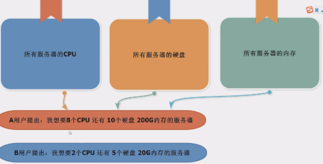

### 服务器与远程管理卡

远程管理卡是安装在服务器上的硬件设备，提供一个以太网接口，使它可以连接到局域网内，提供远程访问。

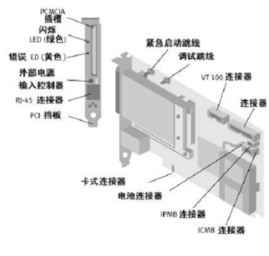

远程管理卡有服务器自带的，也有独立的。

服务器自带的远程管理卡，可以关机、开机，但是看不到开关的显示过程。

所以，选择独立的远程管理卡，稍微 200 块钱。

有了管理卡就可以快速恢复服务。

大客户有 KVM 远程管理，特大客户会有自己的人员驻扎机房。

### 机房服务器布线

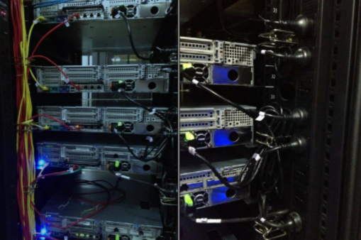

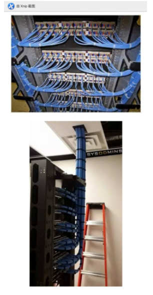