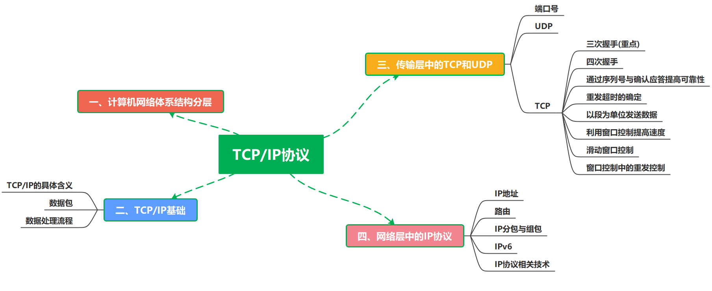
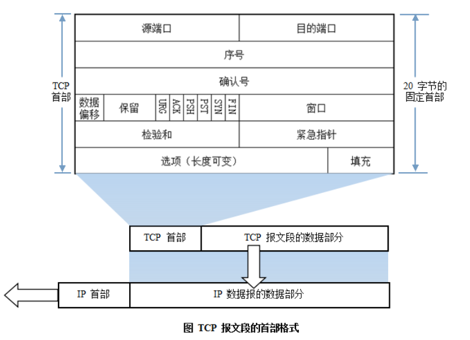
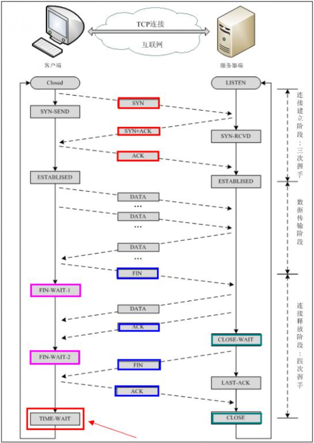

## IP地址

**1）网络地址**

IP地址由网络号（包括子网号）和主机号组成，网络地址的主机号为全0，网络地址代表着整个网络。

**2）广播地址**

广播地址通常称为直接广播地址，是为了区分受限广播地址。

广播地址与网络地址的主机号正好相反，广播地址中，主机号为全1。当向某个网络的广播地址发送消息时，该网络内的所有主机都能收到该广播消息。

**3）组播地址**

D类地址就是组播地址。

先回忆下A，B，C，D类地址吧：

A类地址以0开头，第一个字节作为网络号，地址范围为：0.0.0.0~127.255.255.255；(**modified @2016.05.31**)

B类地址以10开头，前两个字节作为网络号，地址范围是：128.0.0.0~191.255.255.255;

C类地址以110开头，前三个字节作为网络号，地址范围是：192.0.0.0~223.255.255.255。

D类地址以1110开头，地址范围是224.0.0.0~239.255.255.255，D类地址作为组播地址（一对多的通信）；

E类地址以1111开头，地址范围是240.0.0.0~255.255.255.255，E类地址为保留地址，供以后使用。

注：只有A,B,C有网络号和主机号之分，D类地址和E类地址没有划分网络号和主机号。

**4）255.255.255.255**

该IP地址指的是受限的广播地址。受限广播地址与一般广播地址（直接广播地址）的区别在于，受限广播地址只能用于本地网络，路由器不会转发以受限广播地址为目的地址的分组；一般广播地址既可在本地广播，也可跨网段广播。例如：主机192.168.1.1/30上的直接广播数据包后，另外一个网段192.168.1.5/30也能收到该数据报；若发送受限广播数据报，则不能收到。

注：一般的广播地址（直接广播地址）能够通过某些路由器（当然不是所有的路由器），而受限的广播地址不能通过路由器。

**5）0.0.0.0**

常用于寻找自己的IP地址，例如在我们的RARP，BOOTP和DHCP协议中，若某个未知IP地址的无盘机想要知道自己的IP地址，它就以255.255.255.255为目的地址，向本地范围（具体而言是被各个路由器屏蔽的范围内）的服务器发送IP请求分组。

**6）回环地址**

127.0.0.0/8被用作回环地址，回环地址表示本机的地址，常用于对本机的测试，用的最多的是127.0.0.1。

**7）A、B、C类私有地址**

私有地址(private address)也叫专用地址，它们不会在全球使用，只具有本地意义。

A类私有地址：10.0.0.0/8，范围是：10.0.0.0~10.255.255.255

B类私有地址：172.16.0.0/12，范围是：172.16.0.0~172.31.255.255

C类私有地址：192.168.0.0/16，范围是：192.168.0.0~192.168.255.255

## 子网掩码及网络划分

随着互连网应用的不断扩大，原先的IPv4的弊端也逐渐暴露出来，即网络号占位太多，而主机号位太少，所以其能提供的主机地址也越来越稀缺，目前除了使用NAT在企业内部利用保留地址自行分配以外，通常都对一个高类别的IP地址进行再划分，以形成多个子网，提供给不同规模的用户群使用。

这里主要是为了在网络分段情况下有效地利用IP地址，通过对主机号的高位部分取作为子网号，从通常的网络位界限中扩展或压缩子网掩码，用来创建某类地址的更多子网。但创建更多的子网时，在每个子网上的可用主机地址数目会比原先减少。

**什么是子网掩码？**

子网掩码是标志两个IP地址是否同属于一个子网的，也是32位二进制地址，其每一个为1代表该位是网络位，为0代表主机位。它和IP地址一样也是使用点式十进制来表示的。如果两个IP地址在子网掩码的按位与的计算下所得结果相同，即表明它们共属于同一子网中。

**在计算子网掩码时，我们要注意IP地址中的保留地址，即" 0"地址和广播地址，它们是指主机地址或网络地址全为" 0"或" 1"时的IP地址，它们代表着本网络地址和广播地址，一般是不能被计算在内的。**

**子网掩码的计算：**

对于无须再划分成子网的IP地址来说，其子网掩码非常简单，即按照其定义即可写出：如某B类IP地址为 10.12.3.0，无须再分割子网，则该IP地址的子网掩码255.255.0.0。如果它是一个C类地址，则其子网掩码为 255.255.255.0。其它类推，不再详述。下面我们关键要介绍的是一个IP地址，还需要将其高位主机位再作为划分出的子网网络号，剩下的是每个子网的主机号，这时该如何进行每个子网的掩码计算。

下面总结一下有关子网掩码和网络划分常见的面试考题：

　　**1）利用子网数来计算**

在求子网掩码之前必须先搞清楚要划分的子网数目，以及每个子网内的所需主机数目。

(1) 将子网数目转化为二进制来表示;

如欲将B类IP地址168.195.0.0划分成27个子网：27=11011；

(2) 取得该二进制的位数，为N；

该二进制为五位数，N = 5

(3) 取得该IP地址的类子网掩码，将其主机地址部分的的前N位置1即得出该IP地址划分子网的子网掩码。

将B类地址的子网掩码255.255.0.0的主机地址前5位置 1，得到 255.255.248.0

**2）利用主机数来计算**

如欲将B类IP地址168.195.0.0划分成若干子网，每个子网内有主机700台：

(1) 将主机数目转化为二进制来表示；

```
700=1010111100
```

(2) 如果主机数小于或等于254（注意去掉保留的两个IP地址），则取得该主机的二进制位数，为N，这里肯定 N<8。如果大于254，则 N>8，这就是说主机地址将占据不止8位；

该二进制为十位数，N=10；

(3) 使用255.255.255.255来将该类IP地址的主机地址位数全部置1，然后从后向前的将N位全部置为 0，即为子网掩码值。

将该B类地址的子网掩码255.255.0.0的主机地址全部置1，得到255.255.255.255，然后再从后向前将后 10位置0,即为：11111111.11111111.11111100.00000000，即255.255.252.0。这就是该欲划分成主机为700台的B类IP地址 168.195.0.0的子网掩码。

**3）还有一种题型，要你根据每个网络的主机数量进行子网地址的规划和****计算子网掩码。这也可按上述原则进行计算。**

比如一个子网有10台主机，那么对于这个子网需要的IP地址是：

```
10＋1＋1＋1＝13
```

**注意：加的第一个1是指这个网络连接时所需的网关地址，接着的两个1分别是指网****络地址和广播地址。**

因为13小于16（16等于2的4次方），所以主机位为4位。而256－16＝240，所以该子网掩码为255.255.255.240。

如果一个子网有14台主机，不少人常犯的错误是：依然分配具有16个地址空间的子网，而忘记了给网关分配地址。这样就错误了，因为14＋1＋1＋1＝17，17大于16，所以我们只能分配具有32个地址（32等于2的5次方）空间的子网。这时子网掩码为：255.255.255.224。

## ARP/RARP协议

**地址解析协议，即ARP（Address Resolution Protocol），是根据IP地址获取物理地址的一个TCP/IP协议。**主机发送信息时将包含目标IP地址的ARP请求广播到网络上的所有主机，并接收返回消息，以此确定目标的物理地址；收到返回消息后将该IP地址和物理地址存入本机ARP缓存中并保留一定时间，下次请求时直接查询ARP缓存以节约资源。地址解析协议是建立在网络中各个主机互相信任的基础上的，网络上的主机可以自主发送ARP应答消息，其他主机收到应答报文时不会检测该报文的真实性就会将其记入本机ARP缓存；由此攻击者就可以向某一主机发送伪ARP应答报文，使其发送的信息无法到达预期的主机或到达错误的主机，这就构成了一个ARP欺骗。**ARP命令可用于查询本机ARP缓存中IP地址和MAC地址的对应关系、添加或删除静态对应关系等。**

ARP工作流程举例：

主机A的IP地址为192.168.1.1，MAC地址为0A-11-22-33-44-01；

主机B的IP地址为192.168.1.2，MAC地址为0A-11-22-33-44-02；

当主机A要与主机B通信时，地址解析协议可以将主机B的IP地址（192.168.1.2）解析成主机B的MAC地址，以下为工作流程：

- （1）根据主机A上的路由表内容，IP确定用于访问主机B的转发IP地址是192.168.1.2。然后A主机在自己的本地ARP缓存中检查主机B的匹配MAC地址。
- （2）如果主机A在ARP缓存中没有找到映射，它将询问192.168.1.2的硬件地址，从而将ARP请求帧广播到本地网络上的所有主机。源主机A的IP地址和MAC地址都包括在ARP请求中。本地网络上的每台主机都接收到ARP请求并且检查是否与自己的IP地址匹配。如果主机发现请求的IP地址与自己的IP地址不匹配，它将丢弃ARP请求。
- （3）主机B确定ARP请求中的IP地址与自己的IP地址匹配，则将主机A的IP地址和MAC地址映射添加到本地ARP缓存中。
- （4）主机B将包含其MAC地址的ARP回复消息直接发送回主机A。
- （5）当主机A收到从主机B发来的ARP回复消息时，会用主机B的IP和MAC地址映射更新ARP缓存。本机缓存是有生存期的，生存期结束后，将再次重复上面的过程。主机B的MAC地址一旦确定，主机A就能向主机B发送IP通信了。

**逆地址解析协议，即RARP，功能和ARP协议相对，其将局域网中某个主机的物理地址转换为IP地址**

，比如局域网中有一台主机只知道物理地址而不知道IP地址，那么可以通过RARP协议发出征求自身IP地址的广播请求，然后由RARP服务器负责回答。

RARP协议工作流程：

- （1）给主机发送一个本地的RARP广播，在此广播包中，声明自己的MAC地址并且请求任何收到此请求的RARP服务器分配一个IP地址；
- （2）本地网段上的RARP服务器收到此请求后，检查其RARP列表，查找该MAC地址对应的IP地址；
- （3）如果存在，RARP服务器就给源主机发送一个响应数据包并将此IP地址提供给对方主机使用；
- （4）如果不存在，RARP服务器对此不做任何的响应；

## 路由选择协议

常见的路由选择协议有：RIP协议、OSPF协议。

**RIP****协议** ：底层是贝尔曼福特算法，它选择路由的度量标准（metric)是跳数，最大跳数是15跳，如果大于15跳，它就会丢弃数据包。

**OSPF****协议** ：Open Shortest Path First开放式最短路径优先，底层是迪杰斯特拉算法，是链路状态路由选择协议，它选择路由的度量标准是带宽，延迟。

## TCP/IP协议

### 导图



**TCP/IP协议是Internet最基本的协议、Internet国际互联网络的基础，由网络层的IP协议和传输层的TCP协议组成。通俗而言：TCP负责发现传输的问题，一有问题就发出信号，要求重新传输，直到所有数据安全正确地传输到目的地。而IP是给因特网的每一台联网设备规定一个地址。**

IP层接收由更低层（网络接口层例如以太网设备驱动程序）发来的数据包，并把该数据包发送到更高层---TCP或UDP层；相反，IP层也把从TCP或UDP层接收来的数据包传送到更低层。IP数据包是不可靠的，因为IP并没有做任何事情来确认数据包是否按顺序发送的或者有没有被破坏，IP数据包中含有发送它的主机的地址（源地址）和接收它的主机的地址（目的地址）。

TCP是面向连接的通信协议，通过三次握手建立连接，通讯完成时要拆除连接，由于TCP是面向连接的所以只能用于端到端的通讯。TCP提供的是一种可靠的数据流服务，采用"带重传的肯定确认"技术来实现传输的可靠性。TCP还采用一种称为"滑动窗口"的方式进行流量控制，所谓窗口实际表示接收能力，用以限制发送方的发送速度。

**TCP报文首部格式：**



**TCP协议的三次握手和四次挥手：**



　　**注：seq**:"sequance"序列号；**ack**:"acknowledge"确认号；**SYN**:"synchronize"请求同步标志；**；ACK**:"acknowledge"确认标志"**；****FIN**："Finally"结束标志。

**TCP连接建立过程：**首先Client端发送连接请求报文，Server段接受连接后回复ACK报文，并为这次连接分配资源。Client端接收到ACK报文后也向Server段发生ACK报文，并分配资源，这样TCP连接就建立了。

**TCP连接断开过程：**假设Client端发起中断连接请求，也就是发送FIN报文。Server端接到FIN报文后，意思是说"我Client端没有数据要发给你了"，但是如果你还有数据没有发送完成，则不必急着关闭Socket，可以继续发送数据。所以你先发送ACK，"告诉Client端，你的请求我收到了，但是我还没准备好，请继续你等我的消息"。这个时候Client端就进入FIN_WAIT状态，继续等待Server端的FIN报文。当Server端确定数据已发送完成，则向Client端发送FIN报文，"告诉Client端，好了，我这边数据发完了，准备好关闭连接了"。Client端收到FIN报文后，"就知道可以关闭连接了，但是他还是不相信网络，怕Server端不知道要关闭，所以发送ACK后进入TIME_WAIT状态，如果Server端没有收到ACK则可以重传。"，Server端收到ACK后，"就知道可以断开连接了"。Client端等待了2MSL后依然没有收到回复，则证明Server端已正常关闭，那好，我Client端也可以关闭连接了。Ok，TCP连接就这样关闭了！

**为什么要三次握手？**

在只有两次"握手"的情形下，假设Client想跟Server建立连接，但是却因为中途连接请求的数据报丢失了，故Client端不得不重新发送一遍；这个时候Server端仅收到一个连接请求，因此可以正常的建立连接。但是，有时候Client端重新发送请求不是因为数据报丢失了，而是有可能数据传输过程因为网络并发量很大在某结点被阻塞了，这种情形下Server端将先后收到2次请求，并持续等待两个Client请求向他发送数据...问题就在这里，Cient端实际上只有一次请求，而Server端却有2个响应，极端的情况可能由于Client端多次重新发送请求数据而导致Server端最后建立了N多个响应在等待，因而造成极大的资源浪费！所以，"三次握手"很有必要！

**为什么要四次挥手？**

试想一下，假如现在你是客户端你想断开跟Server的所有连接该怎么做？第一步，你自己先停止向Server端发送数据，并等待Server的回复。但事情还没有完，虽然你自身不往Server发送数据了，但是因为你们之前已经建立好平等的连接了，所以此时他也有主动权向你发送数据；故Server端还得终止主动向你发送数据，并等待你的确认。其实，说白了就是保证双方的一个合约的完整执行！

使用TCP的协议：FTP（文件传输协议）、Telnet（远程登录协议）、SMTP（简单邮件传输协议）、POP3（和SMTP相对，用于接收邮件）、HTTP协议等。

